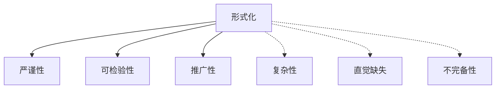

# 5.1 形式化的意义与局限（Significance and Limitations of Formalization）

## 5.1.1 概念定义

- **形式化**：用严格的符号系统、公理和逻辑规则表达数学对象和推理过程，消除歧义，确保严密性。

## 5.1.2 形式化的主要意义

| 方面       | 说明与举例                                 |
|------------|-------------------------------------------|
| 严谨性     | 每一步推理有明确依据，排除直觉模糊性       |
| 可检验性   | 证明过程可被独立验证，适合计算机辅助       |
| 推广性     | 便于理论迁移、跨学科应用                   |
| 发现隐含假设 | 形式化过程揭示未被察觉的前提和逻辑漏洞   |
| 理论创新   | 推动新公理体系和新分支的产生               |

## 5.1.3 形式化的局限性

| 方面       | 说明与举例                                 |
|------------|-------------------------------------------|
| 复杂性     | 完全形式化证明冗长、难以阅读               |
| 直觉缺失   | 过度形式化可能掩盖几何直观和启发           |
| 公理依赖   | 证明的有效性依赖于所选公理体系的无矛盾性   |
| 不完备性   | 哥德尔定理：任何强大系统都存在不可判定命题 |
| 可读性     | 教学和传播中，半形式化与直观解释更易接受   |

## 5.1.4 多表征

### 5.1.4.1 结构图

### 5.1.4.2 举例

- **意义**：
  - 形式化证明揭示三角形内角和定理的逻辑链条。
- **局限**：
  - 四色定理的完全形式化证明极其庞大，难以人工理解。

## 5.1.5 哲学与认知分析

- **意义**：
  - 形式化是现代数学的基石，保障理论的可靠性。
- **局限**：
  - 数学发现和理解常依赖直觉，形式化是后续的整理和确认。
- **认知发展**：
  - 学习者需在直观与形式化之间建立桥梁。
- **哲学反思**：
  - 形式化与人类认知、科学进步的关系值得持续探讨。

## 5.1.6 相关引用

- 希尔伯特《几何基础》
- 哥德尔《不完备性定理》
- 现代数理逻辑、数学哲学教材

---

> 本节内容严格编号，便于后续扩展与交叉引用。下节将处理"5.2 公理系统的选择与反思"。
