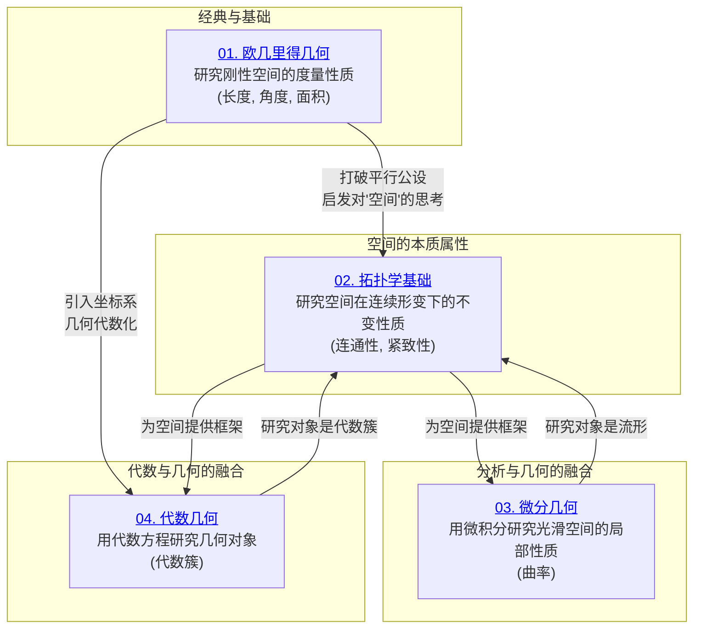

# 05-几何学与拓扑学 总览

---

title: "几何学与拓扑学总览"
version: "1.0"
date: "2025-07-04"

---

## 📋 本地目录导航

- [返回项目总览](../09-项目总览/00-项目总览.md)
- [01-欧几里得几何](./01-欧几里得几何/00-模块总览.md)
- [02-一般拓扑学](./02-一般拓扑学/00-模块总览.md)
- [03-微分几何](./03-微分几何/00-模块总览.md)
- [04-代数几何](./04-代数几何/00-模块总览.md)

## 🗺️ 本地知识图谱

- [数学知识体系映射](../09-项目总览/05-Knowledge_Graphs_and_Mappings/数学知识体系映射.md)
- [知识图谱分析](../知识图谱分析.md)
- [项目总览](../09-项目总览/00-项目总览.md)

---

几何学与拓扑学是研究"空间"的数学分支，但它们从截然不同的角度来探索空间的性质。本章旨在揭示从最刚性的欧几里得几何到最柔性的拓扑学，再到两者与代数、分析深度融合的现代几何学说的宏伟画卷。

## 章节整体架构

本章节的学习路径遵循着一条从具体到抽象、从刚性到柔性、从局部到整体的逻辑线索。

### 学习逻辑链条

1. **欧几里得几何**: 一切的源头，建立了公理化研究空间的范式，并为后来的发展提供了丰富的研究对象和问题。
2. **拓扑学基础**: 对"空间"概念的第一次深刻抽象，剥离了所有关于长度和角度的"刚性"概念，只研究最本质的连续性、连通性等属性。它是理解现代几何学的必备语言。
3. **微分几何**: 将微积分的工具应用于光滑空间（流形）的研究，使得我们可以量化空间的"弯曲程度"（曲率）。它构成了广义相对论的数学基石。
4. **代数几何**: 用多项式方程组的解集来定义和研究几何对象（代数簇），实现了代数与几何的深刻统一，是现代数论等领域的核心工具。

## 模块详细内容

### 01-欧几里得几何 ✅ **已完成**

- **核心**: 公理体系、逻辑证明、度量性质（长度、角度）。
- **主要内容**: 五大公设、全等与相似、毕达哥拉斯定理、解析几何入门。
- **地位**: 整个几何学乃至数学公理化思想的基石。

### 02-拓扑学基础 ✅ **已完成**

- **核心**: 连续形变下的不变量。
- **主要内容**: 拓扑空间、连续映射与同胚、连通性、紧致性、度量空间、基本群。
- **地位**: 现代分析、几何等多个分支的通用语言。

### 03-微分几何 ✅ **已完成**

- **核心**: 光滑流形、切空间、曲率。
- **主要内容**: 欧氏空间中的曲线与曲面论、流形的基本概念、黎曼度量。
- **地位**: 现代物理学（特别是广义相对论和规范场论）的数学语言。

### 04-代数几何 ✅ **已完成**

- **核心**: 代数簇、理想、层。
- **主要内容**: 仿射簇与射影簇、希尔伯特零点定理、代数曲线。
- **地位**: 现代数学皇冠上的明珠之一，深刻连接了数论、代数和几何。

## 知识体系的内在逻辑

- **抽象的阶梯**: 从可以直观感知的欧氏空间，到只关心"附近"的光滑流形，再到可以任意拉伸扭曲的拓扑空间，我们一步步地放宽对"空间"的限制，去探寻更本质的属性。
- **工具的融合**: 几何学的发展史，也是一部不断吸收其他数学分支工具的历史。微积分的引入催生了微分几何，抽象代数的引入催生了代数几何，二者共同建立在拓扑学提供的统一框架之上。

---
[返回项目总览](../09-项目总览/00-项目总览.md)

## 哲学批判与反思

- **历史人物与思想年表**：

  | 年代 | 人物 | 主要思想/事件 | 影响 |
  |------|------|---------------|------|
  | 古希腊 | 欧几里得 | 《几何原本》 | 公理化、演绎体系奠基 |
  | 19世纪 | 高斯、黎曼、罗巴切夫斯基 | 非欧几何、曲面理论 | 空间观念革命 |
  | 20世纪 | 庞加莱、豪斯多夫 | 拓扑学创立与发展 | 结构主义与抽象空间 |
  | 20世纪 | 爱因斯坦 | 广义相对论中的几何 | 数学与物理深度融合 |

- **主要争议事件与哲学分歧**：
  - “空间”本体论：几何对象是现实存在还是理性构造？
  - 非欧几何的发现对“唯一空间观”的冲击。
  - 拓扑学的抽象性与几何直观性的张力。
  - 数学与物理、经验与理性的关系。

- **哲学认知与哲科批判性分析**：
  - 几何学的发展体现了“直观—公理—抽象”的认知演化。
  - 非欧几何、拓扑学等的兴起，挑战了“唯一空间”“绝对真理”的观念。
  - 空间、形状、连续性等概念反映了人类对世界结构的认知需求。
  - 哲学批判性要求我们反思：几何基础的选择是否受限于认知、历史与科学进步？

- **认知科学视角**：
  - 人类对空间、形状、拓扑等概念的理解具有先天性与发展阶段性。
  - 认知科学、心理学等领域揭示，空间直觉、图像思维在几何学习中至关重要。
  - AI与认知科学推动了“空间推理”“视觉-符号混合推理”等新方向，反映几何学的现实意义。
  - 几何抽象性与认知可达性之间的张力，提示我们关注数学表达与人类理解的平衡。

[历史版本变迁说明与归档索引见主线末尾归档区块]
