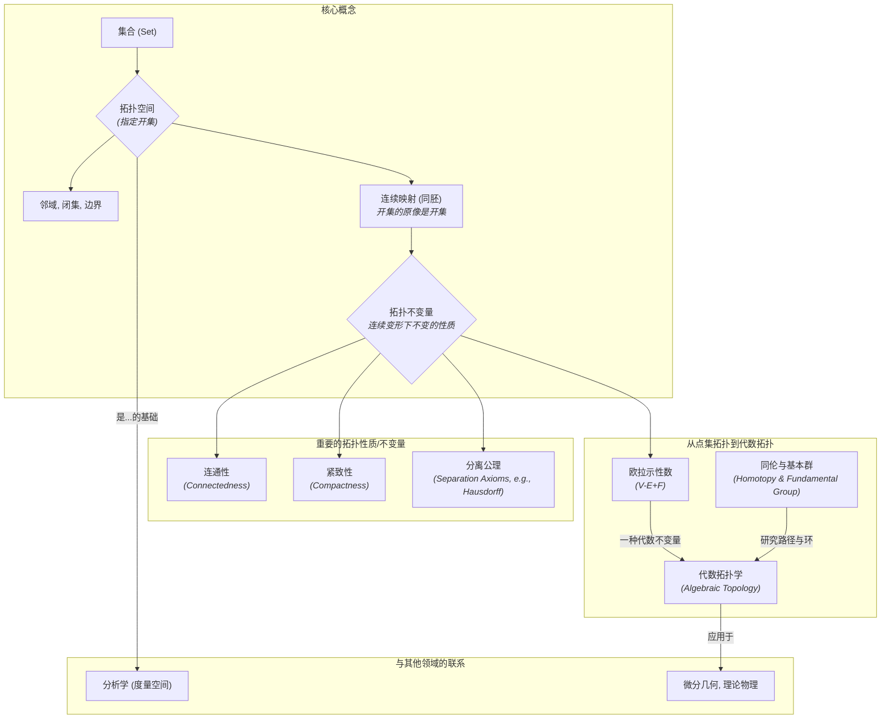

# 02-拓扑学基础总览

**版本**: 1.0
**日期**: 2025-07-02

---

## 2.1. 引言："橡皮筋"的几何学

**拓扑学 (Topology)** 是研究几何对象在连续变形（如拉伸、扭曲、挤压，但不能撕裂或粘合）下保持不变的性质的数学分支。由于它不关心对象的刚性属性（如长度、角度、曲率），它常被通俗地称为"橡皮筋几何学"。

在拓扑学的世界里，一个咖啡杯和一个甜甜圈是"一样"的（拓扑同胚），因为我们可以通过连续的变形将一个变成另一个，它们都只有一个"洞"。然而，一个球体和一个甜甜圈就是本质不同的，因为我们无法在不撕裂球面的情况下制造出一个洞。

拓扑学是现代数学的基石之一，它为分析学、几何学和许多其他领域提供了最普遍的语言来描述"空间"、"邻近"和"连续"等概念。本模块将介绍拓扑学的基本思想和核心概念，为探索更高级的数学领域打下基础。

## 2.2. 知识地图 (Mermaid)

## 2.3. 探索路径

1. **[01-拓扑空间与开集](./01-拓扑空间与开集.md)**: 介绍拓扑学的核心定义——拓扑空间。理解如何通过指定"开集"的方式，在一个抽象的集合上赋予其拓扑结构，以及由此衍生的邻域、闭集等基本概念。
2. **[02-连续映射与同胚](./02-连续映射与同胚.md)**: 定义拓扑学中的"函数"——连续映射，以及拓扑学中的"相等"——同胚。理解为什么在拓扑学意义上，咖啡杯和甜甜圈是等价的。
3. **[03-连通性与紧致性](./03-连通性与紧致性.md)**: 探讨两种最重要的拓扑性质。连通性描述了一个空间是否是"一体"的，而紧致性则是对有限性的一种推广，在分析学中尤为重要。
4. **[04-度量空间](./04-度量空间.md)**: 学习一种非常重要且直观的拓扑空间——度量空间。在度量空间中，拓扑结构由"距离"函数导出，这使其与我们熟悉的欧氏空间和分析学紧密联系。
5. **[05-基本群与同伦简介](./05-基本群与同伦简介.md)**: 初步接触代数拓扑学的思想。介绍同伦的概念（路径的连续变形），并定义第一个代数不变量——基本群，它能用来探测空间的"洞"。

---
[返回上一级: 05-几何学与拓扑学总览](../00-05-几何与拓扑总览.md) | [返回项目总览](../../09-项目总览/00-项目总览.md)
