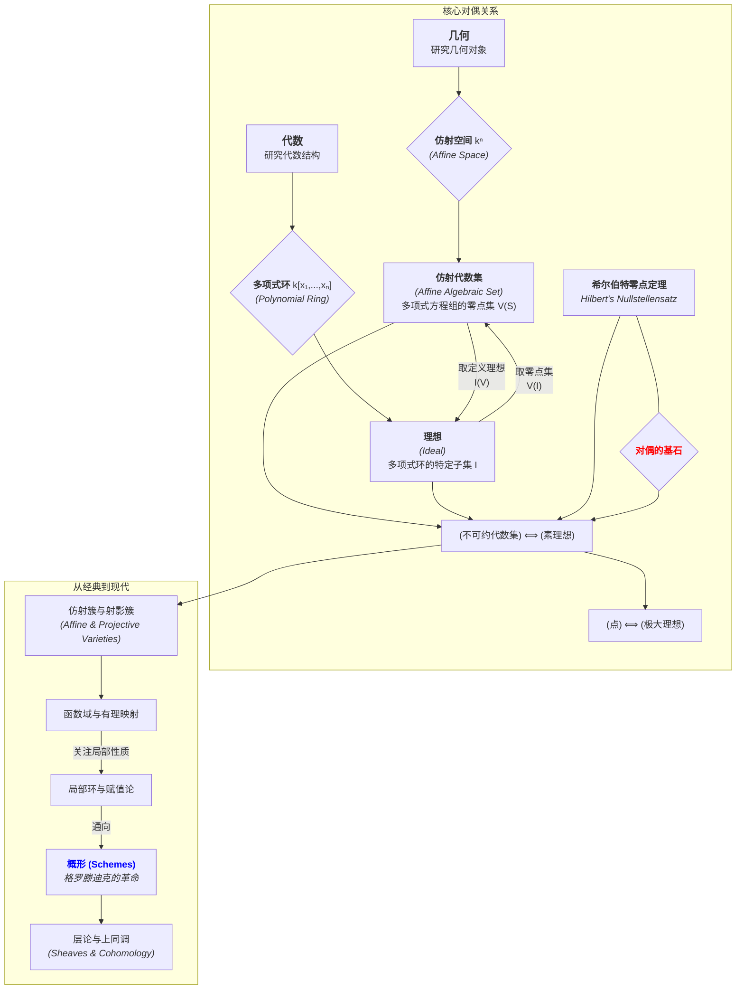

# 04-代数几何总览

**版本**: 1.0
**日期**: 2025-07-02

---

## 4.1. 引言：当几何遇上代数

**代数几何 (Algebraic Geometry)** 是数学的一个核心分支，它致力于研究**代数方程组的解集**所构成的几何对象。与解析几何用方程研究几何图形不同，代数几何的深刻之处在于，它在几何对象和纯粹的代数结构（特别是交换代数中的**环**和**理想**）之间建立了一套系统而深刻的**对偶 (Duality)** 关系。

这使得我们可以用强大的抽象代数工具来分析复杂的几何问题，反之亦然，用几何直观来启发新的代数思想。这门学科在数论（如费马大定理的证明）、密码学（椭圆曲线密码学）、理论物理（弦理论）等领域都有着根本性的应用。

本模块旨在对这门博大精深的学科提供一个初步的、鸟瞰式的介绍，聚焦于其最核心的思想。

## 4.2. 知识地图 (Mermaid)

## 4.3. 探索路径

1. **[01-仿射簇与理想](./01-仿射簇与理想.md)**: 介绍代数几何的基本研究对象——**仿射代数集**（或称仿射簇），即多项式方程组的公共零点集。同时，介绍其在代数一侧的对应物——多项式环中的**理想**。
2. **[02-希尔伯特零点定理](./02-希尔伯特零点定理.md)**: 学习代数几何中最核心的桥梁性定理——**希尔伯特零点定理 (Hilbert's Nullstellensatz)**。这个定理深刻地揭示了"取零点集"和"取定义理想"这两种操作之间的对应关系。
3. **[03-不可约性与素理想](./03-不可约性与素理想.md)**: 在几何上，我们希望研究那些不能被分解成更小部分的基础对象，即"不可约簇"。本节将揭示，这种几何上的不可约性，在代数上完美地对应于环论中的**素理想**概念。
4. **[04-射影空间与射影簇](./04-射影空间与射影簇.md)**: 仿射空间在处理"无穷远"处的行为时有其局限性（例如，两条平行线永不相交）。本节将介绍**射影空间**，一个通过添加"无穷远点"而使几何行为更加统一和优美的框架，并定义其中的几何对象——**射影簇**。
5. **[05-概形理论简介](./05-概形理论简介.md)**: 作为展望，初步接触亚历山大·格罗滕迪克在20世纪对代数几何的革命性重塑。介绍**概形 (Scheme)** 的基本思想，即用"环的谱 (Spectrum of a Ring)"来同时包含几何和算术信息，从而将代数几何与数论等领域以前所未有的深度统一起来。

---
[返回上一级: 05-几何学与拓扑学总览](../00-05-几何与拓扑总览.md) | [返回项目总览](../../09-项目总览/00-项目总览.md)
