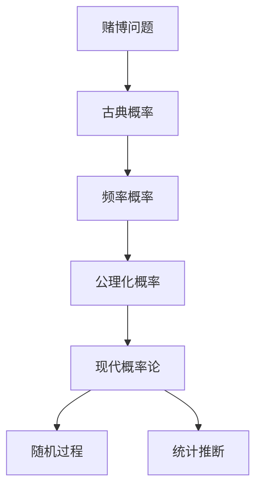

# 01-概率论基础

## 目录

- [1. 概述](#1-概述)
- [2. 概率空间](#2-概率空间)
  - [2.1 样本空间与事件](#21-样本空间与事件)
  - [2.2 概率测度](#22-概率测度)
  - [2.3 柯尔莫哥洛夫公理](#23-柯尔莫哥洛夫公理)
- [3. 随机变量](#3-随机变量)
  - [3.1 随机变量定义](#31-随机变量定义)
  - [3.2 分布函数](#32-分布函数)
  - [3.3 离散随机变量](#33-离散随机变量)
  - [3.4 连续随机变量](#34-连续随机变量)
- [4. 数学期望与方差](#4-数学期望与方差)
  - [4.1 数学期望](#41-数学期望)
  - [4.2 方差与标准差](#42-方差与标准差)
  - [4.3 矩与矩母函数](#43-矩与矩母函数)
- [5. 条件概率与独立性](#5-条件概率与独立性)
- [6. 重要概率分布](#6-重要概率分布)
- [7. 极限定理](#7-极限定理)
- [8. 应用与扩展](#8-应用与扩展)
- [9. 批判性分析](#9-批判性分析)

## 1. 概述

### 1.1 概率论的起源与发展

概率论起源于17世纪的赌博问题，经过几个世纪的发展，已成为现代数学的重要分支。



### 1.2 概率论的核心思想

概率论研究随机现象的数学规律，通过量化不确定性来理解和预测随机事件。

## 2. 概率空间

### 2.1 样本空间与事件

#### 2.1.1 样本空间

**定义**：样本空间 $\Omega$ 是随机试验所有可能结果的集合。

**类型**：

- **离散样本空间**：可数集合
- **连续样本空间**：不可数集合

#### 2.1.2 事件

**定义**：事件是样本空间的子集，即 $A \subseteq \Omega$。

**事件代数**：$\mathcal{F}$ 是 $\Omega$ 的子集族，满足：

1. $\Omega \in \mathcal{F}$
2. $A \in \mathcal{F} \Rightarrow A^c \in \mathcal{F}$
3. $A_i \in \mathcal{F} \Rightarrow \bigcup_{i=1}^{\infty} A_i \in \mathcal{F}$

```rust
// 概率空间实现
use std::collections::HashSet;

#[derive(Debug, Clone)]
struct ProbabilitySpace<T> {
    sample_space: HashSet<T>,
    event_algebra: HashSet<HashSet<T>>,
    probability_measure: Box<dyn Fn(&HashSet<T>) -> f64>,
}

impl<T: Eq + std::hash::Hash + Clone> ProbabilitySpace<T> {
    fn new(sample_space: HashSet<T>) -> Self {
        let mut event_algebra = HashSet::new();
        event_algebra.insert(HashSet::new()); // 空集
        event_algebra.insert(sample_space.clone()); // 全集
        
        ProbabilitySpace {
            sample_space,
            event_algebra,
            probability_measure: Box::new(|_| 0.0), // 默认概率测度
        }
    }
    
    fn is_event(&self, subset: &HashSet<T>) -> bool {
        self.event_algebra.contains(subset)
    }
    
    fn probability(&self, event: &HashSet<T>) -> f64 {
        if self.is_event(event) {
            (self.probability_measure)(event)
        } else {
            panic!("Not a valid event");
        }
    }
    
    fn add_event(&mut self, event: HashSet<T>) {
        self.event_algebra.insert(event);
    }
}
```

### 2.2 概率测度

#### 2.2.1 概率测度定义

**定义**：概率测度 $P$ 是定义在事件代数 $\mathcal{F}$ 上的函数，满足：

- $P(A) \geq 0$ 对所有 $A \in \mathcal{F}$
- $P(\Omega) = 1$
- 可数可加性

#### 2.2.2 概率测度性质

- $P(\emptyset) = 0$
- $P(A^c) = 1 - P(A)$
- $P(A \cup B) = P(A) + P(B) - P(A \cap B)$

### 2.3 柯尔莫哥洛夫公理

#### 2.3.1 公理系统

柯尔莫哥洛夫在1933年提出的概率论公理系统：

1. **非负性**：$P(A) \geq 0$
2. **规范性**：$P(\Omega) = 1$
3. **可数可加性**：对互斥事件序列 $\{A_i\}$，有
   $$P\left(\bigcup_{i=1}^{\infty} A_i\right) = \sum_{i=1}^{\infty} P(A_i)$$

#### 2.3.2 公理化意义

公理化方法为概率论提供了严格的数学基础，使其成为现代数学的分支。

## 3. 随机变量

### 3.1 随机变量定义

#### 3.1.1 基本定义

**定义**：随机变量 $X$ 是从样本空间 $\Omega$ 到实数集 $\mathbb{R}$ 的可测函数：
$$X: \Omega \to \mathbb{R}$$

可测性要求：对任意 $x \in \mathbb{R}$，集合 $\{\omega \in \Omega : X(\omega) \leq x\}$ 是事件。

#### 3.1.2 随机变量类型

- **离散随机变量**：取值可数
- **连续随机变量**：取值不可数
- **混合随机变量**：既有离散又有连续部分

```haskell
-- 随机变量类型类
class RandomVariable rv where
    sampleSpace :: rv -> SampleSpace
    distribution :: rv -> Distribution
    expectation :: rv -> Double
    variance :: rv -> Double

-- 离散随机变量
data DiscreteRandomVariable = DiscreteRandomVariable {
    values :: [Double],
    probabilities :: [Double]
}

instance RandomVariable DiscreteRandomVariable where
    sampleSpace (DiscreteRandomVariable vals _) = DiscreteSampleSpace vals
    distribution rv = DiscreteDistribution (values rv) (probabilities rv)
    expectation rv = sum [x * p | (x, p) <- zip (values rv) (probabilities rv)]
    variance rv = 
        let mu = expectation rv
        in sum [(x - mu)^2 * p | (x, p) <- zip (values rv) (probabilities rv)]

-- 连续随机变量
data ContinuousRandomVariable = ContinuousRandomVariable {
    densityFunction :: Double -> Double,
    support :: (Double, Double)
}

instance RandomVariable ContinuousRandomVariable where
    sampleSpace (ContinuousRandomVariable _ (a, b)) = ContinuousSampleSpace a b
    distribution rv = ContinuousDistribution (densityFunction rv) (support rv)
    expectation rv = 
        let (a, b) = support rv
            f = densityFunction rv
        in integrate (\x -> x * f x) a b
    variance rv = 
        let mu = expectation rv
            (a, b) = support rv
            f = densityFunction rv
        in integrate (\x -> (x - mu)^2 * f x) a b
```

### 3.2 分布函数

#### 3.2.1 累积分布函数

**定义**：随机变量 $X$ 的累积分布函数定义为：
$$F_X(x) = P(X \leq x)$$

**性质**：

- 单调递增
- 右连续
- $\lim_{x \to -\infty} F_X(x) = 0$
- $\lim_{x \to \infty} F_X(x) = 1$

#### 3.2.2 分布函数与概率

- $P(a < X \leq b) = F_X(b) - F_X(a)$
- $P(X = x) = F_X(x) - F_X(x^-)$

### 3.3 离散随机变量

#### 3.3.1 概率质量函数

**定义**：离散随机变量 $X$ 的概率质量函数定义为：
$$p_X(x) = P(X = x)$$

**性质**：

- $p_X(x) \geq 0$
- $\sum_x p_X(x) = 1$

#### 3.3.2 常见离散分布

**伯努利分布**：$X \sim \text{Bernoulli}(p)$
$$P(X = 1) = p, \quad P(X = 0) = 1-p$$

**二项分布**：$X \sim \text{Binomial}(n,p)$
$$P(X = k) = \binom{n}{k} p^k (1-p)^{n-k}$$

**泊松分布**：$X \sim \text{Poisson}(\lambda)$
$$P(X = k) = \frac{\lambda^k e^{-\lambda}}{k!}$$

```rust
// 离散分布实现
#[derive(Debug, Clone)]
struct BernoulliDistribution {
    p: f64,
}

impl BernoulliDistribution {
    fn new(p: f64) -> Self {
        assert!(p >= 0.0 && p <= 1.0);
        BernoulliDistribution { p }
    }
    
    fn probability_mass(&self, x: u32) -> f64 {
        match x {
            0 => 1.0 - self.p,
            1 => self.p,
            _ => 0.0,
        }
    }
    
    fn expectation(&self) -> f64 {
        self.p
    }
    
    fn variance(&self) -> f64 {
        self.p * (1.0 - self.p)
    }
}

#[derive(Debug, Clone)]
struct BinomialDistribution {
    n: u32,
    p: f64,
}

impl BinomialDistribution {
    fn new(n: u32, p: f64) -> Self {
        assert!(p >= 0.0 && p <= 1.0);
        BinomialDistribution { n, p }
    }
    
    fn probability_mass(&self, k: u32) -> f64 {
        if k > self.n {
            return 0.0;
        }
        
        let combination = self.combination(self.n, k);
        combination * self.p.powi(k as i32) * (1.0 - self.p).powi((self.n - k) as i32)
    }
    
    fn combination(&self, n: u32, k: u32) -> f64 {
        if k > n {
            return 0.0;
        }
        
        let mut result = 1.0;
        for i in 0..k {
            result *= (n - i) as f64 / (i + 1) as f64;
        }
        result
    }
    
    fn expectation(&self) -> f64 {
        self.n as f64 * self.p
    }
    
    fn variance(&self) -> f64 {
        self.n as f64 * self.p * (1.0 - self.p)
    }
}
```

### 3.4 连续随机变量

#### 3.4.1 概率密度函数

**定义**：连续随机变量 $X$ 的概率密度函数 $f_X(x)$ 满足：
$$P(a \leq X \leq b) = \int_a^b f_X(x) dx$$

**性质**：

- $f_X(x) \geq 0$
- $\int_{-\infty}^{\infty} f_X(x) dx = 1$

#### 3.4.2 常见连续分布

**均匀分布**：$X \sim \text{Uniform}(a,b)$
$$
f_X(x) = \begin{cases}
\frac{1}{b-a} & \text{if } a \leq x \leq b \\
0 & \text{otherwise}
\end{cases}
$$

**正态分布**：$X \sim \text{Normal}(\mu,\sigma^2)$
$$f_X(x) = \frac{1}{\sqrt{2\pi\sigma^2}} e^{-\frac{(x-\mu)^2}{2\sigma^2}}$$

**指数分布**：$X \sim \text{Exponential}(\lambda)$
$$
f_X(x) = \begin{cases}
\lambda e^{-\lambda x} & \text{if } x \geq 0 \\
0 & \text{otherwise}
\end{cases}
$$

```haskell
-- 连续分布
data NormalDistribution = NormalDistribution {
    mean :: Double,
    variance :: Double
}

instance RandomVariable NormalDistribution where
    sampleSpace _ = RealLine
    distribution (NormalDistribution mu sigma2) =
        NormalDistribution mu sigma2
    expectation (NormalDistribution mu _) = mu
    variance (NormalDistribution _ sigma2) = sigma2

-- 正态分布密度函数
normalDensity :: Double -> Double -> Double -> Double
normalDensity mu sigma2 x =
    let sigma = sqrt sigma2
    in (1 / (sigma * sqrt (2 * pi))) * exp (-((x - mu)^2) / (2 * sigma2))

-- 正态分布累积分布函数（近似）
normalCDF :: Double -> Double -> Double -> Double
normalCDF mu sigma2 x =
    let z = (x - mu) / sqrt sigma2
    in 0.5 * (1 + erf (z / sqrt 2))
    where
        erf x = 2 / sqrt pi * integrate (\t -> exp (-t^2)) 0 x
```

## 4. 数学期望与方差

### 4.1 数学期望

#### 4.1.1 期望定义

**离散随机变量**：
$$E[X] = \sum_x x \cdot P(X = x)$$

**连续随机变量**：
$$E[X] = \int_{-\infty}^{\infty} x \cdot f_X(x) dx$$

#### 4.1.2 期望性质

- $E[aX + b] = aE[X] + b$
- $E[X + Y] = E[X] + E[Y]$
- $E[XY] = E[X]E[Y]$ （如果 $X$ 和 $Y$ 独立）

### 4.2 方差与标准差

#### 4.2.1 方差定义

**定义**：随机变量 $X$ 的方差定义为：
$$\text{Var}(X) = E[(X - E[X])^2] = E[X^2] - (E[X])^2$$

**标准差**：$\sigma_X = \sqrt{\text{Var}(X)}$

#### 4.2.2 方差性质

- $\text{Var}(aX + b) = a^2\text{Var}(X)$
- $\text{Var}(X + Y) = \text{Var}(X) + \text{Var}(Y)$ （如果 $X$ 和 $Y$ 独立）

### 4.3 矩与矩母函数

#### 4.3.1 矩定义

**$k$ 阶矩**：$E[X^k]$
**$k$ 阶中心矩**：$E[(X - E[X])^k]$

#### 4.3.2 矩母函数

**定义**：随机变量 $X$ 的矩母函数定义为：
$$M_X(t) = E[e^{tX}]$$

**性质**：

- $`E[X^k]` = `M_X^{(k)}(0)`$
- $M_{aX+b}(t) = e^{bt}M_X(at)$

```rust
// 矩与矩母函数
impl<T: RandomVariable> T {
    fn kth_moment(&self, k: u32) -> f64 {
        match self {
            DiscreteRandomVariable { values, probabilities } => {
                values.iter().zip(probabilities.iter())
                    .map(|(x, p)| x.powi(k as i32) * p)
                    .sum()
            },
            ContinuousRandomVariable { density_function, support } => {
                let (a, b) = support;
                // 数值积分计算
                self.numerical_integration(
                    |x| x.powi(k as i32) * density_function(x),
                    a, b
                )
            }
        }
    }

    fn moment_generating_function(&self, t: f64) -> f64 {
        match self {
            DiscreteRandomVariable { values, probabilities } => {
                values.iter().zip(probabilities.iter())
                    .map(|(x, p)| (t * x).exp() * p)
                    .sum()
            },
            ContinuousRandomVariable { density_function, support } => {
                let (a, b) = support;
                self.numerical_integration(
                    |x| (t * x).exp() * density_function(x),
                    a, b
                )
            }
        }
    }
}
```

## 5. 条件概率与独立性

### 5.1 条件概率

#### 5.1.1 条件概率定义

**定义**：在事件 $B$ 发生的条件下，事件 $A$ 发生的概率为：
$$P(A|B) = \frac{P(A \cap B)}{P(B)}$$

其中 $P(B) > 0$。

#### 5.1.2 乘法公式

$$P(A \cap B) = P(A|B)P(B) = P(B|A)P(A)$$

#### 5.1.3 全概率公式

如果 $\{B_i\}$ 是样本空间的一个划分，则：
$$P(A) = \sum_i P(A|B_i)P(B_i)$$

### 5.2 贝叶斯定理

#### 5.2.1 贝叶斯公式

$$P(B_i|A) = \frac{P(A|B_i)P(B_i)}{\sum_j P(A|B_j)P(B_j)}$$

#### 5.2.2 贝叶斯解释

贝叶斯定理描述了如何根据新证据更新先验概率。

### 5.3 独立性

#### 5.3.1 事件独立性

**定义**：事件 $A$ 和 $B$ 独立，如果：
$$P(A \cap B) = P(A)P(B)$$

**等价条件**：$P(A|B) = P(A)$

#### 5.3.2 随机变量独立性

**定义**：随机变量 $X$ 和 $Y$ 独立，如果：
$$F_{X,Y}(x,y) = F_X(x)F_Y(y)$$

## 6. 重要概率分布

### 6.1 离散分布

#### 6.1.1 几何分布

**定义**：$X \sim \text{Geometric}(p)$
$$P(X = k) = p(1-p)^{k-1}, \quad k = 1,2,\ldots$$

**期望**：$E[X] = \frac{1}{p}$
**方差**：$\text{Var}(X) = \frac{1-p}{p^2}$

#### 6.1.2 负二项分布

**定义**：$X \sim \text{NegativeBinomial}(r,p)$
$$P(X = k) = \binom{k-1}{r-1} p^r (1-p)^{k-r}$$

### 6.2 连续分布

#### 6.2.1 伽马分布

**定义**：$X \sim \text{Gamma}(\alpha,\beta)$
$$f_X(x) = \frac{\beta^\alpha}{\Gamma(\alpha)} x^{\alpha-1} e^{-\beta x}, \quad x > 0$$

#### 6.2.2 卡方分布

**定义**：$X \sim \chi^2(n)$
$$X = \sum_{i=1}^n Z_i^2, \quad Z_i \sim \text{Normal}(0,1)$$

## 7. 极限定理

### 7.1 大数定律

#### 7.1.1 弱大数定律

**定理**：设 $\{X_n\}$ 是独立同分布随机变量序列，$E[X_1] = \mu$，则：
$$\frac{1}{n}\sum_{i=1}^n X_i \xrightarrow{P} \mu$$

#### 7.1.2 强大数定律

**定理**：在相同条件下：
$$\frac{1}{n}\sum_{i=1}^n X_i \xrightarrow{a.s.} \mu$$

### 7.2 中心极限定理

#### 7.2.1 林德伯格-莱维定理

**定理**：设 $\{X_n\}$ 是独立同分布随机变量序列，$E[X_1] = \mu$，$\text{Var}(X_1) = \sigma^2$，则：
$$\frac{\sqrt{n}(\bar{X}_n - \mu)}{\sigma} \xrightarrow{d} \text{Normal}(0,1)$$

#### 7.2.2 应用

中心极限定理解释了为什么正态分布在统计学中如此重要。

```haskell
-- 大数定律模拟
simulateLawOfLargeNumbers :: Int -> [Double] -> [Double]
simulateLawOfLargeNumbers n samples =
    let runningAverages = scanl1 (+) samples
        counts = [1..length samples]
    in zipWith (/) runningAverages (map fromIntegral counts)

-- 中心极限定理模拟
simulateCentralLimitTheorem :: Int -> Int -> [Double]
simulateCentralLimitTheorem nTrials nSamples =
    let sampleMeans = replicate nTrials (mean (take nSamples randomSamples))
    in sampleMeans
    where
        randomSamples = randomRs (0, 1) (mkStdGen 42) :: [Double]
        mean xs = sum xs / fromIntegral (length xs)
```

## 8. 应用与扩展

### 8.1 统计学应用

#### 8.1.1 参数估计

概率论为参数估计提供了理论基础。

#### 8.1.2 假设检验

概率论为假设检验提供了概率框架。

### 8.2 金融学应用

#### 8.2.1 风险管理

概率论用于量化金融风险。

#### 8.2.2 期权定价

布莱克-斯科尔斯模型基于概率论。

### 8.3 机器学习应用

#### 8.3.1 贝叶斯学习

概率论为贝叶斯学习提供框架。

#### 8.3.2 概率图模型

概率论是概率图模型的基础。

## 9. 批判性分析

### 9.1 哲学意义

#### 9.1.1 概率解释

概率的不同解释：

- **频率主义**：概率是长期频率的极限
- **贝叶斯主义**：概率是主观信念的量化
- **倾向性理论**：概率是物理倾向的度量

#### 9.1.2 不确定性本质

概率论挑战了确定性世界观，引入了不确定性概念。

### 9.2 方法论反思

#### 9.2.1 公理化方法

柯尔莫哥洛夫公理化的优点和局限。

#### 9.2.2 模型选择

如何选择合适的概率模型。

### 9.3 现代发展

#### 9.3.1 随机过程

从随机变量到随机过程的发展。

#### 9.3.2 概率论与信息论

概率论与信息论的交叉发展。

### 9.4 未来展望

#### 9.4.1 量子概率

量子力学中的概率概念。

#### 9.4.2 人工智能

概率论在人工智能中的应用前景。

---

**参考文献**:

1. Billingsley, P. (1995). *Probability and Measure*. Wiley.
2. Durrett, R. (2019). *Probability: Theory and Examples*. Cambridge University Press.
3. Feller, W. (1968). *An Introduction to Probability Theory and Its Applications*. Wiley.
4. Ross, S. M. (2014). *A First Course in Probability*. Pearson.
5. Shiryaev, A. N. (1996). *Probability*. Springer.

---

**相关链接**:

- [数理统计基础](./02-数理统计基础.md)
- [随机过程理论](./03-随机过程理论.md)
- [数学哲学基础](../01-哲学与元数学基础/01-数学哲学基础.md)
