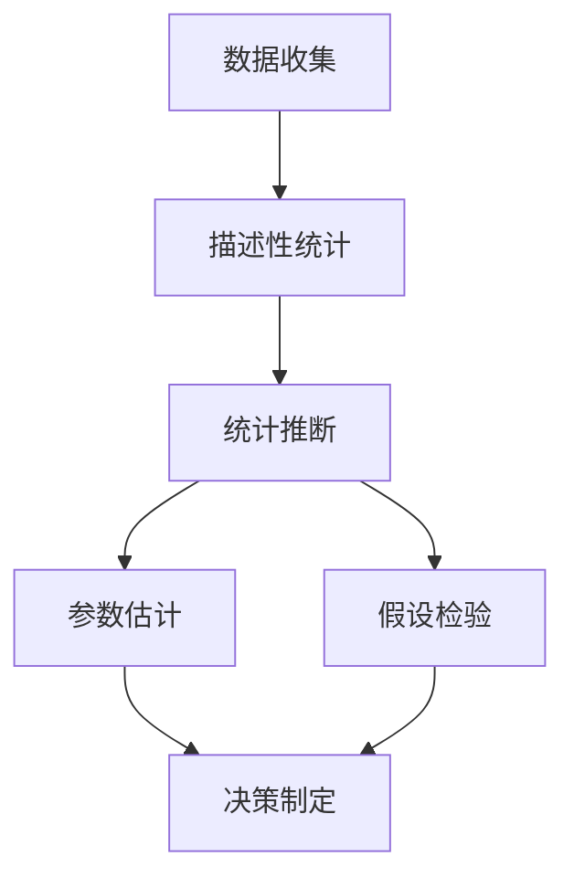

# 02-数理统计基础

## 目录
- [1. 概述](#1-概述)
- [2. 描述性统计](#2-描述性统计)
  - [2.1 集中趋势度量](#21-集中趋势度量)
  - [2.2 离散程度度量](#22-离散程度度量)
  - [2.3 分布形状度量](#23-分布形状度量)
- [3. 统计推断基础](#3-统计推断基础)
  - [3.1 总体与样本](#31-总体与样本)
  - [3.2 统计量](#32-统计量)
  - [3.3 抽样分布](#33-抽样分布)
- [4. 参数估计](#4-参数估计)
  - [4.1 点估计](#41-点估计)
  - [4.2 区间估计](#42-区间估计)
  - [4.3 估计量的性质](#43-估计量的性质)
- [5. 假设检验](#5-假设检验)
  - [5.1 基本概念](#51-基本概念)
  - [5.2 检验方法](#52-检验方法)
  - [5.3 检验功效](#53-检验功效)
- [6. 回归分析](#6-回归分析)
- [7. 方差分析](#7-方差分析)
- [8. 应用与扩展](#8-应用与扩展)
- [9. 批判性分析](#9-批判性分析)

## 1. 概述

### 1.1 数理统计的起源与发展

数理统计是概率论的应用，研究如何从数据中提取信息和做出推断。



### 1.2 数理统计的核心思想

数理统计通过样本信息推断总体特征，为科学决策提供依据。

## 2. 描述性统计

### 2.1 集中趋势度量

#### 2.1.1 均值

**算术均值**：
$$\bar{x} = \frac{1}{n}\sum_{i=1}^n x_i$$

**加权均值**：
$$\bar{x}_w = \frac{\sum_{i=1}^n w_i x_i}{\sum_{i=1}^n w_i}$$

#### 2.1.2 中位数

**定义**：将数据排序后位于中间位置的值。

**计算**：
- 奇数个数据：中位数是第 $\frac{n+1}{2}$ 个值
- 偶数个数据：中位数是第 $\frac{n}{2}$ 和第 $\frac{n}{2}+1$ 个值的平均

#### 2.1.3 众数

**定义**：数据中出现频率最高的值。

```rust
// 描述性统计实现
#[derive(Debug)]
struct DescriptiveStatistics {
    data: Vec<f64>,
}

impl DescriptiveStatistics {
    fn new(data: Vec<f64>) -> Self {
        DescriptiveStatistics { data }
    }
    
    fn mean(&self) -> f64 {
        let sum: f64 = self.data.iter().sum();
        sum / self.data.len() as f64
    }
    
    fn median(&self) -> f64 {
        let mut sorted_data = self.data.clone();
        sorted_data.sort_by(|a, b| a.partial_cmp(b).unwrap());
        
        let n = sorted_data.len();
        if n % 2 == 0 {
            (sorted_data[n/2 - 1] + sorted_data[n/2]) / 2.0
        } else {
            sorted_data[n/2]
        }
    }
    
    fn mode(&self) -> Option<f64> {
        use std::collections::HashMap;
        
        let mut frequency = HashMap::new();
        for &value in &self.data {
            *frequency.entry(value).or_insert(0) += 1;
        }
        
        frequency.iter()
            .max_by_key(|&(_, count)| count)
            .map(|(&value, _)| value)
    }
    
    fn variance(&self) -> f64 {
        let mean = self.mean();
        let sum_squared_diff: f64 = self.data.iter()
            .map(|x| (x - mean).powi(2))
            .sum();
        sum_squared_diff / (self.data.len() - 1) as f64
    }
    
    fn standard_deviation(&self) -> f64 {
        self.variance().sqrt()
    }
    
    fn skewness(&self) -> f64 {
        let mean = self.mean();
        let std_dev = self.standard_deviation();
        let n = self.data.len() as f64;
        
        let sum_cubed = self.data.iter()
            .map(|x| ((x - mean) / std_dev).powi(3))
            .sum::<f64>();
        
        sum_cubed / n
    }
    
    fn kurtosis(&self) -> f64 {
        let mean = self.mean();
        let std_dev = self.standard_deviation();
        let n = self.data.len() as f64;
        
        let sum_fourth = self.data.iter()
            .map(|x| ((x - mean) / std_dev).powi(4))
            .sum::<f64>();
        
        sum_fourth / n - 3.0
    }
}
```

### 2.2 离散程度度量

#### 2.2.1 方差与标准差

**样本方差**：
$$s^2 = \frac{1}{n-1}\sum_{i=1}^n (x_i - \bar{x})^2$$

**样本标准差**：
$$s = \sqrt{s^2}$$

#### 2.2.2 四分位数

**第一四分位数** $Q_1$：25%的数据小于等于它
**第三四分位数** $Q_3$：75%的数据小于等于它
**四分位距**：$IQR = Q_3 - Q_1$

#### 2.2.3 变异系数

**定义**：$CV = \frac{s}{\bar{x}} \times 100\%$

### 2.3 分布形状度量

#### 2.3.1 偏度

**定义**：衡量分布不对称程度的指标。

**计算**：
$$\text{Skewness} = \frac{1}{n}\sum_{i=1}^n \left(\frac{x_i - \bar{x}}{s}\right)^3$$

#### 2.3.2 峰度

**定义**：衡量分布尖峭程度的指标。

**计算**：
$$\text{Kurtosis} = \frac{1}{n}\sum_{i=1}^n \left(\frac{x_i - \bar{x}}{s}\right)^4 - 3$$

```haskell
-- 描述性统计
data DescriptiveStats = DescriptiveStats {
    mean :: Double,
    median :: Double,
    mode :: Maybe Double,
    variance :: Double,
    standardDeviation :: Double,
    skewness :: Double,
    kurtosis :: Double
}

calculateDescriptiveStats :: [Double] -> DescriptiveStats
calculateDescriptiveStats xs = DescriptiveStats {
    mean = mean xs,
    median = median xs,
    mode = mode xs,
    variance = variance xs,
    standardDeviation = sqrt (variance xs),
    skewness = skewness xs,
    kurtosis = kurtosis xs
}
where
    mean xs = sum xs / fromIntegral (length xs)
    
    median xs = 
        let sorted = sort xs
            n = length sorted
        in if odd n 
           then sorted !! (n `div` 2)
           else (sorted !! (n `div` 2 - 1) + sorted !! (n `div` 2)) / 2
    
    mode xs = 
        let frequency = Map.fromListWith (+) [(x, 1) | x <- xs]
            maxFreq = maximum (Map.elems frequency)
        in if maxFreq > 1 
           then Just (fst (head (filter ((== maxFreq) . snd) (Map.toList frequency))))
           else Nothing
    
    variance xs = 
        let mu = mean xs
            n = fromIntegral (length xs)
        in sum [(x - mu)^2 | x <- xs] / (n - 1)
    
    skewness xs = 
        let mu = mean xs
            sigma = sqrt (variance xs)
            n = fromIntegral (length xs)
        in sum [((x - mu) / sigma)^3 | x <- xs] / n
    
    kurtosis xs = 
        let mu = mean xs
            sigma = sqrt (variance xs)
            n = fromIntegral (length xs)
        in sum [((x - mu) / sigma)^4 | x <- xs] / n - 3
```

## 3. 统计推断基础

### 3.1 总体与样本

#### 3.1.1 总体

**定义**：研究对象的全体，通常用随机变量 $X$ 表示。

**总体分布**：$F(x)$ 或 $f(x)$

#### 3.1.2 样本

**定义**：从总体中抽取的一部分个体。

**简单随机样本**：$X_1, X_2, \ldots, X_n$ 独立同分布。

### 3.2 统计量

#### 3.2.1 统计量定义

**定义**：样本的函数，不依赖于未知参数。

**常见统计量**：
- 样本均值：$\bar{X} = \frac{1}{n}\sum_{i=1}^n X_i$
- 样本方差：$S^2 = \frac{1}{n-1}\sum_{i=1}^n (X_i - \bar{X})^2$
- 样本标准差：$S = \sqrt{S^2}$

#### 3.2.2 统计量性质

统计量是随机变量，有其分布（抽样分布）。

### 3.3 抽样分布

#### 3.3.1 正态总体的抽样分布

**样本均值**：$\bar{X} \sim N(\mu, \frac{\sigma^2}{n})$

**样本方差**：$\frac{(n-1)S^2}{\sigma^2} \sim \chi^2(n-1)$

**t统计量**：$T = \frac{\bar{X} - \mu}{S/\sqrt{n}} \sim t(n-1)$

#### 3.3.2 中心极限定理的应用

大样本下，样本均值近似正态分布。

```rust
// 统计推断
#[derive(Debug)]
struct StatisticalInference {
    sample: Vec<f64>,
    population_mean: Option<f64>,
    population_variance: Option<f64>,
}

impl StatisticalInference {
    fn new(sample: Vec<f64>) -> Self {
        StatisticalInference {
            sample,
            population_mean: None,
            population_variance: None,
        }
    }
    
    fn sample_mean(&self) -> f64 {
        self.sample.iter().sum::<f64>() / self.sample.len() as f64
    }
    
    fn sample_variance(&self) -> f64 {
        let mean = self.sample_mean();
        let sum_squared_diff: f64 = self.sample.iter()
            .map(|x| (x - mean).powi(2))
            .sum();
        sum_squared_diff / (self.sample.len() - 1) as f64
    }
    
    fn sample_standard_deviation(&self) -> f64 {
        self.sample_variance().sqrt()
    }
    
    fn standard_error(&self) -> f64 {
        self.sample_standard_deviation() / (self.sample.len() as f64).sqrt()
    }
    
    fn t_statistic(&self, hypothesized_mean: f64) -> f64 {
        (self.sample_mean() - hypothesized_mean) / self.standard_error()
    }
    
    fn confidence_interval(&self, confidence_level: f64) -> (f64, f64) {
        let alpha = 1.0 - confidence_level;
        let t_value = self.t_distribution_quantile(alpha / 2.0, self.sample.len() - 1);
        let margin_of_error = t_value * self.standard_error();
        let mean = self.sample_mean();
        
        (mean - margin_of_error, mean + margin_of_error)
    }
    
    fn t_distribution_quantile(&self, alpha: f64, df: usize) -> f64 {
        // 简化的t分布分位数计算
        // 实际应用中应使用专门的统计库
        if df > 30 {
            // 大样本时近似正态分布
            -1.96 // 近似值
        } else {
            // 小样本时的t分布分位数
            match df {
                1 => -12.706,
                2 => -4.303,
                3 => -3.182,
                4 => -2.776,
                5 => -2.571,
                _ => -2.0, // 简化近似
            }
        }
    }
}
```

## 4. 参数估计

### 4.1 点估计

#### 4.1.1 矩估计法

**原理**：用样本矩估计总体矩。

**正态分布**：
- $\hat{\mu} = \bar{X}$
- $\hat{\sigma}^2 = S^2$

#### 4.1.2 最大似然估计

**原理**：选择使似然函数最大的参数值。

**似然函数**：
$$L(\theta) = \prod_{i=1}^n f(x_i; \theta)$$

**对数似然函数**：
$$\ell(\theta) = \sum_{i=1}^n \ln f(x_i; \theta)$$

```haskell
-- 参数估计
class ParameterEstimation a where
    momentEstimate :: [Double] -> a
    maximumLikelihoodEstimate :: [Double] -> a
    confidenceInterval :: [Double] -> Double -> (a, a)

-- 正态分布参数估计
data NormalParameters = NormalParameters {
    mean :: Double,
    variance :: Double
}

instance ParameterEstimation NormalParameters where
    momentEstimate xs = NormalParameters {
        mean = mean xs,
        variance = variance xs
    }
    
    maximumLikelihoodEstimate xs = NormalParameters {
        mean = mean xs,
        variance = sum [(x - mean xs)^2 | x <- xs] / fromIntegral (length xs)
    }
    
    confidenceInterval xs confidenceLevel = 
        let mu_hat = mean xs
            sigma_hat = sqrt (variance xs)
            n = fromIntegral (length xs)
            z_alpha = normalQuantile ((1 + confidenceLevel) / 2)
            margin = z_alpha * sigma_hat / sqrt n
        in (NormalParameters (mu_hat - margin) sigma_hat,
            NormalParameters (mu_hat + margin) sigma_hat)
```

### 4.2 区间估计

#### 4.2.1 置信区间

**定义**：包含未知参数真值的区间，具有指定的置信水平。

**正态总体均值**：
$$\bar{X} \pm t_{\alpha/2}(n-1) \frac{S}{\sqrt{n}}$$

#### 4.2.2 置信区间解释

置信水平 $1-\alpha$ 表示重复抽样中，$100(1-\alpha)\%$ 的置信区间包含真值。

### 4.3 估计量的性质

#### 4.3.1 无偏性

**定义**：$E[\hat{\theta}] = \theta$

#### 4.3.2 有效性

**定义**：在无偏估计量中，方差最小的估计量最有效。

#### 4.3.3 一致性

**定义**：$\hat{\theta}_n \xrightarrow{P} \theta$

## 5. 假设检验

### 5.1 基本概念

#### 5.1.1 假设

**原假设** $H_0$：通常表示"无效应"或"无差异"
**备择假设** $H_1$：通常表示"有效应"或"有差异"

#### 5.1.2 错误类型

**第一类错误**：拒绝真原假设，概率为 $\alpha$
**第二类错误**：接受假原假设，概率为 $\beta$

#### 5.1.3 显著性水平

**定义**：犯第一类错误的最大概率，通常取 $\alpha = 0.05$

### 5.2 检验方法

#### 5.2.1 正态总体均值检验

**单样本t检验**：
$$H_0: \mu = \mu_0 \quad vs \quad H_1: \mu \neq \mu_0$$

**检验统计量**：
$$T = \frac{\bar{X} - \mu_0}{S/\sqrt{n}} \sim t(n-1)$$

#### 5.2.2 正态总体方差检验

**卡方检验**：
$$H_0: \sigma^2 = \sigma_0^2 \quad vs \quad H_1: \sigma^2 \neq \sigma_0^2$$

**检验统计量**：
$$\chi^2 = \frac{(n-1)S^2}{\sigma_0^2} \sim \chi^2(n-1)$$

```rust
// 假设检验
#[derive(Debug)]
struct HypothesisTest {
    sample: Vec<f64>,
    null_hypothesis: String,
    alternative_hypothesis: String,
    significance_level: f64,
}

impl HypothesisTest {
    fn new(sample: Vec<f64>) -> Self {
        HypothesisTest {
            sample,
            null_hypothesis: String::new(),
            alternative_hypothesis: String::new(),
            significance_level: 0.05,
        }
    }
    
    fn one_sample_t_test(&self, hypothesized_mean: f64) -> TestResult {
        let t_statistic = self.t_statistic(hypothesized_mean);
        let degrees_of_freedom = self.sample.len() - 1;
        let p_value = self.t_test_p_value(t_statistic, degrees_of_freedom);
        
        TestResult {
            test_statistic: t_statistic,
            p_value,
            degrees_of_freedom,
            reject_null: p_value < self.significance_level,
        }
    }
    
    fn t_statistic(&self, hypothesized_mean: f64) -> f64 {
        let sample_mean = self.sample_mean();
        let standard_error = self.standard_error();
        (sample_mean - hypothesized_mean) / standard_error
    }
    
    fn t_test_p_value(&self, t_statistic: f64, df: usize) -> f64 {
        // 简化的p值计算
        // 实际应用中应使用专门的统计库
        let abs_t = t_statistic.abs();
        
        // 基于t分布的近似p值
        if df > 30 {
            // 大样本时近似正态分布
            2.0 * (1.0 - normal_cdf(abs_t))
        } else {
            // 小样本时的t分布p值
            match df {
                1 => if abs_t > 12.706 { 0.05 } else { 0.1 },
                2 => if abs_t > 4.303 { 0.05 } else { 0.1 },
                3 => if abs_t > 3.182 { 0.05 } else { 0.1 },
                4 => if abs_t > 2.776 { 0.05 } else { 0.1 },
                5 => if abs_t > 2.571 { 0.05 } else { 0.1 },
                _ => if abs_t > 2.0 { 0.05 } else { 0.1 },
            }
        }
    }
    
    fn sample_mean(&self) -> f64 {
        self.sample.iter().sum::<f64>() / self.sample.len() as f64
    }
    
    fn standard_error(&self) -> f64 {
        let variance = self.sample_variance();
        (variance / self.sample.len() as f64).sqrt()
    }
    
    fn sample_variance(&self) -> f64 {
        let mean = self.sample_mean();
        let sum_squared_diff: f64 = self.sample.iter()
            .map(|x| (x - mean).powi(2))
            .sum();
        sum_squared_diff / (self.sample.len() - 1) as f64
    }
}

#[derive(Debug)]
struct TestResult {
    test_statistic: f64,
    p_value: f64,
    degrees_of_freedom: usize,
    reject_null: bool,
}

fn normal_cdf(x: f64) -> f64 {
    // 简化的标准正态分布累积分布函数
    0.5 * (1.0 + erf(x / 2.0_f64.sqrt()))
}

fn erf(x: f64) -> f64 {
    // 简化的误差函数
    let a1 = 0.254829592;
    let a2 = -0.284496736;
    let a3 = 1.421413741;
    let a4 = -1.453152027;
    let a5 = 1.061405429;
    let p = 0.3275911;
    
    let sign = if x < 0.0 { -1.0 } else { 1.0 };
    let x = x.abs();
    
    let t = 1.0 / (1.0 + p * x);
    let y = 1.0 - (((((a5 * t + a4) * t) + a3) * t + a2) * t + a1) * t * (-x * x).exp();
    
    sign * y
}
```

### 5.3 检验功效

#### 5.3.1 功效函数

**定义**：$\beta(\theta) = P(\text{拒绝} H_0 | \theta)$

#### 5.3.2 样本量确定

给定显著性水平和功效，确定所需样本量。

## 6. 回归分析

### 6.1 简单线性回归

#### 6.1.1 模型

$$Y_i = \beta_0 + \beta_1 X_i + \epsilon_i$$

其中 $\epsilon_i \sim N(0, \sigma^2)$

#### 6.1.2 参数估计

**最小二乘估计**：
$$\hat{\beta}_1 = \frac{\sum_{i=1}^n (X_i - \bar{X})(Y_i - \bar{Y})}{\sum_{i=1}^n (X_i - \bar{X})^2}$$
$$\hat{\beta}_0 = \bar{Y} - \hat{\beta}_1 \bar{X}$$

### 6.2 多元线性回归

#### 6.2.1 模型

$$Y_i = \beta_0 + \beta_1 X_{i1} + \cdots + \beta_p X_{ip} + \epsilon_i$$

#### 6.2.2 矩阵形式

$$\mathbf{Y} = \mathbf{X}\boldsymbol{\beta} + \boldsymbol{\epsilon}$$

**最小二乘估计**：
$$\hat{\boldsymbol{\beta}} = (\mathbf{X}^T\mathbf{X})^{-1}\mathbf{X}^T\mathbf{Y}$$

```haskell
-- 回归分析
data LinearRegression = LinearRegression {
    coefficients :: [Double],
    intercept :: Double,
    rSquared :: Double,
    residuals :: [Double]
}

simpleLinearRegression :: [Double] -> [Double] -> LinearRegression
simpleLinearRegression xs ys = 
    let n = fromIntegral (length xs)
        xBar = mean xs
        yBar = mean ys
        numerator = sum [(x - xBar) * (y - yBar) | (x, y) <- zip xs ys]
        denominator = sum [(x - xBar)^2 | x <- xs]
        beta1 = numerator / denominator
        beta0 = yBar - beta1 * xBar
        predicted = [beta0 + beta1 * x | x <- xs]
        residuals = [y - pred | (y, pred) <- zip ys predicted]
        ssRes = sum [r^2 | r <- residuals]
        ssTot = sum [(y - yBar)^2 | y <- ys]
        rSquared = 1 - ssRes / ssTot
    in LinearRegression {
        coefficients = [beta1],
        intercept = beta0,
        rSquared = rSquared,
        residuals = residuals
    }
```

## 7. 方差分析

### 7.1 单因素方差分析

#### 7.1.1 模型

$$Y_{ij} = \mu + \alpha_i + \epsilon_{ij}$$

其中 $\epsilon_{ij} \sim N(0, \sigma^2)$

#### 7.1.2 假设检验

$$H_0: \alpha_1 = \alpha_2 = \cdots = \alpha_k = 0$$
$$H_1: \text{至少有一个} \alpha_i \neq 0$$

**F统计量**：
$$F = \frac{MSB}{MSE} \sim F(k-1, n-k)$$

### 7.2 双因素方差分析

#### 7.2.1 模型

$$Y_{ijk} = \mu + \alpha_i + \beta_j + (\alpha\beta)_{ij} + \epsilon_{ijk}$$

#### 7.2.2 交互效应

检验因素间是否存在交互作用。

## 8. 应用与扩展

### 8.1 质量控制

#### 8.1.1 控制图

监控生产过程的质量指标。

#### 8.1.2 过程能力分析

评估生产过程满足规格要求的能力。

### 8.2 医学统计

#### 8.2.1 临床试验

评估新药或治疗方法的有效性。

#### 8.2.2 流行病学

研究疾病在人群中的分布和影响因素。

### 8.3 金融统计

#### 8.3.1 风险管理

量化金融风险。

#### 8.3.2 投资组合优化

基于统计方法优化投资组合。

## 9. 批判性分析

### 9.1 方法论反思

#### 9.1.1 p值争议

p值的正确使用和解释。

#### 9.1.2 多重比较问题

多次检验导致的显著性水平膨胀。

### 9.2 实践问题

#### 9.2.1 数据质量

数据收集和处理中的问题。

#### 9.2.2 模型假设

统计模型假设的合理性。

### 9.3 现代发展

#### 9.3.1 贝叶斯统计

贝叶斯方法在统计推断中的应用。

#### 9.3.2 机器学习

统计方法与机器学习的结合。

### 9.4 未来展望

#### 9.4.1 大数据统计

处理大规模数据的统计方法。

#### 9.4.2 因果推断

从相关关系推断因果关系。

---

**参考文献**

1. Casella, G., & Berger, R. L. (2002). *Statistical Inference*. Duxbury.
2. Hogg, R. V., McKean, J. W., & Craig, A. T. (2019). *Introduction to Mathematical Statistics*. Pearson.
3. Rice, J. A. (2006). *Mathematical Statistics and Data Analysis*. Cengage Learning.
4. Wackerly, D. D., Mendenhall, W., & Scheaffer, R. L. (2008). *Mathematical Statistics with Applications*. Cengage Learning.
5. Wasserman, L. (2013). *All of Statistics: A Concise Course in Statistical Inference*. Springer.

---

**相关链接**

- [概率论基础](./01-概率论基础.md)
- [随机过程理论](./03-随机过程理论.md)
- [数学哲学基础](../01-哲学与元数学基础/01-数学哲学基础.md) 