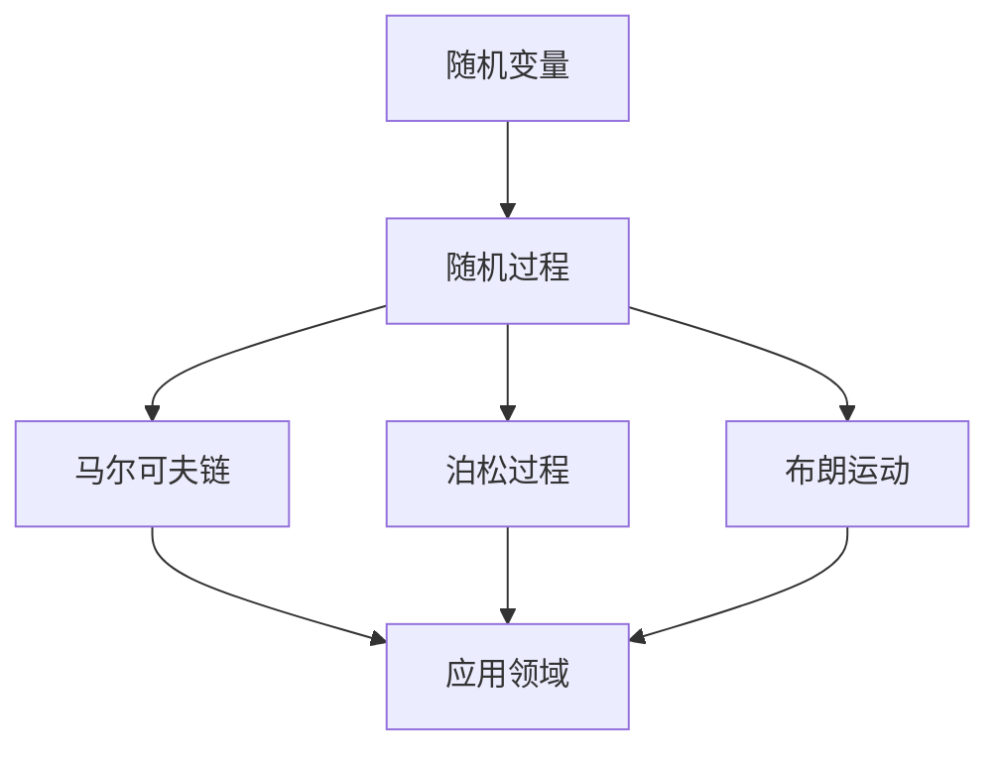

# 03-随机过程理论

## 目录

- [1. 概述](#1-概述)
- [2. 随机过程基础](#2-随机过程基础)
  - [2.1 随机过程定义](#21-随机过程定义)
  - [2.2 随机过程分类](#22-随机过程分类)
  - [2.3 有限维分布](#23-有限维分布)
- [3. 马尔可夫链](#3-马尔可夫链)
  - [3.1 马尔可夫性质](#31-马尔可夫性质)
  - [3.2 转移概率](#32-转移概率)
  - [3.3 平稳分布](#33-平稳分布)
- [4. 泊松过程](#4-泊松过程)
- [5. 布朗运动](#5-布朗运动)
- [6. 随机微分方程](#6-随机微分方程)
- [7. 鞅论](#7-鞅论)
- [8. 应用与扩展](#8-应用与扩展)
- [9. 批判性分析](#9-批判性分析)

## 1. 概述

### 1.1 随机过程的起源与发展

随机过程是概率论的扩展，研究随时间变化的随机现象。



### 1.2 随机过程的核心思想

随机过程将随机性引入时间维度，研究动态随机系统的演化规律。

## 2. 随机过程基础

### 2.1 随机过程定义

#### 2.1.1 基本定义

**定义**：随机过程是定义在概率空间 $(\Omega, \mathcal{F}, P)$ 上的函数族：
$$\{X_t(\omega) : t \in T, \omega \in \Omega\}$$

其中 $T$ 是时间参数集，通常是 $\mathbb{R}$ 或 $\mathbb{Z}$。

#### 2.1.2 样本路径

**定义**：对固定的 $\omega \in \Omega$，函数 $t \mapsto X_t(\omega)$ 称为样本路径。

### 2.2 随机过程分类

#### 2.2.1 按时间参数分类

- **离散时间过程**：$T = \mathbb{Z}$ 或 $\mathbb{N}$
- **连续时间过程**：$T = \mathbb{R}$ 或 $[0,\infty)$

#### 2.2.2 按状态空间分类

- **离散状态过程**：状态空间可数
- **连续状态过程**：状态空间不可数

### 2.3 有限维分布

#### 2.3.1 定义

**定义**：随机过程 $\{X_t\}$ 的有限维分布是：
$$F_{t_1,\ldots,t_n}(x_1,\ldots,x_n) = P(X_{t_1} \leq x_1, \ldots, X_{t_n} \leq x_n)$$

#### 2.3.2 一致性条件

有限维分布必须满足一致性条件（科尔莫哥洛夫定理）。

```rust
// 随机过程基础实现
use std::collections::HashMap;

#[derive(Debug, Clone)]
struct StochasticProcess {
    time_index: Vec<f64>,
    state_space: Vec<f64>,
    sample_paths: HashMap<String, Vec<f64>>,
}

impl StochasticProcess {
    fn new(time_index: Vec<f64>, state_space: Vec<f64>) -> Self {
        StochasticProcess {
            time_index,
            state_space,
            sample_paths: HashMap::new(),
        }
    }
    
    fn add_sample_path(&mut self, path_id: String, values: Vec<f64>) {
        if values.len() == self.time_index.len() {
            self.sample_paths.insert(path_id, values);
        }
    }
    
    fn mean_function(&self) -> Vec<f64> {
        let n_paths = self.sample_paths.len();
        if n_paths == 0 {
            return vec![];
        }
        
        let n_times = self.time_index.len();
        let mut means = vec![0.0; n_times];
        
        for path_values in self.sample_paths.values() {
            for (i, &value) in path_values.iter().enumerate() {
                means[i] += value;
            }
        }
        
        for mean in &mut means {
            *mean /= n_paths as f64;
        }
        
        means
    }
    
    fn covariance_function(&self, t1: usize, t2: usize) -> f64 {
        let mean_t1 = self.mean_function()[t1];
        let mean_t2 = self.mean_function()[t2];
        let n_paths = self.sample_paths.len() as f64;
        
        let mut covariance = 0.0;
        for path_values in self.sample_paths.values() {
            let x1 = path_values[t1] - mean_t1;
            let x2 = path_values[t2] - mean_t2;
            covariance += x1 * x2;
        }
        
        covariance / (n_paths - 1.0)
    }
    
    fn is_stationary(&self) -> bool {
        // 检查是否满足平稳性条件
        // 简化实现：检查均值和方差是否与时间无关
        let means = self.mean_function();
        let first_mean = means[0];
        let last_mean = means[means.len() - 1];
        
        (first_mean - last_mean).abs() < 1e-6
    }
}
```

## 3. 马尔可夫链

### 3.1 马尔可夫性质

#### 3.1.1 马尔可夫性质定义

**定义**：随机过程 $\{X_n\}$ 具有马尔可夫性质，如果：
$$P(X_{n+1} = j | X_n = i, X_{n-1} = i_{n-1}, \ldots, X_0 = i_0) = P(X_{n+1} = j | X_n = i)$$

#### 3.1.2 马尔可夫链

**定义**：具有马尔可夫性质的离散时间随机过程称为马尔可夫链。

### 3.2 转移概率

#### 3.2.1 转移概率矩阵

**定义**：$P_{ij} = P(X_{n+1} = j | X_n = i)$

**转移概率矩阵**：
$$
P = \begin{pmatrix}
P_{11} & P_{12} & \cdots \\
P_{21} & P_{22} & \cdots \\
\vdots & \vdots & \ddots
\end{pmatrix}
$$

#### 3.2.2 n步转移概率

**定义**：$P_{ij}^{(n)} = P(X_{n+m} = j | X_m = i)$

**查普曼-科尔莫哥洛夫方程**：
$$P_{ij}^{(n+m)} = \sum_k P_{ik}^{(n)} P_{kj}^{(m)}$$

```haskell
-- 马尔可夫链
data MarkovChain = MarkovChain {
    states :: [Int],
    transitionMatrix :: [[Double]],
    initialDistribution :: [Double]
}

instance Show MarkovChain where
    show mc = "MarkovChain with " ++ show (length (states mc)) ++ " states"

-- 转移概率矩阵
transitionProbability :: MarkovChain -> Int -> Int -> Double
transitionProbability mc i j =
    let matrix = transitionMatrix mc
    in if i < length matrix && j < length (head matrix)
       then matrix !! i !! j
       else 0.0

-- n步转移概率
nStepTransition :: MarkovChain -> Int -> Int -> Int -> Double
nStepTransition mc n i j =
    let matrix = transitionMatrix mc
        powerMatrix = matrixPower matrix n
    in if i < length powerMatrix && j < length (head powerMatrix)
       then powerMatrix !! i !! j
       else 0.0

-- 矩阵幂运算
matrixPower :: [[Double]] -> Int -> [[Double]]
matrixPower matrix 0 = identityMatrix (length matrix)
matrixPower matrix 1 = matrix
matrixPower matrix n =
    if even n
    then let half = matrixPower matrix (n `div` 2)
         in matrixMultiply half half
    else matrixMultiply matrix (matrixPower matrix (n - 1))

-- 矩阵乘法
matrixMultiply :: [[Double]] -> [[Double]] -> [[Double]]
matrixMultiply a b =
    let rows = length a
        cols = length (head b)
    in [[sum [a !! i !! k * b !! k !! j | k <- [0..length (head a) - 1]]
         | j <- [0..cols - 1]]
        | i <- [0..rows - 1]]

-- 单位矩阵
identityMatrix :: Int -> [[Double]]
identityMatrix n =
    [[if i == j then 1.0 else 0.0 | j <- [0..n-1]] | i <- [0..n-1]]

-- 平稳分布
stationaryDistribution :: MarkovChain -> [Double]
stationaryDistribution mc =
    let matrix = transitionMatrix mc
        n = length matrix
        -- 求解线性方程组 πP = π
        -- 这里使用简化的迭代方法
        initial = replicate n (1.0 / fromIntegral n)
    in iterateToStationary matrix initial

iterateToStationary :: [[Double]] -> [Double] -> [Double]
iterateToStationary matrix pi =
    let newPi = [sum [pi !! i * matrix !! i !! j | i <- [0..length pi - 1]]
                 | j <- [0..length (head matrix) - 1]]
        diff = sum [abs (newPi !! i - pi !! i) | i <- [0..length pi - 1]]
    in if diff < 1e-6
       then newPi
       else iterateToStationary matrix newPi
```

### 3.3 平稳分布

#### 3.3.1 平稳分布定义

**定义**：概率分布 $\pi$ 是平稳分布，如果：
$$\pi_j = \sum_i \pi_i P_{ij}$$

#### 3.3.2 平稳分布性质

- 如果马尔可夫链从平稳分布开始，则分布保持不变
- 不可约马尔可夫链有唯一平稳分布
- 平稳分布是极限分布（如果存在）

```rust
// 马尔可夫链实现
# [derive(Debug, Clone)]
struct MarkovChain {
    states: Vec<usize>,
    transition_matrix: Vec<Vec<f64>>,
    initial_distribution: Vec<f64>,
}

impl MarkovChain {
    fn new(states: Vec<usize>, transition_matrix: Vec<Vec<f64>>) -> Self {
        let n = states.len();
        let initial_distribution = vec![1.0 / n as f64; n];

        MarkovChain {
            states,
            transition_matrix,
            initial_distribution,
        }
    }

    fn transition_probability(&self, from: usize, to: usize) -> f64 {
        if from < self.transition_matrix.len() && to < self.transition_matrix[0].len() {
            self.transition_matrix[from][to]
        } else {
            0.0
        }
    }

    fn n_step_transition(&self, n: usize, from: usize, to: usize) -> f64 {
        let mut current_matrix = self.transition_matrix.clone();

        for _ in 1..n {
            current_matrix = self.matrix_multiply(&current_matrix, &self.transition_matrix);
        }

        if from < current_matrix.len() && to < current_matrix[0].len() {
            current_matrix[from][to]
        } else {
            0.0
        }
    }

    fn matrix_multiply(&self, a: &[Vec<f64>], b: &[Vec<f64>]) -> Vec<Vec<f64>> {
        let rows = a.len();
        let cols = b[0].len();
        let mut result = vec![vec![0.0; cols]; rows];

        for i in 0..rows {
            for j in 0..cols {
                for k in 0..a[0].len() {
                    result[i][j] += a[i][k] * b[k][j];
                }
            }
        }

        result
    }

    fn stationary_distribution(&self) -> Vec<f64> {
        let mut pi = self.initial_distribution.clone();
        let mut converged = false;
        let max_iterations = 1000;
        let tolerance = 1e-6;

        for _ in 0..max_iterations {
            let new_pi = self.next_distribution(&pi);
            let diff: f64 = pi.iter().zip(new_pi.iter())
                .map(|(a, b)| (a - b).abs())
                .sum();

            if diff < tolerance {
                converged = true;
                break;
            }

            pi = new_pi;
        }

        if converged {
            pi
        } else {
            panic!("Stationary distribution did not converge");
        }
    }

    fn next_distribution(&self, current: &[f64]) -> Vec<f64> {
        let n = self.transition_matrix.len();
        let mut next = vec![0.0; n];

        for j in 0..n {
            for i in 0..n {
                next[j] += current[i] * self.transition_matrix[i][j];
            }
        }

        next
    }

    fn simulate(&self, steps: usize) -> Vec<usize> {
        let mut path = Vec::new();
        let mut current_state = self.sample_initial_state();

        for _ in 0..steps {
            path.push(current_state);
            current_state = self.sample_next_state(current_state);
        }

        path
    }

    fn sample_initial_state(&self) -> usize {
        let r = rand::random::<f64>();
        let mut cumulative = 0.0;

        for (i, &prob) in self.initial_distribution.iter().enumerate() {
            cumulative += prob;
            if r <= cumulative {
                return self.states[i];
            }
        }

        self.states[self.states.len() - 1]
    }

    fn sample_next_state(&self, current_state: usize) -> usize {
        let state_index = self.states.iter().position(|&s| s == current_state)
            .unwrap_or(0);
        let transition_probs = &self.transition_matrix[state_index];

        let r = rand::random::<f64>();
        let mut cumulative = 0.0;

        for (i, &prob) in transition_probs.iter().enumerate() {
            cumulative += prob;
            if r <= cumulative {
                return self.states[i];
            }
        }

        self.states[self.states.len() - 1]
    }
}
```

## 4. 泊松过程

### 4.1 泊松过程定义

#### 4.1.1 计数过程

**定义**：计数过程 $\{N(t) : t \geq 0\}$ 满足：

- $N(0) = 0$
- $N(t)$ 是非负整数
- $N(t)$ 是右连续的
- $N(t) - N(s)$ 表示区间 $(s,t]$ 中的事件数

#### 4.1.2 泊松过程

**定义**：计数过程 $\{N(t)\}$ 是强度为 $\lambda$ 的泊松过程，如果：

1. $N(0) = 0$
2. 独立增量
3. 平稳增量
4. $N(t) \sim \text{Poisson}(\lambda t)$

### 4.2 泊松过程性质

#### 4.2.1 基本性质

- $E[N(t)] = \lambda t$
- $\text{Var}(N(t)) = \lambda t$
- 事件间隔时间服从指数分布

#### 4.2.2 条件分布

给定 $N(t) = n$，事件发生时间在 $[0,t]$ 上均匀分布。

```haskell
-- 泊松过程
data PoissonProcess = PoissonProcess {
    intensity :: Double,
    eventTimes :: [Double]
}

instance Show PoissonProcess where
    show pp = "PoissonProcess with intensity " ++ show (intensity pp)

-- 生成泊松过程
generatePoissonProcess :: Double -> Double -> PoissonProcess
generatePoissonProcess lambda t =
    let eventTimes = generateEventTimes lambda t
    in PoissonProcess lambda eventTimes

-- 生成事件时间
generateEventTimes :: Double -> Double -> [Double]
generateEventTimes lambda t =
    let interarrivalTimes = map (\_ -> exponentialRandom lambda) [1..]
        arrivalTimes = scanl1 (+) interarrivalTimes
    in takeWhile (<= t) arrivalTimes

-- 指数分布随机数
exponentialRandom :: Double -> Double
exponentialRandom lambda =
    let u = randomIO :: IO Double
    in -log u / lambda

-- 泊松过程计数
countEvents :: PoissonProcess -> Double -> Int
countEvents pp t = length (filter (<= t) (eventTimes pp))

-- 泊松过程期望
expectedEvents :: PoissonProcess -> Double -> Double
expectedEvents pp t = intensity pp * t

-- 泊松过程方差
varianceEvents :: PoissonProcess -> Double -> Double
varianceEvents pp t = intensity pp * t
```

## 5. 布朗运动

### 5.1 布朗运动定义

#### 5.1.1 标准布朗运动

**定义**：随机过程 $\{B(t) : t \geq 0\}$ 是标准布朗运动，如果：

1. $B(0) = 0$
2. 独立增量
3. 平稳增量
4. $B(t) - B(s) \sim N(0, t-s)$

#### 5.1.2 几何布朗运动

**定义**：$S(t) = S(0) \exp\left(\left(\mu - \frac{\sigma^2}{2}\right)t + \sigma B(t)\right)$

### 5.2 布朗运动性质

#### 5.2.1 基本性质

- $E[B(t)] = 0$
- $\text{Var}(B(t)) = t$
- $B(t) \sim N(0, t)$
- 样本路径几乎处处连续但不可微

#### 5.2.2 反射原理

**反射原理**：对任意 $a > 0$，
$$P(\max_{0 \leq s \leq t} B(s) \geq a) = 2P(B(t) \geq a)$$

```rust
// 布朗运动实现
# [derive(Debug, Clone)]
struct BrownianMotion {
    drift: f64,
    volatility: f64,
    time_points: Vec<f64>,
    paths: Vec<Vec<f64>>,
}

impl BrownianMotion {
    fn new(drift: f64, volatility: f64, time_points: Vec<f64>) -> Self {
        BrownianMotion {
            drift,
            volatility,
            time_points,
            paths: Vec::new(),
        }
    }

    fn generate_path(&mut self, initial_value: f64) -> Vec<f64> {
        let mut path = vec![initial_value];
        let mut current_value = initial_value;

        for i in 1..self.time_points.len() {
            let dt = self.time_points[i] - self.time_points[i-1];
            let dw = self.generate_normal_random(0.0, dt.sqrt());

            // 欧拉-丸山方法
            current_value += self.drift * dt + self.volatility * dw;
            path.push(current_value);
        }

        self.paths.push(path.clone());
        path
    }

    fn generate_normal_random(&self, mean: f64, std_dev: f64) -> f64 {
        // Box-Muller变换
        let u1 = rand::random::<f64>();
        let u2 = rand::random::<f64>();

        let z0 = (-2.0 * u1.ln()).sqrt() * (2.0 * std::f64::consts::PI * u2).cos();
        mean + std_dev * z0
    }

    fn geometric_brownian_motion(&mut self, initial_value: f64) -> Vec<f64> {
        let mut path = vec![initial_value];
        let mut current_value = initial_value;

        for i in 1..self.time_points.len() {
            let dt = self.time_points[i] - self.time_points[i-1];
            let dw = self.generate_normal_random(0.0, dt.sqrt());

            // 几何布朗运动
            let drift_term = (self.drift - 0.5 * self.volatility * self.volatility) * dt;
            let diffusion_term = self.volatility * dw;

            current_value *= (drift_term + diffusion_term).exp();
            path.push(current_value);
        }

        self.paths.push(path.clone());
        path
    }

    fn expected_value(&self, t: f64) -> f64 {
        // 对于标准布朗运动，期望为0
        // 对于带漂移的布朗运动，期望为 drift * t
        self.drift * t
    }

    fn variance(&self, t: f64) -> f64 {
        // 方差为 volatility^2 * t
        self.volatility * self.volatility * t
    }

    fn probability_hitting_barrier(&self, barrier: f64, t: f64) -> f64 {
        // 使用反射原理计算击中障碍的概率
        if barrier > 0.0 {
            2.0 * (1.0 - normal_cdf(barrier / t.sqrt()))
        } else {
            0.0
        }
    }
}

fn normal_cdf(x: f64) -> f64 {
    0.5 * (1.0 + erf(x / 2.0_f64.sqrt()))
}

fn erf(x: f64) -> f64 {
    // 误差函数的近似实现
    let a1 = 0.254829592;
    let a2 = -0.284496736;
    let a3 = 1.421413741;
    let a4 = -1.453152027;
    let a5 = 1.061405429;
    let p = 0.3275911;

    let sign = if x < 0.0 { -1.0 } else { 1.0 };
    let x = x.abs();

    let t = 1.0 / (1.0 + p * x);
    let y = 1.0 - (((((a5 * t + a4) * t) + a3) * t + a2) * t + a1) * t * (-x * x).exp();

    sign * y
}
```

## 6. 随机微分方程

### 6.1 随机微分方程基础

#### 6.1.1 伊藤积分

**定义**：伊藤积分是随机积分的标准形式：
$$\int_0^t f(s) dB(s) = \lim_{n \to \infty} \sum_{i=1}^n f(t_{i-1})(B(t_i) - B(t_{i-1}))$$

#### 6.1.2 随机微分方程

**形式**：$dX(t) = \mu(t, X(t)) dt + \sigma(t, X(t)) dB(t)$

### 6.2 伊藤引理

#### 6.2.1 伊藤引理

**定理**：设 $f(t, x)$ 是二次连续可微函数，则：
$$df(t, X(t)) = \frac{\partial f}{\partial t} dt + \frac{\partial f}{\partial x} dX(t) + \frac{1}{2}\frac{\partial^2 f}{\partial x^2} (dX(t))^2$$

#### 6.2.2 应用

伊藤引理用于求解随机微分方程和计算随机过程的函数。

```haskell
-- 随机微分方程
data StochasticDifferentialEquation = SDE {
    drift :: Double -> Double -> Double,
    diffusion :: Double -> Double -> Double,
    initialValue :: Double
}

-- 欧拉-丸山方法求解SDE
solveSDE :: StochasticDifferentialEquation -> [Double] -> [Double]
solveSDE sde timePoints =
    let initial = initialValue sde
        solveStep x t dt =
            let driftTerm = drift sde t x * dt
                diffusionTerm = diffusion sde t x * sqrt dt * normalRandom
            in x + driftTerm + diffusionTerm
    in scanl (\x (t, dt) -> solveStep x t dt) initial
             (zip timePoints (zipWith (-) (tail timePoints) timePoints))

-- 正态随机数
normalRandom :: Double
normalRandom =
    let u1 = randomIO :: IO Double
        u2 = randomIO :: IO Double
    in sqrt (-2 * log u1) * cos (2 * pi * u2)

-- 几何布朗运动SDE
geometricBrownianMotion :: Double -> Double -> StochasticDifferentialEquation
geometricBrownianMotion mu sigma = SDE {
    drift = \_ x -> mu * x,
    diffusion = \_ x -> sigma * x,
    initialValue = 1.0
}

-- 均值回归过程SDE
meanRevertingProcess :: Double -> Double -> Double -> StochasticDifferentialEquation
meanRevertingProcess theta mu sigma = SDE {
    drift = \_ x -> theta * (mu - x),
    diffusion = \_ _ -> sigma,
    initialValue = mu
}
```

## 7. 鞅论

### 7.1 鞅定义

#### 7.1.1 鞅

**定义**：随机过程 $\{X_n\}$ 是鞅，如果：
$$E[X_{n+1} | X_1, \ldots, X_n] = X_n$$

#### 7.1.2 上鞅和下鞅

**上鞅**：$E[X_{n+1} | X_1, \ldots, X_n] \leq X_n$
**下鞅**：$E[X_{n+1} | X_1, \ldots, X_n] \geq X_n$

### 7.2 鞅性质

#### 7.2.1 基本性质

- 鞅的期望是常数
- 鞅的增量是正交的
- 鞅变换保持鞅性质

#### 7.2.2 鞅收敛定理

**定理**：有界鞅几乎必然收敛。

## 8. 应用与扩展

### 8.1 金融应用

#### 8.1.1 期权定价

布莱克-斯科尔斯模型基于几何布朗运动。

#### 8.1.2 风险管理

随机过程用于建模金融风险。

### 8.2 物理应用

#### 8.2.1 扩散过程

布朗运动描述粒子扩散。

#### 8.2.2 量子力学

随机过程在量子力学中的应用。

### 8.3 生物应用

#### 8.3.1 种群动力学

马尔可夫链建模种群演化。

#### 8.3.2 神经科学

随机过程建模神经元活动。

## 9. 批判性分析

### 9.1 方法论反思

#### 9.1.1 模型假设

随机过程模型的假设合理性。

#### 9.1.2 参数估计

随机过程参数的估计问题。

### 9.2 实践问题

#### 9.2.1 计算复杂性

随机过程计算的数值方法。

#### 9.2.2 数据要求

随机过程建模对数据的要求。

### 9.3 现代发展

#### 9.3.1 高维随机过程

高维随机过程的理论和应用。

#### 9.3.2 非马尔可夫过程

非马尔可夫过程的研究。

### 9.4 未来展望

#### 9.4.1 机器学习

随机过程在机器学习中的应用。

#### 9.4.2 大数据

大数据环境下的随机过程建模。

---

**参考文献**:

1. Karlin, S., & Taylor, H. M. (1975). *A First Course in Stochastic Processes*. Academic Press.
2. Ross, S. M. (2014). *Introduction to Probability Models*. Academic Press.
3. Øksendal, B. (2003). *Stochastic Differential Equations*. Springer.
4. Durrett, R. (2019). *Probability: Theory and Examples*. Cambridge University Press.
5. Williams, D. (1991). *Probability with Martingales*. Cambridge University Press.

---

**相关链接**:

- [概率论基础](./01-概率论基础.md)
- [数理统计基础](./02-数理统计基础.md)
- [数学哲学基础](../01-哲学与元数学基础/01-数学哲学基础.md)
