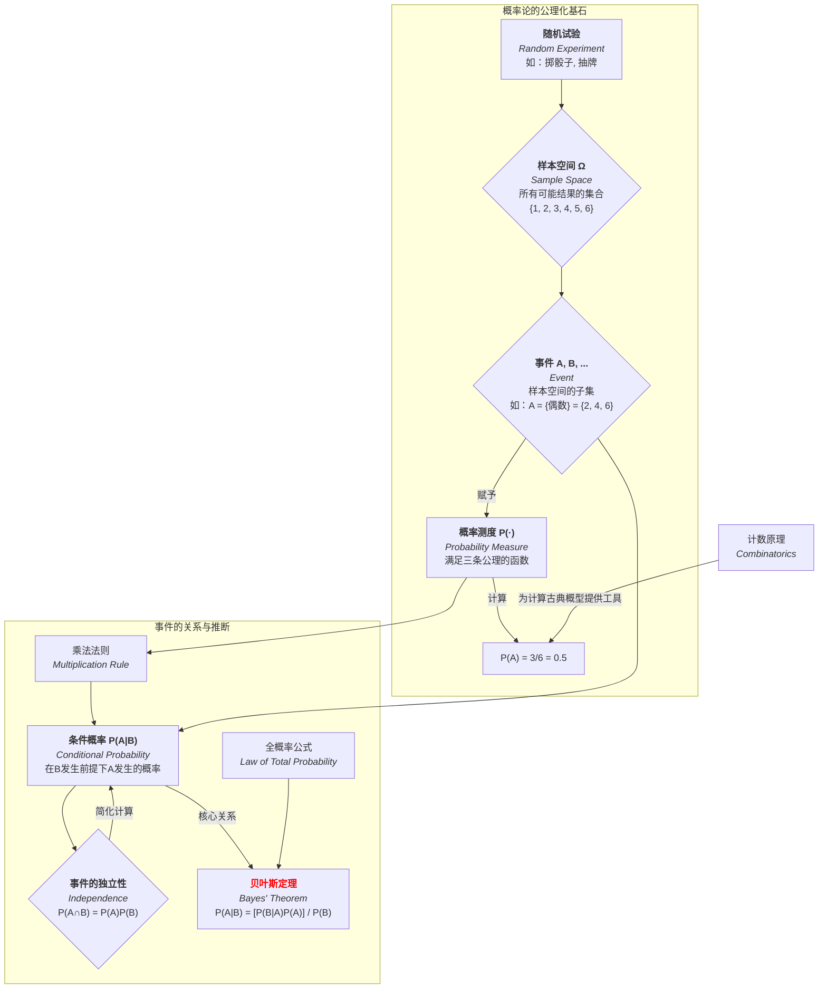

# 01-概率论基础总览

**版本**: 1.0
**日期**: 2025-07-02

---

## 1.1. 引言：量化不确定性

**概率论 (Probability Theory)** 是研究和量化**不确定性 (Uncertainty)** 和**随机性 (Randomness)** 的数学分支。从掷硬币的简单游戏，到金融市场的复杂波动、量子力学的微观行为，再到机器学习算法的决策依据，随机现象无处不在。概率论为我们提供了一套严谨的公理化语言和强大的分析工具，来描述这些现象的内在规律。

本模块是整个概率论与统计学知识体系的基石。我们将从最基本的概念——**随机试验、样本空间、事件**——出发，学习由柯尔莫哥洛夫建立的概率公理体系，并掌握处理事件关系的两个核心工具：**条件概率**和**事件的独立性**。最后，我们将探讨强大的**贝叶斯定理**，它是现代统计推断和机器学习中许多思想的理论源头。

## 1.2. 知识地图 (Mermaid)

## 1.3. 探索路径

1. **[01-随机试验与样本空间](./01-随机试验与样本空间.md)**: 建立描述随机现象的通用语言，介绍什么是随机试验、基本结果，以及所有可能结果构成的集合——样本空间 \(\Omega\)。
2. **[02-事件与概率公理](./02-事件与概率公理.md)**: 定义事件作为样本空间的子集，并学习将概率严格化的三条**柯尔莫哥洛夫公理**。这是整个理论的逻辑出发点。
3. **[03-条件概率与独立性](./03-条件概率与独立性.md)**: 探讨事件之间的相互影响。学习如何在获得部分信息后更新概率（条件概率），并定义事件之间"互不影响"的数学描述（独立性）。
4. **[04-计数分析与古典概型](./04-计数分析与古典概型.md)**: 专注于样本空间有限且等可能的情况（古典概型）。系统学习排列、组合等计数工具，这是计算许多实际问题概率的基础。
5. **[05-贝叶斯定理](./05-贝叶斯定理.md)**: 学习概率论中最具影响力的定理之一。理解贝叶斯定理如何将先验知识和新的证据结合起来，得到更新后的后验概率，并感受其在科学推断和机器学习中的巨大威力。

---
[返回上一级: 06-概率论与统计学总览](../00-06-概率论与统计学总览.md) | [返回项目总览](../../09-项目总览/00-项目总览.md)
