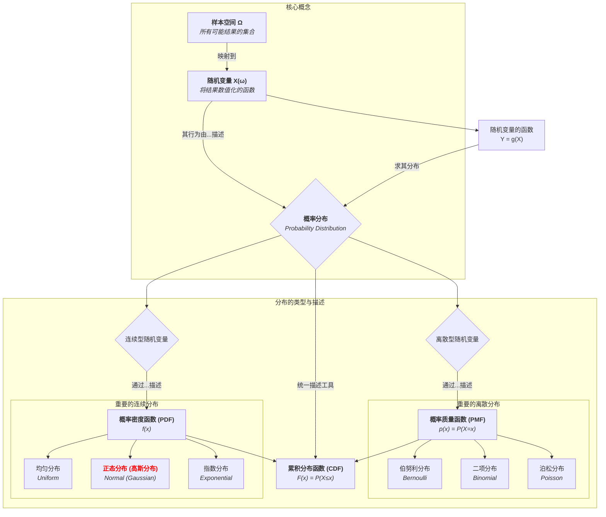

# 00-随机变量与分布总览：从事件到数值

## 📋 本地目录导航

- [01-随机变量的概念](./01-随机变量的概念.md)
- [02-离散型随机变量与概率质量函数](./02-离散型随机变量与概率质量函数.md)
- [03-泊松分布](./03-泊松分布.md)
- [04-连续型随机变量与概率密度函数](./04-连续型随机变量与概率密度函数.md)
- [05-正态分布](./05-正态分布.md)
- [06-累积分布函数](./06-累积分布函数.md)
- [07-随机变量的函数](./07-随机变量的函数.md)

## 🧠 本地知识图谱

- **概率总览**: [概率论与统计学总览](../00-06-概率论与统计学总览.md)
- **随机变量**: [随机变量的概念](./01-随机变量的概念.md)
- **离散分布**: [离散型随机变量与概率质量函数](./02-离散型随机变量与概率质量函数.md)
- **泊松分布**: [泊松分布](./03-泊松分布.md)
- **连续分布**: [连续型随机变量与概率密度函数](./04-连续型随机变量与概率密度函数.md)
- **正态分布**: [正态分布](./05-正态分布.md)
- **累积分布**: [累积分布函数](./06-累积分布函数.md)
- **函数变换**: [随机变量的函数](./07-随机变量的函数.md)
- **概率基础**: [概率论基础](../01-概率论基础/00-模块总览.md)
- **数理统计**: [数理统计](../03-数理统计/00-03-数理统计总览.md)

---

**版本**: 1.0
**日期**: 2025-07-03

## 2.1. 引言：从事件到数值

在概率论基础模块中，我们学习了如何描述和计算事件的概率。然而，在许多实际问题中，我们更关心的是与随机试验结果相关的某个**数值**。例如，在掷两次硬币的试验中，我们可能不关心具体的正反序列，而是关心"正面出现的次数"（这个值可能是0, 1, 或 2）。

**随机变量 (Random Variable)** 正是实现这一转变的数学工具。它是一个函数，将样本空间中的每一个基本结果（样本点）映射到一个实数。通过引入随机变量，我们可以将对事件的复杂描述，转化为对数值的分析，从而能够运用微积分、代数等更强大的数学工具来研究随机现象的规律。

本模块将系统介绍随机变量的概念，探讨其两种基本类型——**离散型**和**连续型**，并学习几种在理论和实践中都至关重要的典型概率分布。

## 2.2. 知识地图 (Mermaid)

## 2.3. 探索路径

1. **[01-随机变量的概念](./01-随机变量的概念.md)**: 形式化地定义什么是随机变量，理解它作为样本空间到实数集的映射函数的作用，并区分其两种基本类型：离散型和连续型。
2. **[02-离散型随机变量与概率质量函数](./02-离散型随机变量与概率质量函数.md)**: 专注于只取有限或可数个值的随机变量。学习其概率分布的描述工具——**概率质量函数 (PMF)**，并详细探讨**伯努利分布**和**二项分布**。
3. **[03-泊松分布](./03-泊松分布.md)**: 专门探讨一个极其重要的离散分布——**泊松分布**。理解它如何描述单位时间/空间内稀有事件发生的次数，以及它作为二项分布极限的推导过程。
4. **[04-连续型随机变量与概率密度函数](./04-连续型随机变量与概率密度函数.md)**: 转向可以取连续值的随机变量。引入描述其概率分布的核心工具——**概率密度函数 (PDF)**，并学习**均匀分布**和**指数分布**。
5. **[05-正态分布](./05-正态分布.md)**: 详细研究概率论的灵魂——**正态分布（高斯分布）**。理解其钟形曲线的特性，学习标准正态分布的计算，并了解中心极限定理的初步思想。
6. **[06-累积分布函数](./06-累积分布函数.md)**: 介绍**累积分布函数 (CDF)** 作为一个通用工具，它能够统一地描述所有类型（离散、连续、混合）随机变量的概率分布。
7. **[07-随机变量的函数](./07-随机变量的函数.md)**: 学习当一个随机变量 Y 是另一个随机变量 X 的函数时（例如 Y = X²），如何从 X 的分布推导出 Y 的分布。

---
[返回上一级: 06-概率论与统计学总览](../00-06-概率论与统计学总览.md) | [返回项目总览](../../09-项目总览/00-项目总览.md)
