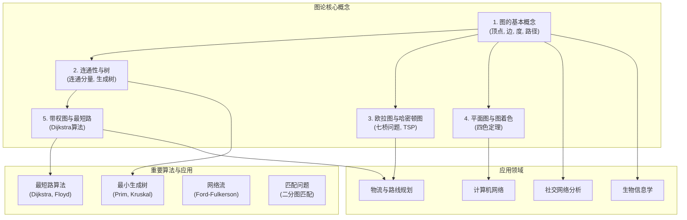

## 模块总览：图论

### 模块简介

图论 (Graph Theory) 是离散数学的一个核心分支，它以**图 (Graph)** 为研究对象。图是由若干个**顶点 (Vertex)** 和连接这些顶点的**边 (Edge)** 所构成的数学结构，它能极其有效地对现实世界中各种"连接"关系进行建模。

从社交网络、计算机网络、交通地图，到分子结构、任务依赖关系，图论为我们提供了一种统一的语言和强大的分析工具。本模块将介绍图论的基本概念、经典问题和重要算法，为理解和解决复杂的网络化问题打下坚实的基础。

### 知识地图 (Mermaid)

### 核心主题

本模块将围绕以下五个核心主题展开：

1. **[01-图的基本概念.md](./01-图的基本概念.md)**:
    * **内容**: 介绍图的正式定义，包括有向图、无向图、简单图、多重图等。学习核心术语，如顶点的度、邻接、路径、回路（环）、子图等。
    * **目标**: 掌握图论的基本语言，能够用图来描述一个实际问题。

2. **[02-连通性与树.md](./02-连通性与树.md)**:
    * **内容**: 探讨图的连通性，包括连通图和连通分量的概念。深入研究一类特殊而重要的图——**树**，学习其定义、性质、生成树以及最小生成树算法（如Prim或Kruskal）。
    * **目标**: 理解图的连通性质，并掌握树作为基本数据结构的核心特征和应用。

3. **[03-欧拉图与哈密顿图.md](./03-欧拉图与哈密顿图.md)**:
    * **内容**: 学习图论中的两个经典遍历问题。**欧拉图**研究的是如何不重复地走完所有的**边**（哥尼斯堡七桥问题）。**哈密顿图**研究的是如何不重复地访问所有的**顶点**（旅行商问题）。
    * **目标**: 理解欧拉图和哈密顿图的判定条件，并认识到两者在计算复杂度上的巨大差异。

4. **[04-平面图与图着色.md](./04-平面图与图着色.md)**:
    * **内容**: 介绍可以绘制在平面上且所有边除端点外不相交的**平面图**。学习欧拉公式（$V-E+F=2$）及其应用。探讨**图着色**问题，即如何用最少的颜色给图的顶点着色，使得相邻顶点颜色不同（四色定理）。
    * **目标**: 掌握平面图的基本性质，理解图着色问题的模型和应用。

5. **[05-带权图与最短路算法.md](./05-带权图与最短路算法.md)**:
    * **内容**: 学习**带权图**，即边上赋有权重（如成本、距离、时间）的图。重点介绍解决单源最短路问题的经典算法——**迪杰斯特拉 (Dijkstra) 算法**。
    * **目标**: 能够为实际问题建立带权图模型，并应用Dijkstra等算法解决最短路径问题。

### 核心定理与算法

| 名称 | 核心思想 | 所在章节 |
| :--- | :--- | :--- |
| **握手定理** | 所有顶点的度数之和等于边数的两倍。 | [01](./01-图的基本概念.md) |
| **欧拉路径定理** | 一个连通图存在欧拉路径，当且仅当度为奇数的顶点数量为0或2。 | [03](./03-欧拉图与哈密顿图.md) |
| **欧拉公式** | 对于任何连通的平面图，$V-E+F=2$。 | [04](./04-平面图与图着色.md) |
| **Dijkstra算法** | 一个贪心算法，用于寻找带非负权重的图中单源最短路径。 | [05](./05-带权图与最短路算法.md) |

### 符号与术语约定

| 符号/术语 | 含义 |
|:--- |:---|
| $G=(V, E)$ | 一个图，由顶点集V和边集E组成 |
| $V$ | 顶点的集合 |
| $E$ | 边的集合 |
| $deg(v)$ | 顶点v的度 |
| $K_n$ | n个顶点的完全图 |
| $C_n$ | n个顶点的循环图 |

### 学习路径

建议按照以上核心主题的顺序学习。首先掌握图论的基本语言和概念，然后逐步深入到连通性、树、经典遍历问题、平面性与着色，最后学习带权图和相关算法。这个路径符合从理论到应用、从简单到复杂的认知规律，能够帮助你系统地构建图论的知识体系。

---
[返回上一级: ../00-章节总览.md] | [返回项目总览: ../../09-项目总览/00-项目总览.md]
