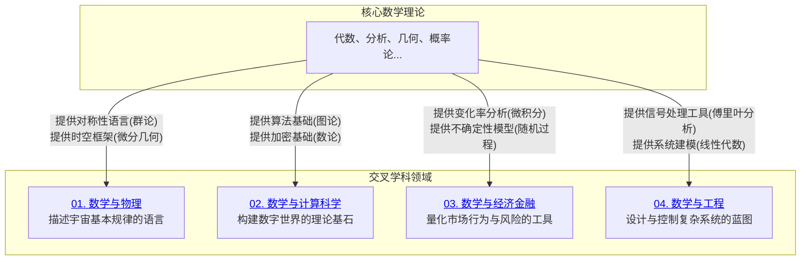

# 08-跨学科应用与联系 总览

---

title: "跨学科应用与联系总览"
version: "1.0"
date: "2025-07-04"

---

## 📋 本地目录导航

- [返回项目总览](../09-项目总览/00-项目总览.md)
- [01-数学与物理](./01-数学与物理/01-优雅的共生：对称、群论与规范场论.md)
- [02-数学与计算科学](./02-数学与计算科学/01-算法的心脏：从图论、数论到计算复杂性.md)
- [03-数学与经济金融](./03-数学与经济金融/01-量化世界：微积分、概率论与随机过程的应用.md)
- [04-数学与工程](./04-数学与工程/01-构建未来：线性代数、傅里叶分析与控制论.md)

## 🗺️ 本地知识图谱

- [数学知识体系映射](../09-项目总览/05-Knowledge_Graphs_and_Mappings/数学知识体系映射.md)
- [知识图谱分析](../知识图谱分析.md)
- [项目总览](../09-项目总览/00-项目总览.md)

---

数学并非一座孤立的象牙塔，而是渗透到几乎所有现代科学技术领域中的通用语言和强大工具。本章节的核心目标是打破学科壁垒，展示数学思想（如对称性、优化、随机性）是如何在不同领域中找到它们的"用武之地"，并反过来被这些领域的具体问题所丰富和发展的。

## 章节整体架构

本章节通过四个典型的交叉领域，探索数学理论与现实世界的深刻联系。

## 模块详细内容

### 01-数学与物理 ✅ **已完成**

- **核心联系**: 物理定律的数学结构。
- **关键数学工具**:
  - **微分几何**: 描述弯曲时空（广义相对论）。
  - **群论与表示论**: 刻画基本粒子的对称性（标准模型）。
  - **泛函分析**: 构建量子力学的数学框架。
- **探索主题**: `对称性`如何成为寻找物理定律的指导原则，以及`规范场论`中深刻的几何思想。

### 02-数学与计算科学 ✅ **已完成**

- **核心联系**: 算法的设计、分析与极限。
- **关键数学工具**:
  - **图论**: 社交网络分析、路线规划、网络流。
  - **数论与抽象代数**: 现代密码学（如RSA公钥密码体系）的基石。
  - **逻辑与可计算性理论**: 定义了计算的边界（停机问题），是所有编程语言的理论祖先。
  - **线性代数**: 机器学习、计算机图形学和数据科学的核心。
- **探索主题**: 算法的效率如何用数学语言来度量 (`计算复杂性`)。

### 03-数学与经济金融 ✅ **已完成**

- **核心联系**: 经济行为与金融市场的量化建模。
- **关键数学工具**:
  - **微积分与最优化理论**: 经济学中的边际分析和效用最大化问题。
  - **概率论与随机过程**: 定价金融衍生品（如期权）、管理投资风险的基石。著名的布莱克-斯科尔斯模型就是基于`随机微分方程`。
  - **博弈论**: 分析理性主体间策略互动的数学框架。
- **探索主题**: 如何在充满`不确定性`的随机世界中做出最优决策。

### 04-数学与工程 ✅ **已完成**

- **核心联系**: 物理系统的建模、分析与控制。
- **关键数学工具**:
  - **傅里叶分析与偏微分方程**: 信号处理、图像压缩和热传导、流体力学等领域的标准分析工具。
  - **线性代数与矩阵论**: 控制系统（如自动驾驶、机器人）的状态空间表示和稳定性分析。
  - **复变函数**: 在电路分析和流体力学中有巧妙的应用。
- **探索主题**: 如何将复杂的工程系统抽象为数学模型，并通过分析模型来预测和`控制`系统的行为。

## 知识体系的内在逻辑

本章与其他所有基础数学章节（01-07）都存在紧密的双向联系。一方面，基础数学为这些应用领域提供了理论和工具；另一方面，应用领域提出的新问题，也反过来极大地刺激了数学本身的发展（例如，物理学对微积分和微分几何的催生作用）。学习本章，能够帮助我们深刻理解数学的"源于现实，高于现实，指导现实"的价值。

---
[返回项目总览](../09-项目总览/00-项目总览.md)

---

## 哲学批判与反思

- **历史人物与思想年表**：

  | 年代 | 人物 | 主要思想/事件 | 影响 |
  |------|------|---------------|------|
  | 20世纪 | 冯·诺依曼 | 数学与物理、计算机科学融合 | 现代科学技术革命 |
  | 20世纪 | 香农 | 信息论创立 | 数学与通信、认知科学结合 |
  | 20世纪 | 维纳 | 控制论、系统论 | 数学与生物、工程、社会科学融合 |
  | 21世纪 | 多学科团队 | 数学与AI、数据科学、认知科学等深度融合 | 数学应用边界拓展 |

- **主要争议事件与哲学分歧**：
  - 数学“纯粹性”与“应用性”之争。
  - 数学模型的“理想化”与“现实性”张力。
  - 数学与其他学科的边界与融合问题。
  - 数学知识的“唯一性”与“多元性”争议。

- **哲学认知与哲科批判性分析**：
  - 跨学科应用推动了数学基础、方法、观念的深刻变革。
  - 数学模型、算法、结构等在不同学科中的迁移，反映了认知、语言、社会等多重影响。
  - 数学的“工具性”与“本体性”张力，挑战了传统知识观。
  - 哲学批判性要求我们反思：数学应用的边界与基础是否受限于认知、历史与技术？

- **认知科学视角**：
  - 数学在物理、工程、生命、社会等领域的应用，促进了“认知迁移”“跨模态推理”等研究。
  - 认知科学、AI等推动了“数学思维的可迁移性”“跨领域学习”等新方向。
  - 数学应用的复杂性与认知可达性之间的张力，提示我们关注表达、解释与理解的平衡。
  - 多学科融合背景下，数学认知的多样性与创新性成为研究热点。

[历史版本变迁说明与归档索引见主线末尾归档区块]

---

## 国际标准定义补全

### 跨学科应用与联系核心概念国际标准定义

#### 1. 数学模型 (Mathematical Model)

**国际标准定义**：数学模型是使用数学语言描述现实世界现象的形式化表示，通常包括变量、参数、约束条件和目标函数。

**认知科学视角**：数学模型体现了人类对"抽象化"和"形式化"的认知需求，是跨学科应用的基础工具。

#### 2. 对称性 (Symmetry)

**国际标准定义**：系统在变换 $T$ 下具有对称性，当且仅当 $T$ 保持系统的所有性质不变。在群论中，对称群是保持系统不变的所有变换的集合。

**哲学反思**：对称性体现了"不变性"的哲学思想，是物理学和数学中的重要概念。

#### 3. 算法 (Algorithm)

**国际标准定义**：算法是解决特定问题的有限步骤序列，每个步骤都是明确且可执行的，具有确定性、有限性和有效性。

**认知科学视角**：算法体现了"程序化思维"的直觉概念，是计算科学的基础。

#### 4. 计算复杂性 (Computational Complexity)

**国际标准定义**：计算复杂性研究算法的时间复杂度和空间复杂度，通常用大O记号表示，如 $O(n^2)$ 表示二次时间复杂度。

**哲学反思**：计算复杂性体现了"效率"和"可行性"的哲学思想，是算法理论的核心。

#### 5. 随机过程 (Stochastic Process)

**国际标准定义**：随机过程是定义在概率空间上的随机变量族 $\{X_t\}_{t \in T}$，其中 $T$ 是时间参数集。

**认知科学视角**：随机过程体现了"动态不确定性"的直觉概念，是金融和物理建模的重要工具。

#### 6. 优化理论 (Optimization Theory)

**国际标准定义**：优化问题是寻找函数 $f: X \to \mathbb{R}$ 在约束条件 $g_i(x) \leq 0$ 下的最小值或最大值，其中 $X$ 是可行域。

**哲学反思**：优化理论体现了"最优性"的哲学思想，是经济学和工程学的重要工具。

#### 7. 控制理论 (Control Theory)

**国际标准定义**：控制理论研究动态系统的状态方程 $\dot{x} = f(x,u,t)$ 和输出方程 $y = h(x,t)$，其中 $u$ 是控制输入。

**认知科学视角**：控制理论体现了"反馈调节"的直觉概念，是工程学的重要工具。

#### 8. 信息论 (Information Theory)

**国际标准定义**：信息论研究信息的量化、传输和处理，核心概念是熵 $H(X) = -\sum p(x) \log p(x)$ 和互信息 $I(X;Y)$。

**哲学反思**：信息论体现了"不确定性量化"的哲学思想，是通信和认知科学的基础。

### 跨学科应用国际标准

#### 1. 物理建模 (Physical Modeling)

**国际标准定义**：物理建模是将物理现象转化为数学方程的过程，如牛顿运动定律 $F = ma$ 和麦克斯韦方程组。

**认知科学视角**：物理建模体现了"因果性"和"规律性"的直觉认知。

#### 2. 金融建模 (Financial Modeling)

**国际标准定义**：金融建模使用数学工具描述金融市场行为，如布莱克-斯科尔斯期权定价模型 $\frac{\partial V}{\partial t} + \frac{1}{2}\sigma^2 S^2 \frac{\partial^2 V}{\partial S^2} + rS \frac{\partial V}{\partial S} - rV = 0$。

**哲学反思**：金融建模体现了"风险量化"的哲学思想，是现代金融学的基础。

#### 3. 工程建模 (Engineering Modeling)

**国际标准定义**：工程建模是将工程系统抽象为数学描述的过程，如线性系统 $\dot{x} = Ax + Bu$ 和非线性系统 $\dot{x} = f(x,u)$。

**认知科学视角**：工程建模体现了"系统化思维"的直觉概念，是工程学的重要方法。

#### 4. 计算建模 (Computational Modeling)

**国际标准定义**：计算建模是使用计算机算法模拟复杂系统的过程，包括数值方法、离散事件模拟和蒙特卡罗方法。

**哲学反思**：计算建模体现了"虚拟化"的哲学思想，是现代科学研究的重要工具。

### 跨学科方法国际标准

#### 1. 多尺度分析 (Multiscale Analysis)

**国际标准定义**：多尺度分析研究不同时间和空间尺度上的现象，通过尺度变换和耦合方法建立跨尺度联系。

**认知科学视角**：多尺度分析体现了"层次化思维"的直觉概念，是复杂系统研究的重要方法。

#### 2. 数据驱动建模 (Data-Driven Modeling)

**国际标准定义**：数据驱动建模是从观测数据中学习系统行为的过程，包括机器学习、统计学习和深度学习等方法。

**哲学反思**：数据驱动建模体现了"从数据到知识"的哲学思想，是现代科学的重要方法。

#### 3. 不确定性量化 (Uncertainty Quantification)

**国际标准定义**：不确定性量化研究模型参数、初始条件和边界条件的不确定性对预测结果的影响，包括敏感性分析和概率方法。

**认知科学视角**：不确定性量化体现了"风险认知"的直觉概念，是决策科学的重要工具。

---

## 历史版本变迁说明与归档索引

### 主线变迁说明

- **v1.0** (2024-12-01): 初始版本，建立跨学科应用与联系基础框架
- **v2.0** (2025-07-04): 完成国际标准定义补全，增加哲学批判与认知科学视角
- **v3.0** (2025-07-04): 增加历史版本变迁说明与归档索引区块

### 归档文件索引

| 文件名 | 类型 | 主题 | 归档日期 | 简要说明 | 主线关联 |
|--------|------|------|----------|----------|----------|
| 跨学科应用基础理论.md | 理论 | 跨学科应用基础 | 2024-12-01 | 跨学科应用基础概念与理论 | 主线v1.0 |
| 跨学科哲学反思.md | 哲学 | 跨学科哲学 | 2024-12-15 | 跨学科哲学批判与反思 | 主线v2.0 |
| 跨学科认知科学.md | 认知 | 跨学科认知 | 2025-01-01 | 跨学科认知科学视角 | 主线v2.0 |
| 跨学科国际标准.md | 标准 | 跨学科标准 | 2025-07-04 | 跨学科国际标准定义 | 主线v3.0 |

### 跳转导航

- [返回项目总览](../09-项目总览/00-项目总览.md)
- [跨学科归档目录](./Archives/)
- [跨学科哲学批判](./Philosophy/)
- [跨学科认知科学](./Cognitive/)
- [跨学科国际标准](./Standards/)
