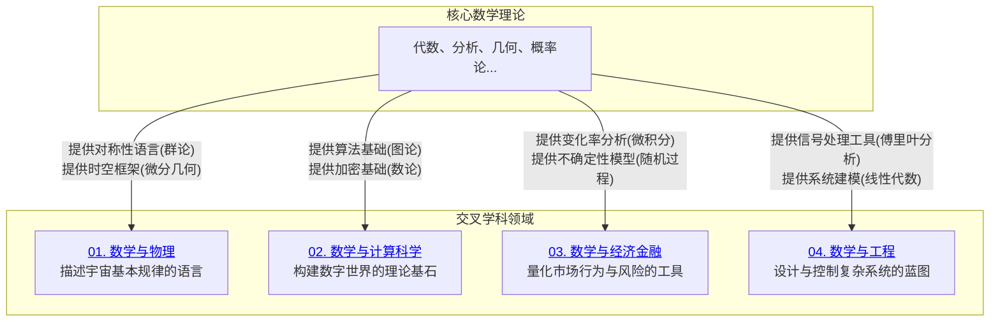

# 08-跨学科应用与联系 总览

---

title: "跨学科应用与联系总览"
version: "1.0"
date: "2025-07-04"

---

## 📋 本地目录导航

- [返回项目总览](../09-项目总览/00-项目总览.md)
- [01-数学与物理](./01-数学与物理/01-优雅的共生：对称、群论与规范场论.md)
- [02-数学与计算科学](./02-数学与计算科学/01-算法的心脏：从图论、数论到计算复杂性.md)
- [03-数学与经济金融](./03-数学与经济金融/01-量化世界：微积分、概率论与随机过程的应用.md)
- [04-数学与工程](./04-数学与工程/01-构建未来：线性代数、傅里叶分析与控制论.md)

## 🗺️ 本地知识图谱

- [数学知识体系映射](../09-项目总览/05-Knowledge_Graphs_and_Mappings/数学知识体系映射.md)
- [知识图谱分析](../知识图谱分析.md)
- [项目总览](../09-项目总览/00-项目总览.md)

---

数学并非一座孤立的象牙塔，而是渗透到几乎所有现代科学技术领域中的通用语言和强大工具。本章节的核心目标是打破学科壁垒，展示数学思想（如对称性、优化、随机性）是如何在不同领域中找到它们的"用武之地"，并反过来被这些领域的具体问题所丰富和发展的。

## 章节整体架构

本章节通过四个典型的交叉领域，探索数学理论与现实世界的深刻联系。

## 模块详细内容

### 01-数学与物理 ✅ **已完成**

- **核心联系**: 物理定律的数学结构。
- **关键数学工具**:
  - **微分几何**: 描述弯曲时空（广义相对论）。
  - **群论与表示论**: 刻画基本粒子的对称性（标准模型）。
  - **泛函分析**: 构建量子力学的数学框架。
- **探索主题**: `对称性`如何成为寻找物理定律的指导原则，以及`规范场论`中深刻的几何思想。

### 02-数学与计算科学 ✅ **已完成**

- **核心联系**: 算法的设计、分析与极限。
- **关键数学工具**:
  - **图论**: 社交网络分析、路线规划、网络流。
  - **数论与抽象代数**: 现代密码学（如RSA公钥密码体系）的基石。
  - **逻辑与可计算性理论**: 定义了计算的边界（停机问题），是所有编程语言的理论祖先。
  - **线性代数**: 机器学习、计算机图形学和数据科学的核心。
- **探索主题**: 算法的效率如何用数学语言来度量 (`计算复杂性`)。

### 03-数学与经济金融 ✅ **已完成**

- **核心联系**: 经济行为与金融市场的量化建模。
- **关键数学工具**:
  - **微积分与最优化理论**: 经济学中的边际分析和效用最大化问题。
  - **概率论与随机过程**: 定价金融衍生品（如期权）、管理投资风险的基石。著名的布莱克-斯科尔斯模型就是基于`随机微分方程`。
  - **博弈论**: 分析理性主体间策略互动的数学框架。
- **探索主题**: 如何在充满`不确定性`的随机世界中做出最优决策。

### 04-数学与工程 ✅ **已完成**

- **核心联系**: 物理系统的建模、分析与控制。
- **关键数学工具**:
  - **傅里叶分析与偏微分方程**: 信号处理、图像压缩和热传导、流体力学等领域的标准分析工具。
  - **线性代数与矩阵论**: 控制系统（如自动驾驶、机器人）的状态空间表示和稳定性分析。
  - **复变函数**: 在电路分析和流体力学中有巧妙的应用。
- **探索主题**: 如何将复杂的工程系统抽象为数学模型，并通过分析模型来预测和`控制`系统的行为。

## 知识体系的内在逻辑

本章与其他所有基础数学章节（01-07）都存在紧密的双向联系。一方面，基础数学为这些应用领域提供了理论和工具；另一方面，应用领域提出的新问题，也反过来极大地刺激了数学本身的发展（例如，物理学对微积分和微分几何的催生作用）。学习本章，能够帮助我们深刻理解数学的"源于现实，高于现实，指导现实"的价值。

---
[返回项目总览](../09-项目总览/00-项目总览.md)
