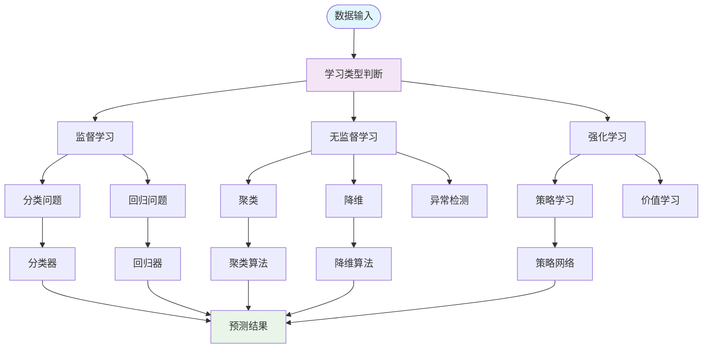
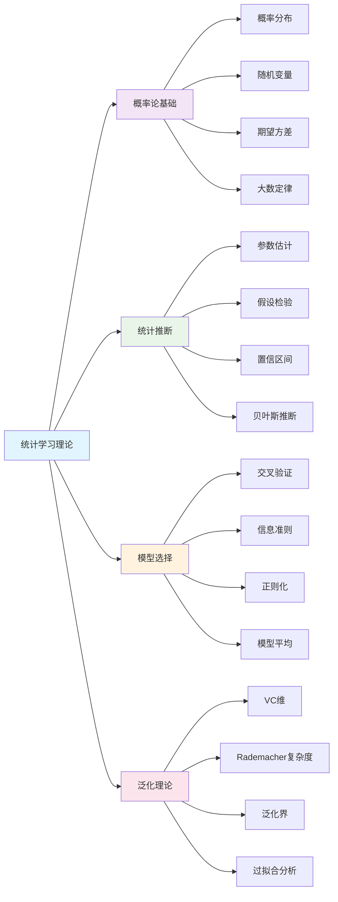
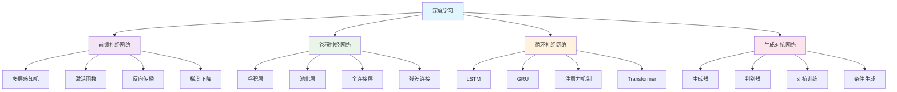
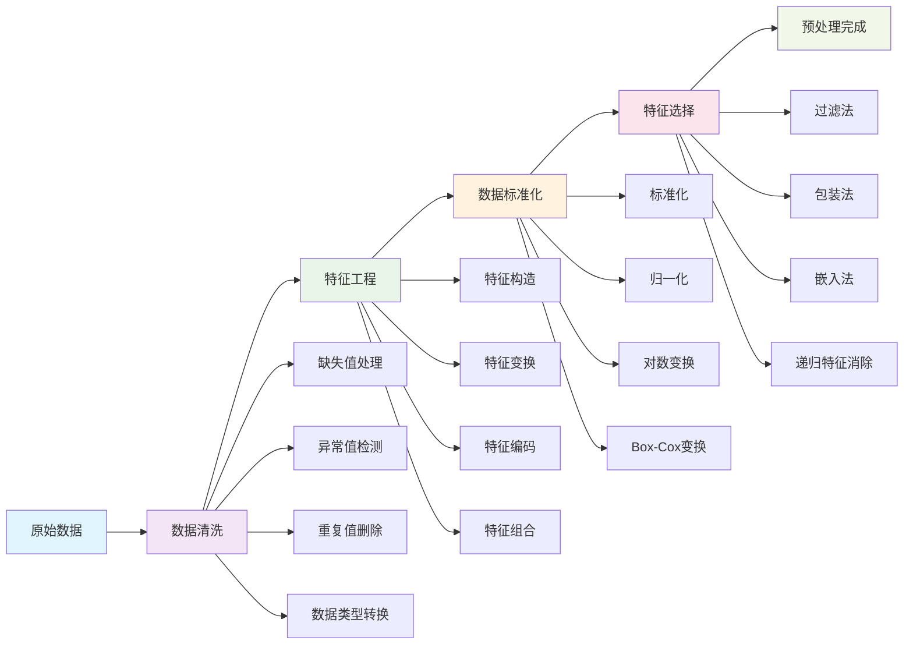
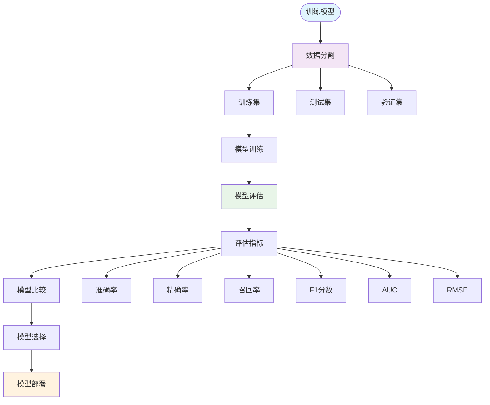

# 数学与数据科学 | 大数据分析·机器学习数学·统计学习（条目与练习）

---

## 1. 学习导引 | Cognitive Primer

- 先修：线性代数、概率统计、微积分、编程基础
- 主线：数据收集→数据预处理→数学建模→算法设计→结果分析→应用部署
- 认知提示：数据科学是数学与计算机科学的交叉领域，理解数学原理有助于设计高效的算法，统计学习理论为机器学习提供了坚实的理论基础

---

## 2. 大数据分析 | Big Data Analytics

- 数据预处理：数据清洗、特征工程、数据标准化
- 降维技术：主成分分析、奇异值分解、流形学习
- 聚类分析：K-means、层次聚类、密度聚类
- 关联规则：频繁项集挖掘、关联规则发现

---

## 3. 机器学习数学 | Machine Learning Mathematics

- 监督学习：线性回归、逻辑回归、支持向量机
- 无监督学习：聚类、降维、异常检测
- 深度学习：神经网络、卷积网络、循环网络
- 强化学习：马尔可夫决策过程、Q学习、策略梯度

---

## 4. 统计学习 | Statistical Learning

- 统计推断：参数估计、假设检验、置信区间
- 贝叶斯方法：贝叶斯推断、贝叶斯网络、变分推断
- 正则化：岭回归、Lasso、弹性网络
- 模型选择：交叉验证、信息准则、模型平均

---

## 5. 可视化内容 | Visualization Content

### 5.1 数据科学整体框架图

```mermaid
graph TD
    A[数据科学] --> B[数据收集]
    A --> C[数据预处理]
    A --> D[数学建模]
    A --> E[算法设计]
    A --> F[结果分析]
    A --> G[应用部署]
    
    B --> B1[结构化数据]
    B --> B2[非结构化数据]
    B --> B3[流式数据]
    B --> B4[图数据]
    
    C --> C1[数据清洗]
    C --> C2[特征工程]
    C --> C3[数据标准化]
    C --> C4[缺失值处理]
    
    D --> D1[统计模型]
    D --> D2[机器学习模型]
    D --> D3[深度学习模型]
    D --> D4[优化模型]
    
    E --> E1[监督学习]
    E --> E2[无监督学习]
    E --> E3[强化学习]
    E --> E4[集成学习]
    
    F --> F1[模型评估]
    F --> F2[结果解释]
    F --> F3[可视化分析]
    F --> F4[假设验证]
    
    G --> G1[模型部署]
    G --> G2[性能监控]
    G --> G3[模型更新]
    G --> G4[系统集成]
    
    style A fill:#e1f5fe
    style B fill:#f3e5f5
    style C fill:#e8f5e8
    style D fill:#fff3e0
    style E fill:#fce4ec
    style F fill:#f1f8e9
    style G fill:#e0f2f1
```

### 5.2 机器学习算法分类图

### 5.3 统计学习理论框架图

### 5.4 深度学习架构图

### 5.5 数据预处理流程图

### 5.6 模型评估与选择图

---

## 6. 典例 | Worked Examples

### 6.1 大数据分析典例

**主成分分析（PCA）**：

- **数学原理**：
  - 目标：找到数据的主要变化方向
  - 数学表达：$\max_{w} w^T \Sigma w$，约束条件：$w^T w = 1$
  - 其中$\Sigma$是协方差矩阵

- **算法步骤**：
  1. 计算数据的协方差矩阵：$\Sigma = \frac{1}{n-1} X^T X$
  2. 计算协方差矩阵的特征值和特征向量
  3. 选择前$k$个最大特征值对应的特征向量
  4. 将数据投影到这些特征向量上：$Y = XW$

- **实际应用**：
  - 图像压缩：将高维图像数据降维
  - 特征提取：从原始特征中提取主要特征
  - 数据可视化：将高维数据投影到2D或3D空间

**K-means聚类算法**：

- **数学原理**：
  - 目标：最小化簇内平方误差：$\min \sum_{i=1}^k \sum_{x \in C_i} \|x - \mu_i\|^2$
  - 其中$\mu_i$是第$i$个簇的中心

- **算法步骤**：
  1. 随机初始化$k$个簇中心
  2. 将每个数据点分配到最近的簇中心
  3. 重新计算每个簇的中心
  4. 重复步骤2-3直到收敛

- **收敛性**：
  - K-means算法保证收敛到局部最优解
  - 目标函数在每次迭代后单调递减
  - 算法在有限步内收敛

### 6.2 机器学习数学典例

**支持向量机（SVM）**：

- **数学原理**：
  - 目标：找到最优超平面：$w^T x + b = 0$
  - 优化问题：$\min_{w,b} \frac{1}{2} \|w\|^2$，约束条件：$y_i(w^T x_i + b) \geq 1$
  - 对偶问题：$\max_{\alpha} \sum_{i=1}^n \alpha_i - \frac{1}{2} \sum_{i,j} \alpha_i \alpha_j y_i y_j K(x_i, x_j)$

- **核技巧**：
  - 线性不可分时使用核函数：$K(x_i, x_j) = \phi(x_i)^T \phi(x_j)$
  - 常用核函数：
    - 线性核：$K(x_i, x_j) = x_i^T x_j$
    - 多项式核：$K(x_i, x_j) = (\gamma x_i^T x_j + r)^d$
    - RBF核：$K(x_i, x_j) = \exp(-\gamma \|x_i - x_j\|^2)$

- **实际应用**：
  - 文本分类：文档的自动分类
  - 图像识别：手写数字识别
  - 生物信息学：蛋白质分类

**神经网络反向传播**：

- **前向传播**：
  - 第$l$层的输出：$a^{(l)} = \sigma(z^{(l)})$，其中$z^{(l)} = W^{(l)} a^{(l-1)} + b^{(l)}$
  - 激活函数：$\sigma(x) = \frac{1}{1 + e^{-x}}$（sigmoid）

- **反向传播**：
  - 输出层误差：$\delta^{(L)} = \nabla_a J \odot \sigma'(z^{(L)})$
  - 隐藏层误差：$\delta^{(l)} = (W^{(l+1)})^T \delta^{(l+1)} \odot \sigma'(z^{(l)})$
  - 梯度更新：$\frac{\partial J}{\partial W^{(l)}} = \delta^{(l)} (a^{(l-1)})^T$

- **优化算法**：
  - 随机梯度下降：$W := W - \alpha \nabla_W J$
  - Adam优化器：结合动量和自适应学习率

### 6.3 统计学习典例

**贝叶斯推断**：

- **贝叶斯定理**：
  - $P(\theta|D) = \frac{P(D|\theta) P(\theta)}{P(D)}$
  - 后验概率 = 似然 × 先验概率 / 证据

- **贝叶斯线性回归**：
  - 先验：$w \sim \mathcal{N}(0, \sigma_w^2 I)$
  - 似然：$y|X,w \sim \mathcal{N}(Xw, \sigma^2 I)$
  - 后验：$w|X,y \sim \mathcal{N}(\mu_w, \Sigma_w)$
  - 其中：$\Sigma_w = (\sigma_w^{-2} I + \sigma^{-2} X^T X)^{-1}$，$\mu_w = \sigma^{-2} \Sigma_w X^T y$

- **实际应用**：
  - 不确定性量化：提供预测的不确定性估计
  - 在线学习：随着新数据到来更新模型
  - 模型选择：通过贝叶斯因子比较模型

**正则化方法**：

- **岭回归（L2正则化）**：
  - 目标函数：$\min_w \|y - Xw\|^2 + \lambda \|w\|^2$
  - 解析解：$w = (X^T X + \lambda I)^{-1} X^T y$
  - 效果：防止过拟合，提高泛化能力

- **Lasso（L1正则化）**：
  - 目标函数：$\min_w \|y - Xw\|^2 + \lambda \|w\|_1$
  - 特点：产生稀疏解，自动特征选择
  - 求解：使用坐标下降法或LARS算法

- **弹性网络**：
  - 目标函数：$\min_w \|y - Xw\|^2 + \lambda_1 \|w\|_1 + \lambda_2 \|w\|^2$
  - 结合L1和L2正则化的优点

---

## 7. 练习（6题） | Exercises (6)

1) **PCA实现练习**：主成分分析算法
   - 任务：实现PCA算法进行数据降维
   - 要求：包含协方差矩阵计算、特征值分解、数据投影
   - 评估：算法的正确性和降维效果

2) **SVM分类练习**：支持向量机实现
   - 任务：实现SVM分类器，包含核函数支持
   - 要求：使用SMO算法求解对偶问题
   - 评估：分类准确性和算法效率

3) **神经网络练习**：反向传播算法
   - 任务：实现多层神经网络和反向传播算法
   - 要求：包含前向传播、反向传播、参数更新
   - 评估：训练效果和收敛性

4) **贝叶斯推断练习**：贝叶斯线性回归
   - 任务：实现贝叶斯线性回归模型
   - 要求：包含先验设置、后验计算、预测分布
   - 评估：不确定性量化的准确性

5) **正则化练习**：正则化方法比较
   - 任务：比较不同正则化方法的效果
   - 要求：实现岭回归、Lasso、弹性网络
   - 评估：正则化效果和特征选择能力

6) **前沿探索练习**：深度学习新发展
   - 任务：研究最新的深度学习技术
   - 要求：分析注意力机制、Transformer架构等
   - 评估：研究的深度和前瞻性

---

## 8. 认知提示与误区警示 | Tips & Pitfalls

### 8.1 认知提示

- **数学基础至关重要**：数据科学需要扎实的数学基础，特别是线性代数、概率统计和优化理论
- **理论与实践结合**：数学模型需要与实际数据结合验证
- **数据质量第一**：数据质量直接影响模型效果，数据预处理是关键
- **模型解释性**：不仅要追求预测准确性，还要考虑模型的可解释性
- **持续学习**：数据科学领域发展迅速，需要持续学习新技术

### 8.2 误区警示

- **过度拟合**：在训练集上表现好不代表泛化能力强
- **忽视数据泄露**：训练集和测试集的数据泄露会导致过于乐观的结果
- **盲目使用复杂模型**：简单模型往往更稳定，复杂模型不一定更好
- **忽视特征工程**：好的特征工程比复杂的模型更重要
- **忽视业务理解**：技术只是工具，理解业务需求才是关键

### 8.3 实践建议

- **扎实基础**：从数学和统计学基础开始，逐步深入
- **动手实践**：使用真实数据集进行实践，积累经验
- **关注前沿**：数据科学发展迅速，需要持续关注最新进展
- **团队合作**：数据科学项目往往需要多学科团队合作
- **伦理意识**：注意数据隐私和算法公平性

---

## 9. 参考 | References

- `https://en.wikipedia.org/wiki/Data_science`
- `https://en.wikipedia.org/wiki/Machine_learning`
- `https://en.wikipedia.org/wiki/Statistical_learning_theory`
- `https://en.wikipedia.org/wiki/Principal_component_analysis`
- `https://en.wikipedia.org/wiki/Support_vector_machine`
- `https://en.wikipedia.org/wiki/Neural_network` 