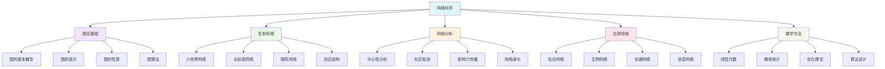
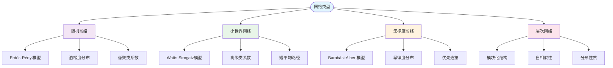
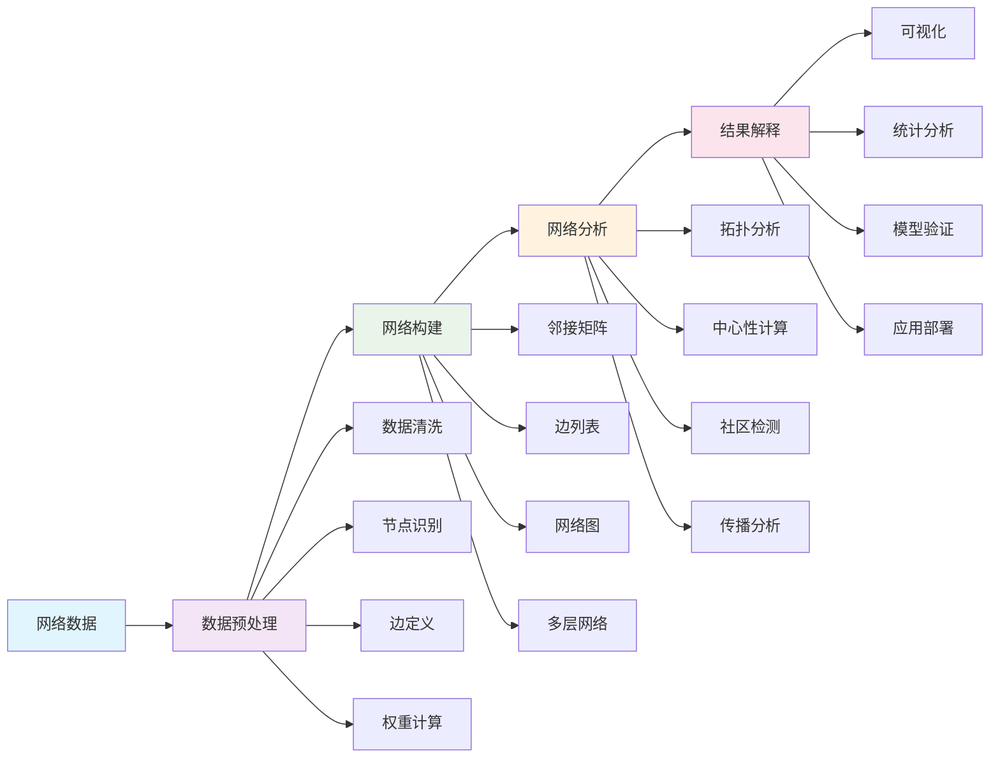
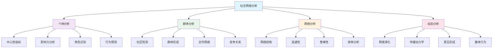
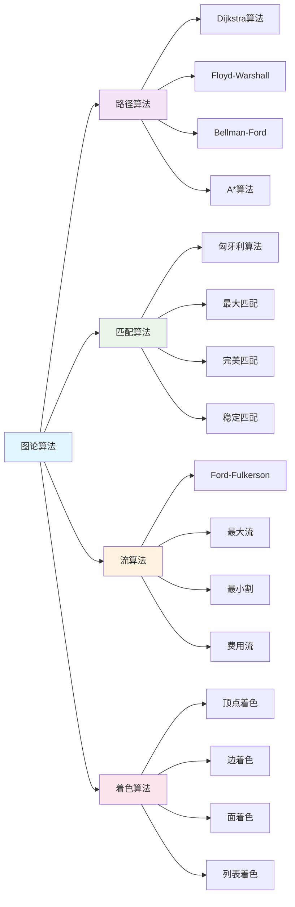
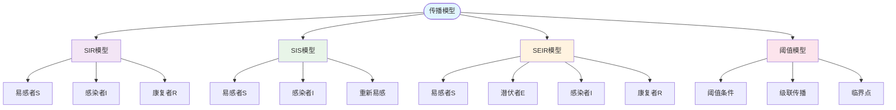

# 数学与网络科学 | 复杂网络·图论应用·社交网络分析（条目与练习）

---

## 1. 学习导引 | Cognitive Primer

- 先修：线性代数、概率统计、图论基础、算法设计
- 主线：图论基础→复杂网络理论→网络分析算法→实际应用→前沿发展
- 认知提示：网络科学是数学与计算机科学的交叉领域，理解图论和复杂网络理论有助于分析各种复杂系统，社交网络分析将推动社会科学和技术的深度融合

---

## 2. 复杂网络 | Complex Networks

- 网络拓扑：度分布、聚类系数、路径长度
- 小世界网络：Watts-Strogatz模型及其性质
- 无标度网络：Barabási-Albert模型及其机制
- 社区结构：模块化检测、社区发现算法

---

## 3. 图论应用 | Graph Theory Applications

- 图算法：最短路径、最小生成树、最大流
- 网络流：Ford-Fulkerson算法、最大流最小割定理
- 匹配理论：二分图匹配、匈牙利算法
- 着色问题：图着色、边着色、面着色

---

## 4. 社交网络分析 | Social Network Analysis

- 中心性分析：度中心性、介数中心性、接近中心性
- 影响力传播：传染病模型、信息传播、意见领袖识别
- 网络演化：网络增长模型、动态网络分析
- 推荐系统：基于网络的推荐算法、协同过滤

---

## 5. 可视化内容 | Visualization Content

### 5.1 网络科学整体框架图

### 5.2 复杂网络类型对比图

### 5.3 网络分析算法流程图

### 5.4 社交网络分析框架图

### 5.5 图论算法分类图

### 5.6 网络传播模型图

---

## 6. 典例 | Worked Examples

### 6.1 复杂网络典例

**Watts-Strogatz小世界网络模型**：

- **模型原理**：
  - 从规则网络开始，每个节点连接到最近的$k$个邻居
  - 以概率$p$随机重连每条边
  - 当$p$很小时，网络保持高聚类系数但平均路径长度急剧下降

- **数学描述**：
  - 聚类系数：$C(p) = C(0)(1-p)^3$
  - 平均路径长度：$L(p) \sim \frac{\ln N}{\ln k}$（当$p$较大时）
  - 小世界性质：$C(p) \gg C_{random}$且$L(p) \approx L_{random}$

- **实际应用**：
  - 社交网络：朋友关系网络
  - 神经网络：大脑神经元连接
  - 电力网络：电网连接结构

**Barabási-Albert无标度网络模型**：

- **模型原理**：
  - 网络从$m_0$个节点开始
  - 每次添加一个新节点，连接到$m$个现有节点
  - 连接概率与节点的度成正比（优先连接）

- **数学描述**：
  - 度分布：$P(k) \sim k^{-\gamma}$，其中$\gamma = 3$
  - 优先连接概率：$\Pi(k_i) = \frac{k_i}{\sum_j k_j}$
  - 度分布演化：$\frac{\partial P(k,t)}{\partial t} = \frac{1}{2m} \frac{\partial}{\partial k}[kP(k,t)]$

- **实际应用**：
  - 互联网：网页链接网络
  - 引用网络：学术论文引用关系
  - 蛋白质网络：蛋白质相互作用

### 6.2 图论应用典例

**Dijkstra最短路径算法**：

- **算法原理**：
  - 从源点开始，逐步扩展到所有其他节点
  - 维护一个距离数组，记录到每个节点的最短距离
  - 使用优先队列选择当前距离最小的节点进行扩展

- **算法步骤**：
  1. 初始化：$dist[s] = 0$，$dist[v] = \infty$（$v \neq s$）
  2. 选择未访问节点中距离最小的节点$u$
  3. 标记$u$为已访问
  4. 更新$u$的邻居节点的距离：$dist[v] = \min(dist[v], dist[u] + w(u,v))$
  5. 重复步骤2-4直到所有节点都被访问

- **复杂度分析**：
  - 时间复杂度：$O((V + E) \log V)$（使用优先队列）
  - 空间复杂度：$O(V)$

**Ford-Fulkerson最大流算法**：

- **算法原理**：
  - 在残量网络中寻找增广路径
  - 沿增广路径增加流量
  - 重复直到无法找到增广路径

- **数学基础**：
  - 最大流最小割定理：最大流等于最小割的容量
  - 残量网络：$G_f = (V, E_f)$，其中$E_f = \{(u,v) | c_f(u,v) > 0\}$
  - 增广路径：从源点到汇点的路径，所有边的残量容量都大于0

- **实际应用**：
  - 网络流量优化：互联网流量分配
  - 运输问题：货物运输网络
  - 匹配问题：二分图最大匹配

### 6.3 社交网络分析典例

**中心性分析**：

- **度中心性**：
  - 定义：$C_D(v) = \frac{deg(v)}{n-1}$
  - 含义：节点的直接连接数
  - 应用：识别网络中的"明星"节点

- **介数中心性**：
  - 定义：$C_B(v) = \sum_{s \neq v \neq t} \frac{\sigma_{st}(v)}{\sigma_{st}}$
  - 含义：节点在所有最短路径中出现的比例
  - 应用：识别网络中的"桥梁"节点

- **接近中心性**：
  - 定义：$C_C(v) = \frac{n-1}{\sum_{u \neq v} d(v,u)}$
  - 含义：节点到其他所有节点的平均距离的倒数
  - 应用：识别网络中的"中心"节点

**社区检测算法**：

- **Louvain算法**：
  - 原理：基于模块度优化的贪心算法
  - 模块度：$Q = \frac{1}{2m} \sum_{ij} [A_{ij} - \frac{k_i k_j}{2m}] \delta(c_i, c_j)$
  - 步骤：
    1. 每个节点作为一个社区
    2. 计算将节点移动到邻居社区的模块度增益
    3. 选择增益最大的移动
    4. 重复直到无法改善
    5. 将社区合并为节点，构建新网络
    6. 重复步骤1-5

- **实际应用**：
  - 社交网络：发现朋友圈、兴趣群体
  - 生物网络：识别功能模块
  - 互联网：发现网站集群

---

## 7. 练习（6题） | Exercises (6)

1) **小世界网络构建练习**：Watts-Strogatz模型实现
   - 任务：实现Watts-Strogatz小世界网络模型
   - 要求：包含网络构建、聚类系数计算、路径长度分析
   - 评估：模型的正确性和小世界性质的验证

2) **无标度网络分析练习**：Barabási-Albert模型
   - 任务：实现Barabási-Albert无标度网络模型
   - 要求：包含网络增长、度分布分析、优先连接机制
   - 评估：度分布的幂律性质和模型的有效性

3) **最短路径算法练习**：Dijkstra算法实现
   - 任务：实现Dijkstra最短路径算法
   - 要求：包含优先队列优化、路径重建、复杂度分析
   - 评估：算法的正确性和效率

4) **最大流算法练习**：Ford-Fulkerson算法
   - 任务：实现Ford-Fulkerson最大流算法
   - 要求：包含残量网络构建、增广路径查找、流量更新
   - 评估：算法的正确性和最大流最小割定理的验证

5) **社区检测练习**：Louvain算法实现
   - 任务：实现Louvain社区检测算法
   - 要求：包含模块度计算、社区优化、层次聚类
   - 评估：社区检测的准确性和算法的效率

6) **前沿探索练习**：网络科学新发展
   - 任务：研究最新的网络科学技术
   - 要求：分析多层网络、时序网络、高阶网络等
   - 评估：研究的深度和前瞻性

---

## 8. 认知提示与误区警示 | Tips & Pitfalls

### 8.1 认知提示

- **图论基础至关重要**：网络科学建立在图论基础之上，扎实的图论知识是成功的关键
- **理论与实践结合**：网络模型需要与实际数据结合验证
- **算法效率考虑**：网络分析算法需要考虑大规模数据的处理效率
- **多尺度分析**：网络分析需要在不同尺度上进行，从局部到全局
- **动态演化视角**：网络是动态演化的，需要考虑时间维度

### 8.2 误区警示

- **忽视网络规模**：不同规模的网络需要不同的分析方法
- **过度简化模型**：复杂网络不能简单用随机网络模型描述
- **忽视网络结构**：网络结构对功能有重要影响，不能忽视
- **盲目使用算法**：不同算法适用于不同类型的问题
- **忽视数据质量**：网络数据的质量直接影响分析结果

### 8.3 实践建议

- **扎实基础**：从图论和线性代数基础开始，逐步深入
- **动手实践**：使用真实网络数据进行实践，积累经验
- **关注前沿**：网络科学发展迅速，需要持续关注最新进展
- **跨学科思维**：网络科学涉及多个学科，需要跨学科思维
- **工具掌握**：熟练掌握网络分析工具和编程语言

---

## 9. 参考 | References

- `https://en.wikipedia.org/wiki/Network_science`
- `https://en.wikipedia.org/wiki/Complex_network`
- `https://en.wikipedia.org/wiki/Graph_theory`
- `https://en.wikipedia.org/wiki/Social_network_analysis`
- `https://en.wikipedia.org/wiki/Small-world_network`
- `https://en.wikipedia.org/wiki/Scale-free_network` 