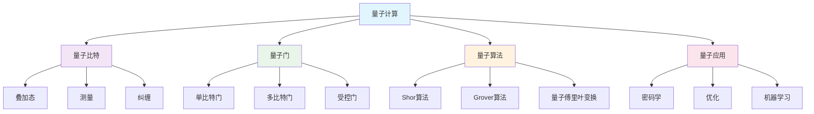
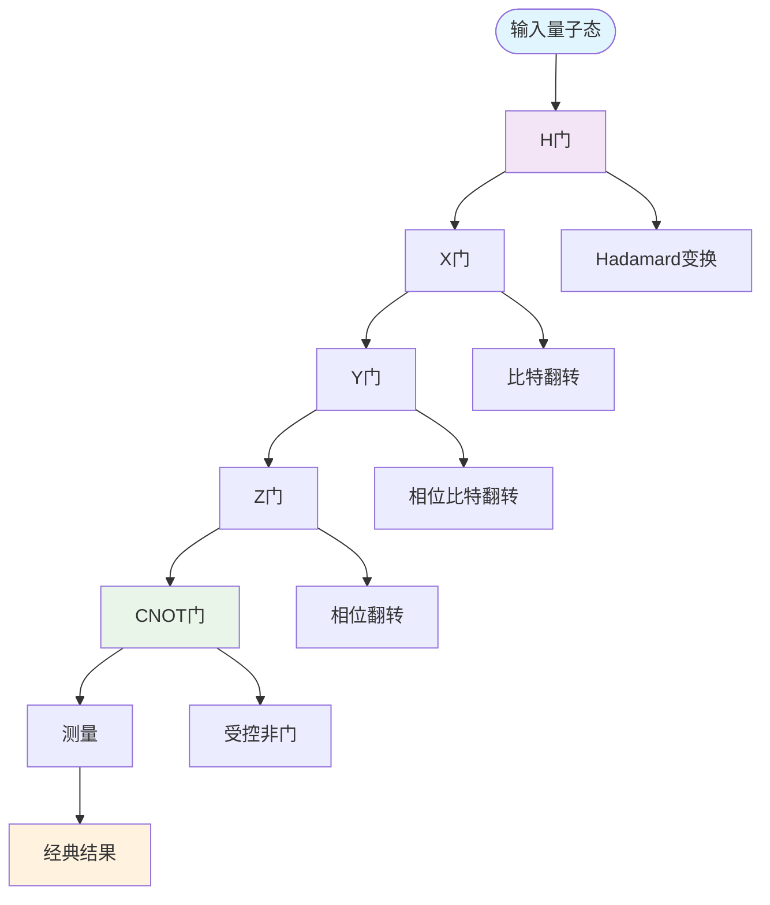
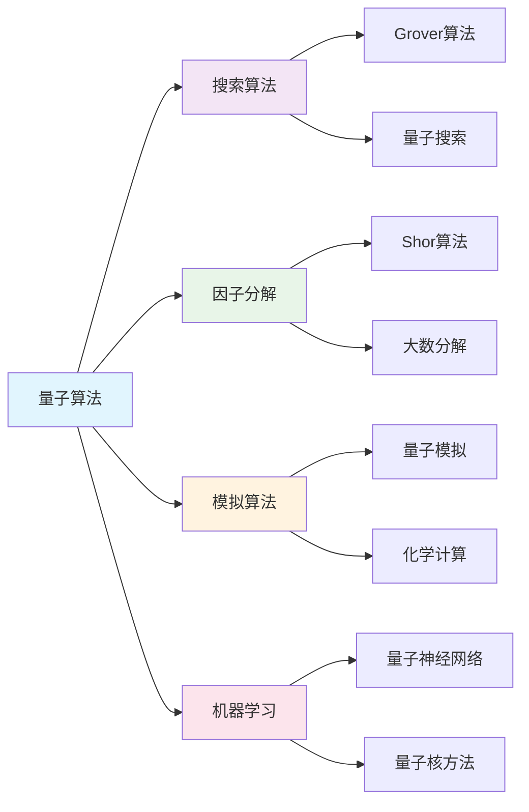
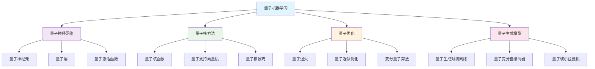

# 数学与量子计算 | 量子算法·量子信息·量子机器学习（条目与练习）

---

## 1. 学习导引 | Cognitive Primer

- 先修：线性代数、量子力学基础、信息论、算法设计
- 主线：量子力学→量子信息→量子算法→量子机器学习→前沿应用
- 认知提示：量子计算是未来计算的重要方向，理解量子数学原理有助于掌握量子算法，量子机器学习将推动AI技术的革命性发展

---

## 2. 量子算法 | Quantum Algorithms

- 量子比特：量子信息的基本单位
- 量子门：量子计算的基本操作
- 量子叠加：量子比特的叠加状态
- 量子纠缠：量子比特间的关联

---

## 3. 量子信息 | Quantum Information

- 量子态：量子系统的状态描述
- 量子测量：量子信息的提取
- 量子信道：量子信息的传输
- 量子编码：量子信息的保护

---

## 4. 量子机器学习 | Quantum Machine Learning

- 量子神经网络：基于量子计算的神经网络
- 量子核方法：量子版本的核方法
- 量子优化：量子版本的优化算法
- 量子生成模型：量子版本的生成模型

---

## 5. 可视化内容 | Visualization Content

### 5.1 量子计算基础框架图



### 5.2 量子比特状态图

```mermaid
graph LR
    A[量子比特] --> B[|0⟩态]
    A --> C[|1⟩态]
    A --> D[叠加态]
    
    B --> B1[基态]
    B --> B2[能量最低]
    
    C --> C1[激发态]
    C --> C2[能量较高]
    
    D --> D1[α|0⟩ + β|1⟩]
    D --> D2[|α|² + |β|² = 1]
    
    style A fill:#e1f5fe
    style B fill:#f3e5f5
    style C fill:#e8f5e8
    style D fill:#fff3e0
```

### 5.3 量子门操作流程图



### 5.4 量子纠缠示意图

```mermaid
graph TD
    A[量子纠缠] --> B[贝尔态]
    A --> C[GHZ态]
    A --> D[W态]
    
    B --> B1[|Φ⁺⟩ = (|00⟩ + |11⟩)/√2]
    B --> B2[|Φ⁻⟩ = (|00⟩ - |11⟩)/√2]
    B --> B3[|Ψ⁺⟩ = (|01⟩ + |10⟩)/√2]
    B --> B4[|Ψ⁻⟩ = (|01⟩ - |10⟩)/√2]
    
    C --> C1[|GHZ⟩ = (|000⟩ + |111⟩)/√2]
    C --> C2[三比特纠缠]
    
    D --> D1[|W⟩ = (|001⟩ + |010⟩ + |100⟩)/√3]
    D --> D2[三比特W态]
    
    style A fill:#e1f5fe
    style B fill:#f3e5f5
    style C fill:#e8f5e8
    style D fill:#fff3e0
```

### 5.5 量子算法分类图



### 5.6 量子机器学习架构图



---

## 6. 典例 | Worked Examples

### 6.1 量子算法典例

**Shor算法：大数因子分解**：

- **算法原理**：
  - 目标：分解大整数$N = pq$，其中$p$和$q$是素数
  - 核心思想：利用量子傅里叶变换找到周期
  - 复杂度：$O((\log N)^3)$，相比经典算法的指数复杂度

- **数学基础**：
  - 周期查找：找到函数$f(x) = a^x \bmod N$的周期$r$
  - 量子傅里叶变换：$|\psi\rangle = \frac{1}{\sqrt{N}} \sum_{x=0}^{N-1} e^{2\pi i xy/N} |x\rangle$
  - 测量结果：通过测量得到周期信息

- **实际应用**：
  - 密码学：破解RSA加密系统
  - 数论：解决数论中的困难问题
  - 计算复杂性：证明量子计算的优越性

**Grover算法：量子搜索**：

- **算法原理**：
  - 目标：在未排序数据库中搜索目标元素
  - 核心思想：利用量子叠加和干涉效应
  - 复杂度：$O(\sqrt{N})$，相比经典算法的$O(N)$

- **数学描述**：
  - 初始态：$|\psi_0\rangle = \frac{1}{\sqrt{N}} \sum_{x=0}^{N-1} |x\rangle$
  - 标记操作：$U_f|x\rangle = (-1)^{f(x)}|x\rangle$
  - 扩散操作：$U_s = 2|\psi_0\rangle\langle\psi_0| - I$

- **迭代过程**：
  - 应用标记操作和扩散操作
  - 通过干涉增强目标态的概率
  - 经过$O(\sqrt{N})$次迭代后测量

### 6.2 量子信息典例

**量子纠缠的数学描述**：

- **贝尔态**：
  - 定义：$|\Phi^+\rangle = \frac{1}{\sqrt{2}}(|00\rangle + |11\rangle)$
  - 性质：最大纠缠态，违反贝尔不等式
  - 应用：量子密钥分发、量子隐形传态

- **纠缠度量**：
  - 冯·诺依曼熵：$S(\rho_A) = -\text{Tr}(\rho_A \log \rho_A)$
  - 纠缠度：$E(\rho) = S(\rho_A) = S(\rho_B)$
  - 对于纯态，纠缠度等于约化密度矩阵的熵

- **纠缠的应用**：
  - 量子通信：超密编码、量子中继
  - 量子计算：量子并行、量子纠错
  - 量子测量：精密测量、量子传感

**量子测量理论**：

- **投影测量**：
  - 测量算符：$M_m = |m\rangle\langle m|$
  - 测量概率：$p(m) = \langle\psi|M_m^\dagger M_m|\psi\rangle$
  - 后测量态：$|\psi_m\rangle = \frac{M_m|\psi\rangle}{\sqrt{p(m)}}$

- **POVM测量**：
  - 正算子值测量：$\{E_m\}$，满足$\sum_m E_m = I$
  - 测量概率：$p(m) = \text{Tr}(E_m\rho)$
  - 优势：更灵活的测量策略

### 6.3 量子机器学习典例

**量子神经网络**：

- **量子神经元**：
  - 输入：量子态$|\psi_{in}\rangle$
  - 权重：酉算子$U(\theta)$
  - 输出：$|\psi_{out}\rangle = U(\theta)|\psi_{in}\rangle$

- **量子层结构**：
  - 编码层：将经典数据编码为量子态
  - 处理层：应用量子门序列
  - 测量层：测量量子态得到输出

- **训练过程**：
  - 参数化量子电路：$U(\theta) = \prod_k U_k(\theta_k)$
  - 梯度计算：使用参数移位规则
  - 优化算法：量子版本的梯度下降

**量子核方法**：

- **量子核函数**：
  - 定义：$K(x_i, x_j) = |\langle\phi(x_i)|\phi(x_j)\rangle|^2$
  - 量子特征映射：$x \rightarrow |\phi(x)\rangle$
  - 优势：可以访问指数大的特征空间

- **量子支持向量机**：
  - 优化问题：$\max_{\alpha} \sum_i \alpha_i - \frac{1}{2}\sum_{i,j} \alpha_i \alpha_j y_i y_j K(x_i, x_j)$
  - 决策函数：$f(x) = \sum_i \alpha_i y_i K(x_i, x) + b$
  - 量子实现：使用量子电路计算核函数

---

## 7. 练习（6题） | Exercises (6)

1) **量子态计算练习**：计算量子叠加态
   - 任务：计算量子态$|\psi\rangle = \frac{1}{\sqrt{2}}(|0\rangle + |1\rangle)$的测量概率
   - 要求：使用量子力学的基本原理
   - 评估：计算的准确性和理解深度

2) **量子门操作练习**：设计量子电路
   - 任务：设计一个量子电路实现贝尔态制备
   - 要求：使用基本的量子门操作
   - 评估：电路设计的正确性和效率

3) **量子算法分析练习**：分析Grover算法
   - 任务：分析Grover算法的迭代次数和成功率
   - 要求：使用量子力学和算法分析
   - 评估：分析的深度和准确性

4) **量子信息理论练习**：计算纠缠度
   - 任务：计算给定量子态的纠缠度
   - 要求：使用冯·诺依曼熵和约化密度矩阵
   - 评估：计算的正确性和理论理解

5) **量子机器学习练习**：实现量子神经网络
   - 任务：使用量子计算框架实现简单的量子神经网络
   - 要求：包含编码、处理和测量过程
   - 评估：实现的正确性和创新性

6) **前沿探索练习**：量子优势研究
   - 任务：研究量子计算在特定问题上的优势
   - 要求：比较量子算法和经典算法的性能
   - 评估：研究的深度和前瞻性

---

## 8. 认知提示与误区警示 | Tips & Pitfalls

### 8.1 认知提示

- **量子计算是未来方向**：量子计算将解决经典计算无法解决的问题
- **数学基础至关重要**：深入理解量子力学数学原理是掌握量子计算的关键
- **理论与实践结合**：量子计算需要理论学习和实验验证相结合
- **关注硬件发展**：量子硬件的发展直接影响量子算法的实现
- **跨学科思维**：量子计算涉及物理、数学、计算机等多个学科

### 8.2 误区警示

- **忽视量子力学基础**：不能只关注算法而忽视量子力学原理
- **过分简化量子概念**：量子现象复杂，不能简单类比经典概念
- **忽视退相干问题**：量子系统的退相干是实际应用的主要挑战
- **过度乐观估计**：量子计算的发展需要时间，不能过分乐观
- **忽视经典算法**：经典算法仍然是当前的主要工具

### 8.3 实践建议

- **扎实基础**：从量子力学基础开始，逐步深入量子计算
- **动手实践**：使用量子计算模拟器进行实验
- **关注前沿**：量子计算发展迅速，需要持续关注最新进展
- **跨学科学习**：学习物理、数学、计算机等相关知识
- **实际应用**：关注量子计算在实际问题中的应用前景

---

## 9. 参考 | References

- `https://en.wikipedia.org/wiki/Quantum_computing`
- `https://en.wikipedia.org/wiki/Quantum_algorithm`
- `https://en.wikipedia.org/wiki/Quantum_information`
- `https://en.wikipedia.org/wiki/Quantum_machine_learning`
- `https://en.wikipedia.org/wiki/Shor%27s_algorithm`
- `https://en.wikipedia.org/wiki/Grover%27s_algorithm`
