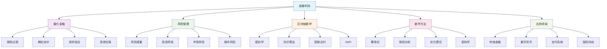
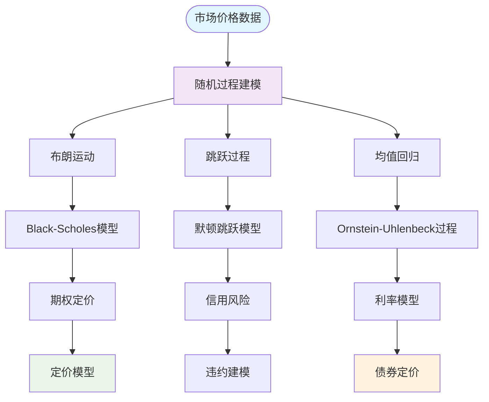
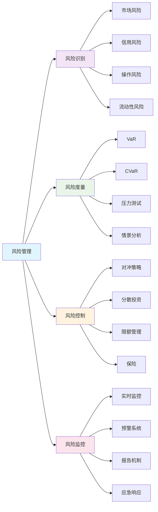
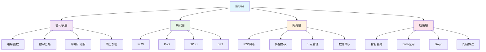
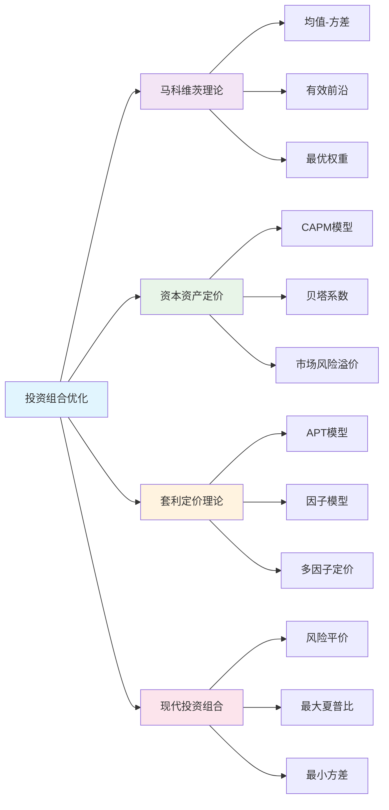
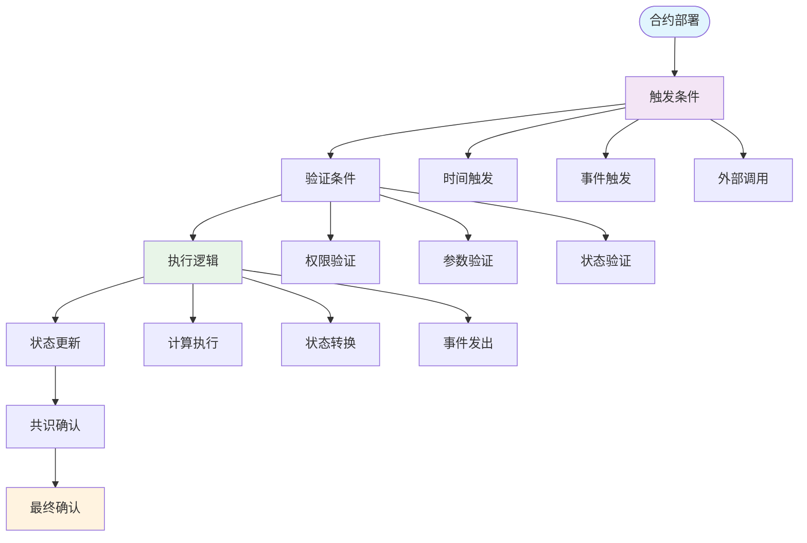

# 数学与金融科技 | 量化金融·风险管理·区块链数学（条目与练习）

---

## 1. 学习导引 | Cognitive Primer

- 先修：概率统计、线性代数、微积分、金融学基础
- 主线：金融数学→量化模型→风险管理→区块链技术→金融科技创新
- 认知提示：金融科技是数学与金融的深度融合，理解数学建模方法有助于分析复杂的金融市场，区块链技术将推动金融系统的革命性变革

---

## 2. 量化金融 | Quantitative Finance

- 随机过程：金融市场价格的随机性建模
- 期权定价：Black-Scholes模型及其扩展
- 投资组合理论：马科维茨均值-方差理论
- 高频交易：基于数学模型的快速交易策略

---

## 3. 风险管理 | Risk Management

- 风险度量：VaR、CVaR等风险指标
- 信用风险：违约概率建模
- 市场风险：价格波动风险分析
- 操作风险：系统性和非系统性风险

---

## 4. 区块链数学 | Blockchain Mathematics

- 密码学基础：哈希函数、数字签名、零知识证明
- 共识算法：工作量证明、权益证明、拜占庭容错
- 智能合约：可编程金融合约的数学基础
- 去中心化金融：DeFi的数学模型

---

## 5. 可视化内容 | Visualization Content

### 5.1 金融科技整体框架图

### 5.2 随机过程建模图

### 5.3 风险管理框架图

### 5.4 区块链技术架构图

### 5.5 投资组合优化图

### 5.6 智能合约执行流程图

---

## 6. 典例 | Worked Examples

### 6.1 量化金融典例

**Black-Scholes期权定价模型**：

- **模型假设**：
  - 股票价格遵循几何布朗运动：$dS = \mu S dt + \sigma S dW$
  - 无风险利率$r$为常数
  - 股票不支付股息
  - 市场无摩擦，无套利机会

- **偏微分方程**：
  - Black-Scholes方程：$\frac{\partial V}{\partial t} + \frac{1}{2}\sigma^2 S^2 \frac{\partial^2 V}{\partial S^2} + rS \frac{\partial V}{\partial S} - rV = 0$
  - 边界条件：$V(S,T) = \max(S-K, 0)$（看涨期权）

- **解析解**：
  - 看涨期权价格：$C = S_0 N(d_1) - Ke^{-rT} N(d_2)$
  - 其中：$d_1 = \frac{\ln(S_0/K) + (r+\sigma^2/2)T}{\sigma\sqrt{T}}$，$d_2 = d_1 - \sigma\sqrt{T}$

- **实际应用**：
  - 期权定价和风险管理
  - 隐含波动率计算
  - 希腊字母（Delta、Gamma、Theta、Vega）计算

**马科维茨投资组合理论**：

- **理论基础**：
  - 投资者是风险厌恶的
  - 投资组合的期望收益：$E(R_p) = \sum_{i=1}^n w_i E(R_i)$
  - 投资组合的方差：$\sigma_p^2 = \sum_{i=1}^n \sum_{j=1}^n w_i w_j \sigma_{ij}$

- **优化问题**：
  - 目标函数：最大化夏普比率 $\frac{E(R_p) - R_f}{\sigma_p}$
  - 约束条件：$\sum_{i=1}^n w_i = 1$，$w_i \geq 0$

- **有效前沿**：
  - 在给定风险水平下最大化收益
  - 在给定收益水平下最小化风险
  - 有效前沿上的投资组合都是最优的

### 6.2 风险管理典例

**VaR（风险价值）计算**：

- **定义**：在给定置信水平下，投资组合在特定时间内的最大可能损失
- **数学表达**：$P(L > VaR) = 1 - \alpha$，其中$\alpha$是置信水平

- **计算方法**：
  - **历史模拟法**：基于历史数据计算VaR
  - **参数法**：假设收益服从正态分布，$VaR = \mu - z_\alpha \sigma$
  - **蒙特卡洛法**：通过随机模拟计算VaR

- **实际应用**：
  - 银行资本充足率计算
  - 投资组合风险控制
  - 监管合规要求

**信用风险建模**：

- **Merton模型**：
  - 公司价值：$V_t = V_0 e^{(\mu-\sigma^2/2)t + \sigma W_t}$
  - 违约概率：$P(V_T < D) = N\left(\frac{\ln(D/V_0) - (\mu-\sigma^2/2)T}{\sigma\sqrt{T}}\right)$
  - 其中$D$是债务面值

- **KMV模型**：
  - 基于Merton模型的扩展
  - 考虑公司资产价值的随机性
  - 提供更准确的违约概率估计

### 6.3 区块链数学典例

**工作量证明（PoW）**：

- **数学原理**：
  - 寻找满足条件的哈希值：$H(block + nonce) < target$
  - 哈希函数：$H: \{0,1\}^* \rightarrow \{0,1\}^{256}$
  - 难度调整：$target = \frac{2^{256}}{difficulty}$

- **挖矿过程**：
  1. 收集待确认交易
  2. 构造区块头
  3. 尝试不同的nonce值
  4. 计算哈希值并检查是否满足条件
  5. 找到满足条件的nonce后广播区块

- **安全性分析**：
  - 51%攻击：需要控制超过50%的算力
  - 双花攻击：通过分叉进行双重支付
  - 自私挖矿：隐藏区块以获得优势

**零知识证明**：

- **数学基础**：
  - 完备性：如果陈述为真，诚实验证者总是接受诚实验证者的证明
  - 可靠性：如果陈述为假，任何不诚实的验证者都无法说服诚实验证者
  - 零知识性：验证者除了陈述为真外，不获得任何其他信息

- **zk-SNARK**：
  - 非交互式零知识证明
  - 基于椭圆曲线密码学
  - 在区块链中用于隐私保护

---

## 7. 练习（6题） | Exercises (6)

1) **期权定价练习**：实现Black-Scholes模型
   - 任务：编写程序计算欧式期权价格
   - 要求：包含Delta、Gamma、Theta、Vega的计算
   - 评估：计算的准确性和理解深度

2) **投资组合优化练习**：马科维茨理论应用
   - 任务：使用历史数据构建最优投资组合
   - 要求：计算有效前沿和最优权重
   - 评估：优化结果的有效性和实用性

3) **VaR计算练习**：风险度量方法
   - 任务：使用不同方法计算投资组合的VaR
   - 要求：比较历史模拟法、参数法、蒙特卡洛法
   - 评估：方法的准确性和适用性

4) **区块链共识练习**：PoW算法实现
   - 任务：实现简化的工作量证明算法
   - 要求：包含难度调整和挖矿过程
   - 评估：实现的正确性和效率

5) **智能合约练习**：DeFi应用开发
   - 任务：设计简单的去中心化金融应用
   - 要求：包含智能合约逻辑和前端界面
   - 评估：设计的创新性和实用性

6) **前沿探索练习**：金融科技创新研究
   - 任务：研究最新的金融科技发展趋势
   - 要求：分析数学在金融科技中的应用
   - 评估：研究的深度和前瞻性

---

## 8. 认知提示与误区警示 | Tips & Pitfalls

### 8.1 认知提示

- **数学建模的重要性**：金融科技的核心是数学建模，扎实的数学基础是成功的关键
- **理论与实践结合**：数学模型需要与实际市场数据结合验证
- **风险意识**：金融科技涉及大量资金，风险控制至关重要
- **监管合规**：金融科技需要遵守相关法律法规和监管要求
- **技术创新**：区块链等新技术正在重塑金融行业

### 8.2 误区警示

- **过度依赖模型**：数学模型是工具，不能完全替代人的判断
- **忽视风险**：任何金融产品都存在风险，不能忽视风险管理
- **技术万能论**：技术不能解决所有问题，需要综合考虑各种因素
- **忽视监管**：金融科技必须遵守监管要求，不能逃避监管
- **盲目跟风**：不能盲目跟随市场热点，需要理性分析

### 8.3 实践建议

- **扎实基础**：从金融学和数学基础开始，逐步深入
- **动手实践**：使用金融数据和分析工具进行实践
- **关注前沿**：金融科技发展迅速，需要持续关注最新进展
- **风险管理**：始终将风险管理放在首位
- **合规意识**：了解并遵守相关法律法规

---

## 9. 参考 | References

- `https://en.wikipedia.org/wiki/Quantitative_finance`
- `https://en.wikipedia.org/wiki/Risk_management`
- `https://en.wikipedia.org/wiki/Blockchain`
- `https://en.wikipedia.org/wiki/Black%E2%80%93Scholes_model`
- `https://en.wikipedia.org/wiki/Modern_portfolio_theory`
- `https://en.wikipedia.org/wiki/Value_at_risk`
