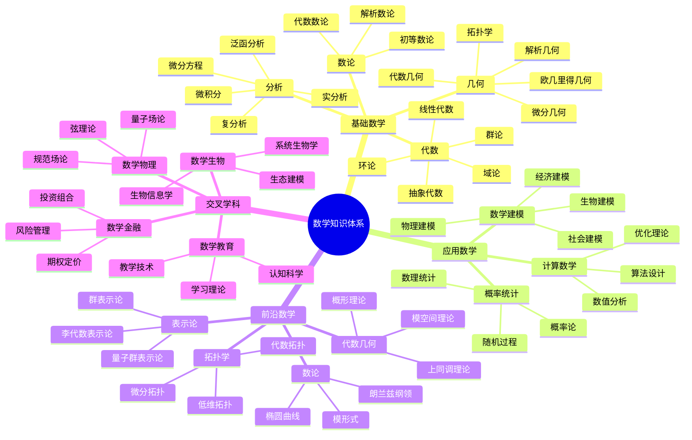
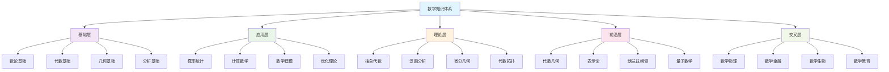
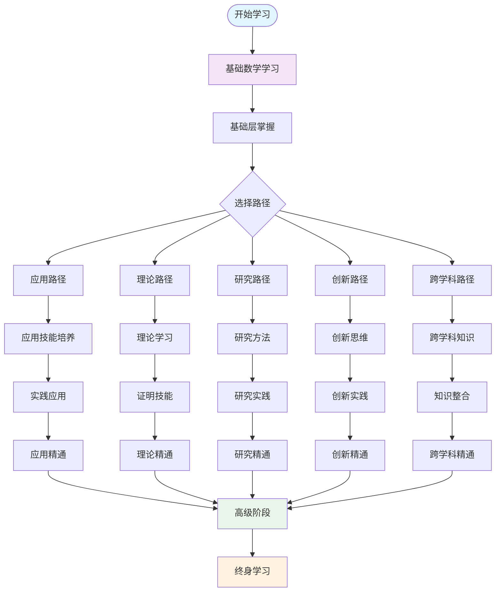
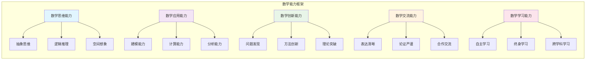

# 数学知识体系总览 | 知识结构·学习路径·能力框架（条目与练习）

---

## 1. 学习导引 | Cognitive Primer

- 先修：数学基础、教育理论、认知科学基础
- 主线：知识梳理→路径规划→能力培养→体系构建
- 认知提示：数学知识体系是学习的基础框架，系统化的知识结构能帮助学习者建立完整的认知体系，个性化学习路径能显著提高学习效率

---

## 2. 知识结构 | Knowledge Structure

- 基础层：数、代数、几何、分析的基础概念
- 应用层：数学在各领域的应用方法
- 理论层：数学理论的深入理解和证明
- 前沿层：数学前沿领域的最新发展
- 交叉层：数学与其他学科的交叉融合

---

## 3. 学习路径 | Learning Pathways

- 基础路径：从基础数学到高等数学的递进
- 应用路径：从理论到应用的实践路径
- 研究路径：从学习到研究的学术路径
- 创新路径：从理解到创新的发展路径
- 跨学科路径：数学与其他学科的融合路径

---

## 4. 能力框架 | Competency Framework

- 数学思维能力：抽象思维、逻辑推理、空间想象
- 数学应用能力：建模能力、计算能力、分析能力
- 数学创新能力：问题发现、方法创新、理论突破
- 数学交流能力：表达清晰、论证严谨、合作交流
- 数学学习能力：自主学习、终身学习、跨学科学习

---

## 5. 可视化内容 | Visualization Content

### 5.1 数学知识体系思维导图

### 5.2 知识结构层次图

### 5.3 学习路径流程图

### 5.4 能力框架雷达图

---

## 6. 典例 | Worked Examples

### 6.1 知识结构典例

**数学知识体系的层次结构图**：

- **基础层结构**：
  - 数论：从自然数到代数数论的发展脉络
  - 代数：从线性代数到抽象代数的抽象化过程
  - 几何：从欧几里得几何到现代几何的演化
  - 分析：从微积分到现代分析的深化

- **应用层结构**：
  - 概率统计：从古典概率到现代统计理论
  - 计算数学：从数值计算到算法设计
  - 数学建模：从物理建模到跨学科建模
  - 优化理论：从线性规划到现代优化

- **理论层结构**：
  - 抽象代数：群、环、域的统一理论
  - 泛函分析：从函数空间到算子理论
  - 微分几何：从曲线曲面到流形理论
  - 代数拓扑：从同伦论到上同调理论

### 6.2 学习路径典例

**不同学习目标的路径规划**：

- **应用导向路径**：
  - 基础数学 → 应用数学 → 专业应用 → 实践创新
  - 案例：工程数学学习路径

- **理论导向路径**：
  - 基础数学 → 理论数学 → 前沿理论 → 理论创新
  - 案例：纯数学研究路径

- **研究导向路径**：
  - 基础数学 → 研究方法 → 研究实践 → 学术创新
  - 案例：数学研究人才培养路径

- **跨学科路径**：
  - 基础数学 → 跨学科知识 → 知识整合 → 交叉创新
  - 案例：数学物理交叉研究路径

### 6.3 能力框架典例

**数学能力的评估和发展**：

- **思维能力评估**：
  - 抽象思维：概念抽象和模式识别能力
  - 逻辑推理：演绎推理和归纳推理能力
  - 空间想象：几何直觉和空间思维能力

- **应用能力评估**：
  - 建模能力：实际问题数学化的能力
  - 计算能力：数值计算和符号计算能力
  - 分析能力：问题分析和解决能力

- **创新能力评估**：
  - 问题发现：发现新问题的敏感性
  - 方法创新：创造新方法的能力
  - 理论突破：理论创新的能力

---

## 7. 练习（6题） | Exercises (6)

1) **分析练习**：分析数学知识的内在联系
   - 任务：分析不同数学分支间的内在联系
   - 要求：识别概念关联、方法迁移、理论统一
   - 评估：分析的深度和系统性

2) **设计练习**：设计个性化的学习路径
   - 任务：根据个人特点设计个性化学习路径
   - 要求：考虑兴趣、能力、目标、时间
   - 评估：路径的合理性和可行性

3) **评估练习**：评估数学能力的发展水平
   - 任务：评估个人数学能力的发展水平
   - 要求：使用多维度评估方法
   - 评估：评估的准确性和全面性

4) **规划练习**：规划长期的学习目标
   - 任务：规划长期数学学习目标
   - 要求：设定阶段性目标和实现策略
   - 评估：目标的合理性和可实现性

5) **整合练习**：整合不同领域的数学知识
   - 任务：整合不同领域的数学知识
   - 要求：建立知识间的联系和统一框架
   - 评估：整合的系统性和创新性

6) **应用练习**：应用知识体系解决实际问题
   - 任务：应用数学知识体系解决实际问题
   - 要求：选择合适的数学工具和方法
   - 评估：应用的效果和创新性

---

## 8. 认知提示与误区警示 | Tips & Pitfalls

### 8.1 认知提示

- **知识体系是学习的基础框架**：系统化的知识结构能帮助建立完整的认知体系
- **个性化路径能提高学习效率**：根据个人特点选择合适的学习路径
- **能力培养需要全面发展**：数学能力需要多维度、系统性的培养
- **理论与实践相结合**：理论学习与实践应用相互促进
- **终身学习是必然趋势**：数学学习需要持续更新和深化

### 8.2 误区警示

- **忽视基础训练**：不能忽视基础数学的训练
- **过分追求应用**：不能过分追求应用而忽视理论
- **忽视能力培养**：不能只关注知识而忽视能力培养
- **学习路径单一**：不能使用单一的学习路径
- **忽视个性化**：不能忽视个人特点和需求

### 8.3 实践建议

- **系统学习**：按照知识体系系统学习
- **个性化选择**：根据个人特点选择学习路径
- **全面发展**：注重数学能力的全面发展
- **实践结合**：理论学习与实践应用相结合
- **持续更新**：保持学习的持续性和更新性

---

## 9. 参考 | References

- `https://en.wikipedia.org/wiki/Mathematics_education`
- `https://en.wikipedia.org/wiki/Mathematical_thinking`
- `https://en.wikipedia.org/wiki/Mathematical_competency`
- `https://en.wikipedia.org/wiki/Mathematical_knowledge`
- `https://en.wikipedia.org/wiki/Mathematical_learning`
- `https://en.wikipedia.org/wiki/Mathematical_skills`
