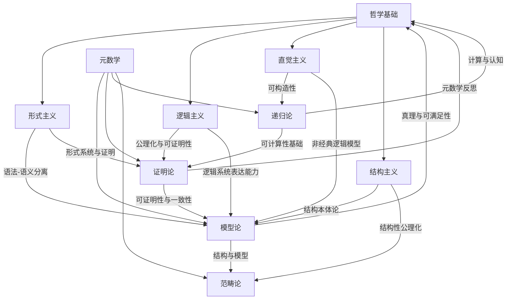

# 元数学-哲学基础交叉知识图谱

## 1. 概述

本图谱梳理元数学与哲学基础（形式主义、逻辑主义、直觉主义、结构主义等）之间的交互结构，突出模型论、证明论、递归论等分支与哲学流派的深层联系。

## 2. Mermaid交叉知识图谱

## 3. 说明

- **模型论**：与形式主义、逻辑主义、结构主义密切相关，强调结构、模型、真理的语义解释。
- **证明论**：与形式主义、逻辑主义关联紧密，关注形式系统的可证明性与一致性。
- **递归论**：与直觉主义、可构造性密切相关，研究可计算性与算法基础。
- **范畴论**：结构主义的典型代表，强调结构间的映射与统一。
- **哲学基础**：为元数学各分支提供本体论、认识论、方法论基础。

---

**创建日期**: 2025-07-12  
**最后更新**: 2025-07-12  
**作者**: AI助手
