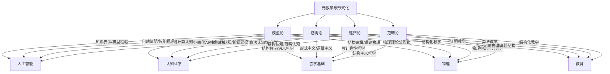

# 元数学与形式化-交叉专题知识图谱

## 1. 概述

本图谱梳理元数学与形式化各分支（模型论、证明论、递归论、范畴论等）与交叉专题（AI、认知科学、物理、哲学、教育等）的多维交互结构，突出理论与应用的深度融合。

## 2. Mermaid交叉专题图谱

## 3. 说明

- **AI**：知识表示、自动证明、可计算认知、范畴化AI等。
- **认知科学**：结构认知、推理认知、算法认知、范畴认知等。
- **哲学基础**：结构哲学、语义哲学、形式主义、逻辑主义、可计算性哲学等。
- **物理**：理论物理、结构建模、物理中的可计算性、范畴物理等。
- **教育**：结构化教学、证明教学、算法教学等。

---

**创建日期**: 2025-07-12  
**最后更新**: 2025-07-12  
**作者**: AI助手
