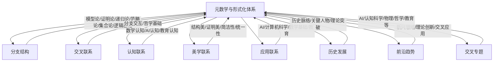

# 元数学与形式化-全局总览知识图谱

## 1. 概述

本图谱整合元数学与形式化体系的分支结构、交叉联系、认知与美学、应用、历史、前沿等多维知识图谱，突出整体结构与多维联系。

## 2. Mermaid全局总览图谱

## 3. 说明

- **分支结构**：模型论、证明论、递归论、范畴论、集合论、逻辑基础等核心分支。
- **交叉联系**：分支间的理论、方法、哲学等多维交互。
- **认知联系**：数学认知、AI认知、教育认知等多维认知结构。
- **美学联系**：结构美、证明美、简洁性、统一性等美学维度。
- **应用联系**：AI、计算机科学、数学基础、教育等多领域应用。
- **历史发展**：历史脉络、关键人物、理论突破等。
- **前沿趋势**：新兴领域、理论创新、交叉应用等。
- **交叉专题**：AI、认知科学、物理、哲学、教育等多学科融合。

---

**创建日期**: 2025-07-12  
**最后更新**: 2025-07-12  
**作者**: AI助手
