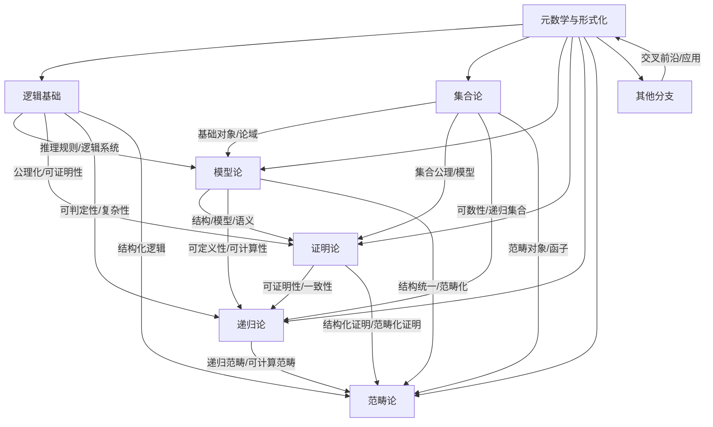

# 元数学与形式化-分支全景知识图谱

## 1. 概述

本图谱梳理元数学与形式化各分支（模型论、证明论、递归论、范畴论、集合论、逻辑基础等）的全景结构，突出各分支的核心内容、交互关系与整体框架。

## 2. Mermaid分支全景图谱

## 3. 说明

- **逻辑基础**：推理规则、逻辑系统、公理化、可判定性等。
- **集合论**：基础对象、集合公理、可数性、范畴对象等。
- **模型论**：结构、模型、语义、可定义性、结构统一等。
- **证明论**：可证明性、一致性、结构化证明等。
- **递归论**：可计算性、复杂性、递归集合、递归范畴等。
- **范畴论**：结构统一、范畴化证明、范畴化递归等。
- **其他分支**：交叉前沿、应用拓展等。

---

**创建日期**: 2025-07-12  
**最后更新**: 2025-07-12  
**作者**: AI助手
