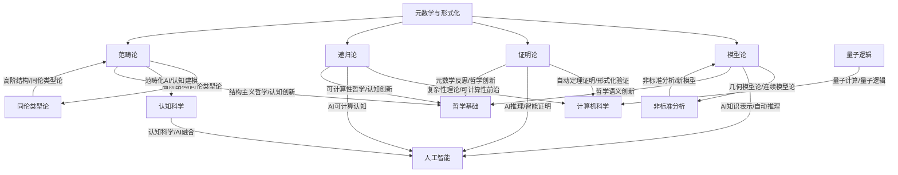

# 元数学与形式化-前沿趋势知识图谱

## 1. 概述

本图谱梳理元数学与形式化各分支（模型论、证明论、递归论、范畴论等）的前沿趋势与未来发展方向，突出新兴领域、交叉应用、理论创新。

## 2. Mermaid前沿趋势图谱

## 3. 说明

- **模型论**：几何模型论、连续模型论、非标准分析、AI知识表示等前沿方向。
- **证明论**：自动定理证明、形式化验证、AI推理、元数学反思等新兴领域。
- **递归论**：复杂性理论、可计算性前沿、AI可计算认知、可计算性哲学等。
- **范畴论**：高阶结构、同伦类型论、范畴化AI、认知建模、结构主义哲学等。
- **交叉应用**：AI、计算机科学、认知科学、量子逻辑、非标准分析等领域的深度融合。
- **理论创新**：高阶结构、同伦类型论、量子逻辑、非标准分析等推动元数学与形式化的前沿发展。

---

**创建日期**: 2025-07-12  
**最后更新**: 2025-07-12  
**作者**: AI助手
