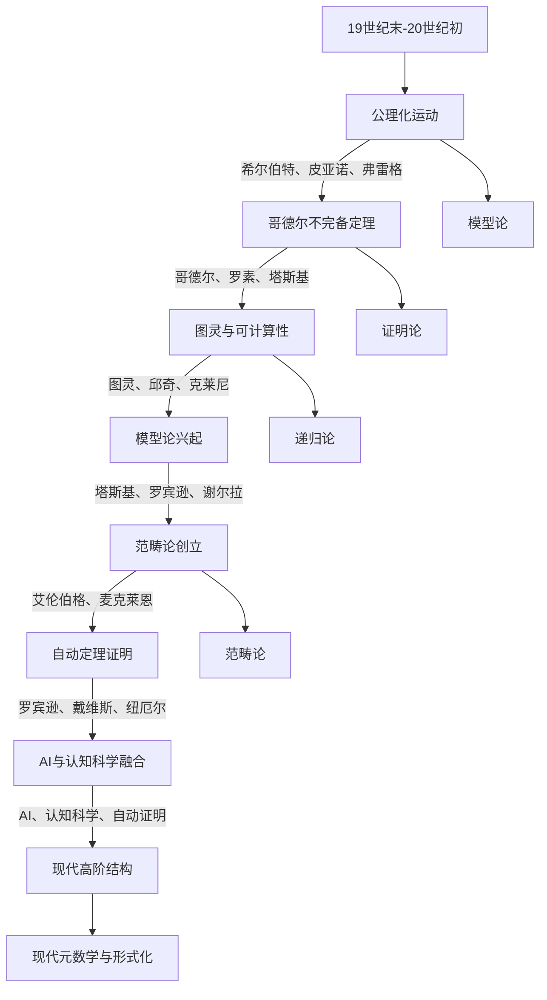

# 元数学与形式化-历史与发展知识图谱

## 1. 概述

本图谱梳理元数学与形式化各分支（模型论、证明论、递归论、范畴论等）的历史演进与发展脉络，突出关键人物、重大事件、理论突破。

## 2. Mermaid历史发展图谱

## 3. 说明

- **公理化运动**：19世纪末-20世纪初，希尔伯特、皮亚诺、弗雷格等推动了数学基础的公理化。
- **哥德尔不完备定理**：揭示了形式系统的局限性，推动了证明论、模型论的发展。
- **图灵与可计算性**：图灵、邱奇、克莱尼等奠定了递归论与可计算性理论基础。
- **模型论兴起**：塔斯基、罗宾逊、谢尔拉等推动了模型论的独立发展。
- **范畴论创立**：艾伦伯格、麦克莱恩创立范畴论，推动结构主义哲学。
- **自动定理证明与AI**：自动推理、AI、认知科学与元数学深度融合。
- **现代高阶结构**：高阶逻辑、同伦类型论等推动元数学与形式化的前沿发展。

---

**创建日期**: 2025-07-12  
**最后更新**: 2025-07-12  
**作者**: AI助手
