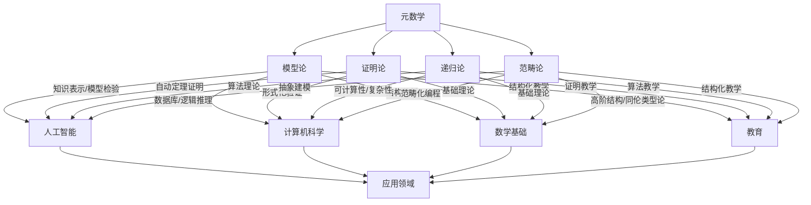

# 元数学与形式化-应用联系知识图谱

## 1. 概述

本图谱梳理元数学与形式化各分支（模型论、证明论、递归论、范畴论等）与应用领域（AI、计算机科学、数学基础、教育等）的交互结构，突出其在理论与实际应用中的多维联系。

## 2. Mermaid应用联系图谱

## 3. 说明

- **模型论**：广泛应用于AI知识表示、模型检验、数据库、逻辑推理、结构化教学等。
- **证明论**：在自动定理证明、形式化验证、基础理论、证明教学等领域有重要应用。
- **递归论**：在可计算性、复杂性、算法理论、基础理论、算法教学等领域有深远影响。
- **范畴论**：在高阶结构、抽象建模、范畴化编程、结构化教学等领域推动理论与应用融合。
- **应用领域**：涵盖AI、计算机科学、数学基础、教育等多维场景。

---

**创建日期**: 2025-07-12  
**最后更新**: 2025-07-12  
**作者**: AI助手
