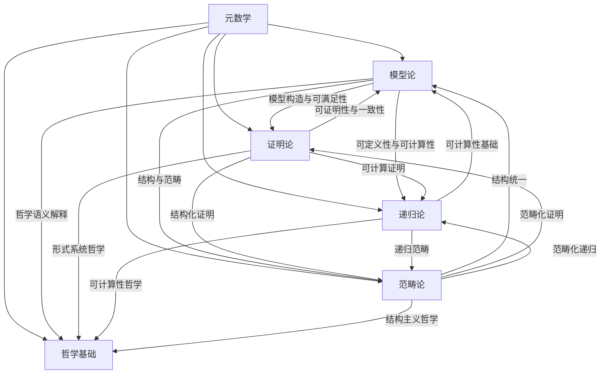

# 元数学与形式化分支交叉联系知识图谱

## 1. 概述

本图谱细化元数学与形式化各分支（模型论、证明论、递归论、范畴论等）之间的交叉联系，突出其在理论、方法、应用、哲学基础等层面的互动。

## 2. Mermaid交叉联系图谱

## 3. 说明

- **模型论-证明论**：模型论为证明论提供模型语义，证明论为模型论提供可证明性分析。
- **模型论-递归论**：模型论研究可定义性，递归论研究可计算性，两者在可判定性、复杂性等领域交叉。
- **模型论-范畴论**：结构与范畴的统一，范畴论为模型论提供更高层次的结构工具。
- **证明论-递归论**：可计算证明、自动定理证明等领域交叉。
- **证明论-范畴论**：结构化证明、范畴化证明方法。
- **递归论-范畴论**：递归范畴、可计算范畴等新兴领域。
- **各分支与哲学基础**：各分支在本体论、认识论、方法论等层面与哲学基础深度互动。

---

**创建日期**: 2025-07-12  
**最后更新**: 2025-07-12  
**作者**: AI助手
