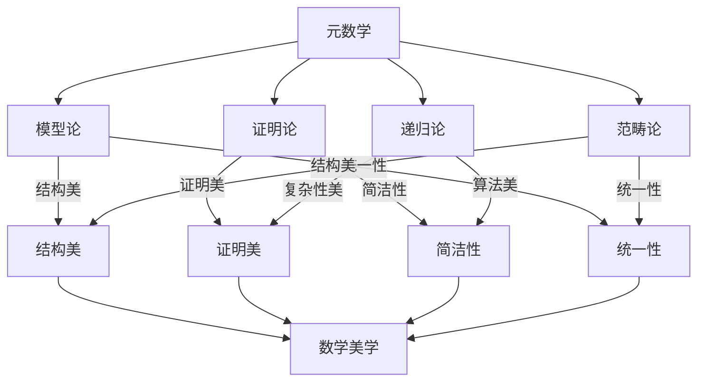

# 元数学与形式化-美学联系知识图谱

## 1. 概述

本图谱梳理元数学与形式化各分支（模型论、证明论、递归论、范畴论等）与数学美学（结构美、证明美、简洁性、统一性等）的交互结构，突出其在理论美、结构美、认知美等方面的联系。

## 2. Mermaid美学联系图谱

## 3. 说明

- **模型论**：强调结构美、统一性，揭示数学结构的深层美学。
- **证明论**：突出证明美、简洁性，追求推理过程的优雅与深刻。
- **递归论**：关注算法美、复杂性美，展现可计算过程的美学特征。
- **范畴论**：强调结构美、统一性，推动数学理论的美学统一。
- **数学美学**：整合结构美、证明美、简洁性、统一性等多维美学视角。

---

**创建日期**: 2025-07-12  
**最后更新**: 2025-07-12  
**作者**: AI助手
