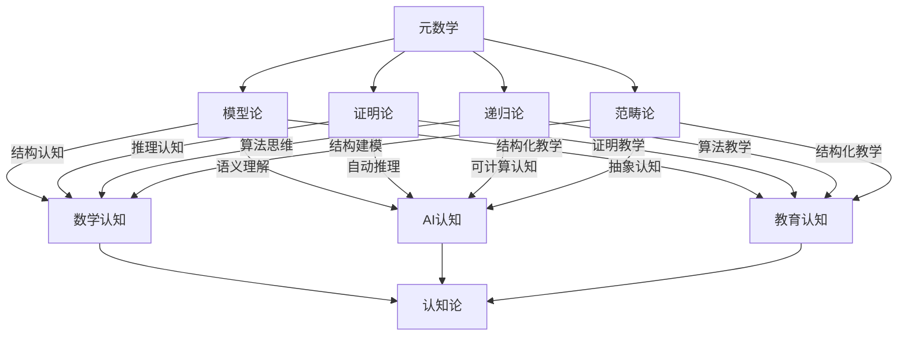

# 元数学与形式化-认知联系知识图谱

## 1. 概述

本图谱梳理元数学与形式化各分支（模型论、证明论、递归论、范畴论等）与认知论（数学认知、AI认知、教育认知等）的交互结构，突出其在认知科学、AI、教育等领域的联系。

## 2. Mermaid认知联系图谱

## 3. 说明

- **模型论**：强调结构认知、语义理解、结构化教学。
- **证明论**：突出推理认知、自动推理、证明教学。
- **递归论**：关注算法思维、可计算认知、算法教学。
- **范畴论**：强调结构建模、抽象认知、结构化教学。
- **认知论**：整合数学认知、AI认知、教育认知等多维视角。

---

**创建日期**: 2025-07-12  
**最后更新**: 2025-07-12  
**作者**: AI助手
