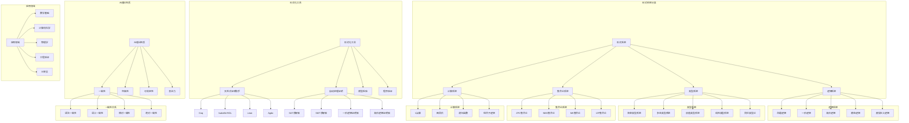

# 形式化系统基础

## 目录

- [形式化系统基础](#形式化系统基础)
  - [目录](#目录)
  - [1. 形式化系统的本质](#1-形式化系统的本质)
    - [1.1 定义与核心特征](#11-定义与核心特征)
    - [1.2 形式化的意义](#12-形式化的意义)
    - [1.3 历史发展](#13-历史发展)
  - [2. 形式化系统的基本结构](#2-形式化系统的基本结构)
    - [2.1 符号系统](#21-符号系统)
    - [2.2 语法规则](#22-语法规则)
    - [2.3 公理系统](#23-公理系统)
    - [2.4 推理规则](#24-推理规则)
  - [3. 形式化系统的例子](#3-形式化系统的例子)
    - [3.1 命题逻辑](#31-命题逻辑)
    - [3.2 一阶谓词逻辑](#32-一阶谓词逻辑)
    - [3.3 ZFC集合论](#33-zfc集合论)
    - [3.4 皮亚诺算术](#34-皮亚诺算术)
  - [4. 形式化系统的元理论性质](#4-形式化系统的元理论性质)
    - [4.1 一致性](#41-一致性)
      - [4.1.1 一致性的等价表述](#411-一致性的等价表述)
      - [4.1.2 一致性证明方法](#412-一致性证明方法)
      - [4.1.3 重要的一致性结果](#413-重要的一致性结果)
      - [4.1.4 一致性与其他元理论性质的关系](#414-一致性与其他元理论性质的关系)
    - [4.2 完备性](#42-完备性)
    - [4.3 可判定性](#43-可判定性)
    - [4.4 表达力](#44-表达力)
  - [5. 形式化系统与数学基础](#5-形式化系统与数学基础)
    - [5.1 希尔伯特纲领](#51-希尔伯特纲领)
      - [5.1.1 一致性证明的技术](#511-一致性证明的技术)
      - [5.1.2 重要的一致性结果](#512-重要的一致性结果)
      - [5.1.3 哲学意义](#513-哲学意义)
    - [5.2 哥德尔不完备性定理的影响](#52-哥德尔不完备性定理的影响)
      - [5.2.1 不完备性定理的内容](#521-不完备性定理的内容)
      - [5.2.2 对一致性证明的影响](#522-对一致性证明的影响)
      - [5.2.3 认知与哲学含义](#523-认知与哲学含义)
    - [5.3 不同数学学派的观点](#53-不同数学学派的观点)
      - [5.3.1 形式主义与一致性](#531-形式主义与一致性)
      - [5.3.2 逻辑主义与一致性](#532-逻辑主义与一致性)
      - [5.3.3 直觉主义与一致性](#533-直觉主义与一致性)
      - [5.3.4 柏拉图主义与一致性](#534-柏拉图主义与一致性)
      - [5.3.5 其他现代观点](#535-其他现代观点)
  - [6. 形式化系统的认知意义](#6-形式化系统的认知意义)
    - [6.1 形式化与数学理解](#61-形式化与数学理解)
      - [6.1.1 形式化如何促进理解](#611-形式化如何促进理解)
      - [6.1.2 形式化与认知过程](#612-形式化与认知过程)
      - [6.1.3 形式化的认知挑战](#613-形式化的认知挑战)
      - [6.1.4 形式化理解的平衡](#614-形式化理解的平衡)
    - [6.2 形式化与数学创造](#62-形式化与数学创造)
      - [6.2.1 形式化与创造性思维的张力](#621-形式化与创造性思维的张力)
      - [6.2.2 形式化作为创造工具](#622-形式化作为创造工具)
      - [6.2.3 创造过程中的形式化角色](#623-创造过程中的形式化角色)
      - [6.2.4 计算机与形式化创造](#624-计算机与形式化创造)
    - [6.3 形式化的局限性](#63-形式化的局限性)
      - [6.3.1 理论局限性](#631-理论局限性)
      - [6.3.2 表达局限性](#632-表达局限性)
      - [6.3.3 实用局限性](#633-实用局限性)
      - [6.3.4 超越局限性](#634-超越局限性)
  - [7. 现代发展与应用](#7-现代发展与应用)
    - [7.1 计算机科学中的应用](#71-计算机科学中的应用)
      - [7.1.1 形式语言与自动机理论](#711-形式语言与自动机理论)
      - [7.1.2 形式语义学](#712-形式语义学)
      - [7.1.3 形式化验证](#713-形式化验证)
      - [7.1.4 编程语言设计](#714-编程语言设计)
    - [7.2 证明助手与自动化](#72-证明助手与自动化)
      - [7.2.1 交互式证明助手](#721-交互式证明助手)
      - [7.2.2 自动定理证明](#722-自动定理证明)
      - [7.2.3 混合方法与证明策略](#723-混合方法与证明策略)
      - [7.2.4 形式化库与社区](#724-形式化库与社区)
    - [7.3 形式化数学项目](#73-形式化数学项目)
      - [7.3.1 里程碑形式化项目](#731-里程碑形式化项目)
      - [7.3.2 综合形式化库](#732-综合形式化库)
      - [7.3.3 前沿研究方向](#733-前沿研究方向)
      - [7.3.4 形式化数学的影响与前景](#734-形式化数学的影响与前景)
  - [8. 形式化系统的未来方向](#8-形式化系统的未来方向)
    - [8.1 形式系统的理论拓展](#81-形式系统的理论拓展)
    - [8.2 人工智能与形式系统](#82-人工智能与形式系统)
    - [8.3 形式系统在科学中的应用](#83-形式系统在科学中的应用)
    - [8.4 形式化教育与普及](#84-形式化教育与普及)
  - [9. 形式系统关系图谱](#9-形式系统关系图谱)
  - [10. 术语表](#10-术语表)
    - [A](#a)
    - [C](#c)
    - [D](#d)
    - [E](#e)
    - [F](#f)
    - [G](#g)
    - [H](#h)
    - [I](#i)
    - [L](#l)
    - [M](#m)
    - [N](#n)
    - [O](#o)
    - [P](#p)
    - [Q](#q)
    - [R](#r)
    - [S](#s)
    - [T](#t)
    - [U](#u)
    - [V](#v)
    - [W](#w)
    - [Z](#z)
  - [11. 附录：重要定理](#11-附录重要定理)
    - [A. 完备性定理](#a-完备性定理)
    - [B. 不完备性定理](#b-不完备性定理)
    - [C. 可判定性结果](#c-可判定性结果)
    - [D. 模型论结果](#d-模型论结果)
    - [E. 证明论结果](#e-证明论结果)
    - [F. 集合论结果](#f-集合论结果)
    - [G. 计算理论结果](#g-计算理论结果)
    - [H. 类型论结果](#h-类型论结果)
  - [12. 练习与思考题](#12-练习与思考题)
    - [12.1 基础练习](#121-基础练习)
    - [12.2 进阶思考题](#122-进阶思考题)
    - [12.3 挑战问题](#123-挑战问题)
    - [12.4 研究方向建议](#124-研究方向建议)
  - [13. 在线资源与学习材料](#13-在线资源与学习材料)
    - [13.1 在线课程与教程](#131-在线课程与教程)
    - [13.2 交互式工具与平台](#132-交互式工具与平台)
    - [13.3 形式化数学库与项目](#133-形式化数学库与项目)
    - [13.4 学术社区与会议](#134-学术社区与会议)
    - [13.5 入门书籍推荐](#135-入门书籍推荐)
  - [14. 常见问题解答](#14-常见问题解答)
    - [14.1 形式系统基础问题](#141-形式系统基础问题)
    - [14.2 元理论性质问题](#142-元理论性质问题)
    - [14.3 哲学与基础问题](#143-哲学与基础问题)
    - [14.4 实践应用问题](#144-实践应用问题)
  - [15. 案例研究：形式系统的实际应用](#15-案例研究形式系统的实际应用)
    - [15.1 数学定理的形式化](#151-数学定理的形式化)
      - [15.1.1 四色定理](#1511-四色定理)
      - [15.1.2 Kepler猜想](#1512-kepler猜想)
      - [15.1.3 奇数阶定理](#1513-奇数阶定理)
    - [15.2 软件与硬件验证](#152-软件与硬件验证)
      - [15.2.1 CompCert验证编译器](#1521-compcert验证编译器)
      - [15.2.2 seL4微内核](#1522-sel4微内核)
      - [15.2.3 形式化的加密协议](#1523-形式化的加密协议)
    - [15.3 跨学科应用](#153-跨学科应用)
      - [15.3.1 形式化生物学](#1531-形式化生物学)
      - [15.3.2 形式化物理学](#1532-形式化物理学)
      - [15.3.3 形式化经济学](#1533-形式化经济学)
    - [15.4 形式化的未来展望](#154-形式化的未来展望)
  - [16. 形式系统的教学与学习](#16-形式系统的教学与学习)
    - [16.1 教学挑战与策略](#161-教学挑战与策略)
      - [16.1.1 主要挑战](#1611-主要挑战)
      - [16.1.2 有效教学策略](#1612-有效教学策略)
    - [16.2 课程设计与资源](#162-课程设计与资源)
      - [16.2.1 课程结构模式](#1621-课程结构模式)
      - [16.2.2 教学资源类型](#1622-教学资源类型)
    - [16.3 学习路径与技能发展](#163-学习路径与技能发展)
      - [16.3.1 推荐学习路径](#1631-推荐学习路径)
      - [16.3.2 核心技能发展](#1632-核心技能发展)
    - [16.4 教育创新与未来趋势](#164-教育创新与未来趋势)
      - [16.4.1 当前创新](#1641-当前创新)
      - [16.4.2 未来教育趋势](#1642-未来教育趋势)
    - [16.5 教学评估与效果测量](#165-教学评估与效果测量)
      - [16.5.1 评估方法](#1651-评估方法)
      - [16.5.2 成功指标](#1652-成功指标)
  - [参考文献](#参考文献)

---

## 1. 形式化系统的本质

### 1.1 定义与核心特征

**定义 1.1** (形式化系统)
形式化系统是一个由严格定义的符号集合、明确的语法规则、特定的公理集合和推理规则组成的系统，用于对数学理论进行严格而精确的表达和推理。

形式化系统的核心特征包括：

1. **精确性**：使用明确定义的符号和规则，消除自然语言的模糊性
2. **机械性**：推理过程可以机械化执行，不依赖于直觉或洞察
3. **封闭性**：系统内部具有自足性，所有推理都在系统规则范围内进行
4. **可验证性**：每个推理步骤都可以被独立验证

### 1.2 形式化的意义

形式化在数学中具有多重意义：

1. **严谨性保证**：提供严格的推理框架，保证数学结论的可靠性
2. **基础探究**：探索数学基础的本质和限制
3. **元数学研究**：将数学本身作为研究对象
4. **自动化支持**：为计算机辅助证明和验证提供基础
5. **交流标准**：提供不依赖于特定文化或语言的数学交流标准

### 1.3 历史发展

形式化系统的发展经历了几个关键阶段：

1. **古代形式化**：欧几里得《几何原本》的公理化方法
2. **近代逻辑发展**：布尔代数、弗雷格的符号逻辑
3. **数学基础危机**：罗素悖论引发的基础危机
4. **形式主义运动**：希尔伯特纲领试图通过形式化解决基础危机
5. **哥德尔定理**：不完备性定理对形式化的限制
6. **现代形式化**：计算机时代的形式验证与证明助手

## 2. 形式化系统的基本结构

### 2.1 符号系统

符号系统是形式化系统的基本构成要素：

**定义 2.1** (字母表)
字母表 $\Sigma$ 是一个有限的符号集合，作为形式语言的基本构建元素。

典型的符号系统包括：

1. **逻辑符号**：$\neg, \wedge, \vee, \rightarrow, \forall, \exists$
2. **常量符号**：$0, 1, \emptyset$
3. **变量符号**：$x, y, z$
4. **函数符号**：$f, g, h$
5. **关系符号**：$=, <, \in$
6. **辅助符号**：$(, ), [, ], \{, \}$

### 2.2 语法规则

语法规则定义了如何从基本符号构建合法的表达式：

**定义 2.2** (形式语言)
给定字母表 $\Sigma$，形式语言 $L$ 是 $\Sigma^*$（即 $\Sigma$ 中符号的所有可能有限序列）的子集。

语法规则通常采用递归定义的方式：

1. **项**：描述对象的表达式
   - 变量是项
   - 如果 $f$ 是 $n$ 元函数符号，$t_1,...,t_n$ 是项，则 $f(t_1,...,t_n)$ 是项

2. **公式**：描述性质或关系的表达式
   - 如果 $R$ 是 $n$ 元关系符号，$t_1,...,t_n$ 是项，则 $R(t_1,...,t_n)$ 是公式
   - 如果 $\varphi$ 是公式，则 $\neg\varphi$ 是公式
   - 如果 $\varphi$ 和 $\psi$ 是公式，则 $\varphi \wedge \psi$, $\varphi \vee \psi$, $\varphi \rightarrow \psi$ 都是公式
   - 如果 $\varphi$ 是公式，$x$ 是变量，则 $\forall x\varphi$ 和 $\exists x\varphi$ 是公式

### 2.3 公理系统

公理是形式系统中不经证明就接受的基本陈述：

**定义 2.3** (公理)
公理是形式系统中不需要证明的基本命题，作为推理的起点。

公理系统的特点：

1. **有限性**：公理集通常是有限的，或者可递归枚举
2. **无矛盾性**：公理之间不应存在矛盾
3. **独立性**：理想情况下，每个公理都不能从其他公理推导出
4. **完备性**：公理应足够表达该理论领域的全部真理

### 2.4 推理规则

推理规则定义了如何从已知命题推导出新命题：

**定义 2.4** (推理规则)
推理规则是一个关系，将一组前提公式映射到结论公式。

典型的推理规则格式为：
$$\frac{\varphi_1, \varphi_2, ..., \varphi_n}{\psi}$$

常见的推理规则包括：

1. **分离规则** (Modus Ponens)：$\frac{\varphi, \varphi \rightarrow \psi}{\psi}$
2. **代入规则**：从公式模式中通过替换变量产生新公式
3. **概括规则**：$\frac{\varphi}{\forall x \varphi}$（在适当条件下）

## 3. 形式化系统的例子

### 3.1 命题逻辑

**命题逻辑形式系统 PL**:

1. **符号**：
   - 命题变量：$p, q, r, ...$
   - 逻辑连接词：$\neg, \wedge, \vee, \rightarrow, \leftrightarrow$
   - 括号：$(, )$

2. **语法**：
   - 原子公式：所有命题变量都是公式
   - 复合公式：如果 $\varphi$ 和 $\psi$ 是公式，则 $\neg\varphi$, $(\varphi \wedge \psi)$, $(\varphi \vee \psi)$, $(\varphi \rightarrow \psi)$, $(\varphi \leftrightarrow \psi)$ 都是公式

3. **公理模式**：
   - A1: $\varphi \rightarrow (\psi \rightarrow \varphi)$
   - A2: $(\varphi \rightarrow (\psi \rightarrow \chi)) \rightarrow ((\varphi \rightarrow \psi) \rightarrow (\varphi \rightarrow \chi))$
   - A3: $(\neg\varphi \rightarrow \neg\psi) \rightarrow (\psi \rightarrow \varphi)$

4. **推理规则**：
   - 分离规则 (MP)：$\frac{\varphi, \varphi \rightarrow \psi}{\psi}$

### 3.2 一阶谓词逻辑

**一阶谓词逻辑形式系统 FOL**:

1. **符号**：
   - 命题逻辑的所有符号
   - 变量符号：$x, y, z, ...$
   - 量词：$\forall, \exists$
   - 函数符号：$f, g, h, ...$
   - 谓词符号：$P, Q, R, ...$

2. **语法**：
   - 项：变量是项；如果 $f$ 是 $n$ 元函数符号，$t_1,...,t_n$ 是项，则 $f(t_1,...,t_n)$ 是项
   - 原子公式：如果 $P$ 是 $n$ 元谓词符号，$t_1,...,t_n$ 是项，则 $P(t_1,...,t_n)$ 是公式
   - 复合公式：同命题逻辑；另外，如果 $\varphi$ 是公式，$x$ 是变量，则 $\forall x\varphi$ 和 $\exists x\varphi$ 是公式

3. **公理**：
   - 命题逻辑的所有公理
   - 量词公理：
     - $\forall x\varphi(x) \rightarrow \varphi(t)$（$t$ 对 $x$ 在 $\varphi$ 中自由）
     - $\varphi(t) \rightarrow \exists x\varphi(x)$（$t$ 对 $x$ 在 $\varphi$ 中自由）

4. **推理规则**：
   - 命题逻辑的规则
   - 全称概括规则：$\frac{\varphi \rightarrow \psi(x)}{\varphi \rightarrow \forall x\psi(x)}$（其中 $x$ 不在 $\varphi$ 中自由出现）

### 3.3 ZFC集合论

**ZFC集合论形式系统**:

1. **语言**：一阶逻辑语言加上一个二元关系符号 $\in$

2. **公理**：
   - **外延公理**：$\forall x \forall y (\forall z (z \in x \leftrightarrow z \in y) \rightarrow x = y)$
   - **空集公理**：$\exists x \forall y (y \notin x)$
   - **配对公理**：$\forall x \forall y \exists z \forall w (w \in z \leftrightarrow w = x \vee w = y)$
   - **并集公理**：$\forall x \exists y \forall z (z \in y \leftrightarrow \exists w (w \in x \wedge z \in w))$
   - **幂集公理**：$\forall x \exists y \forall z (z \in y \leftrightarrow \forall w (w \in z \rightarrow w \in x))$
   - **无穷公理**：$\exists x (\emptyset \in x \wedge \forall y (y \in x \rightarrow y \cup \{y\} \in x))$
   - **替代公理模式**：$\forall x_1...\forall x_n \forall u (\forall y \forall z (\varphi(x_1,...,x_n,y,z,u) \rightarrow y = z) \rightarrow \forall v \exists w \forall r (r \in w \leftrightarrow \exists s (s \in v \wedge \varphi(x_1,...,x_n,s,r,u))))$
   - **分离公理模式**：$\forall x_1...\forall x_n \forall u \exists v \forall y (y \in v \leftrightarrow y \in u \wedge \varphi(x_1,...,x_n,y,u))$
   - **正则公理**：$\forall x (x \neq \emptyset \rightarrow \exists y (y \in x \wedge y \cap x = \emptyset))$
   - **选择公理**：$\forall x (\forall y \in x (y \neq \emptyset) \rightarrow \exists f \forall y \in x (f(y) \in y))$

3. **推理规则**：一阶逻辑的推理规则

### 3.4 皮亚诺算术

**皮亚诺算术形式系统 PA**:

1. **语言**：
   - 常量符号：$0$
   - 函数符号：一元函数 $S$（后继函数）
   - 二元函数符号：$+$（加法）, $\times$（乘法）
   - 二元关系符号：$=$（相等）

2. **公理**：
   - **相等公理**：
     - $\forall x (x = x)$
     - $\forall x \forall y (x = y \rightarrow y = x)$
     - $\forall x \forall y \forall z ((x = y \wedge y = z) \rightarrow x = z)$
     - $\forall x_1...\forall x_n \forall y_1...\forall y_n ((x_1 = y_1 \wedge ... \wedge x_n = y_n) \rightarrow f(x_1,...,x_n) = f(y_1,...,y_n))$
     - $\forall x_1...\forall x_n \forall y_1...\forall y_n ((x_1 = y_1 \wedge ... \wedge x_n = y_n \wedge P(x_1,...,x_n)) \rightarrow P(y_1,...,y_n))$

   - **后继公理**：
     - $\forall x (S(x) \neq 0)$
     - $\forall x \forall y (S(x) = S(y) \rightarrow x = y)$

   - **加法公理**：
     - $\forall x (x + 0 = x)$
     - $\forall x \forall y (x + S(y) = S(x + y))$

   - **乘法公理**：
     - $\forall x (x \times 0 = 0)$
     - $\forall x \forall y (x \times S(y) = x \times y + x)$

   - **归纳公理模式**：对任意公式 $\varphi(x)$：
     - $[\varphi(0) \wedge \forall x (\varphi(x) \rightarrow \varphi(S(x)))] \rightarrow \forall x \varphi(x)$

## 4. 形式化系统的元理论性质

### 4.1 一致性

**定义 4.1** (一致性)
形式系统 $F$ 是一致的，如果不存在公式 $\varphi$ 使得 $F \vdash \varphi$ 且 $F \vdash \neg\varphi$。

一致性分为几种类型：

1. **语法一致性**：系统不能证明矛盾的命题
2. **语义一致性**：系统有模型（存在满足所有公理的解释）
3. **相对一致性**：如果系统 $A$ 是一致的，则系统 $B$ 也是一致的
4. **绝对一致性**：无条件证明系统是一致的

**定理 4.1** (哥德尔第二不完备性定理)
如果算术形式系统 $F$ 至少包含皮亚诺算术并且是一致的，那么 $F$ 无法在自身内部证明其一致性。

#### 4.1.1 一致性的等价表述

一致性可以通过多种等价方式表述：

1. **标准一致性**：不存在公式 $\varphi$ 使得 $F \vdash \varphi$ 且 $F \vdash \neg\varphi$
2. **简单一致性**：不是所有公式都可在 $F$ 中证明
3. **$\Sigma_1$-可靠性**：对任何 $\Sigma_1$ 算术命题 $\varphi$，如果 $F \vdash \varphi$，则 $\varphi$ 为真
4. **$\omega$-一致性**：对任何公式 $\varphi(x)$，如果对每个自然数 $n$，$F \vdash \varphi(\overline{n})$，则不能有 $F \vdash \neg\forall x\varphi(x)$
5. **1-一致性**：系统不能证明形如 "$t = s$" 的假语句，其中 $t$ 和 $s$ 是闭项

#### 4.1.2 一致性证明方法

证明形式系统一致性的主要方法有：

1. **模型论方法**：
   - **构造模型**：通过构造系统的模型来证明一致性
   - **完备性定理**：利用哥德尔完备性定理，证明系统一致等价于有模型
   - **代数方法**：使用代数结构作为模型

2. **证明论方法**：
   - **截断方法**：根据证明复杂度分层分析证明
   - **正规化方法**：证明每个推导都可归约为特定标准形式
   - **消去法**：如希尔伯特的 $\varepsilon$-消去法，证明可消去理想元素
   - **序数分析**：通过将证明与良序数相关联证明终止性

3. **归纳方法**：
   - **超限归纳法**：如 Gentzen 使用的归纳至 $\varepsilon_0$ 的方法
   - **递归定义**：使用原始递归函数分析证明结构

#### 4.1.3 重要的一致性结果

1. **相对一致性结果**：
   - **非欧几何一致性**：相对于欧几里得几何一致
   - **ZFC + 连续统假设**：相对于 ZFC 一致 (哥德尔, 1940)
   - **ZFC + 连续统假设的否定**：相对于 ZFC 一致 (科恩, 1963)

2. **绝对一致性结果**：
   - **命题逻辑**：可通过真值表法证明绝对一致
   - **皮亚诺算术**：Gentzen 使用超限归纳法至 $\varepsilon_0$ 证明其一致性
   - **有限集理论**：可在 PRA (原始递归算术) 中证明一致

3. **不一致性结果**：
   - **素朴集合论**：罗素悖论证明了素朴集合论不一致
   - **扩展系统**：扩展某些系统可导致不一致，如 Curry 悖论

#### 4.1.4 一致性与其他元理论性质的关系

1. **一致性与完备性**：
   - 一致性是系统可靠的最低要求
   - 强一致性可能导致不完备（哥德尔不完备性定理）

2. **一致性与可判定性**：
   - 一致性问题通常是不可判定的
   - 对足够强的系统，一致性问题是 $\Pi_1$-完全的

3. **一致性与守恒性**：
   - 守恒扩张保持一致性
   - 非守恒扩张可能破坏一致性

4. **一致性与真实性**：
   - 系统一致并不保证其公理为真
   - 模型可以满足系统公理但与直觉不符

### 4.2 完备性

**定义 4.2** (语法完备性)
形式系统 $F$ 是语法完备的，如果对于任何公式 $\varphi$，要么 $F \vdash \varphi$，要么 $F \vdash \neg\varphi$。

**定义 4.3** (语义完备性)
形式系统 $F$ 是语义完备的，如果对于任何公式 $\varphi$，当 $\varphi$ 在所有模型中为真时，有 $F \vdash \varphi$。

完备性的主要结果：

1. **哥德尔完备性定理**：一阶逻辑是语义完备的
2. **哥德尔第一不完备性定理**：任何包含基本算术的一致形式系统都是语法不完备的
3. **丘奇-图灵定理**：算术谓词的可满足性问题是不可判定的

### 4.3 可判定性

**定义 4.4** (可判定性)
形式系统 $F$ 是可判定的，如果存在算法能够判定任意给定公式是否为系统中的定理。

可判定性的主要结果：

1. **命题逻辑是可判定的**：存在决定性算法（如真值表法）
2. **一阶逻辑是不可判定的**：不存在通用算法判定任意一阶公式的可证性
3. **丘奇-图灵定理**：停机问题是不可判定的

### 4.4 表达力

**定义 4.5** (表达力)
形式系统的表达力是指该系统能够表达的概念范围。

表达力的比较：

1. **命题逻辑**：只能表达命题间的逻辑关系
2. **一阶逻辑**：能表达对象的性质和关系，以及量化
3. **二阶逻辑**：能表达对性质和关系的量化
4. **类型论**：能表达更丰富的抽象概念

## 5. 形式化系统与数学基础

### 5.1 希尔伯特纲领

希尔伯特纲领是形式主义数学哲学的代表，旨在通过形式化方法解决数学基础危机：

1. **形式化**：将所有数学理论表示为形式系统
2. **一致性证明**：证明这些形式系统不会产生矛盾
   - **有限主义方法**：希尔伯特要求用有限主义方法证明形式系统的一致性，即使用在直觉上明确且可靠的推理方法
   - **相对一致性**：通过证明某个系统相对于另一个系统的一致性，如几何相对于算术的一致性
   - **递归证明**：发展了原始递归算术(PRA)作为进行一致性证明的元理论工具
   - **ε-消去法**：希尔伯特与阿克曼、冯·诺依曼开发的证明技术，试图通过消去理想元素(如无限集合)实现一致性证明
3. **完备性**：证明所有数学真理都可以在形式系统中证明
4. **可判定性**：找到决定任意数学命题真假的算法

#### 5.1.1 一致性证明的技术

在希尔伯特纲领中，一致性证明采用了几种关键技术：

1. **模型构造**：通过构建形式系统的解释模型来证明一致性
   - 例如，希尔伯特在几何学中通过解析几何模型证明欧几里得几何的一致性
   - 哥德尔通过构造"可构造集合"L的模型证明选择公理与连续统假设相对于ZF集合论的一致性

2. **证明论方法**：直接分析形式系统的语法性质
   - **截断方法**：根据证明复杂度分层分析
   - **序数分析**：通过将证明与良序数相关联证明终止性
   - **Gentzen的证明**：使用超限归纳法证明了皮亚诺算术的一致性，但超出了有限主义范围

3. **保守性扩张**：证明扩张系统不会在原始语言中导致新的定理
   - 如证明向皮亚诺算术添加选择公理不会导致关于自然数的新定理

#### 5.1.2 重要的一致性结果

尽管希尔伯特纲领在其原始形式上因哥德尔定理而失败，但在一致性研究中仍取得了重要成果：

1. **Gentzen(1936)**：使用超限归纳法至ε₀证明了皮亚诺算术的一致性
2. **Gödel(1940)**：证明了AC和GCH相对于ZF的一致性
3. **Cohen(1963)**：证明了AC和GCH的否定相对于ZF的一致性，发明了迫法(forcing)
4. **Friedman和Simpson**：发展了逆数学，研究不同数学理论的精确证明强度

#### 5.1.3 哲学意义

一致性证明的追求对数学基础研究产生了深远影响：

1. **证明论的发展**：作为独立数学分支的诞生
2. **有限性的边界**：探索了有限主义方法的极限
3. **归纳定义**：推动了良基归纳和递归定义理论的发展
4. **证明复杂度**：建立了衡量证明复杂性的基础

### 5.2 哥德尔不完备性定理的影响

哥德尔不完备性定理对形式化产生了深远影响：

1. **证明了希尔伯特纲领的不可达成**：充分强的形式系统既不可能完备又不能证明自身一致性
2. **揭示了形式化的内在限制**：数学真理超出了任何单一形式系统的范围
3. **开启了元数学研究**：促使对形式系统本身性质的深入研究
4. **影响了数学哲学**：对形式主义构成挑战，促进了数学哲学的多元化发展

#### 5.2.1 不完备性定理的内容

哥德尔于1931年发表了两个著名的不完备性定理，对形式系统的限制提出了根本性挑战：

1. **第一不完备性定理**：任何包含基本算术的一致形式系统 $F$ 中，存在一个算术命题 $G$，使得 $G$ 在 $F$ 中既不可证明也不可否证
   - $G$ 实质上表达了"此命题在系统F中不可证明"
   - 如果 $F$ 能证明 $G$，则证明了假命题，因此 $F$ 不一致
   - 如果 $F$ 能证明 $\neg G$，则 $G$ 可证，导致矛盾
   - 因此，如果 $F$ 一致，则 $G$ 是不可判定命题

2. **第二不完备性定理**：如果形式系统 $F$ 包含基本算术且一致，则 $F$ 不能证明自身的一致性
   - 令 $Con(F)$ 表示 $F$ 的一致性陈述
   - $Con(F)$ 可形式化为算术命题
   - 哥德尔证明：如果 $F \vdash Con(F)$，则 $F$ 不一致

#### 5.2.2 对一致性证明的影响

不完备性定理对一致性证明研究产生了决定性影响：

1. **破碎了希尔伯特的梦想**：无法在系统内部证明系统自身的一致性
   - 完全的形式化数学一致性证明是不可能的
   - 任何一致性证明都必须使用比被证明系统更强的方法

2. **转向相对一致性**：研究焦点从绝对一致性转向相对一致性
   - 研究一个系统相对于另一个系统的一致性
   - 建立不同理论间的一致性层次

3. **超越有限主义**：一致性证明需要超出希尔伯特原始框架
   - Gentzen使用超限归纳法至ε₀序数
   - 发展了序数分析作为衡量证明论强度的工具

4. **逆数学方法**：研究数学定理所需的最小公理系统
   - 分析经典数学定理的精确证明强度
   - 建立不同数学理论的精确层次结构

#### 5.2.3 认知与哲学含义

不完备性定理及其对形式系统的限制揭示了深刻的认知与哲学含义：

1. **数学知识的开放性**：数学真理不能被任何单一形式系统完全捕捉
   - 数学知识是开放且不断发展的
   - 公理选择具有不可避免的创造性元素

2. **形式化与非形式化思维**：数学需要形式化与非形式化思维的结合
   - 形式化为严谨提供基础
   - 直觉为发现新公理和新概念提供指导

3. **元数学视角**：促进了对数学本身的反思
   - 数学不仅研究对象，也研究自身
   - 揭示了自指系统的基本特性

4. **机械化的限制**：对人工智能和自动化证明设置了理论界限
   - 不存在解决所有数学问题的通用算法
   - 创造性思维在数学中的不可替代性

### 5.3 不同数学学派的观点

不同数学学派对形式化的态度：

1. **形式主义**：数学就是形式系统中的符号游戏，不关心内容的意义
2. **逻辑主义**：数学可归约为逻辑，通过形式化逻辑建立数学基础
3. **直觉主义**：强调数学的构造性，批评非构造性证明和无限集合理论
4. **柏拉图主义**：数学对象客观存在，形式化只是表达方式

#### 5.3.1 形式主义与一致性

形式主义学派由希尔伯特创立，对形式化系统和一致性有独特见解：

1. **数学本质观**：
   - 数学本质上是一种符号游戏，由明确规则操作不具内在意义的符号
   - 数学真理等同于形式系统中的可证明性
   - 数学对象无需实际存在，只需在形式系统中无矛盾地运作

2. **一致性地位**：
   - 一致性是数学理论唯一必要的本体论要求
   - 希尔伯特："如果矛盾的公理不导致矛盾，那么它们就是真的"
   - 数学客观性来自形式系统的一致性，而非对象的存在

3. **有限主义立场**：
   - 元数学应采用有限主义方法，避免无限概念的循环论证
   - 区分"真实数学"（有限构造）和"理想数学"（涉及无限）
   - 通过有限方法证明包含无限概念的系统一致性

4. **后希尔伯特发展**：
   - 新形式主义接受了哥德尔定理的限制
   - 发展了相对一致性研究方法
   - 保留了"数学作为形式系统"的核心观念

#### 5.3.2 逻辑主义与一致性

逻辑主义试图将数学归约为逻辑，由弗雷格创立，罗素和怀特海发展：

1. **数学本质观**：
   - 数学命题本质上是逻辑命题，数学概念可定义为逻辑概念
   - 数学真理是分析性的，而非综合性的
   - 数学不需要特殊的直觉或经验基础

2. **罗素类型论**：
   - 为解决罗素悖论，发展了类型论
   - 通过层次化的类型避免自指悖论
   - 《数学原理》试图从纯逻辑公理推导整个数学

3. **一致性观点**：
   - 一致性源于逻辑系统的一致性
   - 数学一致性应通过逻辑分析证明
   - 认为悖论来自不当使用语言，而非数学本身问题

4. **局限性**：
   - 需要引入非逻辑公理（如无穷公理、选择公理）
   - 类型论系统过于复杂，不符合实际数学实践
   - 无法完全实现将数学归约为逻辑的目标

#### 5.3.3 直觉主义与一致性

直觉主义由布劳威尔创立，反对经典数学中的非构造性方法：

1. **数学本质观**：
   - 数学本质上是心智构造的活动，而非发现客观真理
   - 数学对象只有在被构造出来时才存在
   - 拒绝将数学视为形式系统，强调数学思维的创造性

2. **排中律批判**：
   - 拒绝无限集合上的排中律应用
   - 不接受纯粹的存在性证明，要求构造性证明
   - "A或非A"只有在能够决定A或能够决定非A时才有效

3. **一致性观点**：
   - 一致性不是主要问题，因为构造性数学本身保证无矛盾
   - 不需要元数学证明一致性，因为数学活动本身就是自证的
   - 海廷的实现表明直觉主义数学可形式化为一致系统

4. **现代发展**：
   - 构造性数学与计算机科学紧密联系
   - 马丁-洛夫类型论提供了构造性数学的形式化基础
   - 直觉主义逻辑成为非经典逻辑的重要分支

#### 5.3.4 柏拉图主义与一致性

柏拉图主义认为数学对象客观存在，由哥德尔、庞加莱等人支持：

1. **数学本质观**：
   - 数学对象独立于人类心智客观存在
   - 数学发现而非发明，类似于科学发现物理规律
   - 数学直觉能够感知抽象数学对象

2. **一致性观点**：
   - 一致性源于数学对象的实际存在
   - 形式系统一致是因为它们描述了真实存在的结构
   - 哥德尔认为数学直觉可以超越任何形式系统的限制

3. **对形式化的态度**：
   - 形式化是表达数学真理的工具，而非数学本身
   - 形式系统永远无法完全捕捉数学实在
   - 支持发展越来越强的公理系统以接近数学真理

4. **现代变体**：
   - 结构实在论：关注数学结构而非个体对象
   - 自然主义柏拉图主义：将数学实在与科学理论联系
   - 认知科学视角：研究数学直觉的神经基础

#### 5.3.5 其他现代观点

除了传统学派，现代数学哲学还发展了多种观点：

1. **结构主义**：
   - 数学研究的是抽象结构而非具体对象
   - 强调同构结构的等价性
   - 一致性源于结构可能性

2. **拟经验主义**：
   - 数学知识类似科学知识，可修正可证伪
   - 数学公理基于经验和实用考量选择
   - 一致性是经验假设而非先验保证

3. **社会构建主义**：
   - 数学是社会实践的产物
   - 数学标准受社会和历史因素影响
   - 一致性是社会共识的结果

4. **多元主义**：
   - 接受多种数学基础并存
   - 不同形式系统适用于不同目的
   - 一致性相对于特定理论框架评估

## 6. 形式化系统的认知意义

### 6.1 形式化与数学理解

形式化与数学理解的关系是复杂的：

1. **促进精确理解**：消除歧义，澄清概念
2. **提供结构洞察**：揭示概念间的逻辑关系
3. **标准化知识**：建立共享的理解框架
4. **挑战**：形式化可能掩盖直觉理解

#### 6.1.1 形式化如何促进理解

形式化系统通过多种机制促进数学理解：

1. **概念明晰化**：
   - 形式定义迫使我们精确表达模糊概念
   - 消除自然语言的歧义性和含糊性
   - 例如，"连续"的ε-δ定义比直观描述更精确

2. **逻辑关系显化**：
   - 形式化揭示概念间的逻辑依赖关系
   - 清晰展示定理间的推导结构
   - 帮助识别证明中的隐藏假设

3. **模块化理解**：
   - 将复杂理论分解为基本组件
   - 建立层次化知识结构
   - 允许独立验证每个组件

4. **反直觉结果的理解**：
   - 帮助理解与直觉相悖的数学结果
   - 例如，康托尔定理、哥德尔定理等
   - 提供严格框架分析悖论

#### 6.1.2 形式化与认知过程

形式化系统与人类认知过程的交互：

1. **外化思维**：
   - 形式系统作为"思维的外部支架"
   - 减轻工作记忆负担
   - 允许更复杂的推理链

2. **认知抽象**：
   - 形式符号系统支持高阶抽象思维
   - 符号操作可表达无法直接想象的概念
   - 例如，高维空间、无穷集合等

3. **元认知监控**：
   - 形式化提供检查推理正确性的标准
   - 帮助识别直觉推理中的错误
   - 培养数学严谨性

4. **认知风格差异**：
   - 不同人对形式化的接受度不同
   - 视觉-空间型思考者可能偏好几何直观
   - 逻辑-分析型思考者可能偏好形式系统

#### 6.1.3 形式化的认知挑战

形式化也带来一些认知挑战：

1. **符号负担**：
   - 大量形式符号增加认知负担
   - 符号密集的表达式难以直观理解
   - 可能导致"看不见森林只见树木"的问题

2. **意义脱离**：
   - 过度形式化可能脱离原始数学问题
   - 符号操作可能掩盖概念意义
   - 如希尔伯特所言："不能剥夺数学家使用直觉的权利"

3. **学习门槛**：
   - 形式系统需要专门训练才能掌握
   - 初学者往往难以理解高度抽象的形式化
   - 可能阻碍数学入门

4. **创造性限制**：
   - 严格遵循形式规则可能限制思维灵活性
   - 重大突破常来自形式系统之外的洞察
   - 例如，庞加莱的拓扑直觉、欧拉的计算实验

#### 6.1.4 形式化理解的平衡

有效的数学理解需要平衡形式化与其他认知方式：

1. **多重表征**：
   - 结合形式化、视觉化、实例和类比
   - 不同表征形式互相补充
   - 例如，群论可通过公理、置换表和几何变换理解

2. **形式与直觉的互动**：
   - 形式化验证直觉，直觉指导形式化
   - 数学家在严格证明和直觉探索间切换
   - 如庞加莱所说："逻辑证明，直觉发现"

3. **教学启示**：
   - 数学教育应结合形式严谨性和概念理解
   - 先建立直觉理解，再引入形式化
   - 展示形式化如何澄清和精确化直觉概念

4. **认知工具**：
   - 形式系统是思维工具而非目的本身
   - 评价形式系统应基于其认知效用
   - 好的形式系统应增强而非替代人类理解

### 6.2 形式化与数学创造

形式化在数学创造中的角色：

1. **创造的限制**：形式化规则约束思维的自由度
2. **创造的工具**：形式化提供概念操作的精确工具
3. **启发与验证**：形式化为直觉发现提供验证机制
4. **案例**：自动定理证明发现的新结果

#### 6.2.1 形式化与创造性思维的张力

形式化系统与创造性思维之间存在固有的张力：

1. **规则与自由**：
   - 创造性需要思维自由，而形式化强调规则遵循
   - 数学发现常发生在形式规则之外
   - 如波利亚所说："数学家首先是发明者，其次才是证明者"

2. **直觉与严谨**：
   - 创造性突破常源于直觉跃迁
   - 形式化要求每一步都有严格证明
   - 数学史上许多重要发现最初缺乏严格证明（如欧拉公式）

3. **探索与确证**：
   - 创造过程需要自由探索可能性
   - 形式化强调确定性和可验证性
   - 探索阶段过早形式化可能阻碍发现

4. **模糊与精确**：
   - 创造性思维常始于模糊概念和不完整想法
   - 形式化要求精确定义和明确边界
   - 如庞加莱所述："思考不应被符号所束缚"

#### 6.2.2 形式化作为创造工具

尽管存在张力，形式化系统也能作为创造性工具：

1. **概念生成器**：
   - 形式系统可系统性生成新概念
   - 通过组合已有概念创造新结构
   - 例如，群、环、域等代数结构的形式化产生了新数学分支

2. **类比转移**：
   - 形式化揭示不同领域间的结构相似性
   - 促进数学知识在领域间迁移
   - 例如，希尔伯特空间形式化促进了量子力学发展

3. **问题重构**：
   - 将问题转换为形式语言可揭示新视角
   - 不同形式化可提供互补洞察
   - 例如，微分几何问题的代数形式化

4. **边界探索**：
   - 形式系统的限制本身成为研究对象
   - 探索"不可能性"常导致新数学分支
   - 例如，不可解五次方程导致了伽罗瓦理论

#### 6.2.3 创造过程中的形式化角色

在数学创造的不同阶段，形式化扮演不同角色：

1. **准备阶段**：
   - 掌握现有形式系统提供思维基础
   - 识别形式系统中的模式和结构
   - 理解形式系统的限制和边界

2. **孵化阶段**：
   - 暂时放松形式约束，允许自由联想
   - 在不同形式系统间建立联系
   - 直觉探索可能的解决路径

3. **顿悟阶段**：
   - 关键洞察常超越现有形式框架
   - 创造性跃迁可能需要新形式语言
   - 如爱因斯坦所言："创造性思维是有组织的游戏"

4. **验证阶段**：
   - 形式化严格验证创造性洞察
   - 将直觉转化为精确证明
   - 整合新发现到现有形式体系

#### 6.2.4 计算机与形式化创造

计算机系统利用形式化进行创造性数学探索：

1. **自动定理证明**：
   - 计算机在形式系统中寻找证明
   - 可发现人类难以想到的复杂证明
   - 例如，四色定理的计算机证明

2. **实验数学**：
   - 计算机探索形式模式和规律
   - 生成假设供人类数学家研究
   - 例如，Ramanujan机器自动发现数学恒等式

3. **交互式证明系统**：
   - 人机协作进行数学创造
   - 人类提供创造性洞察，计算机验证形式正确性
   - 例如，Lean、Coq等交互式证明助手

4. **创造性形式化**：
   - 发展新形式系统本身是创造性活动
   - 设计表达力强且直观的形式语言
   - 例如，范畴论提供了新的形式化视角

### 6.3 形式化的局限性

形式化系统存在以下局限性：

1. **不完备性**：哥德尔不完备性定理的限制
2. **表达局限**：某些数学概念难以形式化
3. **认知局限**：形式化不能完全捕捉数学直觉
4. **实用局限**：完全形式化证明往往过于冗长复杂
5. **意义局限**：形式符号缺乏直观意义

#### 6.3.1 理论局限性

形式化系统面临根本性的理论限制：

1. **哥德尔不完备性**：
   - 任何包含基本算术的一致形式系统都不完备
   - 存在真命题无法在系统内证明
   - 系统无法证明自身一致性
   - 形式化无法完全捕捉数学真理

2. **决定性问题**：
   - 许多重要的形式系统问题不可判定
   - 不存在通用算法判定任意命题的可证明性
   - 丘奇-图灵定理限制了形式系统的算法可解性
   - 某些数学问题原则上无法通过机械程序解决

3. **表达力与一致性的权衡**：
   - 增强表达力往往降低一致性保证
   - 更强的系统面临更大的悖论风险
   - 如罗素悖论所示，过于强大的表达能力导致矛盾
   - 形式系统需要在表达力和安全性间取得平衡

4. **复杂性障碍**：
   - 某些可证明的定理需要极其长的证明
   - 证明长度可能超出实际可行范围
   - 存在简单陈述但证明极其复杂的命题
   - 如巴黎-哈丁定理所示的"自然不可证明性"现象

#### 6.3.2 表达局限性

形式系统在表达某些数学概念时面临困难：

1. **直觉概念的形式化**：
   - 某些直觉清晰的概念难以形式化
   - 例如"自然"、"简单"、"优雅"等数学美学概念
   - 连续体假设等问题显示了集合论形式化的局限
   - 某些拓扑直觉难以完全代数化

2. **意义的传达**：
   - 形式符号难以传达概念的直观意义
   - 形式定义常缺乏解释性力量
   - 同一形式结构可对应多种直观解释
   - 如希尔伯特空间的多种物理解释

3. **隐含知识**：
   - 数学实践包含大量隐性知识
   - 专家直觉难以完全形式化
   - 数学家如何选择有前途的研究方向
   - 证明策略和启发式方法的选择

4. **创新概念**：
   - 突破性数学概念常先于其形式化出现
   - 新概念往往需要新形式语言
   - 历史上许多概念经历了长期形式化过程
   - 如无穷小、函数、连续性等概念的演化

#### 6.3.3 实用局限性

在实际应用中，形式化面临实用性挑战：

1. **复杂性爆炸**：
   - 完全形式化的证明通常极其冗长
   - 即使简单定理的完全形式化也可能需要数千步
   - 例如，1+1=2在《数学原理》中需要数百页推导
   - 形式化复杂度限制了人类直接处理的能力

2. **可读性问题**：
   - 高度形式化的文本难以阅读和理解
   - 符号密集的证明降低了沟通效率
   - 缺乏解释性注释的形式证明难以传递洞见
   - 数学家实际工作中使用半形式化语言

3. **工程挑战**：
   - 大规模形式化项目需要巨大工作量
   - 形式化现有数学知识库需要数十年努力
   - 形式系统间的翻译和兼容性问题
   - 维护和更新形式化知识库的困难

4. **成本效益考量**：
   - 完全形式化的收益可能不匹配其成本
   - 数学实践中的"足够严谨"而非"完全形式化"
   - 资源有限性要求在形式化程度上做出权衡
   - 针对不同应用场景的适当形式化水平

#### 6.3.4 超越局限性

尽管存在局限，数学家和逻辑学家开发了多种策略来应对：

1. **多元形式系统**：
   - 发展多种互补的形式系统
   - 不同系统适用于不同数学领域
   - 如集合论、类型论、范畴论等多种基础
   - 承认没有单一"完美"形式系统

2. **分层形式化**：
   - 采用不同层次的形式严谨性
   - 关键结果完全形式化，常规推理半形式化
   - 根据重要性和风险分配形式化资源
   - 如数学软件中的核心算法与应用层

3. **计算机辅助**：
   - 利用计算机处理形式化的机械方面
   - 自动验证形式证明的正确性
   - 交互式证明助手结合人类洞察和机器验证
   - 形式化库的重用和共享

4. **认知增强**：
   - 将形式系统视为认知增强工具
   - 开发更符合人类认知的形式语言
   - 结合可视化和交互式探索
   - 形式化作为思维辅助而非替代

## 7. 现代发展与应用

### 7.1 计算机科学中的应用

形式化系统在计算机科学中的应用：

1. **形式语言理论**：编程语言设计和编译原理
2. **形式语义学**：程序行为的精确描述
3. **形式化验证**：硬件和软件系统的正确性验证
4. **类型系统**：编程语言的安全性保证

#### 7.1.1 形式语言与自动机理论

形式语言理论为计算机科学提供了基础框架：

1. **乔姆斯基层次结构**：
   - 正则语言、上下文无关语言、上下文相关语言、递归可枚举语言
   - 对应不同复杂度的形式系统
   - 为不同计算任务提供适当的形式化工具
   - 编程语言语法通常基于上下文无关文法

2. **自动机模型**：
   - 有限状态自动机、下推自动机、图灵机等
   - 形式化不同计算能力的抽象机器
   - 为算法分析提供理论基础
   - 编译器词法分析器基于有限状态自动机

3. **可计算性理论**：
   - 形式化定义可计算函数
   - 确立计算机能力的基本界限
   - 不可判定性结果指导算法设计
   - λ演算与函数式编程的理论基础

4. **复杂度理论**：
   - 形式化定义计算问题的复杂度类
   - P、NP、PSPACE等复杂度类的层次结构
   - 形式证明某些问题的计算困难性
   - 指导高效算法设计和资源分配

#### 7.1.2 形式语义学

形式语义学为编程语言提供精确的数学模型：

1. **操作语义**：
   - 形式化程序执行的步骤
   - 小步语义、大步语义、结构化操作语义
   - 为虚拟机和解释器实现提供基础
   - 例如，Java虚拟机规范的形式化

2. **指称语义**：
   - 将程序映射到数学对象
   - 使用域论和固定点理论
   - 为程序分析提供抽象模型
   - 函数式语言的数学基础

3. **公理语义**：
   - 通过逻辑公理和推理规则描述程序
   - 霍尔逻辑和分离逻辑
   - 支持程序验证和正确性证明
   - 形式化程序规范和契约

4. **类型理论**：
   - 形式化类型系统的语义
   - 依值类型、多态类型、线性类型等
   - 证明辅助工具的理论基础
   - Curry-Howard同构连接类型和证明

#### 7.1.3 形式化验证

形式化验证应用形式方法确保系统正确性：

1. **模型检验**：
   - 系统状态空间的穷举搜索
   - 时序逻辑和模态逻辑形式化规范
   - 验证并发系统的安全性和活性
   - 工业应用如Intel CPU验证、NASA火星探测器

2. **定理证明**：
   - 基于形式逻辑的机械化证明
   - 交互式和自动化证明方法
   - 验证复杂算法和协议
   - 如seL4微内核的完全形式化验证

3. **静态分析**：
   - 基于抽象解释的程序分析
   - 形式化检测程序错误和漏洞
   - 类型检查、数据流分析、符号执行
   - 工业工具如Coverity、Astrée等

4. **运行时验证**：
   - 形式化监控程序执行
   - 时序逻辑规范的动态检查
   - 合约和断言的形式化
   - 如Java PathFinder和监控工具

#### 7.1.4 编程语言设计

形式系统深刻影响了编程语言设计：

1. **类型系统**：
   - 静态类型系统的形式化设计
   - 类型安全性和类型推导
   - 防止运行时类型错误
   - 如Haskell的Hindley-Milner类型系统

2. **函数式编程**：
   - 基于λ演算的语言设计
   - 引用透明性和不变性的形式保证
   - 数学上可靠的程序组合
   - Haskell、OCaml、Scala等语言

3. **形式化语言特性**：
   - 代数数据类型和模式匹配
   - 形式化定义的模块系统
   - 依赖类型和精确规范
   - 如Idris、Agda、Coq等语言

4. **并发模型**：
   - π演算和进程代数
   - 形式化并发通信
   - CSP、Actor模型等
   - 如Erlang、Go、Clojure的并发模型

### 7.2 证明助手与自动化

现代计算机辅助形式化工具：

1. **证明助手**：
   - Coq：基于类型论的证明助手
   - Isabelle/HOL：高阶逻辑证明助手
   - Lean：现代定理证明器和编程语言

2. **自动定理证明**：
   - 一阶逻辑的自动推理
   - SMT解算器
   - 归结原理和表消解

3. **半自动化方法**：
   - 战术语言
   - 证明策略
   - 机器学习辅助证明

#### 7.2.1 交互式证明助手

交互式证明助手结合人类洞察力和计算机验证能力：

1. **基于类型论的系统**：
   - **Coq**：基于归纳构造演算（CIC），支持依赖类型
   - **Agda**：基于马丁-洛夫类型论，强调构造性证明
   - **Lean**：结合类型论和自动化，注重数学形式化
   - 利用Curry-Howard同构，将证明视为程序

2. **基于高阶逻辑的系统**：
   - **Isabelle/HOL**：基于高阶逻辑，强大的自动化支持
   - **HOL Light**：简洁核心设计，用于复杂数学证明
   - **PVS**：集成类型检查和定理证明
   - 结合传统逻辑与现代自动化技术

3. **系统架构**：
   - **小核心设计**：可靠的逻辑核心验证所有证明步骤
   - **战术语言**：高级证明构造命令
   - **证明脚本**：记录和重放证明步骤
   - **用户界面**：交互式证明开发环境

4. **应用领域**：
   - **数学定理形式化**：如四色定理、Feit-Thompson定理
   - **软硬件验证**：CompCert编译器、seL4微内核
   - **密码学协议**：TLS协议形式化验证
   - **物理学和工程**：控制系统形式化验证

#### 7.2.2 自动定理证明

自动定理证明系统无需或极少需要人类干预：

1. **一阶逻辑自动化**：
   - **分辨法**：基于归结原理的推理
   - **超分辨法**：改进的分辨推理策略
   - **Vampire**、**E定理证明器**：高性能一阶逻辑证明器
   - **SPASS**：基于超分辨的自动证明系统

2. **SAT求解器**：
   - **DPLL算法**：系统性搜索布尔公式的可满足赋值
   - **CDCL技术**：冲突驱动的子句学习
   - **MiniSAT**、**Glucose**：高效SAT求解器
   - 应用于硬件验证、规划问题等

3. **SMT求解器**：
   - **结合理论推理**：整数算术、实数算术、位向量等
   - **Z3**：微软开发的SMT求解器
   - **CVC4/CVC5**：支持多种理论的求解器
   - **Yices**：高效的SMT求解器
   - 应用于程序验证、测试生成等

4. **归纳定理证明**：
   - **ACL2**：基于递归函数的自动证明系统
   - **归纳法证明策略**：自动发现和应用归纳假设
   - **Hipster**：用于Isabelle的归纳证明工具
   - 适用于递归数据结构和函数的验证

#### 7.2.3 混合方法与证明策略

结合交互式和自动化方法的混合系统：

1. **战术自动化**：
   - **auto**、**blast**等高级战术
   - **Sledgehammer**：Isabelle中调用外部自动证明器
   - **hammer**工具：在Coq、HOL等系统中的实现
   - 自动选择和应用适当的证明策略

2. **证明规划**：
   - **证明计划生成**：自动构建高层次证明结构
   - **IsaPlanner**：Isabelle中的证明规划系统
   - **证明模式识别**：利用以往证明的模式
   - 减少证明搜索空间

3. **机器学习方法**：
   - **TacticToe**：基于机器学习的战术选择
   - **CoqGym**：Coq证明的强化学习环境
   - **GamePad**：将证明视为游戏进行学习
   - **HOList**：结合神经网络和搜索的证明系统

4. **交互模式**：
   - **证明调试**：定位和修复证明中的错误
   - **证明重构**：改进和简化现有证明
   - **证明探索**：交互式探索证明空间
   - **证明解释**：生成人类可理解的证明解释

#### 7.2.4 形式化库与社区

支持形式化发展的基础设施：

1. **数学库**：
   - **Coq的数学组件库**：代数、分析、拓扑学等
   - **Isabelle/HOL的AFP**：存档形式化证明
   - **Lean的mathlib**：现代数学形式化库
   - **Mizar数学库**：大规模形式化数学知识

2. **验证软件库**：
   - **CompCert**：经过验证的C编译器
   - **CakeML**：验证的ML语言实现
   - **VST**：验证软件工具链
   - **CertiKOS**：验证的操作系统内核

3. **社区与协作**：
   - **Proof General**：多系统证明助手界面
   - **jsCoq**、**Lean Web Editor**：基于Web的证明环境
   - **GitHub集成**：协作证明开发
   - **ProofPeer**：分布式证明协作平台

4. **教育与可访问性**：
   - **交互式教程**：如Lean的Natural Number Game
   - **证明小游戏**：游戏化形式证明学习
   - **可视化工具**：证明状态和结构可视化
   - **自然语言接口**：减少形式语言学习门槛

### 7.3 形式化数学项目

重要的形式化数学项目：

1. **形式化四色定理**：使用Coq形式化证明
2. **Mizar数学库**：大规模形式化数学知识库
3. **Flyspeck项目**：形式化开普勒猜想证明
4. **UniMath项目**：使用同伦类型论形式化数学
5. **Lean数学组件库**：现代数学形式化

#### 7.3.1 里程碑形式化项目

数学史上的重要定理形式化：

1. **四色定理**：
   - **项目背景**：1976年由Appel和Haken证明，使用计算机检查近2000种情况
   - **形式化过程**：1997-2004年由Gonthier团队在Coq中完成
   - **技术创新**：开发了小规模反射技术，显著简化证明
   - **意义**：首个完全形式化的重大数学定理，验证了原始计算机辅助证明

2. **Feit-Thompson定理**：
   - **项目背景**：群论中的奇数阶定理，原始证明超过250页
   - **形式化过程**：由Gonthier领导的团队在Coq中完成
   - **规模**：超过15万行形式化代码，开发了大量群论库
   - **意义**：展示了形式化处理复杂数学理论的能力

3. **Kepler猜想（Flyspeck项目）**：
   - **项目背景**：关于球体堆积的最优密度问题
   - **形式化过程**：由Hales领导，使用HOL Light和Isabelle
   - **挑战**：处理大量计算几何和非线性优化
   - **完成时间**：2014年完成，历时近10年

4. **homotopy.io项目**：
   - **目标**：形式化高维范畴论和同伦论
   - **创新**：结合图形界面与形式证明
   - **特点**：支持高维图示操作
   - **应用**：拓扑学和高阶代数结构研究

#### 7.3.2 综合形式化库

系统性形式化数学知识的库：

1. **Mizar数学库（MML）**：
   - **历史**：始于1989年，最早的大规模形式化数学库之一
   - **规模**：超过60,000个定理，1300多篇文章
   - **覆盖范围**：从基础集合论到高等数学多个分支
   - **特点**：使用接近自然数学语言的形式化语言

2. **Isabelle/HOL的AFP**（Archive of Formal Proofs）：
   - **组织方式**：同行评审的形式化证明存档
   - **内容**：包含代数、分析、拓扑学、计算机科学等领域
   - **贡献模式**：开放社区贡献，严格质量控制
   - **增长**：每年稳定增加新条目

3. **Lean的mathlib**：
   - **特点**：现代、社区驱动的数学库
   - **组织**：模块化设计，注重可重用性
   - **发展速度**：近年来发展最快的形式化库之一
   - **目标**：形式化本科及研究生水平数学

4. **Coq的数学组件库**：
   - **结构**：模块化设计的代数层次结构
   - **特色**：小规模反射方法，结合计算与证明
   - **应用**：支持多个大型形式化项目
   - **扩展**：如ForMath项目，扩展到分析学和代数拓扑

#### 7.3.3 前沿研究方向

形式化数学的新兴研究领域：

1. **同伦类型论与UniMath**：
   - **理论基础**：基于Voevodsky的同伦类型论
   - **哲学**：统一数学基础的新方法
   - **特点**：将同伦和类型论结合，支持更自然的数学表达
   - **目标**：建立数学的统一形式化基础

2. **形式化范畴论**：
   - **项目**：如Coq中的Category Theory Library
   - **挑战**：处理大规模抽象结构和宇宙层次
   - **应用**：形式化现代数学中的范畴方法
   - **进展**：已形式化许多核心范畴概念和定理

3. **形式化分析学**：
   - **项目**：如C-CoRN（Coq中的构造性实分析）
   - **挑战**：处理连续性、极限和无穷概念
   - **方法**：构造性与经典方法的形式化
   - **应用**：形式化微积分、测度论和泛函分析

4. **交互式形式化**：
   - **工具**：如ProofWidgets和jsCoq
   - **目标**：降低形式化门槛，提高可用性
   - **方法**：结合图形界面与形式证明
   - **未来**：形式化与人工智能辅助证明结合

#### 7.3.4 形式化数学的影响与前景

形式化对数学实践的影响：

1. **教育影响**：
   - **形式化教学**：如Lean的Natural Number Game
   - **精确理解**：形式化澄清概念和证明细节
   - **自动反馈**：系统即时验证学生证明
   - **可访问性**：降低高级数学的入门门槛

2. **研究实践变革**：
   - **协作证明**：团队合作形式化大型定理
   - **证明挖掘**：从形式化库中发现模式和联系
   - **交叉验证**：不同系统间的结果转换
   - **证明风格**：形式化影响非形式化证明的表达

3. **数学基础研究**：
   - **基础比较**：不同形式化基础的优缺点评估
   - **强度分析**：确定定理所需的公理强度
   - **一致性研究**：探索形式系统间的关系
   - **新基础**：如同伦类型论等新形式化基础

4. **未来展望**：
   - **形式化百科全书**：完整的数学知识形式化
   - **自动化程度提高**：减少形式化工作量
   - **形式化与非形式化结合**：互补优势
   - **新数学发现**：形式化辅助发现新定理和结构

这些案例表明，形式系统已经从纯理论研究发展为解决实际问题的强大工具，其应用范围和影响力将继续扩大。

## 8. 形式化系统的未来方向

随着计算机科学和数学的发展，形式化系统正朝着多个方向演进，既扩展了其理论基础，也拓宽了应用领域。

### 8.1 形式系统的理论拓展

形式系统理论本身正在经历重要发展：

1. **新型逻辑系统**：
   - **线性逻辑**：处理资源敏感推理
   - **模态逻辑**：形式化时间、知识和信念
   - **量子逻辑**：适应量子计算的推理系统
   - **多值逻辑**：超越经典二值逻辑的形式系统

2. **更强表达能力**：
   - **高阶逻辑**：超越一阶逻辑的表达能力
   - **依值类型系统**：结合类型和逻辑的强大形式系统
   - **多元宇宙层次**：处理大型数学结构的形式化
   - **归纳-归纳定义**：扩展递归定义能力

3. **元理论新发展**：
   - **逆数学新结果**：精确刻画数学定理的证明强度
   - **序数分析技术**：发展新的一致性证明方法
   - **不可判定性边界研究**：探索可判定与不可判定的界限
   - **随机性与复杂性**：将算法信息理论与形式系统结合

4. **跨学科理论整合**：
   - **范畴论视角**：通过范畴论统一不同形式系统
   - **计算复杂性理论**：研究形式证明的计算资源需求
   - **信息论方法**：使用信息论分析形式系统的表达效率
   - **量子信息理论**：探索量子计算对形式系统的影响

### 8.2 人工智能与形式系统

人工智能与形式系统的结合正在创造新的研究范式：

1. **神经-符号系统**：
   - **深度学习辅助证明**：使用神经网络指导证明搜索
   - **符号约束的神经系统**：结合神经网络的学习能力与形式系统的精确性
   - **可解释AI**：使用形式方法提供AI决策的严格保证
   - **形式化的神经架构**：为神经网络提供形式化语义

2. **自动化证明新方法**：
   - **大型语言模型辅助证明**：利用预训练模型生成证明草图
   - **强化学习证明搜索**：通过奖励机制优化证明策略
   - **证明合成**：从例子和规范自动生成证明
   - **类比推理**：利用已有证明模式解决新问题

3. **交互式证明新范式**：
   - **自适应证明助手**：根据用户风格调整辅助策略
   - **多模态交互**：结合自然语言、图形和形式语言的证明界面
   - **协作证明系统**：支持多人同时参与的证明开发
   - **渐进形式化**：允许从非形式到完全形式的平滑过渡

4. **形式化知识图谱**：
   - **数学知识自动提取**：从文献中提取形式化知识
   - **定理关系网络**：构建数学定理间的依赖和联系图谱
   - **跨系统知识转换**：不同形式系统间的自动翻译
   - **概念演化追踪**：记录数学概念在不同形式系统中的发展

### 8.3 形式系统在科学中的应用

形式系统正扩展到更广泛的科学领域：

1. **物理学形式化**：
   - **量子力学的形式基础**：严格形式化量子理论
   - **相对论形式化**：时空理论的形式化表达
   - **物理定律验证**：形式化验证物理模型的一致性
   - **计算物理保证**：为物理模拟提供形式化保证

2. **生物学与医学**：
   - **系统生物学模型验证**：形式化生物网络模型
   - **医学推理系统**：基于形式逻辑的诊断和治疗推理
   - **药物设计验证**：形式化药物相互作用分析
   - **生物信息学算法验证**：确保基因分析算法正确性

3. **工程应用**：
   - **关键系统验证**：航空、核能、医疗设备等安全关键系统
   - **分布式系统形式化**：区块链和共识协议的形式验证
   - **人机交互系统**：形式化人机交互安全性和可用性
   - **自动驾驶验证**：形式化验证自动驾驶决策系统

4. **社会科学**：
   - **经济模型形式化**：严格表达和验证经济理论
   - **博弈论形式化**：策略交互的精确数学表达
   - **社会选择理论**：投票和集体决策系统的形式分析
   - **法律推理系统**：法律文本和推理的形式化表示

### 8.4 形式化教育与普及

形式化思维正逐渐融入更广泛的教育体系：

1. **教育方法创新**：
   - **交互式形式化学习**：通过游戏化方式学习形式推理
   - **可视化形式系统**：直观展示形式推理过程
   - **分层形式化教学**：根据学习阶段调整形式化严格程度
   - **自适应学习系统**：根据学生理解调整形式化教学内容

2. **跨学科形式化培训**：
   - **计算思维与形式化结合**：在计算机科学教育中强化形式思维
   - **STEM学科形式化基础**：在科学、技术、工程和数学中引入形式方法
   - **哲学与形式系统**：探讨形式系统的认识论和本体论意义
   - **创造性思维与形式化**：研究形式化如何促进而非限制创造力

3. **公众理解与参与**：
   - **科学传播中的形式化**：向公众解释形式化的价值和意义
   - **公民科学形式化项目**：让非专业人士参与形式化工作
   - **开放形式化平台**：降低形式化工具使用门槛
   - **形式化思维普及**：将形式化思维作为通用素养推广

4. **伦理与社会影响**：
   - **形式化的伦理维度**：研究形式系统的价值取向
   - **形式化与数字鸿沟**：确保形式化技术的公平获取
   - **形式化的文化视角**：不同文化背景下的形式思维差异
   - **形式化与人类认知**：研究形式化如何增强或改变人类思维方式

形式化系统的未来发展将继续深化其理论基础，拓展其应用领域，并更紧密地与人类认知和社会需求结合，在保持数学严谨性的同时，提高其可用性和普适性。

## 9. 形式系统关系图谱

以下图谱展示了形式系统的分类、性质及其相互关系，提供了本文所讨论内容的可视化概览：

此图谱展示了形式系统的多样性及其在不同领域的应用。
从基础的逻辑和类型系统，到具体的证明工具和应用领域，形式化方法已经成为现代科学和工程中不可或缺的组成部分。
图中也反映了一致性等元理论性质在形式系统研究中的核心地位。

## 10. 术语表

为便于读者理解本文中使用的专业术语，特提供以下术语表：

### A

- **抽象解释**（Abstract Interpretation）：程序分析的一种形式化方法，通过在抽象域上执行程序来推导程序性质。
- **公理**（Axiom）：形式系统中不需要证明而直接接受的基本命题。
- **公理模式**（Axiom Schema）：无限多个公理的有限表示，通常包含自由变量，可通过替换生成具体公理。

### C

- **范畴论**（Category Theory）：研究数学结构及其之间态射的抽象代数理论。
- **丘奇-图灵论题**（Church-Turing Thesis）：关于有效可计算性的假说，认为任何直观上可计算的函数都可由图灵机计算。
- **一致性**（Consistency）：形式系统的性质，表示系统中不能同时证明一个命题及其否定。
- **构造性数学**（Constructive Mathematics）：要求所有数学对象必须通过有效程序构造的数学分支。

### D

- **可判定性**（Decidability）：存在算法能在有限步骤内判定任意给定命题真假的性质。
- **推导**（Deduction）：按照形式系统规则从前提得出结论的过程。
- **依值类型**（Dependent Type）：依赖于值的类型，如依赖于自然数n的向量类型Vec(n)。

### E

- **有效程序**（Effective Procedure）：能通过有限、精确、机械化步骤执行的算法。

### F

- **一阶逻辑**（First-order Logic）：允许量化个体变量但不允许量化谓词或函数的逻辑系统。
- **形式化**（Formalization）：将数学理论转换为精确的符号系统的过程。
- **形式语言**（Formal Language）：由精确规则定义的符号串集合。
- **形式系统**（Formal System）：由符号、公理和推理规则组成的精确数学系统。

### G

- **哥德尔编码**（Gödel Numbering）：将形式系统中的符号和表达式映射到自然数的方法。
- **哥德尔不完备性定理**（Gödel's Incompleteness Theorems）：证明任何包含基本算术的一致形式系统都存在不可判定命题的定理。

### H

- **希尔伯特纲领**（Hilbert's Program）：形式化全部数学并证明其一致性的计划。
- **高阶逻辑**（Higher-order Logic）：允许量化谓词和函数的逻辑系统。
- **同伦类型论**（Homotopy Type Theory）：将类型视为空间、类型等价视为同伦等价的类型论。

### I

- **归纳定义**（Inductive Definition）：通过基本情况和递归规则定义集合或关系的方法。
- **直觉主义逻辑**（Intuitionistic Logic）：不接受排中律的逻辑系统，要求构造性证明。

### L

- **λ演算**（Lambda Calculus）：研究函数定义、应用和递归的形式系统。
- **语言**（Language）：在形式系统中，由字母表上的符号组成的串的集合。
- **线性逻辑**（Linear Logic）：将命题视为资源，强调资源使用的逻辑系统。

### M

- **元数学**（Metamathematics）：研究数学系统本身的数学分支。
- **元理论**（Metatheory）：关于形式理论的理论，研究形式系统的性质。
- **模型**（Model）：满足形式系统所有公理的数学结构。
- **模型论**（Model Theory）：研究形式语言与其解释之间关系的数学分支。

### N

- **自然演绎**（Natural Deduction）：模仿自然推理过程的形式证明系统。
- **非标准分析**（Nonstandard Analysis）：使用无穷小和无穷大量的数学分析方法。

### O

- **序数**（Ordinal）：表示良序集合顺序类型的数学对象。
- **序数分析**（Ordinal Analysis）：使用序数来衡量形式系统证明理论强度的方法。

### P

- **皮亚诺算术**（Peano Arithmetic）：形式化自然数算术的公理系统。
- **多态性**（Polymorphism）：允许函数或数据类型适用于多种类型的特性。
- **谓词**（Predicate）：表示对象性质或关系的逻辑表达式。
- **命题逻辑**（Propositional Logic）：处理不可分解命题及其逻辑连接的基本逻辑系统。

### Q

- **量词**（Quantifier）：表示"所有"（∀）或"存在"（∃）的逻辑符号。

### R

- **递归**（Recursion）：通过自我引用定义函数或过程的方法。
- **递归可枚举**（Recursively Enumerable）：存在算法可枚举其所有元素的集合。
- **表示定理**（Representation Theorem）：证明某种数学结构可以用另一种结构表示的定理。

### S

- **语义**（Semantics）：形式语言表达式的含义或解释。
- **序贯演算**（Sequent Calculus）：一种形式证明系统，使用序贯（前提和结论的有序对）。
- **集合论**（Set Theory）：研究集合及其性质的数学分支，常作为数学基础。
- **SMT求解器**（SMT Solver）：结合布尔满足性和各种理论的自动推理工具。
- **语法**（Syntax）：形式系统中符号组合规则的研究。

### T

- **陶特论证**（Tautology）：在所有可能的解释下都为真的命题逻辑公式。
- **定理**（Theorem）：在形式系统中可证明的命题。
- **理论**（Theory）：形式语言中一组公式的集合，通常是某些公理的逻辑闭包。
- **类型论**（Type Theory）：将数学对象分类为不同类型的形式系统。

### U

- **单价原则**（Univalence Principle）：同伦类型论中的原则，认为等价类型在所有方面都可视为相等。
- **宇宙**（Universe）：类型论中包含其他类型的类型。

### V

- **有效性**（Validity）：在所有可能的解释下都为真的逻辑公式性质。

### W

- **良基归纳法**（Well-founded Induction）：基于良基关系的归纳证明方法。

### Z

- **ZFC集合论**（ZFC Set Theory）：Zermelo-Fraenkel集合论加上选择公理，现代集合论的标准公理化系统。

## 11. 附录：重要定理

本附录列出了形式系统理论中的一些核心定理及其简要陈述，为读者提供参考。

### A. 完备性定理

**哥德尔完备性定理**：一阶逻辑是语义完备的，即如果一个公式在所有模型中都为真，那么它在形式系统中是可证明的。

形式化表述：对于任意一阶公式 $\varphi$，如果 $\varphi$ 在所有模型中都为真（$\models \varphi$），则 $\varphi$ 在形式系统中可证明（$\vdash \varphi$）。

### B. 不完备性定理

**哥德尔第一不完备性定理**：任何包含基本算术的一致形式系统中，存在既不可证明也不可否证的命题。

形式化表述：如果形式系统 $F$ 是一致的且足够强（包含基本算术），则存在一个 $F$ 中的句子 $G$，使得 $F \nvdash G$ 且 $F \nvdash \neg G$。

**哥德尔第二不完备性定理**：任何包含基本算术的一致形式系统不能证明自身的一致性。

形式化表述：如果形式系统 $F$ 是一致的且足够强，则 $F \nvdash Con(F)$，其中 $Con(F)$ 表示 $F$ 的一致性陈述。

### C. 可判定性结果

**命题逻辑的可判定性**：存在算法可以判定任意命题逻辑公式是否为永真式。

**一阶逻辑的不可判定性**（丘奇-图灵定理）：不存在算法可以判定任意一阶逻辑公式是否为有效式。

**停机问题的不可判定性**：不存在算法可以判定任意给定的程序是否会在有限步骤内停止。

### D. 模型论结果

**紧致性定理**：一阶逻辑理论的每个有限子集都有模型，当且仅当该理论本身有模型。

**罗文海姆-斯科伦定理**：如果一个可数一阶理论有无限模型，则它对任意无限基数 $\kappa$ 都有基数为 $\kappa$ 的模型。

**洛斯定理**：超积构造保持一阶逻辑中的真值。

### E. 证明论结果

**截断引理**（Gentzen）：任何经典一阶逻辑的证明都可以转换为截断形式，即不包含绕道的证明。

**Herbrand定理**：如果一个无量词一阶公式是有效的，则存在有限多个该公式的实例的析取式是重言式。

**消去定理**（Gentzen）：自然演绎系统中的任何证明都可以转换为不使用排中律的标准形式。

### F. 集合论结果

**ZFC中的相对一致性结果**：

- 选择公理（AC）与连续统假设（CH）相对于ZF是一致的（哥德尔）。
- 选择公理与连续统假设的否定相对于ZF是一致的（科恩）。
- 可测基数存在性与ZFC相对一致（索洛维）。

### G. 计算理论结果

**丘奇-图灵论题**：直观上可计算的函数恰好是图灵机可计算的函数。

**莱斯定理**：图灵机的非平凡性质一般是不可判定的。

**递归定理**（Kleene）：对于任何可计算函数 $f$，存在一个程序 $e$ 使得 $e$ 和 $f(e)$ 计算相同的函数。

### H. 类型论结果

**Curry-Howard同构**：程序与证明之间存在对应关系，类型对应命题，程序对应证明。

**规范化定理**：在简单类型的λ演算中，任何项都可以规范化为正规形式。

**参数化定理**：在多态类型系统中，参数化类型的函数必须对所有类型一致行为。

## 12. 练习与思考题

本节提供一系列练习和思考题，帮助读者巩固对形式系统的理解，并鼓励进一步探索。题目按难度分为基础、进阶和挑战三个级别。

### 12.1 基础练习

1. **符号与语法**
   - 写出下列公式在一阶逻辑中的形式化表示：
     - 所有的自然数都有一个后继数
     - 存在无理数 $x$ 和 $y$ 使得 $x^y$ 是有理数
     - 任意两个不同的实数之间存在有理数

2. **证明系统**
   - 在自然演绎系统中，证明 $\neg(P \wedge Q) \vdash \neg P \vee \neg Q$
   - 在希尔伯特式公理系统中，使用分离规则（Modus Ponens）证明：若 $\vdash A \rightarrow B$ 且 $\vdash B \rightarrow C$，则 $\vdash A \rightarrow C$

3. **模型与语义**
   - 构造一个模型，使得公式 $\forall x \exists y (R(x,y) \wedge \neg R(y,x))$ 为真
   - 证明公式 $\forall x \forall y (R(x,y) \rightarrow R(y,x)) \rightarrow \forall x \forall y (R(x,y) \rightarrow \forall z (R(y,z) \rightarrow R(x,z)))$ 不是永真式

4. **形式系统性质**
   - 解释为什么命题逻辑是可判定的，而一阶逻辑是不可判定的
   - 说明一个形式系统可以是完备的但不一致，或者一致但不完备

### 12.2 进阶思考题

1. **元理论探究**
   - 分析哥德尔第一不完备性定理的证明中自指句的构造方法，并解释为什么这种构造对证明至关重要
   - 讨论哥德尔第二不完备性定理对希尔伯特纲领的影响，特别是关于有限主义方法证明一致性的可能性

2. **形式系统的表达力**
   - 比较皮亚诺算术（PA）和Zermelo-Fraenkel集合论（ZF）的表达力
   - 探讨在不同的形式系统中如何定义和处理无穷概念

3. **一致性与独立性**
   - 解释为什么连续统假设（CH）在ZFC中是独立的，并讨论这一结果的哲学含义
   - 探讨相对一致性证明的方法，以及它们如何应用于研究公理的独立性

4. **形式化与直觉**
   - 分析形式化如何帮助澄清数学概念，举例说明形式化过程中发现的概念混淆
   - 讨论直觉在形式化数学中的作用，特别是在公理选择和定理证明策略方面

### 12.3 挑战问题

1. **证明理论深度问题**
   - 研究Gentzen的截断消除定理，并解释其在证明论中的重要性
   - 探讨序数分析如何用于测量形式系统的证明论强度

2. **形式化实践**
   - 选择一个简单的数学定理，用Coq、Isabelle/HOL或Lean等证明助手进行形式化证明
   - 分析形式化过程中遇到的挑战，以及与传统数学证明的差异

3. **形式系统的扩展**
   - 设计一个扩展标准一阶逻辑的形式系统，使其能更自然地表达某类数学结构
   - 证明您设计的系统的基本元理论性质（如一致性、完备性或可判定性）

4. **计算与证明的关系**
   - 探讨Curry-Howard同构的深层含义，特别是关于程序验证和类型系统
   - 研究交互式定理证明与自动定理证明的结合方法，提出提高证明自动化水平的策略

### 12.4 研究方向建议

1. **形式化数学**
   - 调研当前主要形式化数学库（如Lean的mathlib、Coq的Mathematical Components、Isabelle/HOL的Archive of Formal Proofs）的组织结构和设计理念
   - 分析形式化大型数学理论的方法学挑战

2. **人工智能与形式推理**
   - 探讨神经网络如何辅助形式证明搜索和证明步骤生成
   - 研究大型语言模型在数学形式化中的潜在应用和局限

3. **跨学科应用**
   - 调研形式方法在软件验证、密码学或量子计算等领域的应用
   - 探讨形式系统在认知科学或哲学中的意义，特别是关于数学思维和知识表示

4. **形式系统基础**
   - 研究替代集合论基础（如范畴论、同伦类型论）的优势和挑战
   - 探索构造性数学和经典数学在形式化方面的差异和联系

## 13. 在线资源与学习材料

本节提供形式系统相关的在线资源、教程、工具和社区信息，帮助读者进一步学习和实践。

### 13.1 在线课程与教程

1. **逻辑与形式系统基础**
   - [斯坦福大学：数理逻辑导论](https://plato.stanford.edu/entries/logic-classical/)
   - [麻省理工学院：数学逻辑公开课](https://ocw.mit.edu/courses/mathematics/18-515-mathematical-logic-spring-2010/)
   - [Coursera: 数理逻辑导论](https://www.coursera.org/learn/mathematical-logic)
   - [LogicMatters: 逻辑学习指南](https://www.logicmatters.net/)

2. **证明助手教程**
   - [Coq交互式教程](https://coq.inria.fr/tutorial/)
   - [Software Foundations系列](https://softwarefoundations.cis.upenn.edu/)
   - [Isabelle/HOL交互式教程](https://isabelle.in.tum.de/documentation.html)
   - [Lean数学库教程](https://leanprover-community.github.io/learn.html)
   - [ProofWiki: 形式化证明百科全书](https://proofwiki.org/wiki/Main_Page)

3. **视频讲座**
   - [OPLSS: 俄勒冈编程语言夏季学校](https://www.cs.uoregon.edu/research/summerschool/)
   - [形式化数学基础视频课程](https://www.youtube.com/playlist?list=PLlSZlNj22M7QQ5bYDs7VHAAC-uxobUHZ6)
   - [类型论与证明助手讲座系列](https://www.youtube.com/playlist?list=PLGCr8P_YncjVjwAxrifKgcQYtbZ3zuPlb)

### 13.2 交互式工具与平台

1. **在线逻辑工具**
   - [LogicTools: 命题逻辑与一阶逻辑练习](http://logictools.org/)
   - [Metamath Proof Explorer](http://us.metamath.org/index.html)
   - [Incredible Proof Machine](http://incredible.pm/)
   - [Natural Deduction Proof Editor](https://proofs.openlogicproject.org/)

2. **证明助手**
   - [Coq](https://coq.inria.fr/) - 基于依值类型的证明助手
   - [Isabelle/HOL](https://isabelle.in.tum.de/) - 高阶逻辑证明助手
   - [Lean](https://leanprover.github.io/) - 现代定理证明系统
   - [Agda](https://wiki.portal.chalmers.se/agda/pmwiki.php) - 依值类型的函数式编程语言与证明助手
   - [HOL Light](https://www.cl.cam.ac.uk/~jrh13/hol-light/) - 轻量级高阶逻辑证明系统
   - [Mizar](http://mizar.org/) - 形式化数学系统

3. **自动定理证明器**
   - [Z3](https://github.com/Z3Prover/z3) - 微软研究院开发的SMT求解器
   - [Vampire](https://vprover.github.io/) - 一阶逻辑自动定理证明器
   - [E Theorem Prover](https://wwwlehre.dhbw-stuttgart.de/~sschulz/E/E.html) - 等式一阶逻辑证明器
   - [Prover9](https://www.cs.unm.edu/~mccune/prover9/) - 一阶逻辑自动证明系统

### 13.3 形式化数学库与项目

1. **主要形式化库**
   - [Lean mathlib](https://github.com/leanprover-community/mathlib) - Lean的数学库
   - [Archive of Formal Proofs](https://www.isa-afp.org/) - Isabelle/HOL的形式化证明档案库
   - [Coq Mathematical Components](https://math-comp.github.io/) - Coq的数学组件库
   - [Mizar Mathematical Library](http://mizar.org/library/) - Mizar的数学库
   - [UniMath](https://github.com/UniMath/UniMath) - 单价基础数学库

2. **标志性形式化项目**
   - [四色定理形式化证明](https://github.com/math-comp/fourcolor)
   - [Kepler猜想形式化证明](https://github.com/flyspeck/flyspeck)
   - [CompCert: 经过验证的C编译器](https://compcert.inria.fr/)
   - [seL4: 经过验证的微内核](https://sel4.systems/)
   - [DeepSpec: 深度规范项目](https://deepspec.org/)

### 13.4 学术社区与会议

1. **研究社区**
   - [交互式定理证明社区](https://itp-community.github.io/)
   - [自动推理社区](http://aarinc.org/)
   - [形式化数学社区](https://www.cs.ru.nl/~freek/digimath/)
   - [程序语言与验证社区](https://popl.sigplan.org/)

2. **主要会议**
   - ITP: 交互式定理证明国际会议
   - CADE: 自动推理国际会议
   - LICS: 逻辑在计算机科学中的应用研讨会
   - CPP: 认证程序与证明国际会议
   - FSCD: 形式结构与计算与推导国际会议

3. **期刊与预印本**
   - [Journal of Automated Reasoning](https://www.springer.com/journal/10817)
   - [Logical Methods in Computer Science](https://lmcs.episciences.org/)
   - [Journal of Formalized Reasoning](https://jfr.unibo.it/)
   - [arXiv Logic分类](https://arxiv.org/list/math.LO/recent)

### 13.5 入门书籍推荐

1. **数理逻辑基础**
   - Enderton, H. B. (2001). A Mathematical Introduction to Logic (2nd ed.). Academic Press.
   - Mendelson, E. (2015). Introduction to Mathematical Logic (6th ed.). CRC Press.
   - Cori, R., & Lascar, D. (2000). Mathematical Logic: A Course with Exercises. Oxford University Press.

2. **证明理论与形式系统**
   - Troelstra, A. S., & Schwichtenberg, H. (2000). Basic Proof Theory (2nd ed.). Cambridge University Press.
   - Negri, S., & Von Plato, J. (2008). Structural Proof Theory. Cambridge University Press.
   - Girard, J. Y., Taylor, P., & Lafont, Y. (1989). Proofs and Types. Cambridge University Press.

3. **形式化方法实践**
   - Pierce, B. C., et al. (2018). Logical Foundations. Software Foundations series, volume 1.
   - Nipkow, T., & Klein, G. (2014). Concrete Semantics with Isabelle/HOL. Springer.
   - Chlipala, A. (2013). Certified Programming with Dependent Types. MIT Press.

## 14. 常见问题解答

本节收集了关于形式系统的常见问题及其解答，旨在帮助读者澄清一些常见的混淆点和误解。

### 14.1 形式系统基础问题

**问：形式系统和形式语言有什么区别？**

答：形式语言是由字母表上的符号串构成的集合，由语法规则定义。而形式系统除了包含形式语言外，还包括公理（特殊的公式）和推理规则，用于从公理出发推导定理。简言之，形式语言关注的是表达能力，而形式系统关注的是推理能力。

**问：为什么需要多种不同的形式系统？一个通用的系统不就足够了吗？**

答：不同的形式系统有不同的表达力、计算复杂性和应用领域。例如，命题逻辑简单且可判定，适合某些自动化任务；而ZFC集合论表达力强但不可判定，适合作为数学基础。此外，不同系统反映了不同的数学哲学观点，如经典逻辑与直觉主义逻辑的区别。

**问：形式系统中的符号本身有意义吗？**

答：在纯粹的形式系统中，符号本身没有固有意义，它们只是按照语法规则组合和按照推理规则转换的对象。符号的意义来自于对形式系统的解释（语义），这种解释将形式系统中的符号和公式映射到某个数学结构中。

**问：公理是如何选择的？为什么选这些而不是其他的？**

答：公理的选择通常基于以下考虑：(1)简洁性：尽量少的公理；(2)独立性：公理之间相互独立；(3)一致性：不导致矛盾；(4)完备性：能够导出所有我们认为应该成立的定理；(5)直观性：反映我们对所描述对象的基本直觉。不同的公理选择反映了不同的数学观点。

### 14.2 元理论性质问题

**问：一致性和完备性能同时满足吗？**

答：根据哥德尔不完备性定理，任何包含基本算术的一致形式系统都必然不完备。也就是说，如果系统足够强大且一致，就必然存在该系统中既不能证明也不能反驳的命题。然而，某些较弱的系统（如命题逻辑或一阶谓词逻辑）可以同时满足一致性和完备性。

**问：如果一个形式系统不一致，是否意味着它完全无用？**

答：不一致的系统确实存在严重问题，因为根据"爆炸原理"，在不一致系统中任何命题都可以被证明，这使得系统失去了区分真假的能力。然而，在某些应用中，人们研究了"副一致逻辑"（paraconsistent logic），它限制了爆炸原理，允许系统包含某些矛盾而不至于完全崩溃。

**问：可判定性有多重要？不可判定的系统有什么用？**

答：可判定性对于自动化推理和计算机应用非常重要。然而，许多强大的数学理论（如一阶算术、集合论）是不可判定的。这些系统仍然非常有用，因为：(1)它们可以表达丰富的数学概念；(2)许多具体问题仍然可以在这些系统中解决；(3)半判定过程可以找到正例；(4)人类数学家可以使用直觉和创造力在这些系统中工作。

**问：形式系统的表达力和复杂性之间有什么关系？**

答：通常，表达力越强的系统，其元理论性质（如可判定性）就越复杂。这反映了计算理论中的一个基本权衡：表达力与计算复杂性之间存在反比关系。例如，命题逻辑可判定但表达力有限；一阶逻辑表达力更强但半可判定；二阶逻辑表达力更强但不是半可判定的。

### 14.3 哲学与基础问题

**问：哥德尔不完备性定理是否意味着数学基础的失败？**

答：不完全是。哥德尔定理确实对希尔伯特纲领提出了严重挑战，表明无法用有限主义方法证明强系统的一致性。然而，这并不意味着数学基础的完全失败，而是促使我们更深入地理解形式系统的限制，并发展出更丰富的数学哲学观点。现代数学基础研究继续探索替代方法，如相对一致性证明和序数分析。

**问：形式主义、逻辑主义和直觉主义的主要区别是什么？**

答：这些学派对数学本质的理解不同：形式主义将数学视为符号游戏，关注一致性而非真理；逻辑主义试图将数学归约为逻辑，认为数学真理是逻辑真理；直觉主义强调数学对象必须通过构造性方法创建，拒绝非构造性证明。这些差异导致它们采用不同的逻辑系统和证明方法。

**问：数学真的需要形式化吗？非形式化的数学有什么问题？**

答：非形式化数学可能存在模糊性、歧义和隐含假设，有时会导致错误。形式化提供了严格性和确定性，特别是在复杂证明和边界情况中。然而，日常数学实践中的非形式化推理往往更为灵活和直观。理想的方法是将两者结合：使用非形式化思维进行创造和理解，使用形式化方法进行验证和澄清。

**问：计算机能最终取代数学家进行定理证明吗？**

答：虽然计算机在形式验证和某些类型的证明中越来越强大，但完全取代数学家似乎不太可能。数学创造力、直觉、问题选择和概念创新等方面仍然主要依赖人类。更可能的情况是人机协作：数学家提供创造性洞察和证明策略，计算机处理形式细节和验证。这种协作已经在复杂证明项目中显示出强大潜力。

### 14.4 实践应用问题

**问：学习形式系统对普通数学家有什么帮助？**

答：了解形式系统可以帮助数学家：(1)更精确地表达概念和定理；(2)识别隐含假设和潜在漏洞；(3)理解证明的逻辑结构；(4)欣赏数学基础的深度问题；(5)使用证明助手等工具验证复杂证明。即使不直接从事形式化工作，这种理解也能提高数学思维的严谨性。

**问：开始使用证明助手的最佳方式是什么？**

答：建议采取以下步骤：(1)先学习基本的数理逻辑和类型论；(2)选择一个适合初学者的证明助手（如Lean或Coq）及其教程；(3)从形式化简单的数学概念和证明开始；(4)参与社区获取帮助；(5)逐步尝试更复杂的项目。Software Foundations系列和Lean的Natural Number Game是很好的起点。

**问：形式化一个数学定理通常需要多长时间？**

答：这高度依赖于定理的复杂性、形式化者的经验和可用的形式化库。简单定理可能只需几小时，而复杂定理可能需要数月甚至数年。例如，四色定理的形式化花了几年时间，而Kepler猜想的形式化是一个持续十多年的项目。随着库和工具的改进，形式化速度正在提高。

**问：形式化数学与程序验证有什么关系？**

答：两者密切相关且相互促进。形式化数学提供了验证程序所需的数学基础（如数论、实分析等）；而程序验证技术反过来增强了数学形式化工具。Curry-Howard同构揭示了程序与证明之间的深层联系：程序对应证明，类型对应命题。许多现代证明助手同时支持数学形式化和程序验证。

## 15. 案例研究：形式系统的实际应用

本节通过具体案例展示形式系统在数学证明、软件验证和其他领域的实际应用，以及这些应用所取得的成果和面临的挑战。

### 15.1 数学定理的形式化

#### 15.1.1 四色定理

四色定理是第一个主要依赖计算机证明的著名数学定理，它断言任何平面地图都可以用最多四种颜色着色，使相邻区域颜色不同。

**形式化过程**：

- 1976年，Appel和Haken首次给出计算机辅助证明，但其正确性受到质疑
- 1997年，Robertson等人简化了证明，但仍依赖计算机
- 2004-2005年，Gonthier使用Coq证明助手完成了完整的形式化证明
- 形式化工作量：约6万行Coq代码，4人年工作量

**关键挑战**：

- 将图论概念转化为形式语言
- 处理大量的特殊情况（近2000种构型）
- 开发高效的形式化策略以减少重复工作

**影响**：四色定理的形式化证明是一个里程碑事件，它展示了形式化方法在验证复杂数学证明方面的潜力，特别是那些依赖计算机的证明。

#### 15.1.2 Kepler猜想

Kepler猜想关于三维空间中球体最密堆积方式的问题，已有400多年历史。

**形式化过程**：

- 1998-2005年，Hales完成了传统证明，但审稿人无法完全验证其正确性
- 2003年，Hales启动Flyspeck项目，旨在形式化整个证明
- 2014年，团队宣布在HOL Light和Isabelle中完成了完整形式化
- 形式化工作量：约50万行代码，约22人年工作量

**关键挑战**：

- 处理复杂的非线性不等式系统
- 形式化大量的线性规划计算
- 协调多个证明助手之间的工作

**影响**：Kepler猜想的形式化证明是迄今为止最复杂的形式化项目之一，它证明了形式化方法可以应用于最前沿的数学研究。

#### 15.1.3 奇数阶定理

奇数阶定理（又称Feit-Thompson定理）是有限群论中的一个重要结果，断言所有有限单群要么是奇数阶，要么是偶数阶且可解。

**形式化过程**：

- 2006年，Gonthier团队开始在Coq中形式化这一定理
- 2012年，团队宣布完成形式化证明
- 形式化工作量：约17万行Coq代码，约6人年工作量

**关键挑战**：

- 形式化大量的代数结构和理论
- 处理复杂的数学符号和表示
- 开发可重用的数学组件库

**影响**：奇数阶定理的形式化展示了形式化方法在处理抽象数学理论方面的能力，并促进了Mathematical Components库的发展。

### 15.2 软件与硬件验证

#### 15.2.1 CompCert验证编译器

CompCert是一个经过形式验证的C编译器，保证编译过程不会引入错误。

**形式化过程**：

- 2005年启动，由INRIA团队开发
- 使用Coq证明助手实现和验证
- 形式化工作量：约10万行Coq代码

**关键特性**：

- 形式化证明编译器保留程序语义
- 覆盖从C源代码到汇编代码的全部编译阶段
- 实际性能接近GCC -O1优化级别

**影响**：CompCert展示了形式化方法在开发高可靠性软件方面的实用性，特别是在安全关键领域。它已在航空航天等高可靠性要求的行业中得到应用。

#### 15.2.2 seL4微内核

seL4是世界上第一个具有端到端形式验证的操作系统微内核。

**形式化过程**：

- 2009年首次发布验证版本
- 使用Isabelle/HOL进行形式化证明
- 形式化工作量：约20万行证明代码，约20人年工作量

**验证属性**：

- 功能正确性：实现符合抽象规范
- 信息流安全：保证信息不会泄露
- 完整性：关键系统组件不会被未授权修改
- 可用性：系统资源不会被耗尽

**影响**：seL4已经在高安全性要求的领域得到应用，如无人机系统、医疗设备和军事通信系统。它证明了形式验证可以应用于实际操作系统开发。

#### 15.2.3 形式化的加密协议

加密协议的形式化验证对于确保网络通信安全至关重要。

**案例：TLS协议验证**:

- 多个研究团队对TLS协议进行了形式化分析
- 使用工具：ProVerif、Tamarin、F*、Coq等
- 发现了多个实际漏洞，如FREAK、Logjam和Triple Handshake攻击

**验证属性**：

- 认证性：通信方身份得到验证
- 保密性：传输数据不被未授权方获取
- 前向保密性：即使密钥泄露，过去通信仍然安全
- 协议一致性：不同实现之间的互操作性

**影响**：形式化方法已成为设计和分析现代加密协议的标准工具，提高了互联网通信的安全性。

### 15.3 跨学科应用

#### 15.3.1 形式化生物学

形式系统已开始应用于生物学模型的精确表达和验证。

**应用案例：信号通路建模**:

- 使用过程代数和时序逻辑形式化细胞信号通路
- 工具：PRISM模型检查器、BioNetGen等
- 形式化工作：将生物网络转化为可验证的数学模型

**主要成果**：

- 发现现有模型中的不一致性
- 预测实验中未观察到的行为
- 生成可测试的生物学假设

**挑战与前景**：

- 处理生物系统的复杂性和不确定性
- 整合不同尺度的生物学知识
- 促进生物学家和形式化专家之间的合作

#### 15.3.2 形式化物理学

物理学理论的形式化有助于澄清概念和验证推理。

**应用案例：量子力学公理化**:

- 使用类型论和范畴论形式化量子力学基础
- 工具：Agda、Coq等依值类型系统
- 形式化工作：将量子力学公理转化为形式语言

**主要成果**：

- 澄清量子力学中的概念依赖关系
- 验证量子算法的正确性
- 发现物理理论中的隐含假设

**挑战与前景**：

- 处理物理学中的连续数学结构
- 形式化不确定性原理和测量理论
- 为量子计算提供经过验证的基础

#### 15.3.3 形式化经济学

经济学模型的形式化有助于验证其逻辑一致性和探索其含义。

**应用案例：博弈论形式化**:

- 使用定理证明器验证纳什均衡存在性
- 工具：Isabelle/HOL、Lean等
- 形式化工作：将经济学假设和定理转化为形式语言

**主要成果**：

- 验证经典经济学定理的正确性
- 发现现有证明中的漏洞
- 探索模型假设的必要性和充分性

**挑战与前景**：

- 处理经济学中的策略互动和理性假设
- 形式化不完全信息和不确定性
- 为经济政策分析提供更可靠的基础

### 15.4 形式化的未来展望

基于这些案例研究，我们可以预见形式系统未来的发展方向：

1. **规模扩展**：形式化项目将继续扩大规模，覆盖更复杂的数学理论和软件系统
2. **工具改进**：证明助手将变得更加自动化、用户友好，并支持更丰富的推理形式
3. **库生态**：形式化库将继续增长，降低新项目的形式化成本
4. **教育普及**：形式化方法将逐渐纳入数学和计算机科学教育
5. **跨学科应用**：形式系统将继续扩展到更多学科，如生物学、医学和社会科学
6. **人工智能协作**：AI技术将与形式系统结合，提高证明自动化水平
7. **工业应用**：形式化方法将在关键基础设施和高可靠性系统中得到更广泛应用

这些案例表明，形式系统已经从纯理论研究发展为解决实际问题的强大工具，其应用范围和影响力将继续扩大。

## 16. 形式系统的教学与学习

本节探讨形式系统的教学方法、学习挑战以及教育创新，旨在为教育工作者和学习者提供实用指导。

### 16.1 教学挑战与策略

形式系统的教学面临一系列独特挑战，需要采用特定的教学策略来有效克服。

#### 16.1.1 主要挑战

1. **抽象性障碍**
   - 形式符号与直观理解之间的鸿沟
   - 学生难以将形式表示与实际含义联系起来
   - 抽象推理能力的培养需要时间

2. **技术性障碍**
   - 严格的语法和推理规则要求精确性
   - 证明构造需要细致的步骤控制
   - 形式化工具有较陡的学习曲线

3. **动机性障碍**
   - 学生可能质疑形式系统的实用价值
   - 初期学习缺乏即时反馈和成就感
   - 理论与应用之间的联系不明显

#### 16.1.2 有效教学策略

1. **循序渐进法**
   - 从简单系统（如命题逻辑）开始，逐步过渡到复杂系统
   - 先介绍非形式化版本，再引入形式化表示
   - 将大型证明分解为可管理的小步骤

2. **可视化与交互**
   - 使用图形表示展示形式系统的结构
   - 采用交互式证明工具提供即时反馈
   - 通过动画演示推理规则的应用过程

3. **实例驱动教学**
   - 从具体问题出发，引出形式化需求
   - 使用丰富的例子说明抽象概念
   - 展示形式系统解决实际问题的案例

4. **多角度解释**
   - 结合语法、语义和实用角度解释概念
   - 提供形式定义与直观解释的双重说明
   - 联系学生已有知识，建立认知桥梁

### 16.2 课程设计与资源

形式系统课程的设计需要平衡理论深度与实践应用，并提供适当的学习资源。

#### 16.2.1 课程结构模式

1. **基础-应用模式**
   - 第一阶段：逻辑基础（命题逻辑、一阶逻辑）
   - 第二阶段：形式系统理论（语法、语义、元理论）
   - 第三阶段：应用领域（形式化数学、程序验证）

2. **工具驱动模式**
   - 围绕特定证明助手（如Coq、Isabelle）组织内容
   - 通过实际项目学习形式系统概念
   - 强调实践技能与理论理解并重

3. **问题驱动模式**
   - 以具体问题为中心（如软件验证、定理证明）
   - 按需引入形式系统概念和工具
   - 强调解决实际问题的能力

#### 16.2.2 教学资源类型

1. **交互式教材**
   - 在线证明助手教程（如Software Foundations）
   - 交互式逻辑练习平台
   - 带有即时反馈的自动评分系统

2. **项目资源**
   - 分级难度的形式化项目库
   - 已形式化证明的案例研究
   - 小型但完整的形式化挑战

3. **辅助工具**
   - 证明可视化工具
   - 简化的证明助手界面
   - 自动提示和错误诊断系统

### 16.3 学习路径与技能发展

学习形式系统需要系统性规划，培养一系列核心技能。

#### 16.3.1 推荐学习路径

1. **数学背景路径**
   - 数学逻辑基础 → 证明理论 → 模型论 → 形式系统 → 证明助手
   - 适合有数学背景的学习者
   - 强调理论基础和数学严谨性

2. **计算机科学路径**
   - 离散数学 → 形式语言 → 类型系统 → 程序逻辑 → 形式验证
   - 适合有编程背景的学习者
   - 强调实用工具和应用

3. **混合路径**
   - 基础逻辑 → 简单证明助手 → 形式系统理论 → 高级应用
   - 理论与实践交替进行
   - 适合多数初学者

#### 16.3.2 核心技能发展

1. **形式化思维**
   - 精确表达能力：将自然语言转化为形式语言
   - 结构化推理：按照严格规则构建推理链
   - 抽象思考：识别和操作抽象概念

2. **技术技能**
   - 语法掌握：熟悉形式系统的符号和规则
   - 证明构造：设计和实现形式化证明
   - 工具使用：熟练操作证明助手和自动化工具

3. **元认知技能**
   - 证明策略：选择适当的证明方法和技巧
   - 错误诊断：识别和修正形式化中的问题
   - 复杂性管理：处理大型形式化项目

### 16.4 教育创新与未来趋势

形式系统教育正经历创新变革，未来趋势显示出新的可能性。

#### 16.4.1 当前创新

1. **游戏化学习**
   - 将形式系统学习融入游戏环境（如Natural Number Game）
   - 通过关卡设计提供渐进式挑战
   - 利用成就系统增强学习动机

2. **协作学习平台**
   - 支持多人协作的在线证明环境
   - 社区驱动的形式化项目
   - 同伴评审和讨论机制

3. **自适应学习系统**
   - 基于学习者表现调整难度和内容
   - 个性化的学习路径推荐
   - 智能辅导系统提供针对性指导

#### 16.4.2 未来教育趋势

1. **AI辅助教学**
   - AI系统辅助证明构造和错误诊断
   - 智能导师系统提供个性化指导
   - 自动生成适合学习者水平的练习

2. **虚拟与增强现实应用**
   - 3D可视化复杂形式系统结构
   - 沉浸式证明构造环境
   - 协作虚拟空间进行形式化项目

3. **跨学科整合**
   - 将形式系统教育融入其他学科课程
   - 发展特定领域的形式化教育模块
   - 促进形式方法在各专业中的应用

### 16.5 教学评估与效果测量

有效评估形式系统学习成果对于改进教学至关重要。

#### 16.5.1 评估方法

1. **多维度评估**
   - 概念理解：测试形式系统基本概念掌握
   - 技术能力：评估形式化和证明构造能力
   - 应用能力：测量解决实际问题的能力

2. **过程性评估**
   - 证明发展追踪：记录证明构造过程
   - 错误模式分析：识别常见误解
   - 学习行为数据：收集工具使用模式

3. **项目式评估**
   - 形式化项目完成情况
   - 证明质量与效率
   - 团队协作与沟通

#### 16.5.2 成功指标

1. **直接学习成果**
   - 形式系统概念理解深度
   - 证明构造能力提升
   - 工具使用熟练度

2. **间接学习成果**
   - 一般逻辑推理能力增强
   - 抽象思维水平提高
   - 精确表达能力发展

3. **长期影响**
   - 形式方法在后续学习中的应用
   - 职业发展中的技能转化
   - 持续学习形式系统的动机

通过系统性的教学设计、多样化的学习资源、清晰的技能发展路径和有效的评估方法，形式系统教育可以变得更加可及和有效，为培养下一代形式化思维人才奠定基础。

## 参考文献

1. Enderton, H. B. (2001). A Mathematical Introduction to Logic (2nd ed.). Academic Press.
2. Mendelson, E. (2015). Introduction to Mathematical Logic (6th ed.). CRC Press.
3. Hilbert, D., & Ackermann, W. (1950). Principles of Mathematical Logic. Chelsea.
4. Gödel, K. (1931). Über formal unentscheidbare Sätze der Principia Mathematica und verwandter Systeme I. Monatshefte für Mathematik und Physik, 38(1), 173-198.
5. Kleene, S. C. (1952). Introduction to Metamathematics. North-Holland.
6. Cori, R., & Lascar, D. (2000). Mathematical Logic: A Course with Exercises. Oxford University Press.
7. Avigad, J., & Harrison, J. (2014). Formally verified mathematics. Communications of the ACM, 57(4), 66-75.
8. Hales, T. C. (2008). Formal proof. Notices of the AMS, 55(11), 1370-1380.
9. Gentzen, G. (1936). Die Widerspruchsfreiheit der reinen Zahlentheorie. Mathematische Annalen, 112, 493-565.
10. Gonthier, G. (2008). Formal proof—the four-color theorem. Notices of the AMS, 55(11), 1382-1393.
11. Hales, T., et al. (2017). A formal proof of the Kepler conjecture. Forum of Mathematics, Pi, 5, e2.
12. Harrison, J. (2009). Handbook of Practical Logic and Automated Reasoning. Cambridge University Press.
13. Paulson, L. C. (2018). Computational Logic: Its Origins and Applications. Cambridge University Press.
14. Barendregt, H., & Wiedijk, F. (2005). The challenge of computer mathematics. Philosophical Transactions of the Royal Society A, 363(1835), 2351-2375.
15. Avigad, J. (2018). The mechanization of mathematics. Notices of the AMS, 65(6), 681-690.
16. Wiedijk, F. (2006). The Seventeen Provers of the World. Springer.
17. Pfenning, F., & Paulin-Mohring, C. (1989). Inductively defined types in the Calculus of Constructions. In Mathematical Foundations of Programming Semantics (pp. 209-228). Springer.
18. Siekmann, J., & Wrightson, G. (Eds.). (2012). Automation of Reasoning: Classical Papers on Computational Logic. Springer.
19. Voevodsky, V., Ahrens, B., Grayson, D., & others. (2013). UniMath: Univalent Mathematics. Available at <https://github.com/UniMath/UniMath>.
20. Buzzard, K., Commelin, J., & Massot, P. (2020). Formalising perfectoid spaces. In Proceedings of the 9th ACM SIGPLAN International Conference on Certified Programs and Proofs (pp. 299-312).
21. Simpson, S. G. (2009). Subsystems of Second Order Arithmetic (2nd ed.). Cambridge University Press.
22. Troelstra, A. S., & Schwichtenberg, H. (2000). Basic Proof Theory (2nd ed.). Cambridge University Press.
23. Girard, J. Y., Taylor, P., & Lafont, Y. (1989). Proofs and Types. Cambridge University Press.
24. Soare, R. I. (2016). Turing Computability: Theory and Applications. Springer.
25. Barwise, J. (Ed.). (2017). Handbook of Mathematical Logic. Elsevier.
26. Mancosu, P., Zach, R., & Badesa, C. (2009). The Development of Mathematical Logic from Russell to Tarski, 1900-1935. Oxford University Press.
27. Rathjen, M. (2006). The art of ordinal analysis. In Proceedings of the International Congress of Mathematicians (Vol. 2, pp. 45-69).
28. Zach, R. (2007). Hilbert's program then and now. In Philosophy of Logic (pp. 411-447). Elsevier.
29. Feferman, S. (1988). Hilbert's Program Relativized: Proof-Theoretical and Foundational Reductions. The Journal of Symbolic Logic, 53(2), 364-384.
30. Artemov, S. N. (2001). Explicit provability and constructive semantics. Bulletin of Symbolic Logic, 7(1), 1-36.
31. Pease, A., & Martin, U. (2012). Seventy four minutes of mathematics: An analysis of the third Mini-Polymath project. In Proceedings of AISB/IACAP 2012 (pp. 52-105).
32. Ganesalingam, M., & Gowers, W. T. (2017). A fully automatic theorem prover with human-style output. Journal of Automated Reasoning, 58(2), 253-291.
33. Kaliszyk, C., & Urban, J. (2015). Learning-assisted theorem proving with millions of lemmas. Journal of Symbolic Computation, 69, 109-128.
34. Loos, S. M., Irving, G., Szegedy, C., & Kaliszyk, C. (2017). Deep network guided proof search. In LPAR-21 (pp. 85-105).
35. Szegedy, C. (2020). A promising path towards autoformalization and general artificial intelligence. In International Conference on Intelligent Computer Mathematics (pp. 3-20).
36. Benzmüller, C., & Paleo, B. W. (2014). Automating Gödel's ontological proof of God's existence with higher-order automated theorem provers. In ECAI 2014 (pp. 93-98).
37. Grabowski, A., Korniłowicz, A., & Naumowicz, A. (2010). Mizar in a nutshell. Journal of Formalized Reasoning, 3(2), 153-245.
38. Paulson, L. C. (2010). Three years of experience with Sledgehammer, a practical link between automatic and interactive theorem provers. In IWIL-2010 (pp. 1-10).
39. Nipkow, T., & Klein, G. (2014). Concrete Semantics with Isabelle/HOL. Springer.
40. Appel, A. W. (2011). Verified software toolchain. In European Symposium on Programming (pp. 1-17).
41. Asperti, A., Ricciotti, W., Sacerdoti Coen, C., & Tassi, E. (2011). The Matita interactive theorem prover. In International Conference on Automated Deduction (pp. 64-69).
42. Barras, B. (2010). Sets in Coq, Coq in sets. Journal of Formalized Reasoning, 3(1), 29-48.
43. Chlipala, A. (2013). Certified Programming with Dependent Types: A Pragmatic Introduction to the Coq Proof Assistant. MIT Press.
44. Gonthier, G., et al. (2013). A machine-checked proof of the odd order theorem. In International Conference on Interactive Theorem Proving (pp. 163-179).
45. Homotopy Type Theory: Univalent Foundations of Mathematics. (2013). The Univalent Foundations Program, Institute for Advanced Study.

---

**创建日期**: 2023-07-20
**最后更新**: 2024-07-05
**作者**: AI助手
