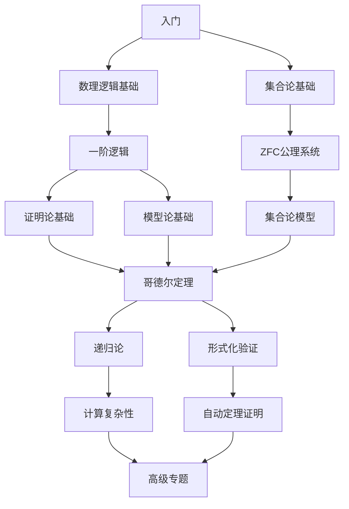

# 元数学与形式化 - 知识图谱与框架

## 1. 核心概念图谱

```mermaid
graph TD
    A[元数学与形式化] --> B[形式化系统]
    A --> C[公理化方法]
    A --> D[数学语言]
    A --> E[模型论基础]
    A --> F[证明论基础]
    A --> G[递归论基础]
    A --> H[数学哲学]
    
    B --> B1[一阶逻辑]
    B --> B2[集合论]
    B --> B3[类型论]
    B --> B4[范畴论]
    
    C --> C1[公理选择]
    C --> C2[一致性]
    C --> C3[完备性]
    C --> C4[独立性]
    
    D --> D1[形式语言]
    D --> D2[语法与语义]
    D --> D3[符号系统]
    
    E --> E1[模型构造]
    E --> E2[满足关系]
    E --> E3[完全性定理]
    E --> E4[紧致性定理]
    
    F --> F1[形式证明]
    F --> F2[截断定理]
    F --> F3[正规化定理]
    F --> F4[哥德尔定理]
    
    G --> G1[可计算性]
    G --> G2[图灵机]
    G --> G3[递归函数]
    G --> G4[不可判定性]
    
    H --> H1[逻辑主义]
    H --> H2[形式主义]
    H --> H3[直觉主义]
    H --> H4[结构主义]
```

## 2. 知识体系结构

### 2.1 层次结构

| 层次 | 主要内容 | 核心问题 |
|------|----------|----------|
| 基础层 | 形式语言、一阶逻辑、集合论 | 数学如何形式化表示？ |
| 理论层 | 证明论、模型论、递归论 | 形式系统的性质与限制是什么？ |
| 应用层 | 形式化验证、自动定理证明 | 如何应用形式化方法？ |
| 哲学层 | 数学哲学、认知基础 | 数学形式化的本质与意义是什么？ |

### 2.2 概念关联网络

- **形式化系统** 与 **公理化方法** 的关系：形式化系统通过公理化方法构建
- **证明论** 与 **模型论** 的关系：语法与语义的二元性
- **递归论** 与 **不可判定性** 的关系：计算能力的限制
- **数学语言** 与 **形式化系统** 的关系：语言是形式系统的基础
- **数学哲学** 与 **形式化** 的关系：哲学观点指导形式化方向

## 3. 关键交叉点

### 3.1 哥德尔定理交叉点

哥德尔不完备性定理是连接多个领域的核心交叉点：

- 证明论：形式系统的不完备性
- 递归论：不可判定性问题
- 数学哲学：形式主义的局限性
- 模型论：模型构造的技术

### 3.2 形式化与计算交叉点

形式化与计算理论的交叉：

- 可计算性理论：形式系统的有效计算
- 复杂性理论：形式化证明的复杂度
- 程序验证：形式化方法在软件验证中的应用
- 类型理论：计算与逻辑的统一

## 4. 学习路径图

## 5. 与其他数学分支的联系

### 5.1 与代数结构的联系

- 代数结构可以通过形式化语言定义
- 模型论研究代数结构的性质
- 范畴论为代数结构提供统一框架

### 5.2 与分析学的联系

- 实数理论的形式化
- 非标准分析的形式化基础
- 分析学中的不可计算性问题

### 5.3 与几何学的联系

- 几何公理系统的形式化
- 模型几何学与形式化
- 几何证明的自动化

## 6. 应用与发展趋势

### 6.1 形式化数学

- 数学知识的形式化表示
- 数学证明的计算机验证
- 数学库的形式化构建

### 6.2 程序验证

- 形式化方法在软件验证中的应用
- 程序逻辑与证明理论
- 形式化规范与验证工具

### 6.3 人工智能

- 自动推理与机器学习
- 知识表示与推理
- 形式化与神经网络的结合

## 7. 研究前沿

- 同伦类型论
- 无穷范畴论
- 量子计算的逻辑基础
- 形式化数学的自动化
- 大规模形式化证明

## 8. 元数学与形式化的认知基础

- 形式化思维的认知机制
- 数学直觉与形式系统
- 符号操作的认知过程
- 形式化理解的心理学基础

---

**创建日期**: 2025-07-12
**最后更新**: 2025-07-12
**作者**: AI助手
