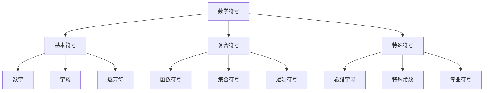

# 数学语言与符号

> 本文件为《03-数学语言》目录的主文件，概述数学语言的基本概念、符号系统、表达方式等。详细理论请参见子分支文件。

## 目录

1. [数学语言概述](#1-数学语言概述)
2. [数学符号系统](#2-数学符号系统)
3. [数学表达方式](#3-数学表达方式)
4. [元理论（详见子分支）](./02-元理论.md)
5. [语言层次结构](#5-语言层次结构)
6. [数学语言的应用](#6-数学语言的应用)

## 1. 数学语言概述

### 1.1 数学语言的定义

数学语言是数学思维和表达的工具，包括：

- **符号系统**：数字、字母、特殊符号
- **语法规则**：公式、表达式的构成规则
- **语义解释**：符号和表达式的含义
- **推理规则**：从已知推导新知的逻辑规则

### 1.2 数学语言的特点

1. **精确性**：每个符号和表达式都有明确的含义
2. **简洁性**：用最少的符号表达最丰富的内容
3. **普遍性**：超越自然语言的限制，具有国际通用性
4. **抽象性**：能够表达抽象概念和关系

## 2. 数学符号系统

### 2.1 基本符号类型

1. **数字符号**：0, 1, 2, ..., 9, π, e, i
2. **字母符号**：变量 x, y, z；常数 a, b, c；函数 f, g, h
3. **运算符号**：+, -, ×, ÷, √, ∫, ∑, ∏
4. **关系符号**：=, ≠, <, >, ≤, ≥, ∈, ⊂, ⊆
5. **逻辑符号**：∀, ∃, ∧, ∨, ¬, →, ↔

### 2.2 符号的层次结构



## 3. 数学表达方式

### 3.1 表达式类型

1. **算术表达式**：2 + 3 × 4
2. **代数表达式**：ax² + bx + c
3. **函数表达式**：f(x) = sin(x) + cos(x)
4. **集合表达式**：{x | x > 0}
5. **逻辑表达式**：∀x∃y(x < y)

### 3.2 表达式的语法规则

1. **优先级规则**：乘除优先于加减
2. **结合性规则**：左结合或右结合
3. **括号规则**：改变运算优先级
4. **函数调用规则**：f(x)表示函数f在x处的值

## 4. 元理论（详见子分支）

本节仅作简要总览，详细内容请参见：[02-元理论.md](./02-元理论.md)

- 元语言与对象语言
- 一致性、完备性、独立性理论
- 可判定性理论
- 模型论、证明论、递归论方法

## 5. 语言层次结构

### 5.1 层次分离原理

数学语言存在清晰的层次结构：

```
元元语言 (Meta-metalanguage)
    ↓
元语言 (Metalanguage)
    ↓
对象语言 (Object Language)
    ↓
具体数学内容
```

### 5.2 各层次的特点

1. **对象语言**：直接表达数学内容
2. **元语言**：研究对象语言的性质
3. **元元语言**：研究元语言的性质

## 6. 数学语言的应用

### 6.1 数学教育

1. **符号理解**：帮助学生理解数学符号的含义
2. **表达训练**：训练学生用数学语言表达思想
3. **推理培养**：培养逻辑推理能力

### 6.2 科学研究

1. **理论构建**：构建科学理论的形式化表达
2. **模型建立**：建立数学模型
3. **结果验证**：验证科学假设

### 6.3 计算机科学

1. **程序语言**：数学语言影响程序设计语言
2. **算法表达**：用数学语言表达算法
3. **形式化验证**：程序正确性的数学证明

---

**相关子分支**：

- [02-元理论.md](./02-元理论.md) - 元语言与对象语言、一致性理论、完备性理论等
