# 模型论基础

## 目录

1. [模型论的定义与本质](#1-模型论的定义与本质)
2. [模型论的基本概念](#2-模型论的基本概念)
3. [模型论的基本定理](#3-模型论的基本定理)
4. [模型构造方法](#4-模型构造方法)
5. [稳定性理论](#5-稳定性理论)
6. [模型论的应用](#6-模型论的应用)
7. [模型论与认知论的联系](#7-模型论与认知论的联系)
8. [应用与展望](#8-应用与展望)

## 1. 模型论的定义与本质

模型论是数理逻辑的一个分支，主要研究形式语言的语义解释以及形式系统与其模型之间的关系。它提供了一种将抽象的语法结构与具体的数学结构联系起来的方法，使我们能够通过研究模型来理解形式系统的性质。

### 1.1 模型论的定义

模型论可以定义为：

> 研究形式语言、形式理论及其解释（模型）之间关系的数学分支，关注的核心问题是语法结构与语义结构之间的对应关系。

### 1.2 模型论的基本问题

模型论主要关注以下基本问题：

1. **存在性问题**：给定一个形式理论，它是否有模型？
2. **分类问题**：一个理论的所有模型可以如何分类？
3. **同构问题**：两个模型在什么条件下同构？
4. **定义性问题**：在模型中，什么样的集合是可定义的？
5. **元定理问题**：关于模型的一般性质（如紧致性、洛文海姆-斯科伦定理等）

### 1.3 模型论在数学中的地位

模型论在数学中占有特殊地位：

- **桥梁作用**：连接语法（形式系统）与语义（数学结构）
- **元数学工具**：研究数学理论本身的性质
- **独立学科**：发展出自身的研究对象和方法
- **应用领域**：为代数、分析、组合学等领域提供强大工具

## 2. 模型论的基本概念

### 2.1 语言与结构

#### 2.1.1 形式语言

形式语言 $L$ 通常包含以下符号：

- **逻辑符号**：连接词（$\wedge$, $\vee$, $\rightarrow$, $\neg$）、量词（$\forall$, $\exists$）、等号（$=$）、变量等
- **非逻辑符号**：
  - 常量符号：$c_1, c_2, ...$
  - 函数符号：$f_1, f_2, ...$（每个带有元数）
  - 关系符号：$R_1, R_2, ...$（每个带有元数）

#### 2.1.2 结构（模型）

$L$-结构（或$L$-模型）$\mathcal{M}$ 是对语言 $L$ 的一个解释，包含：

- **论域**：一个非空集合 $M$（也称为载体）
- **解释函数**：将语言中的非逻辑符号映射到论域上的对象、函数或关系：
  - 每个常量符号 $c$ 映射到 $M$ 中的一个元素 $c^\mathcal{M}$
  - 每个 $n$ 元函数符号 $f$ 映射到 $M$ 上的一个 $n$ 元函数 $f^\mathcal{M}: M^n \rightarrow M$
  - 每个 $n$ 元关系符号 $R$ 映射到 $M$ 上的一个 $n$ 元关系 $R^\mathcal{M} \subseteq M^n$

### 2.2 满足与真值

#### 2.2.1 赋值

赋值 $s$ 是一个函数，将变量映射到模型的论域中的元素。

#### 2.2.2 满足关系

满足关系（记作 $\models$）定义了公式在模型中何时为真：

- $\mathcal{M} \models \phi[s]$ 表示在模型 $\mathcal{M}$ 中，在赋值 $s$ 下，公式 $\phi$ 为真
- 满足关系通过归纳定义：
  - 对于原子公式 $R(t_1,...,t_n)$，当且仅当 $(t_1^\mathcal{M,s},...,t_n^\mathcal{M,s}) \in R^\mathcal{M}$ 时，$\mathcal{M} \models R[t_1,...,t_n](s)$
  - 对于等式 $t_1 = t_2$，当且仅当 $t_1^\mathcal{M,s} = t_2^\mathcal{M,s}$ 时，$\mathcal{M} \models t_1 = t_2[s]$
  - 对于否定 $\neg\phi$，当且仅当 $\mathcal{M} \not\models \phi[s]$ 时，$\mathcal{M} \models \neg\phi[s]$
  - 对于合取 $\phi \wedge \psi$，当且仅当 $\mathcal{M} \models \phi[s]$ 且 $\mathcal{M} \models \psi[s]$ 时，$\mathcal{M} \models \phi \wedge \psi[s]$
  - 对于存在量化 $\exists x \phi$，当且仅当存在 $a \in M$ 使得 $\mathcal{M} \models \phi[s(x/a)]$ 时，$\mathcal{M} \models \exists x \phi[s]$

#### 2.2.3 模型与理论

- **模型**：如果 $\mathcal{M} \models \phi$ 对所有 $\phi \in T$ 成立，则称 $\mathcal{M}$ 是理论 $T$ 的模型，记作 $\mathcal{M} \models T$
- **理论**：一组公式的集合
- **完全理论**：对任何公式 $\phi$，要么 $T \models \phi$，要么 $T \models \neg\phi$
- **一致理论**：不包含矛盾的理论（有模型的理论）

### 2.3 基本模型论概念

#### 2.3.1 初等等价

两个结构 $\mathcal{M}$ 和 $\mathcal{N}$ 称为初等等价（记作 $\mathcal{M} \equiv \mathcal{N}$），如果它们满足完全相同的公式集合。

#### 2.3.2 初等子结构

如果 $\mathcal{M}$ 是 $\mathcal{N}$ 的子结构，且对任何公式 $\phi(x_1,...,x_n)$ 和任何 $a_1,...,a_n \in M$，有 $\mathcal{M} \models \phi[a_1,...,a_n]$ 当且仅当 $\mathcal{N} \models \phi[a_1,...,a_n]$，则称 $\mathcal{M}$ 是 $\mathcal{N}$ 的初等子结构，记作 $\mathcal{M} \prec \mathcal{N}$。

#### 2.3.3 理论的模型类

理论 $T$ 的所有模型构成的类记作 $Mod(T)$。

## 3. 模型论的基本定理

### 3.1 紧致性定理

**紧致性定理**：一阶逻辑的一个基本定理，它断言：

> 一个公式集合 $T$ 有模型，当且仅当 $T$ 的每个有限子集都有模型。

这个定理有多种等价形式，是模型论中最基本的结果之一。

#### 3.1.1 紧致性定理的应用

紧致性定理有广泛的应用：

- **一致性证明**：证明理论的一致性
- **非标准模型构造**：构造如超实数系统等非标准模型
- **不可定义性结果**：证明某些概念在特定理论中不可定义

### 3.2 完备性定理

**完备性定理**：由哥德尔证明的基本定理，它断言：

> 在一阶逻辑中，一个公式 $\phi$ 在所有模型中为真（语义有效），当且仅当 $\phi$ 可以在形式系统中被证明（语法可证）。

形式化表示为：$T \models \phi$ 当且仅当 $T \vdash \phi$。

### 3.3 洛文海姆-斯科伦定理

**洛文海姆-斯科伦定理**包含两部分：

- **向下定理**：如果一个可数语言的理论 $T$ 有无限模型，则 $T$ 有可数无限模型。
- **向上定理**：如果一个理论 $T$ 有无限模型，则对任何基数 $\kappa$，$T$ 都有基数为 $\kappa$ 的模型。

这个定理揭示了一阶逻辑无法区分不同无限基数的局限性。

### 3.4 模型完备性

**模型完备性**：理论 $T$ 称为模型完备的，如果任何两个模型 $\mathcal{M}, \mathcal{N} \models T$ 都是初等等价的。

等价地，$T$ 是模型完备的，当且仅当对任何公式 $\phi$，要么 $T \models \phi$，要么 $T \models \neg\phi$。

## 4. 模型构造方法

### 4.1 初等链

**初等链**是一种构造大模型的方法，通过一系列初等扩张：

$\mathcal{M}_0 \prec \mathcal{M}_1 \prec \mathcal{M}_2 \prec \cdots$

初等链的并 $\mathcal{M} = \bigcup_{i<\omega} \mathcal{M}_i$ 满足 $\mathcal{M}_i \prec \mathcal{M}$ 对所有 $i < \omega$ 成立。

### 4.2 超积

**超积**是一种构造新模型的强大工具：

给定一族结构 $\{\mathcal{M}_i : i \in I\}$ 和 $I$ 上的超滤子 $\mathcal{U}$，可以构造超积 $\prod_{i \in I} \mathcal{M}_i / \mathcal{U}$。

超积保持许多一阶性质，是模型论中的重要构造。

### 4.3 强制法

**强制法**最初由科恩发明用于证明连续统假设的独立性，后来成为模型论的重要工具：

- 通过"条件"（forcing conditions）扩展模型
- 使用"泛型过滤"（generic filter）确保扩展的一致性
- 可用于构造具有特定性质的模型

### 4.4 饱和模型

**饱和模型**是满足特定完备性条件的模型：

模型 $\mathcal{M}$ 称为 $\kappa$-饱和的，如果对任何小于 $\kappa$ 的类型 $p(x)$，只要 $p(x)$ 在 $\mathcal{M}$ 中是一致的，$p(x)$ 就在 $\mathcal{M}$ 中可实现。

饱和模型在模型论中有重要应用，特别是在分类理论中。

## 5. 稳定性理论

### 5.1 稳定性的概念

**稳定性**是模型论中的核心概念，由谢尔平斯基引入：

理论 $T$ 称为稳定的，如果对任何基数 $\kappa$，$T$ 在 $\kappa$ 上有不超过 $\kappa$ 个完全类型。

### 5.2 可数范畴理论

理论 $T$ 称为**可数范畴**的，如果它恰好有一个可数模型（除同构外）。

可数范畴理论的例子包括：

- 代数闭特征零域的理论
- 稠密线性序无端点的理论
- 无限原子布尔代数的理论

### 5.3 分类理论

**分类理论**研究理论的模型数量：

- **全稳定理论**：在所有基数上都是稳定的理论
- **超稳定理论**：满足更强稳定性条件的理论
- **$\omega$-稳定理论**：在可数基数上稳定的理论

谢尔平斯基的工作建立了稳定理论的基础，后来由拉斯卡尔、希尔伯特等人进一步发展。

## 6. 模型论的应用

### 6.1 代数中的应用

#### 6.1.1 代数闭域

代数闭域理论是模型论应用的经典例子：

- **特征为 $p$ 的代数闭域理论**是完全的、模型完备的
- **量词消去**：每个公式等价于无量词公式
- **代数闭域分类**：代数闭域完全由其特征和超越度决定

#### 6.1.2 实闭域

实闭域理论也有重要的模型论性质：

- **塔斯基-赛登伯格定理**：实闭域理论允许量词消去
- **应用**：解决希尔伯特第十七问题（正多项式表示为平方和）

### 6.2 数论中的应用

模型论在数论中有重要应用：

- **阿克塞尔-科恩定理**：使用超积方法证明有限域上的结果
- **非标准分析**：使用超实数系统研究极限和无穷小
- **丢番图几何**：研究整数点和有理点的存在性

### 6.3 组合学中的应用

模型论为组合学提供了强大工具：

- **拉姆齐定理**的模型论证明和推广
- **零一规律**的研究
- **极值组合问题**的模型论方法

### 6.4 计算机科学中的应用

模型论在计算机科学中的应用：

- **有限模型论**：研究有限结构上的逻辑，应用于数据库理论
- **描述复杂性**：使用逻辑刻画计算复杂性类
- **程序验证**：使用模型检验技术验证系统性质

## 7. 模型论与认知论的联系

### 7.1 模型论与认知科学

模型论与认知科学的交叉研究：

1. **认知模型**：
   - 模型论为认知建模提供形式化框架
   - 语义解释对应认知理解过程
   - 模型构造反映认知结构形成

2. **知识表示**：
   - 形式语言作为知识表示工具
   - 模型作为知识的具体实现
   - 满足关系描述知识验证过程

3. **学习理论**：
   - 模型论指导机器学习算法设计
   - 模型更新对应知识更新过程
   - 模型选择反映学习策略

### 7.2 模型论与人工智能

模型论在人工智能中的应用：

1. **知识推理**：
   - 模型论为知识推理提供理论基础
   - 逻辑推理对应模型间的关系
   - 模型检查验证系统性质

2. **语义理解**：
   - 模型论指导自然语言语义理解
   - 形式语义对应语言理解过程
   - 模型构造实现语义解释

3. **智能系统**：
   - 模型论指导智能系统设计
   - 模型更新实现系统学习
   - 模型验证确保系统正确性

### 7.3 模型论与教育

模型论对数学教育的启示：

1. **概念理解**：
   - 模型论强调概念的具体化理解
   - 抽象概念通过具体模型理解
   - 多模型比较深化概念理解

2. **推理训练**：
   - 模型论训练逻辑推理能力
   - 模型构造培养构造性思维
   - 模型验证训练批判性思维

3. **知识建构**：
   - 模型论指导知识建构过程
   - 模型更新反映知识发展
   - 模型选择体现认知策略

## 8. 应用与展望

### 8.1 数学研究应用

1. **代数研究**：
   - 模型论在代数几何中的应用
   - 代数结构的模型论研究
   - 代数理论的一致性证明

2. **分析研究**：
   - 非标准分析的理论基础
   - 分析结构的模型论研究
   - 分析理论的形式化

3. **几何研究**：
   - 几何结构的模型论研究
   - 几何理论的一致性证明
   - 几何概念的精确化

### 8.2 计算机科学应用

1. **程序验证**：
   - 模型论指导程序验证方法
   - 模型检查验证程序性质
   - 形式语义指导程序理解

2. **数据库理论**：
   - 模型论指导数据库设计
   - 查询语言的形式语义
   - 数据库一致性验证

3. **人工智能**：
   - 模型论指导AI系统设计
   - 知识表示的形式化
   - 推理系统的理论基础

### 8.3 未来发展方向

1. **理论发展**：
   - 高阶模型论的发展
   - 范畴论与模型论的结合
   - 计算模型论的新方向

2. **技术应用**：
   - 量子计算中的模型论
   - 生物计算中的模型论
   - 社会计算中的模型论

3. **跨学科融合**：
   - 认知科学与模型论
   - 语言学与模型论
   - 哲学与模型论

## 9. 现代模型论的发展

### 9.1 几何模型论

**几何模型论**是现代模型论的重要分支：

- 研究模型中的几何结构（如维数、独立性等）
- 发展了强小理论、o-极小理论等工具
- 应用于代数几何、数论等领域

### 9.2 连续模型论

**连续模型论**扩展了经典模型论到度量空间和巴拿赫空间：

- 研究连续逻辑和连续结构
- 应用于泛函分析、算子代数等领域
- 发展了连续稳定性理论

### 9.3 新兴方向

模型论的一些新兴研究方向：

- **模型论与同调代数**的联系
- **模型论与数论**的深入交互
- **量子逻辑的模型论**
- **高阶模型论**的发展

## 10. 学习路径与资源

### 10.1 入门学习路径

模型论的学习路径建议：

1. **预备知识**：集合论、一阶逻辑、基本代数结构
2. **基础概念**：语言、结构、满足关系、初等等价
3. **核心定理**：紧致性定理、完备性定理、洛文海姆-斯科伦定理
4. **基本构造**：初等链、超积、饱和模型
5. **特殊理论**：代数闭域、实闭域、离散有序环等

### 10.2 进阶主题

进阶学习可以包括：

1. **稳定性理论**：Morley定理、分类理论
2. **几何模型论**：强小理论、o-极小理论
3. **模型论代数**：模型伴随、代数闭包
4. **无限组合学**：大基数公理、不可区分元素

### 10.3 推荐资源

模型论学习的推荐资源：

- **入门教材**：
  - Chang & Keisler, "Model Theory"
  - Marker, "Model Theory: An Introduction"
  - Hodges, "A Shorter Model Theory"

- **进阶教材**：
  - Shelah, "Classification Theory"
  - Pillay, "Geometric Stability Theory"
  - Tent & Ziegler, "A Course in Model Theory"

- **研究期刊**：
  - Journal of Symbolic Logic
  - Annals of Pure and Applied Logic
  - Archive for Mathematical Logic

## 11. 类型空间与可定义性

### 11.1 类型空间

类型空间（Type Space）是模型论中研究元素可能满足的公式集合的工具。给定一个理论 $T$ 和参数集 $A$，$n$ 元类型是关于 $n$ 个变量的、在 $A$ 上一致的公式的极大集合。

- **类型的实现**：如果某个元素元组在模型中满足类型中的所有公式，则称该类型在该模型中被实现。
- **完全类型**：关于变量 $x$ 的所有可能公式的极大一致集合。
- **类型空间的结构**：类型空间本身可以带有拓扑结构（Stone空间），用于研究模型的紧致性与分解。

### 11.2 可定义性

- **可定义集合**：在模型 $\mathcal{M}$ 中，集合 $D \subseteq M^n$ 称为可定义的，如果存在公式 $\phi(x_1,...,x_n)$，使得 $D = \{ (a_1,...,a_n) \in M^n \mid \mathcal{M} \models \phi[a_1,...,a_n] \}$。
- **可定义类型**：类型 $p(x)$ 称为可定义的，如果存在一个公式族对其进行刻画。
- **可定义性与自动同构**：可定义对象在模型的自同构下保持不变。

### 11.3 极大模型与同构

- **极大模型**：在某些理论下，存在极大模型，即无法再扩大的模型。
- **同构与同质性**：两个模型 $\mathcal{M}, \mathcal{N}$ 称为同构，如果存在双射 $f: M \to N$ 保持所有结构。若模型中任意有限部分的同构可扩展为全体的自同构，则称为同质模型。

## 12. 模型论与哲学基础的联系

模型论不仅是数学逻辑的分支，也与哲学基础密切相关：

- **形式主义**：模型论为形式主义提供了语义基础，强调符号系统与其解释的分离。
- **逻辑主义**：通过模型论分析数学理论的可公理化性与一致性。
- **直觉主义与构造性**：模型论揭示了经典与非经典逻辑的模型差异。
- **结构主义**：模型论强调结构的本质，支持数学对象的结构性理解。
- **真理与可满足性**：模型论为"真理"提供了模型语义解释，区分了语法与语义的层次。
- **元数学视角**：模型论作为元数学工具，研究理论的极限、独立性与不可判定性。

## 13. Mermaid：模型论结构与外部联系

```mermaid
graph TD
  A["模型论 Model Theory"]
  A1["语言与结构"]
  A2["满足关系"]
  A3["基本定理"]
  A4["模型构造方法"]
  A5["稳定性理论"]
  A6["类型空间与可定义性"]
  A7["现代发展"]
  A8["应用领域"]
  A9["哲学基础联系"]

  A --> A1
  A --> A2
  A --> A3
  A --> A4
  A --> A5
  A --> A6
  A --> A7
  A --> A8
  A --> A9

  A3 --> B1["紧致性定理"]
  A3 --> B2["完备性定理"]
  A3 --> B3["洛文海姆-斯科伦定理"]
  A3 --> B4["模型完备性"]

  A4 --> C1["初等链"]
  A4 --> C2["超积"]
  A4 --> C3["强制法"]
  A4 --> C4["饱和模型"]

  A5 --> D1["稳定性"]
  A5 --> D2["可数范畴理论"]
  A5 --> D3["分类理论"]

  A6 --> E1["类型空间"]
  A6 --> E2["可定义性"]
  A6 --> E3["极大模型"]
  A6 --> E4["同构与同质性"]

  A7 --> F1["几何模型论"]
  A7 --> F2["连续模型论"]
  A7 --> F3["新兴方向"]

  A8 --> G1["代数"]
  A8 --> G2["数论"]
  A8 --> G3["组合学"]
  A8 --> G4["计算机科学"]

  A9 --> H1["形式主义"]
  A9 --> H2["逻辑主义"]
  A9 --> H3["直觉主义"]
  A9 --> H4["结构主义"]
  A9 --> H5["真理与可满足性"]
  A9 --> H6["元数学视角"]
```

---

**创建日期**: 2025-07-12
**最后更新**: 2025-07-12
**作者**: AI助手
