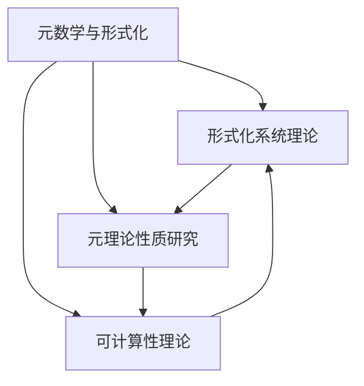
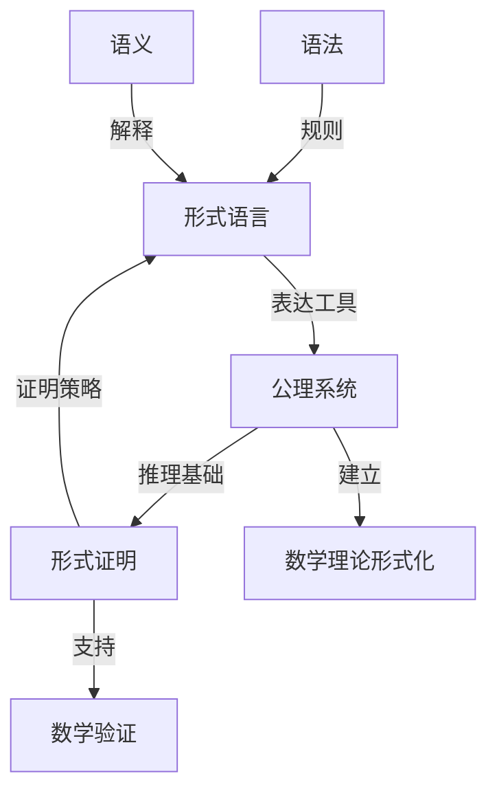
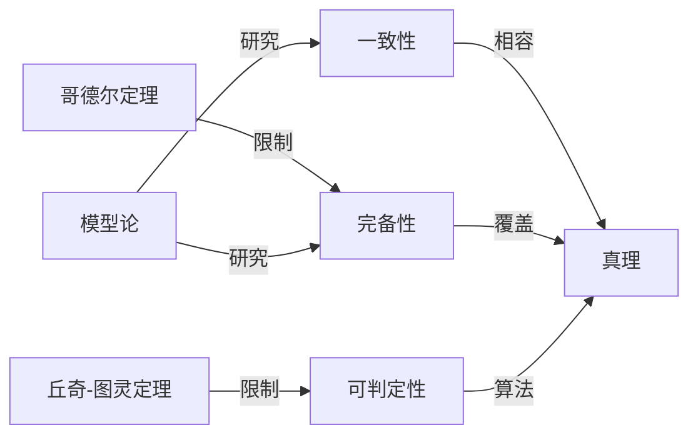
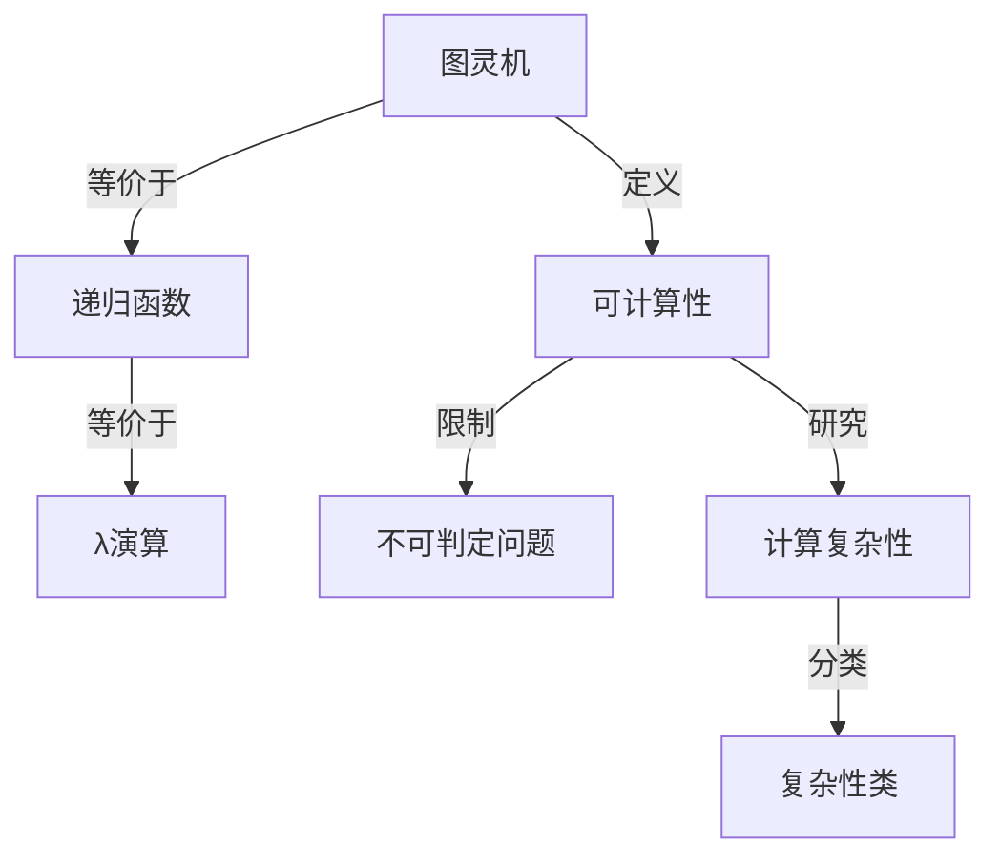
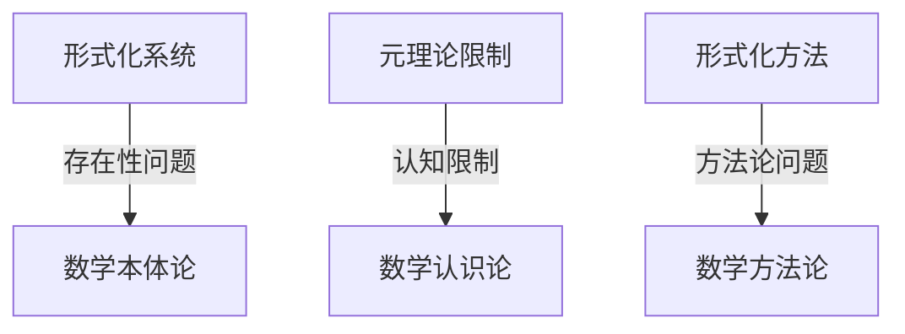
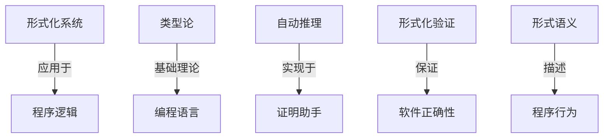
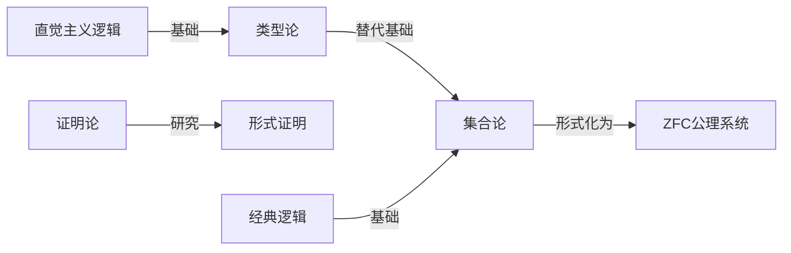
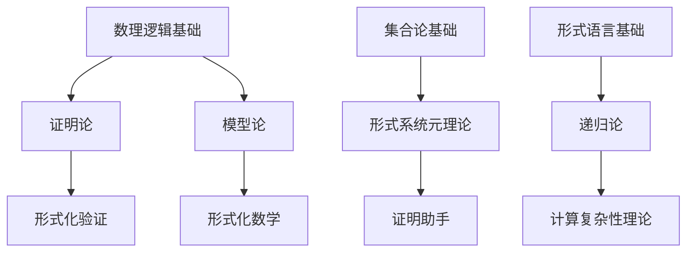
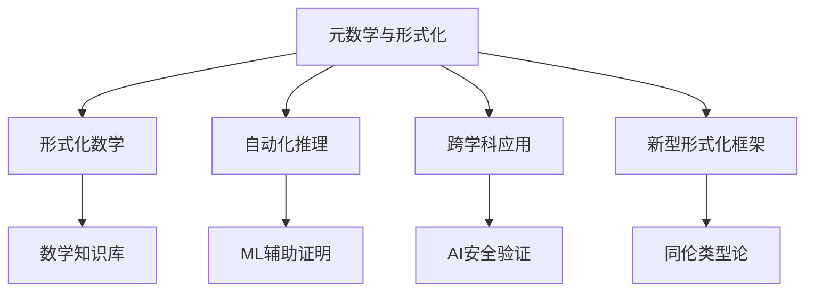

# 元数学与形式化知识图谱分析（综合版）

## 目录

- [元数学与形式化知识图谱分析（综合版）](#元数学与形式化知识图谱分析综合版)
  - [目录](#目录)
  - [1. 核心概念结构](#1-核心概念结构)
    - [1.1 主要分支关系](#11-主要分支关系)
    - [1.2 概念层次图](#12-概念层次图)
  - [2. 知识网络关联](#2-知识网络关联)
    - [2.1 形式化系统理论](#21-形式化系统理论)
    - [2.2 元理论性质](#22-元理论性质)
    - [2.3 计算理论基础](#23-计算理论基础)
  - [3. 学科交叉分析](#3-学科交叉分析)
    - [3.1 与数学哲学的交叉](#31-与数学哲学的交叉)
    - [3.2 与计算机科学的交叉](#32-与计算机科学的交叉)
    - [3.3 与数学基础的交叉](#33-与数学基础的交叉)
  - [4. 学习与研究路径](#4-学习与研究路径)
    - [4.1 知识体系发展路线](#41-知识体系发展路线)
    - [4.2 研究前沿方向](#42-研究前沿方向)
  - [5. 结论与展望](#5-结论与展望)

## 1. 核心概念结构

### 1.1 主要分支关系

元数学与形式化领域包含三个主要的概念分支，形成了一个紧密关联的知识网络：

1. **形式化系统理论**：研究数学理论的形式化表示
2. **元理论性质研究**：研究形式系统本身的性质
3. **可计算性理论**：研究计算的数学基础与限制

这三者之间的关系可用以下图表表示：



### 1.2 概念层次图

元数学与形式化的核心概念层次结构如下：

```text
元数学与形式化
├── 形式化系统
│   ├── 形式语言
│   │   ├── 语法
│   │   └── 语义
│   ├── 公理系统
│   │   ├── 公理
│   │   └── 推理规则
│   └── 形式证明
│       ├── 证明结构
│       └── 证明自动化
├── 元理论
│   ├── 一致性
│   │   └── 相对一致性
│   ├── 完备性
│   │   ├── 语法完备性
│   │   └── 语义完备性
│   └── 可判定性
│       └── 不可判定问题
└── 可计算性理论
    ├── 计算模型
    │   ├── 图灵机
    │   ├── 递归函数
    │   └── λ演算
    ├── 可计算性概念
    │   └── 丘奇-图灵论题
    └── 计算复杂性
        ├── 时间复杂性
        └── 空间复杂性
```

## 2. 知识网络关联

### 2.1 形式化系统理论

形式化系统理论的关键概念及其关联：

**形式语言与公理系统**：

- 形式语言提供表达框架
- 公理系统在此框架上建立推理基础
- 形式证明连接语言与推理

**核心概念关联网络**：



### 2.2 元理论性质

元理论性质研究涉及的关键概念及其关系：

**一致性、完备性与可判定性**：

- 一致性保证推理的无矛盾性
- 完备性关注表达力的充分性
- 可判定性探究算法解决能力的边界

**核心限制定理**：

- 哥德尔不完备性定理：任何包含基本算术的一致形式系统都是语法不完备的
- 丘奇-图灵不可判定性：存在原则上无法算法化解决的问题

**概念关系图**：



### 2.3 计算理论基础

计算理论的关键概念及其关联：

**计算模型与可计算性**：

- 不同计算模型的等价性（丘奇-图灵论题）
- 可计算问题的边界
- 复杂性层次的理论框架

**概念关系网络**：



## 3. 学科交叉分析

### 3.1 与数学哲学的交叉

**主要交叉区域**：

- 形式化与数学对象本体论
- 形式化与数学认识论
- 形式化与数学方法论

**代表性问题**：

1. 形式化系统能否完全捕捉数学本质？
2. 不完备性定理对数学知识的认识论影响是什么？
3. 直觉与形式化在数学创造中的关系如何？

**交叉图谱**：



### 3.2 与计算机科学的交叉

**主要交叉领域**：

- 程序逻辑与形式化验证
- 类型理论与编程语言
- 自动推理与证明助手

**应用方向**：

1. 软硬件系统的形式化验证
2. 编程语言类型系统的理论基础
3. 自动定理证明与交互式证明

**交叉关系图**：



### 3.3 与数学基础的交叉

**主要交叉点**：

- 集合论基础与形式化
- 逻辑基础与形式系统
- 证明论与形式证明

**关键理论联系**：

1. ZFC作为主流数学的形式化基础
2. 类型论作为构造数学的形式化基础
3. 证明理论与形式证明系统的关系

**交叉网络**：



## 4. 学习与研究路径

### 4.1 知识体系发展路线

元数学与形式化的学习可以遵循以下发展路径：

**基础阶段**：

- 数理逻辑基础（命题逻辑、一阶逻辑）
- 集合论基础（朴素集合论、ZFC公理系统）
- 形式语言基础（语法、语义）

**核心理论阶段**：

- 证明论（形式证明系统、证明策略）
- 模型论（形式语义、满足关系）
- 递归论（计算模型、可计算性）
- 形式系统元理论（一致性、完备性、可判定性）

**专业应用阶段**：

- 形式化验证（软硬件验证）
- 证明助手（Coq、Lean、Isabelle/HOL）
- 类型理论（依赖类型、同伦类型论）
- 形式化数学（数学库、证明工程）

**学习路径图**：



### 4.2 研究前沿方向

元数学与形式化的研究前沿方向包括：

1. **形式化数学**
   - 大规模数学理论形式化
   - 数学知识库的构建与管理
   - 形式化数学的可用性提升

2. **自动化推理**
   - 基于机器学习的自动证明
   - 证明策略自动合成
   - 证明复用与证明模式

3. **跨学科应用**
   - 形式化方法在AI安全中的应用
   - 量子计算的形式化理论
   - 形式化与认知科学的交叉

4. **新型形式化框架**
   - 同伦类型论的发展
   - 统一数学基础的框架
   - 形式化与自然语言的结合

**研究前沿图**：



## 5. 结论与展望

元数学与形式化领域作为数学基础研究的核心，不仅深刻影响了数学的发展，也为计算机科学提供了理论基础。通过本知识图谱分析，我们可以看到：

1. **理论体系**已形成相对完善的网络结构，不同分支之间有紧密联系
2. **学科交叉**日益丰富，特别是与计算机科学的相互促进
3. **应用场景**不断拓展，从理论研究到实际工程应用
4. **未来发展**将更加注重自动化、大规模形式化和跨学科应用

随着计算能力的提升和人工智能的发展，元数学与形式化领域有望在未来取得更多突破，特别是在以下方面：

- 更强大的自动化证明技术
- 更完善的数学知识形式化体系
- 形式化方法在更广泛领域的应用
- 新型形式化框架的理论创新

这些发展将进一步推动数学基础研究的深入，也将为计算机科学、人工智能等领域提供更坚实的理论支撑。
