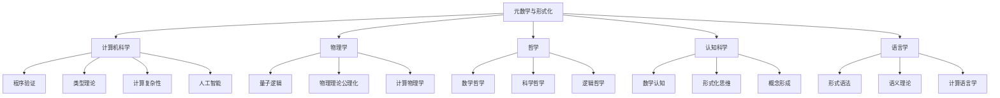

# 元数学与形式化 - 综合知识图谱（更新版）

## 目录

- [1. 知识图谱总览](#1-知识图谱总览)
- [2. 哲学与元数学基础的深入联系](#2-哲学与元数学基础的深入联系)
- [3. 元数学与其他数学分支的具体联系](#3-元数学与其他数学分支的具体联系)
- [4. 跨学科联系图谱](#4-跨学科联系图谱)
- [5. 核心概念关联网络](#5-核心概念关联网络)
- [6. 理论体系分析](#6-理论体系分析)
- [7. 概念关联网络](#7-概念关联网络)
- [8. 交叉关联分析](#8-交叉关联分析)
- [9. 知识体系发展路径](#9-知识体系发展路径)
- [10. 应用领域关联](#10-应用领域关联)

## 1. 知识图谱总览

```mermaid
graph TD
    A[元数学与形式化] --> B[形式化系统]
    A --> C[公理化方法]
    A --> D[数学语言]
    A --> E[模型论]
    A --> F[证明论]
    A --> G[递归论]
    A --> H[数学哲学]
    
    %% 与其他数学分支的联系
    A --- M1[代数结构与理论]
    A --- M2[微积分与分析]
    A --- M3[几何与拓扑]
    A --- M4[数论与离散数学]
    A --- M5[概率统计与随机过程]
    A --- M6[跨学科应用]
    A --- M7[哲学与元数学基础]
    
    %% 哲学与元数学基础的详细联系
    M7 --- PH1[数学哲学流派]
    M7 --- PH2[数学认知论]
    M7 --- PH3[数学本体论]
    M7 --- PH4[形式化与元结构]
    M7 --- PH5[批判性分析]
    M7 --- PH6[数学美学]
    
    %% 数学哲学流派细分
    PH1 --- PH1_1[逻辑主义]
    PH1 --- PH1_2[形式主义]
    PH1 --- PH1_3[直觉主义]
    PH1 --- PH1_4[结构主义]
    
    %% 形式化与元结构细分
    PH4 --- PH4_1[形式化验证]
    PH4 --- PH4_2[形式化推理]
    PH4 --- PH4_3[元理论与理论]
    
    %% 代数结构与理论的联系
    M1 --- AB1[形式化代数系统]
    M1 --- AB2[代数结构的公理化]
    M1 --- AB3[范畴论与元数学]
    
    %% 微积分与分析的联系
    M2 --- CA1[实数理论的形式化]
    M2 --- CA2[分析学中的不可计算性]
    M2 --- CA3[非标准分析的形式化基础]
    
    %% 几何与拓扑的联系
    M3 --- GT1[几何公理系统]
    M3 --- GT2[拓扑空间的公理化]
    M3 --- GT3[同伦类型论与几何]
    
    %% 数论与离散数学的联系
    M4 --- NT1[数论中的不可判定性]
    M4 --- NT2[图论的形式化]
    M4 --- NT3[组合数学与证明复杂性]
    
    %% 概率统计的联系
    M5 --- PS1[概率论公理化]
    M5 --- PS2[统计推断的形式化]
    M5 --- PS3[随机性的逻辑基础]
    
    %% 跨学科应用的联系
    M6 --- AP1[计算机科学中的形式化方法]
    M6 --- AP2[物理学中的公理化]
    M6 --- AP3[AI与形式化推理]
```

## 2. 哲学与元数学基础的深入联系

### 2.1 数学哲学与元数学的交互

数学哲学与元数学之间存在深刻的双向影响关系：

- **哲学观点对形式化的影响**：
  - 逻辑主义促进了形式逻辑系统的发展
  - 形式主义催生了公理化方法和元数学研究
  - 直觉主义导致了构造性数学和直觉主义逻辑
  - 结构主义推动了范畴论作为基础的研究

- **形式化结果对哲学的影响**：
  - 哥德尔不完备性定理对形式主义的挑战
  - 集合论悖论对逻辑主义的限制
  - 计算复杂性理论对数学实践的影响
  - 形式化验证对数学确定性概念的深化

### 2.2 认知维度与形式化

数学认知与形式化系统的关系：

- **抽象思维过程**：
  - 从具体到抽象的认知阶梯
  - 形式符号的心理表征
  - 规则应用的认知机制

- **直觉与形式的张力**：
  - 数学直觉的本质与来源
  - 直觉与形式系统的互补关系
  - 创造性思维与形式验证的结合

- **概念形成与演化**：
  - 数学概念的认知基础
  - 概念框架的历史演变
  - 形式化对概念理解的影响

### 2.3 批判性分析框架

对数学基础的批判性思考：

- **基础危机的反思**：
  - 第一次基础危机：微积分的严格化
  - 第二次基础危机：集合论悖论
  - 第三次基础危机：不完备性定理

- **数学确定性的批判**：
  - 证明的社会构建性
  - 数学真理的本质问题
  - 形式系统的局限性

- **多元视角的整合**：
  - 不同形式化系统的比较
  - 数学实践与形式理想的差距
  - 跨文化数学观念的比较

### 2.4 数学美学与形式化

数学美学与形式化的关系：

- **形式美的标准**：
  - 简洁性与对称性
  - 统一性与普遍性
  - 意外联系的惊奇

- **证明美学**：
  - 优雅证明的特征
  - 形式化与证明风格
  - 计算机证明的美学挑战

- **形式系统的审美价值**：
  - 形式系统设计的美学原则
  - 符号系统的视觉美学
  - 形式化与创造性的关系

## 3. 元数学与其他数学分支的具体联系

### 3.1 元数学与代数结构的联系

#### 3.1.1 形式化视角下的代数结构

代数结构（如群、环、域）可以通过形式化语言精确定义，这种定义方式揭示了代数结构的本质特征：

- **公理化表示**：群的结合律、单位元、逆元等性质通过公理表达
- **模型论视角**：研究满足特定代数公理的所有结构
- **证明论应用**：代数结构中定理的形式化证明

#### 3.1.2 范畴论作为桥梁

范畴论在元数学与代数结构之间扮演关键角色：

- **抽象统一**：通过函子、自然变换等概念统一不同代数结构
- **形式化基础**：为数学提供替代集合论的基础
- **高阶抽象**：通过高阶范畴捕捉数学结构间的深层关系

### 3.2 元数学与微积分分析的联系

#### 3.2.1 实数理论的形式化

实数系统的形式化是分析学基础的关键：

- **公理化方法**：戴德金分割、柯西序列等方法的形式化
- **完备性公理**：实数完备性的形式化表达
- **非标准分析**：使用超实数的严格形式化

#### 3.2.2 分析中的不可计算性问题

分析学中存在本质的不可计算性：

- **不可计算实数**：存在无法通过算法计算的实数
- **微分方程的可解性**：某些微分方程解的不可计算性
- **递归论视角**：分析学中的可计算性边界

### 3.3 元数学与几何拓扑的联系

#### 3.3.1 几何的公理化历程

几何学是最早系统使用公理化方法的领域：

- **欧几里得几何**：经典公理系统及其局限
- **非欧几何**：不同公理系统导致的不同几何
- **形式化验证**：几何定理的计算机辅助证明

#### 3.3.2 拓扑学的形式化基础

拓扑学概念的形式化：

- **开集公理**：拓扑空间的公理化定义
- **同伦论**：同伦概念的形式化表达
- **同伦类型论**：统一逻辑与拓扑的形式系统

## 4. 跨学科联系图谱

## 5. 核心概念关联网络

### 5.1 形式化系统与数学分支的关联

| 数学分支 | 形式化系统 | 关键公理系统 | 主要应用 |
|---------|----------|------------|---------|
| 代数结构 | 一阶逻辑 | 群论、环论、域论公理 | 抽象代数、代数几何 |
| 微积分分析 | 实数理论 | ZFC+完备性公理 | 分析学、微分方程 |
| 几何拓扑 | 几何公理系统 | 欧几里得公理、拓扑公理 | 几何学、拓扑学 |
| 数论 | 皮亚诺算术 | PA、ZFC | 数论、密码学 |
| 概率统计 | 测度论 | 科尔莫哥洛夫公理 | 统计推断、随机过程 |

### 5.2 元理论性质与数学分支

| 元理论性质 | 代数结构 | 微积分分析 | 几何拓扑 | 数论 | 概率统计 |
|----------|---------|----------|---------|-----|---------|
| 一致性 | 模型构造 | 实数模型 | 几何模型 | 算术模型 | 概率空间 |
| 完备性 | 群的完备性 | 实数完备性 | 拓扑完备性 | 算术完备性 | 概率完备性 |
| 可判定性 | 群判定性 | 连续性判定 | 拓扑判定 | 算术判定 | 随机性判定 |

## 6. 理论体系分析

### 6.1 形式化系统理论

- 形式语言：语法、语义、符号系统
- 公理系统：公理、推理规则、定理
- 形式证明：证明结构、证明策略、证明自动化

### 6.2 元理论性质

- 一致性：相对一致性、绝对一致性
- 完备性：语法完备性、语义完备性
- 可判定性：可判定理论、半可判定理论、不可判定问题

### 6.3 计算理论基础

- 计算模型：图灵机、递归函数、λ演算
- 可计算性概念：可计算函数、丘奇-图灵论题、不可计算问题
- 计算复杂性：时间复杂性、空间复杂性、复杂性层次

## 7. 概念关联网络

- 形式语言 ↔ 语法规则 ↔ 表达式
- 公理 ↔ 推理规则 ↔ 定理
- 形式证明 ↔ 证明验证 ↔ 证明助手
- 一致性 ↔ 可靠性 ↔ 保守性
- 完备性 ↔ 表达力 ↔ 不完备性定理
- 可判定性 ↔ 可计算性 ↔ 停机问题
- 图灵机 ↔ 算法 ↔ 有效计算
- 递归函数 ↔ 原始递归函数 ↔ μ递归函数
- 计算复杂性 ↔ 时间资源 ↔ 空间资源

## 8. 交叉关联分析

### 8.1 与数学哲学的交叉

- 形式化与数学本体论
- 完备性与数学真理
- 不完备性定理与数学认识论

### 8.2 与数学基础的交叉

- 形式化系统与集合论
- 类型论与函数主义
- 构造主义与证明理论

## 9. 知识体系发展路径

- 学习路径图
- 研究前沿方向

## 10. 应用领域关联

- 形式化验证
- 证明助手
- 人工智能

---

**创建日期**: 2025-07-12
**最后更新**: 2025-07-12
**作者**: AI助手
