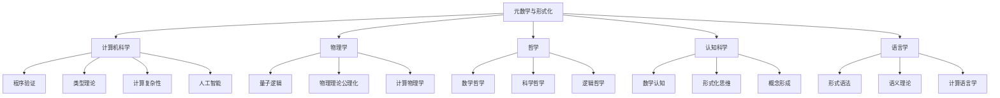
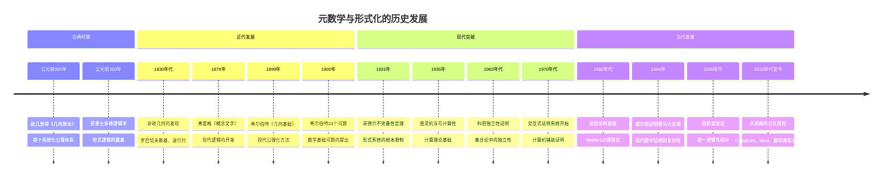
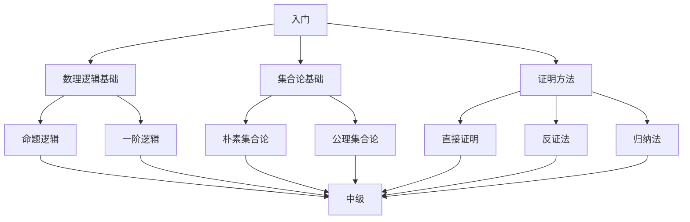
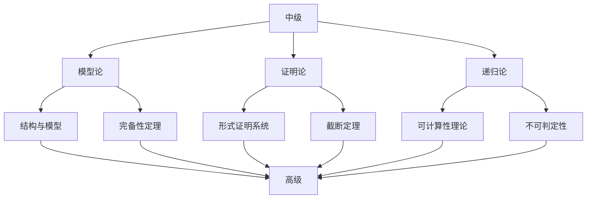
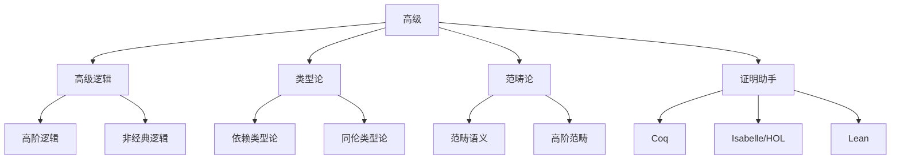

# 元数学与形式化 - 综合知识图谱

## 1. 知识图谱总览

```mermaid
graph TD
    A[元数学与形式化] --> B[形式化系统]
    A --> C[公理化方法]
    A --> D[数学语言]
    A --> E[模型论]
    A --> F[证明论]
    A --> G[递归论]
    A --> H[数学哲学]
    
    %% 与其他数学分支的联系
    A --- M1[代数结构与理论]
    A --- M2[微积分与分析]
    A --- M3[几何与拓扑]
    A --- M4[数论与离散数学]
    A --- M5[概率统计与随机过程]
    A --- M6[跨学科应用]
    A --- M7[哲学与元数学基础]
    
    %% 代数结构与理论的联系
    M1 --- AB1[形式化代数系统]
    M1 --- AB2[代数结构的公理化]
    M1 --- AB3[范畴论与元数学]
    
    %% 微积分与分析的联系
    M2 --- CA1[实数理论的形式化]
    M2 --- CA2[分析学中的不可计算性]
    M2 --- CA3[非标准分析的形式化基础]
    
    %% 几何与拓扑的联系
    M3 --- GT1[几何公理系统]
    M3 --- GT2[拓扑空间的公理化]
    M3 --- GT3[同伦类型论与几何]
    
    %% 数论与离散数学的联系
    M4 --- NT1[数论中的不可判定性]
    M4 --- NT2[图论的形式化]
    M4 --- NT3[组合数学与证明复杂性]
    
    %% 概率统计的联系
    M5 --- PS1[概率论公理化]
    M5 --- PS2[统计推断的形式化]
    M5 --- PS3[随机性的逻辑基础]
    
    %% 跨学科应用的联系
    M6 --- AP1[计算机科学中的形式化方法]
    M6 --- AP2[物理学中的公理化]
    M6 --- AP3[AI与形式化推理]
    
    %% 哲学与元数学基础的联系
    M7 --- PH1[数学哲学流派]
    M7 --- PH2[数学认知论]
    M7 --- PH3[数学本体论]
```

## 2. 元数学与其他数学分支的具体联系

### 2.1 元数学与代数结构的联系

#### 2.1.1 形式化视角下的代数结构

代数结构（如群、环、域）可以通过形式化语言精确定义，这种定义方式揭示了代数结构的本质特征：

- **公理化表示**：群的结合律、单位元、逆元等性质通过公理表达
- **模型论视角**：研究满足特定代数公理的所有结构
- **证明论应用**：代数结构中定理的形式化证明

#### 2.1.2 范畴论作为桥梁

范畴论在元数学与代数结构之间扮演关键角色：

- **抽象统一**：通过函子、自然变换等概念统一不同代数结构
- **形式化基础**：为数学提供替代集合论的基础
- **高阶抽象**：通过高阶范畴捕捉数学结构间的深层关系

### 2.2 元数学与微积分分析的联系

#### 2.2.1 实数理论的形式化

实数系统的形式化是分析学基础的关键：

- **公理化方法**：戴德金分割、柯西序列等方法的形式化
- **完备性公理**：实数完备性的形式化表达
- **非标准分析**：使用超实数的严格形式化

#### 2.2.2 分析中的不可计算性问题

分析学中存在本质的不可计算性：

- **不可计算实数**：存在无法通过算法计算的实数
- **微分方程的可解性**：某些微分方程解的不可计算性
- **递归论视角**：分析学中的可计算性边界

### 2.3 元数学与几何拓扑的联系

#### 2.3.1 几何的公理化历程

几何学是最早系统使用公理化方法的领域：

- **欧几里得几何**：经典公理系统及其局限
- **非欧几何**：不同公理系统导致的不同几何
- **形式化验证**：几何定理的计算机辅助证明

#### 2.3.2 拓扑学的形式化基础

拓扑学概念的形式化：

- **开集公理**：拓扑空间的公理化定义
- **同伦论**：同伦概念的形式化表达
- **同伦类型论**：统一逻辑与拓扑的形式系统

### 2.4 元数学与数论离散数学的联系

#### 2.4.1 数论中的不可判定性

数论与递归论的深刻联系：

- **希尔伯特第十问题**：丢番图方程的不可判定性
- **哥德尔编码**：使用数论实现元数学
- **不可判定命题**：数论中的独立命题

#### 2.4.2 离散结构的形式化

离散数学结构的形式化：

- **图论公理**：图的形式化定义与性质
- **组合对象**：排列、组合的形式化表示
- **离散优化**：形式化方法在算法设计中的应用

### 2.5 元数学与概率统计的联系

#### 2.5.1 概率论的公理化

概率论通过公理化获得严格基础：

- **科尔莫哥洛夫公理**：概率的公理化定义
- **测度论基础**：概率的测度论解释
- **随机性定义**：随机性的形式化表征

#### 2.5.2 统计推断的形式化

统计学中的形式化方法：

- **贝叶斯统计**：条件概率的形式化应用
- **统计假设检验**：决策理论的形式化
- **信息论联系**：熵与形式化复杂性

## 3. 跨学科联系图谱

## 4. 核心概念关联网络

### 4.1 形式化系统与数学分支的关联

| 数学分支 | 形式化系统 | 关键公理系统 | 主要应用 |
|---------|----------|------------|---------|
| 代数结构 | 一阶逻辑 | 群论、环论、域论公理 | 抽象代数、代数几何 |
| 微积分分析 | 实数理论 | ZFC+完备性公理 | 分析学、微分方程 |
| 几何拓扑 | 几何公理系统 | 欧几里得公理、拓扑公理 | 几何学、拓扑学 |
| 数论 | 皮亚诺算术 | PA、ZFC | 数论、密码学 |
| 概率统计 | 测度论 | 科尔莫哥洛夫公理 | 统计推断、随机过程 |

### 4.2 元理论性质与数学分支

| 元理论性质 | 代数结构 | 微积分分析 | 几何拓扑 | 数论 | 概率统计 |
|----------|---------|----------|---------|-----|---------|
| 一致性 | 模型构造 | 实数模型 | 几何模型 | 算术模型 | 概率空间 |
| 完备性 | 一阶理论完备性 | 实数公理完备性 | 拓扑公理完备性 | 算术不完备性 | 概率公理完备性 |
| 可判定性 | 特殊代数理论可判定 | 实数理论不可判定 | 特定几何理论可判定 | 算术不可判定 | 特定概率问题可判定 |

## 5. 历史发展脉络

## 6. 学习路径与知识地图

### 6.1 基础层次学习路径

### 6.2 进阶层次学习路径

### 6.3 高级层次学习路径

## 7. 研究前沿与发展趋势

### 7.1 当前研究热点

- **同伦类型论**：统一逻辑、计算与拓扑的新框架
- **形式化数学库**：大规模数学知识的形式化
- **自动化定理证明**：结合机器学习的智能证明系统
- **量子计算的逻辑基础**：量子逻辑与量子计算模型
- **复杂系统的形式化**：生物系统、社会系统的形式化方法

### 7.2 未来发展方向

- **形式化与人工智能的结合**：AI辅助的形式化证明
- **大规模形式化验证**：关键系统的端到端验证
- **数学教育中的形式化工具**：辅助数学学习与理解
- **跨学科形式化应用**：更广泛学科中的形式化方法
- **形式化的认知基础**：理解人类如何进行形式化思维

## 8. 元数学与形式化的认知维度

### 8.1 形式化思维的认知过程

- **抽象化**：从具体到抽象的认知过程
- **符号操作**：符号系统的心理表征
- **形式规则应用**：规则遵循的认知机制
- **直觉与形式化**：数学直觉与形式系统的关系

### 8.2 数学认知的形式化模型

- **概念形成**：数学概念的认知表征
- **类比推理**：数学思维中的类比机制
- **错误模式**：形式化推理中的认知偏差
- **专家思维**：数学专家的认知策略

---

**创建日期**: 2025-07-12
**最后更新**: 2025-07-12
**作者**: AI助手
