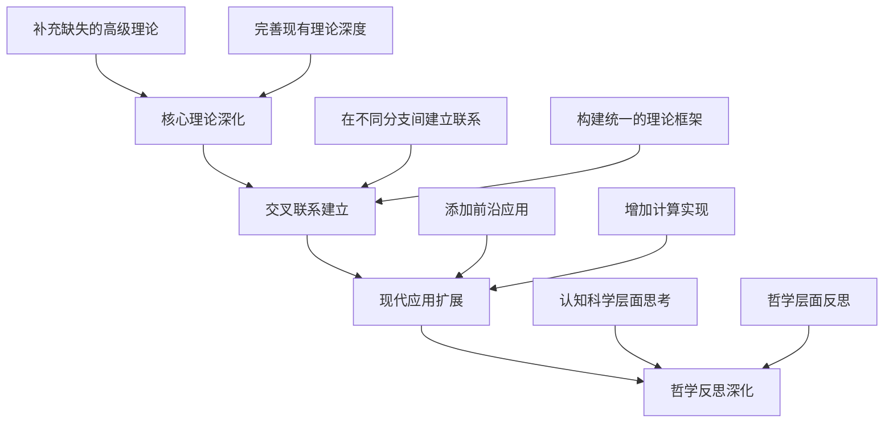

# 第二阶段深度广度扩展计划

---

title: "第二阶段深度广度扩展计划"
version: "1.0"
date: "2025-01-27"
status: "规划阶段"

---

## 📋 目录导航

- [返回项目总览](../00-项目总览.md)
- [第一阶段完成报告](../03-Reports_and_Analysis/2025-07-04_阶段性成果综合报告.md)
- [知识图谱分析](../05-Knowledge_Graphs_and_Mappings/01-知识图谱分析.md)

---

## 1. 当前状态分析

### 1.1 已完成的基础架构

✅ **已完成的核心模块**：

- **数学哲学与元数学**：三大主义、形式化方法、公理系统
- **数学基础与逻辑**：集合论、数理逻辑、证明论、模型论、递归论、范畴论
- **代数结构与理论**：基本代数系统、群论、环论、域论、模论、格论、线性代数、范畴论、代数认知结构
- **分析学基础**：实数与极限、一元微分学、一元积分学、级数理论、多元微积分、测度论与勒贝格积分、泛函分析
- **几何学与拓扑学**：欧几里得几何、一般拓扑学、微分几何、代数几何
- **概率论与统计学**：概率论基础、随机变量与分布、数理统计、随机过程
- **数论与离散数学**：初等数论、代数数论、图论、组合数学
- **跨学科应用**：数学与物理、计算科学、经济金融、工程

### 1.2 深度广度不足的领域

❌ **需要深度扩展的领域**：

#### 1.2.1 高级代数理论

- **表示论**：当前仅2个文件，缺乏李代数、李群表示、特征标理论
- **李代数**：完全缺失
- **代数几何**：基础内容不足，缺乏概形理论、上同调理论
- **同调代数**：完全缺失
- **K理论**：完全缺失

#### 1.2.2 现代分析学

- **调和分析**：完全缺失
- **复分析**：完全缺失
- **偏微分方程**：完全缺失
- **分布理论**：完全缺失
- **小波分析**：完全缺失

#### 1.2.3 拓扑学与几何学

- **代数拓扑**：完全缺失
- **微分拓扑**：完全缺失
- **黎曼几何**：基础内容不足
- **辛几何**：完全缺失
- **几何群论**：完全缺失

#### 1.2.4 现代数论

- **解析数论**：完全缺失
- **模形式**：完全缺失
- **椭圆曲线**：完全缺失
- **L函数理论**：完全缺失

#### 1.2.5 概率论与统计学

- **随机过程**：基础内容不足
- **贝叶斯统计**：完全缺失
- **机器学习数学基础**：完全缺失
- **随机分析**：完全缺失

#### 1.2.6 应用数学

- **数值分析**：完全缺失
- **优化理论**：完全缺失
- **控制论**：完全缺失
- **信息论**：完全缺失

## 2. 扩展策略

### 2.1 递归迭代深化方法

采用**"四层递进、交叉融合"**的扩展策略：



### 2.2 优先级排序

#### 第一优先级：核心理论深化

1. **高级代数理论**（表示论、李代数、同调代数）
2. **现代分析学**（调和分析、复分析、偏微分方程）
3. **拓扑学与几何学**（代数拓扑、微分拓扑、黎曼几何）

#### 第二优先级：交叉联系建立

1. **代数几何与数论的联系**
2. **分析与几何的融合**
3. **代数与拓扑的统一**

#### 第三优先级：现代应用扩展

1. **概率论与统计学的现代发展**
2. **应用数学的数值方法**
3. **计算数学的实现**

#### 第四优先级：哲学反思深化

1. **认知科学与数学思维**
2. **数学哲学与现代发展**
3. **人工智能与数学基础**

## 3. 详细扩展计划

### 3.1 高级代数理论扩展

#### 3.1.1 表示论深化

```text
10-表示论/
├── 00-表示论总览.md ✅
├── 01-表示论基础：群表示.md ✅
├── 02-特征标理论.md ❌
├── 03-不可约表示.md ❌
├── 04-诱导表示.md ❌
├── 05-李群表示论.md ❌
├── 06-李代数表示论.md ❌
├── 07-代数群表示.md ❌
└── 08-表示论应用.md ❌
```

#### 3.1.2 李代数理论

```text
11-李代数/
├── 00-李代数总览.md ❌
├── 01-李代数的定义与性质.md ❌
├── 02-半单李代数.md ❌
├── 03-根系与权系.md ❌
├── 04-李代数的表示.md ❌
├── 05-李群与李代数.md ❌
├── 06-例外李代数.md ❌
└── 07-李代数应用.md ❌
```

#### 3.1.3 同调代数

```text
12-同调代数/
├── 00-同调代数总览.md ❌
├── 01-链复形与同调.md ❌
├── 02-导出函子.md ❌
├── 03-Ext与Tor.md ❌
├── 04-谱序列.md ❌
├── 05-同调维数.md ❌
└── 06-同调代数应用.md ❌
```

### 3.2 现代分析学扩展

#### 3.2.1 调和分析

```text
08-调和分析/
├── 00-调和分析总览.md ❌
├── 01-傅里叶变换.md ❌
├── 02-卷积与卷积算子.md ❌
├── 03-奇异积分算子.md ❌
├── 04-小波分析.md ❌
├── 05-时频分析.md ❌
└── 06-调和分析应用.md ❌
```

#### 3.2.2 复分析

```text
09-复分析/
├── 00-复分析总览.md ❌
├── 01-复变函数基础.md ❌
├── 02-柯西积分定理.md ❌
├── 03-留数理论.md ❌
├── 04-共形映射.md ❌
├── 05-黎曼曲面.md ❌
└── 06-复分析应用.md ❌
```

#### 3.2.3 偏微分方程

```text
10-偏微分方程/
├── 00-偏微分方程总览.md ❌
├── 01-一阶偏微分方程.md ❌
├── 02-二阶线性方程.md ❌
├── 03-椭圆型方程.md ❌
├── 04-抛物型方程.md ❌
├── 05-双曲型方程.md ❌
└── 06-非线性偏微分方程.md ❌
```

### 3.3 拓扑学与几何学扩展

#### 3.3.1 代数拓扑

```text
05-代数拓扑/
├── 00-代数拓扑总览.md ❌
├── 01-基本群.md ❌
├── 02-同伦论.md ❌
├── 03-奇异同调.md ❌
├── 04-上同调.md ❌
├── 05-纤维丛.md ❌
└── 06-代数拓扑应用.md ❌
```

#### 3.3.2 微分拓扑

```text
06-微分拓扑/
├── 00-微分拓扑总览.md ❌
├── 01-流形基础.md ❌
├── 02-切丛与向量场.md ❌
├── 03-微分形式.md ❌
├── 04-德拉姆上同调.md ❌
├── 05-示性类.md ❌
└── 06-微分拓扑应用.md ❌
```

#### 3.3.3 黎曼几何深化

```text
07-黎曼几何/
├── 00-黎曼几何总览.md ❌
├── 01-黎曼度量.md ❌
├── 02-测地线.md ❌
├── 03-曲率.md ❌
├── 04-比较几何.md ❌
├── 05-黎曼几何应用.md ❌
└── 06-几何分析.md ❌
```

### 3.4 现代数论扩展

#### 3.4.1 解析数论

```text
05-解析数论/
├── 00-解析数论总览.md ❌
├── 01-狄利克雷级数.md ❌
├── 02-素数分布.md ❌
├── 03-L函数.md ❌
├── 04-模形式.md ❌
├── 05-椭圆曲线.md ❌
└── 06-解析数论应用.md ❌
```

### 3.5 概率论与统计学扩展

#### 3.5.1 随机过程深化

```text
05-随机过程/
├── 00-随机过程总览.md ✅
├── 01-随机过程的基本概念.md ✅
├── 02-泊松过程.md ✅
├── 03-马尔可夫过程.md ❌
├── 04-布朗运动.md ❌
├── 05-随机微分方程.md ❌
└── 06-随机过程应用.md ❌
```

#### 3.5.2 贝叶斯统计

```text
06-贝叶斯统计/
├── 00-贝叶斯统计总览.md ❌
├── 01-贝叶斯推断.md ❌
├── 02-先验分布.md ❌
├── 03-后验分布.md ❌
├── 04-贝叶斯计算.md ❌
└── 05-贝叶斯统计应用.md ❌
```

### 3.6 应用数学扩展

#### 3.6.1 数值分析

```text
09-数值分析/
├── 00-数值分析总览.md ❌
├── 01-数值线性代数.md ❌
├── 02-数值积分.md ❌
├── 03-数值微分方程.md ❌
├── 04-插值与逼近.md ❌
├── 05-最优化算法.md ❌
└── 06-数值分析应用.md ❌
```

#### 3.6.2 优化理论

```text
10-优化理论/
├── 00-优化理论总览.md ❌
├── 01-凸优化.md ❌
├── 02-线性规划.md ❌
├── 03-非线性规划.md ❌
├── 04-动态规划.md ❌
├── 05-变分法.md ❌
└── 06-优化理论应用.md ❌
```

## 4. 实施时间表

### 4.1 第一阶段（2025年1-3月）：核心理论深化

- **第1个月**：高级代数理论（表示论、李代数）
- **第2个月**：现代分析学（调和分析、复分析）
- **第3个月**：拓扑学与几何学（代数拓扑、微分拓扑）

### 4.2 第二阶段（2025年4-6月）：交叉联系建立

- **第4个月**：代数几何与数论的联系
- **第5个月**：分析与几何的融合
- **第6个月**：代数与拓扑的统一

### 4.3 第三阶段（2025年7-9月）：现代应用扩展

- **第7个月**：概率论与统计学的现代发展
- **第8个月**：应用数学的数值方法
- **第9个月**：计算数学的实现

### 4.4 第四阶段（2025年10-12月）：哲学反思深化

- **第10个月**：认知科学与数学思维
- **第11个月**：数学哲学与现代发展
- **第12个月**：人工智能与数学基础

## 5. 质量保证机制

### 5.1 内容质量标准

- **理论完整性**：每个模块必须包含完整的理论基础
- **历史发展脉络**：体现理论的历史演进过程
- **应用实例**：提供具体的应用案例
- **交叉联系**：建立与其他分支的联系
- **哲学反思**：包含认知和哲学层面的思考

### 5.2 进度跟踪机制

- **周度检查**：每周检查完成进度
- **月度评估**：每月评估内容质量
- **季度总结**：每季度进行阶段性总结
- **年度报告**：年底进行全年总结

### 5.3 反馈改进机制

- **内容审查**：定期审查内容质量
- **结构优化**：根据反馈优化目录结构
- **深度调整**：根据需求调整内容深度
- **广度扩展**：根据发展需要扩展广度

## 6. 预期成果

### 6.1 理论成果

- **完整的现代数学知识体系**：涵盖从基础到前沿的完整理论
- **统一的数学思维框架**：建立跨分支的统一理解
- **深度的哲学反思**：提供认知和哲学层面的思考

### 6.2 应用成果

- **实用的数学工具**：为各领域提供数学支持
- **计算实现**：提供具体的算法和程序
- **教学资源**：为数学教育提供优质资源

### 6.3 创新成果

- **新的理论联系**：发现不同分支间的深层联系
- **认知模型**：建立数学思维的认知模型
- **哲学框架**：构建数学哲学的现代框架

## 7. 风险评估与应对

### 7.1 主要风险

- **内容过于复杂**：可能导致理解困难
- **进度延迟**：可能影响整体计划
- **质量不均**：不同模块质量差异较大
- **缺乏应用**：理论脱离实际应用

### 7.2 应对策略

- **分层递进**：采用分层递进的学习路径
- **灵活调整**：根据实际情况灵活调整计划
- **质量监控**：建立严格的质量监控机制
- **应用导向**：始终关注实际应用需求

---

**总结**：第二阶段深度广度扩展计划是一个系统性的、长期的项目，需要采用科学的方法和严谨的态度来实施。通过这个计划，我们将建立一个更加完整、深入、实用的现代数学知识体系，为数学教育和科学研究提供强有力的支持。

[返回项目总览](../00-项目总览.md)
