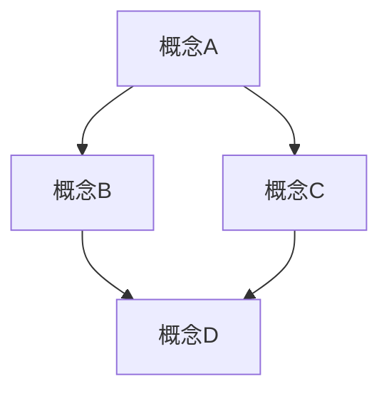

# 00-标准文档模板：数学知识体系文档规范

## 📋 本地目录导航

- [01-项目风格指南](./01-项目风格指南.md)
- [04-文档模板](./04-文档模板.md)
- [项目总览](../00-项目总览.md)
- [数学知识体系总框架](../01-Plans_and_Roadmaps/00-数学知识体系总框架.md)
- [重构行动计划](../01-Plans_and_Roadmaps/01-重构行动计划.md)

## 🧠 本地知识图谱

- **模板标准**: [项目风格指南](./01-项目风格指南.md)
- **文档模板**: [文档模板](./04-文档模板.md)
- **项目总览**: [项目总览](../00-项目总览.md)
- **知识框架**: [数学知识体系总框架](../01-Plans_and_Roadmaps/00-数学知识体系总框架.md)
- **重构计划**: [重构行动计划](../01-Plans_and_Roadmaps/01-重构行动计划.md)
- **进度跟踪**: [进度跟踪](../02-Progress_and_Logs/01-进度跟踪.md)
- **分析报告**: [全面分析报告](../03-Reports_and_Analysis/00-数学知识体系全面分析报告.md)
- **知识图谱**: [知识图谱分析](../05-Knowledge_Graphs_and_Mappings/01-知识图谱分析.md)

---

# [文档标题]

## 本地目录

- [00-标准文档模板：数学知识体系文档规范](#00-标准文档模板数学知识体系文档规范)
  - [📋 本地目录导航](#-本地目录导航)
  - [🧠 本地知识图谱](#-本地知识图谱)
- [\[文档标题\]](#文档标题)
  - [本地目录](#本地目录)
  - [1. 概述](#1-概述)
    - [1.1 基本定义](#11-基本定义)
    - [1.2 历史背景](#12-历史背景)
    - [1.3 核心思想](#13-核心思想)
  - [2. 理论基础](#2-理论基础)
    - [2.1 公理系统](#21-公理系统)
    - [2.2 基本定理](#22-基本定理)
    - [2.3 形式化表示](#23-形式化表示)
  - [3. 结构分析](#3-结构分析)
    - [3.1 内部结构](#31-内部结构)
    - [3.2 关系网络](#32-关系网络)
    - [3.3 性质特征](#33-性质特征)
  - [4. 证明方法](#4-证明方法)
    - [4.1 直接证明](#41-直接证明)
    - [4.2 反证法](#42-反证法)
    - [4.3 归纳证明](#43-归纳证明)
  - [5. 应用与扩展](#5-应用与扩展)
    - [5.1 理论应用](#51-理论应用)
    - [5.2 跨学科联系](#52-跨学科联系)
    - [5.3 开放问题](#53-开放问题)
  - [6. 参考资料](#6-参考资料)
  - [本地知识图谱](#本地知识图谱)
    - [相关文件](#相关文件)
      - [模板与标准](#模板与标准)
      - [项目总览与规划](#项目总览与规划)
      - [进度跟踪与日志](#进度跟踪与日志)
      - [报告与分析](#报告与分析)
      - [知识图谱与映射](#知识图谱与映射)
    - [相关分支](#相关分支)
      - [数学哲学与元数学](#数学哲学与元数学)
      - [数学基础与逻辑](#数学基础与逻辑)
      - [代数结构与理论](#代数结构与理论)
      - [分析学](#分析学)
      - [几何学与拓扑学](#几何学与拓扑学)
      - [概率论与统计学](#概率论与统计学)
      - [数论与离散数学](#数论与离散数学)
      - [跨学科应用与联系](#跨学科应用与联系)

## 1. 概述

### 1.1 基本定义

[在此处提供基本定义，使用严格的数学语言]

**定义 1.1.1** ([概念名称])：[形式化定义]

**定义 1.1.2** ([概念名称])：[形式化定义]

### 1.2 历史背景

[在此处简要介绍历史背景，包括概念的起源和发展]

### 1.3 核心思想

[在此处阐述核心思想，使用清晰的语言和适当的形式化表示]

## 2. 理论基础

### 2.1 公理系统

[在此处列出相关的公理系统]

**公理 2.1.1** ([公理名称])：[公理内容]

**公理 2.1.2** ([公理名称])：[公理内容]

### 2.2 基本定理

[在此处列出基本定理]

**定理 2.2.1** ([定理名称])：[定理内容]

**证明**：
[提供严格的数学证明]

### 2.3 形式化表示

[在此处提供形式化表示，可以使用数学符号、图表或代码]

```lean
-- Lean证明助手代码示例
theorem example_theorem : ∀ n : ℕ, n + 0 = n :=
begin
  intro n,
  rw add_zero,
end
```

## 3. 结构分析

### 3.1 内部结构

[在此处分析内部结构，可以使用图表]



### 3.2 关系网络

[在此处描述与其他概念的关系网络]

### 3.3 性质特征

[在此处列出主要性质和特征]

**性质 3.3.1** ([性质名称])：[性质描述]

**证明**：
[提供证明或参考]

## 4. 证明方法

### 4.1 直接证明

[在此处提供直接证明的示例]

### 4.2 反证法

[在此处提供反证法的示例]

### 4.3 归纳证明

[在此处提供归纳证明的示例]

## 5. 应用与扩展

### 5.1 理论应用

[在此处描述理论应用]

### 5.2 跨学科联系

[在此处描述与其他学科的联系]

### 5.3 开放问题

[在此处列出相关的开放问题]

## 6. 参考资料

1. [作者]. ([年份]). [标题]. [期刊/出版社], [卷(期)], [页码].
2. [作者]. ([年份]). [标题]. [期刊/出版社], [卷(期)], [页码].

---

**创建日期**: [日期]
**最后更新**: [日期]
**文档版本**: [版本号]
**相关文件**:

- [相关文件链接1](相对路径)
- [相关文件链接2](相对路径)

## 本地知识图谱

### 相关文件

#### 模板与标准

- [01-项目风格指南.md](./01-项目风格指南.md) - 项目风格指南
- [04-文档模板.md](./04-文档模板.md) - 文档模板

#### 项目总览与规划

- [../00-项目总览.md](../00-项目总览.md) - 数学知识体系重构总览
- [../01-Plans_and_Roadmaps/00-数学知识体系总框架.md](../01-Plans_and_Roadmaps/00-数学知识体系总框架.md) - 数学知识体系的完整层次结构
- [../01-Plans_and_Roadmaps/00-重构项目总览.md](../01-Plans_and_Roadmaps/00-重构项目总览.md) - 重构项目的总体规划
- [../01-Plans_and_Roadmaps/01-重构行动计划.md](../01-Plans_and_Roadmaps/01-重构行动计划.md) - 具体的重构行动计划

#### 进度跟踪与日志

- [../02-Progress_and_Logs/00-持续上下文跟踪.md](../02-Progress_and_Logs/00-持续上下文跟踪.md) - 项目持续上下文跟踪
- [../02-Progress_and_Logs/01-进度跟踪.md](../02-Progress_and_Logs/01-进度跟踪.md) - 详细进度跟踪
- [../02-Progress_and_Logs/02-今日工作进度.md](../02-Progress_and_Logs/02-今日工作进度.md) - 今日工作进度记录

#### 报告与分析

- [../03-Reports_and_Analysis/00-数学知识体系全面分析报告.md](../03-Reports_and_Analysis/00-数学知识体系全面分析报告.md) - 数学知识体系全面分析
- [../03-Reports_and_Analysis/2025-07-02_项目批判性综合评价.md](../03-Reports_and_Analysis/2025-07-02_项目批判性综合评价.md) - 项目批判性综合评价
- [../03-Reports_and_Analysis/2025-07-04_阶段性成果综合报告.md](../03-Reports_and_Analysis/2025-07-04_阶段性成果综合报告.md) - 阶段性成果综合报告

#### 知识图谱与映射

- [../05-Knowledge_Graphs_and_Mappings/01-知识图谱分析.md](../05-Knowledge_Graphs_and_Mappings/01-知识图谱分析.md) - 知识图谱分析
- [../05-Knowledge_Graphs_and_Mappings/02-知识图谱.md](../05-Knowledge_Graphs_and_Mappings/02-知识图谱.md) - 知识图谱
- [../05-Knowledge_Graphs_and_Mappings/数学知识体系映射.md](../05-Knowledge_Graphs_and_Mappings/数学知识体系映射.md) - 数学知识体系映射

### 相关分支

#### 数学哲学与元数学

- [../../01-数学哲学-元数学与形式化/00-数学哲学与元数学总览.md](../../01-数学哲学-元数学与形式化/00-数学哲学与元数学总览.md) - 数学哲学与元数学总览
- [../../01-数学哲学-元数学与形式化/01-数学哲学的三大主义.md](../../01-数学哲学-元数学与形式化/01-数学哲学的三大主义.md) - 数学哲学的三大主义
- [../../01-数学哲学-元数学与形式化/02-形式化方法与公理系统.md](../../01-数学哲学-元数学与形式化/02-形式化方法与公理系统.md) - 形式化方法与公理系统

#### 数学基础与逻辑

- [../../02-数学基础与逻辑/00-数学基础与逻辑总览.md](../../02-数学基础与逻辑/00-数学基础与逻辑总览.md) - 数学基础与逻辑总览
- [../../02-数学基础与逻辑/01-集合论/00-集合论总览.md](../../02-数学基础与逻辑/01-集合论/00-集合论总览.md) - 集合论总览
- [../../02-数学基础与逻辑/02-数理逻辑/00-数理逻辑总览.md](../../02-数学基础与逻辑/02-数理逻辑/00-数理逻辑总览.md) - 数理逻辑总览

#### 代数结构与理论

- [../../03-代数结构与理论/00-代数结构与理论总览.md](../../03-代数结构与理论/00-代数结构与理论总览.md) - 代数结构与理论总览
- [../../03-代数结构与理论/01-基本代数系统/00-模块总览.md](../../03-代数结构与理论/01-基本代数系统/00-模块总览.md) - 基本代数系统总览
- [../../03-代数结构与理论/02-群论/00-群论总览.md](../../03-代数结构与理论/02-群论/00-群论总览.md) - 群论总览

#### 分析学

- [../../04-分析学/00-分析学总览.md](../../04-分析学/00-分析学总览.md) - 分析学总览
- [../../04-分析学/01-实数与极限/00-模块总览.md](../../04-分析学/01-实数与极限/00-模块总览.md) - 实数与极限总览
- [../../04-分析学/02-一元微分学/00-模块总览.md](../../04-分析学/02-一元微分学/00-模块总览.md) - 一元微分学总览

#### 几何学与拓扑学

- [../../05-几何学与拓扑学/00-几何学与拓扑学总览.md](../../05-几何学与拓扑学/00-几何学与拓扑学总览.md) - 几何学与拓扑学总览
- [../../05-几何学与拓扑学/01-欧几里得几何/00-模块总览.md](../../05-几何学与拓扑学/01-欧几里得几何/00-模块总览.md) - 欧几里得几何总览
- [../../05-几何学与拓扑学/02-一般拓扑学/00-模块总览.md](../../05-几何学与拓扑学/02-一般拓扑学/00-模块总览.md) - 一般拓扑学总览

#### 概率论与统计学

- [../../06-概率论与统计学/00-06-概率论与统计学总览.md](../../06-概率论与统计学/00-06-概率论与统计学总览.md) - 概率论与统计学总览
- [../../06-概率论与统计学/01-概率论基础/00-模块总览.md](../../06-概率论与统计学/01-概率论基础/00-模块总览.md) - 概率论基础总览
- [../../06-概率论与统计学/02-随机变量与分布/00-模块总览.md](../../06-概率论与统计学/02-随机变量与分布/00-模块总览.md) - 随机变量与分布总览

#### 数论与离散数学

- [../../07-数论与离散数学/00-章节总览.md](../../07-数论与离散数学/00-章节总览.md) - 数论与离散数学总览
- [../../07-数论与离散数学/01-初等数论/00-模块总览.md](../../07-数论与离散数学/01-初等数论/00-模块总览.md) - 初等数论总览
- [../../07-数论与离散数学/02-代数数论/00-模块总览.md](../../07-数论与离散数学/02-代数数论/00-模块总览.md) - 代数数论总览

#### 跨学科应用与联系

- [../../08-跨学科应用与联系/00-08-跨学科应用与联系总览.md](../../08-跨学科应用与联系/00-08-跨学科应用与联系总览.md) - 跨学科应用与联系总览
- [../../08-跨学科应用与联系/01-数学与物理/01-优雅的共生：对称、群论与规范场论.md](../../08-跨学科应用与联系/01-数学与物理/01-优雅的共生：对称、群论与规范场论.md) - 数学与物理
- [../../08-跨学科应用与联系/02-数学与计算科学/01-算法的心脏：从图论、数论到计算复杂性.md](../../08-跨学科应用与联系/02-数学与计算科学/01-算法的心脏：从图论、数论到计算复杂性.md) - 数学与计算科学
