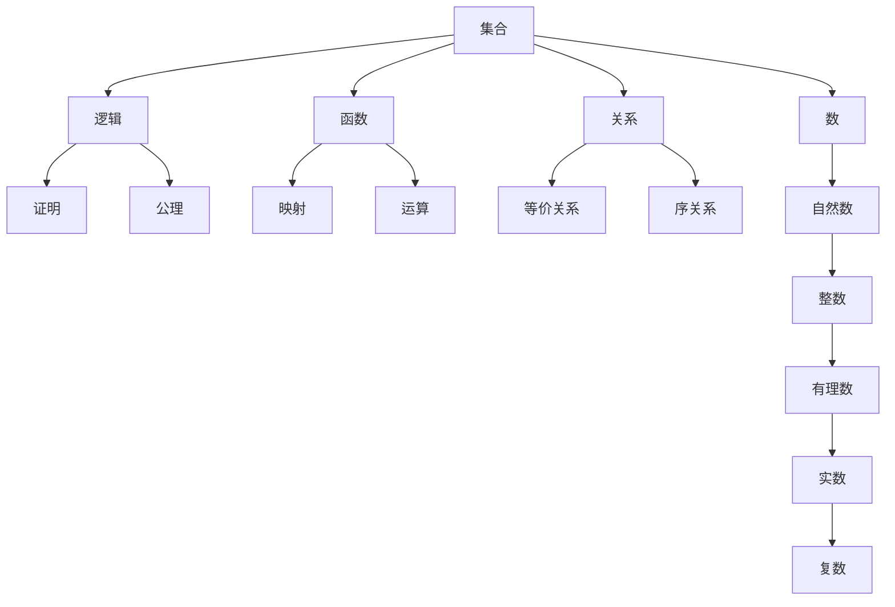
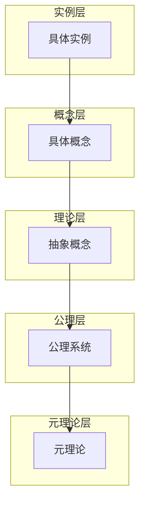
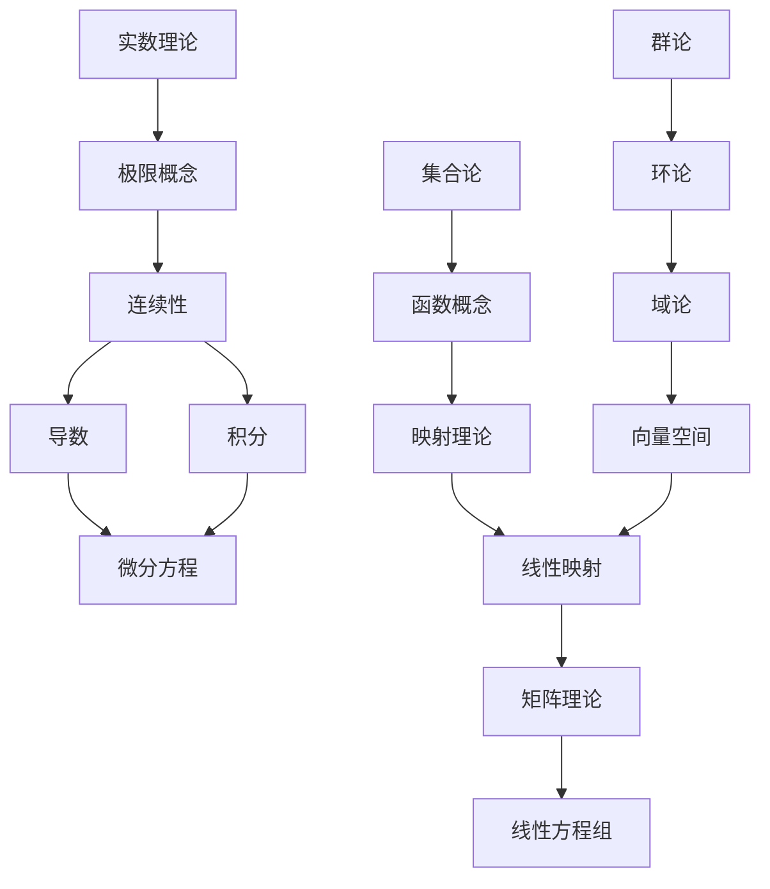
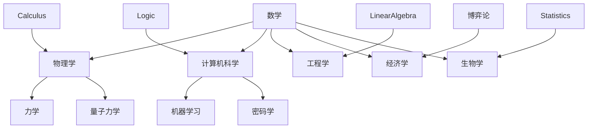

# 00-知识图谱分析：数学知识体系网络结构

## 📋 本地目录导航

- [02-知识图谱](./02-知识图谱.md)
- [数学知识体系映射](./数学知识体系映射.md)
- [项目总览](../00-项目总览.md)
- [数学知识体系总框架](../01-Plans_and_Roadmaps/00-数学知识体系总框架.md)
- [重构行动计划](../01-Plans_and_Roadmaps/01-重构行动计划.md)

## 🧠 本地知识图谱

- **知识图谱**: [知识图谱](./02-知识图谱.md)
- **体系映射**: [数学知识体系映射](./数学知识体系映射.md)
- **项目总览**: [项目总览](../00-项目总览.md)
- **知识框架**: [数学知识体系总框架](../01-Plans_and_Roadmaps/00-数学知识体系总框架.md)
- **重构计划**: [重构行动计划](../01-Plans_and_Roadmaps/01-重构行动计划.md)
- **进度跟踪**: [进度跟踪](../02-Progress_and_Logs/01-进度跟踪.md)
- **分析报告**: [全面分析报告](../03-Reports_and_Analysis/00-数学知识体系全面分析报告.md)
- **标准模板**: [标准文档模板](../04-Templates_and_Standards/00-标准文档模板.md)

---

## 本地目录

- [00-知识图谱分析：数学知识体系网络结构](#00-知识图谱分析数学知识体系网络结构)
  - [📋 本地目录导航](#-本地目录导航)
  - [🧠 本地知识图谱](#-本地知识图谱)
  - [本地目录](#本地目录)
  - [1. 知识图谱概述](#1-知识图谱概述)
  - [2. 核心概念与关系](#2-核心概念与关系)
    - [2.1 基础概念关联网络](#21-基础概念关联网络)
    - [2.2 概念-定理关系网络](#22-概念-定理关系网络)
  - [3. 数学分支关联图](#3-数学分支关联图)
  - [4. 层次结构分析](#4-层次结构分析)
    - [4.1 概念层次结构](#41-概念层次结构)
    - [4.2 抽象程度层次](#42-抽象程度层次)
  - [5. 知识传递路径](#5-知识传递路径)
    - [5.1 经典学习路径](#51-经典学习路径)
    - [5.2 概念依赖图](#52-概念依赖图)
  - [6. 跨学科联系](#6-跨学科联系)
    - [6.1 数学与其他学科的关联](#61-数学与其他学科的关联)
    - [6.2 数学内部跨领域联系](#62-数学内部跨领域联系)
  - [7. 应用与实现](#7-应用与实现)
    - [7.1 本地引用系统](#71-本地引用系统)
    - [7.2 可视化与导航](#72-可视化与导航)
    - [7.3 后续开发计划](#73-后续开发计划)
  - [本地知识图谱](#本地知识图谱)
    - [相关文件](#相关文件)
      - [知识图谱与映射](#知识图谱与映射)
      - [项目总览与规划](#项目总览与规划)
      - [进度跟踪与日志](#进度跟踪与日志)
      - [报告与分析](#报告与分析)
      - [模板与标准](#模板与标准)
    - [相关分支](#相关分支)
      - [数学哲学与元数学](#数学哲学与元数学)
      - [数学基础与逻辑](#数学基础与逻辑)
      - [代数结构与理论](#代数结构与理论)
      - [分析学](#分析学)
      - [几何学与拓扑学](#几何学与拓扑学)
      - [概率论与统计学](#概率论与统计学)
      - [数论与离散数学](#数论与离散数学)
      - [跨学科应用与联系](#跨学科应用与联系)

## 1. 知识图谱概述

数学知识体系是一个由概念、定理、方法和思想构成的复杂网络。本知识图谱旨在通过可视化和结构化的方式，展现这一网络的整体结构和内部联系，帮助理解数学知识的组织方式和学习路径。

知识图谱的核心目标包括：

- 展示数学核心概念间的依赖与关联关系
- 明确各数学分支的边界与交叉点
- 揭示数学知识的自然层次结构
- 构建清晰的学习路径和知识传递链

## 2. 核心概念与关系

### 2.1 基础概念关联网络

### 2.2 概念-定理关系网络

数学的概念与定理构成了一个紧密关联的网络，概念是数学的基本元素，而定理则展示了这些概念之间的深层关系。

核心概念与关键定理的关联包括：

| 概念领域 | 核心概念 | 关键定理/结果 | 关联概念 |
|---------|---------|--------------|---------|
| 集合论 | 集合、子集、映射 | Cantor定理、ZFC公理系统 | 基数、序数、选择公理 |
| 数理逻辑 | 命题、谓词、量词 | 完备性定理、紧致性定理 | 形式系统、可判定性 |
| 代数 | 群、环、域 | 拉格朗日定理、伽罗瓦理论 | 同构、同态、商结构 |
| 分析 | 极限、连续性、导数 | 中值定理、泰勒定理 | 收敛性、完备性、紧致性 |
| 几何 | 点、线、面、变换 | 欧几里得公理、庞加莱猜想 | 度量、曲率、同胚 |
| 拓扑 | 开集、闭集、紧集 | 布拉维尔不动点定理、连通性 | 连续映射、同胚、基本群 |
| 概率 | 样本空间、概率测度 | 大数定律、中心极限定理 | 随机变量、期望、方差 |

## 3. 数学分支关联图

数学各主要分支之间的关联可以通过下图表示：

```mermaid
graph TD
    classDef foundation fill:#f9d5e5,stroke:#333,stroke-width:1px;
    classDef structure fill:#eeac99,stroke:#333,stroke-width:1px;
    classDef analysis fill:#e06377,stroke:#333,stroke-width:1px;
    classDef geometry fill:#c83349,stroke:#333,stroke-width:1px;
    classDef applied fill:#5b9aa0,stroke:#333,stroke-width:1px;
    classDef meta fill:#d6e1c7,stroke:#333,stroke-width:1px;
    
    Foundation[数学基础与逻辑] --> SetTheory[集合论]
    Foundation --> Logic[数理逻辑]
    Foundation --> ProofTheory[证明论]
    
    Algebra[代数结构与理论] --> GroupTheory[群论]
    Algebra --> RingTheory[环论]
    Algebra --> FieldTheory[域论]
    Algebra --> LinearAlgebra[线性代数]
    Algebra --> CategoryTheory[范畴论]
    
    Analysis[微积分与分析] --> RealAnalysis[实分析]
    Analysis --> ComplexAnalysis[复分析]
    Analysis --> FunctionalAnalysis[泛函分析]
    Analysis --> DifferentialEquations[微分方程]
    
    Geometry[几何与拓扑] --> EuclideanGeometry[欧几里得几何]
    Geometry --> DifferentialGeometry[微分几何]
    Geometry --> Topology[拓扑学]
    Geometry --> AlgebraicGeometry[代数几何]
    
    DiscreteMath[数论与离散数学] --> NumberTheory[数论]
    DiscreteMath --> GraphTheory[图论]
    DiscreteMath --> Combinatorics[组合数学]
    
    ProbStats[概率统计与随机过程] --> Probability[概率论]
    ProbStats --> Statistics[统计学]
    ProbStats --> StochasticProcess[随机过程]
    
    Applications[跨学科应用与联系] --> MathPhysics[数学物理]
    Applications --> Computation[计算数学]
    Applications --> FinancialMath[金融数学]
    
    Meta[元数学与形式化] --> ModelTheory[模型论]
    Meta --> ComputabilityTheory[可计算性理论]
    Meta --> FormalizationSystems[形式化系统]
    
    Philosophy[哲学与元数学基础] --> MathPhilosophy[数学哲学]
    Philosophy --> Epistemology[数学认识论]
    Philosophy --> Ontology[数学本体论]
    Philosophy --> Methodology[数学方法论]
    
    SetTheory --> GroupTheory
    SetTheory --> Topology
    Logic --> ProofTheory
    Logic --> ModelTheory
    ProofTheory --> FormalizationSystems
    
    GroupTheory --> RingTheory
    GroupTheory --> LinearAlgebra
    RingTheory --> FieldTheory
    LinearAlgebra --> FunctionalAnalysis
    LinearAlgebra --> DifferentialGeometry
    
    RealAnalysis --> ComplexAnalysis
    RealAnalysis --> FunctionalAnalysis
    RealAnalysis --> DifferentialEquations
    
    Topology --> DifferentialGeometry
    Topology --> AlgebraicGeometry
    
    NumberTheory --> Algebra
    NumberTheory --> Cryptography[密码学]
    
    Probability --> Statistics
    Probability --> StochasticProcess
    
    CategoryTheory --> AlgebraicGeometry
    CategoryTheory --> Topology
    CategoryTheory --> FormalizationSystems
    
    class Foundation,SetTheory,Logic,ProofTheory foundation;
    class Algebra,GroupTheory,RingTheory,FieldTheory,LinearAlgebra,CategoryTheory structure;
    class Analysis,RealAnalysis,ComplexAnalysis,FunctionalAnalysis,DifferentialEquations analysis;
    class Geometry,EuclideanGeometry,DifferentialGeometry,Topology,AlgebraicGeometry geometry;
    class DiscreteMath,NumberTheory,GraphTheory,Combinatorics,ProbStats,Probability,Statistics,StochasticProcess applied;
    class Meta,ModelTheory,ComputabilityTheory,FormalizationSystems,Philosophy,MathPhilosophy,Epistemology,Ontology,Methodology meta;
```

## 4. 层次结构分析

### 4.1 概念层次结构

数学知识体系可以从不同层次进行分析，由基本到高级：

1. **基础概念层**：集合、逻辑、数
2. **基本结构层**：群、环、域、向量空间
3. **理论框架层**：代数系统、分析系统、几何系统
4. **综合应用层**：跨数学分支的应用理论

### 4.2 抽象程度层次

从抽象程度角度看数学知识体系：

## 5. 知识传递路径

### 5.1 经典学习路径

从基础到高级的经典数学学习路径：

1. **入门基础**：集合论 → 基础逻辑 → 数系理论 → 基础代数与几何
2. **核心理论**：线性代数 → 微积分 → 初等数论 → 概率统计
3. **高级专题**：实分析 → 抽象代数 → 拓扑学 → 复分析 → 泛函分析
4. **专业方向**：（根据具体兴趣选择）代数几何/微分几何/代数拓扑/数学物理等

### 5.2 概念依赖图

以下图表展示了核心数学概念的依赖关系，箭头表示"依赖于"：

## 6. 跨学科联系

### 6.1 数学与其他学科的关联

数学与其他学科的关联可以通过下图表示：

### 6.2 数学内部跨领域联系

数学内部不同领域之间的重要联系：

| 联系主题 | 相关领域 | 桥接概念/理论 |
|---------|---------|--------------|
| 代数几何 | 代数 + 几何 | 代数簇、理想理论、椭圆曲线 |
| 代数拓扑 | 代数 + 拓扑 | 同调群、基本群、上同调 |
| 微分几何 | 微积分 + 几何 | 微分形式、度量张量、联络 |
| 调和分析 | 复分析 + 实分析 | 傅里叶级数、傅里叶变换 |
| 动力系统 | 微分方程 + 拓扑 | 相空间、稳定性、混沌 |
| 概率测度论 | 概率论 + 测度论 | 测度空间、可测函数、勒贝格积分 |

## 7. 应用与实现

### 7.1 本地引用系统

知识图谱将通过本地引用系统实现：

- 使用Markdown的相对链接指向相关概念
- 在总览文档中提供概念索引和链接地图
- 在每个概念文档中提供相关概念链接

### 7.2 可视化与导航

本知识图谱通过以下方式提升导航体验：

- Mermaid图表的动态可视化
- 层级式目录结构
- 概念关系表格
- 清晰的学习路径指引

### 7.3 后续开发计划

- [ ] 完善各数学分支的详细知识图谱
- [ ] 开发交互式知识导航工具
- [ ] 添加核心概念的详细关系描述
- [ ] 构建形式化的概念依赖图
- [ ] 集成代码实现和形式化证明的示例

---

**更新日期**: 2025-07-01  
**状态**: 持续完善中  
**相关文件**: [00-数学知识体系重构总览.md](./00-数学知识体系重构总览.md), [02-进度跟踪.md](./02-进度跟踪.md)

## 本地知识图谱

### 相关文件

#### 知识图谱与映射

- [02-知识图谱.md](./02-知识图谱.md) - 知识图谱
- [数学知识体系映射.md](./数学知识体系映射.md) - 数学知识体系映射

#### 项目总览与规划

- [../00-项目总览.md](../00-项目总览.md) - 数学知识体系重构总览
- [../01-Plans_and_Roadmaps/00-数学知识体系总框架.md](../01-Plans_and_Roadmaps/00-数学知识体系总框架.md) - 数学知识体系的完整层次结构
- [../01-Plans_and_Roadmaps/00-重构项目总览.md](../01-Plans_and_Roadmaps/00-重构项目总览.md) - 重构项目的总体规划
- [../01-Plans_and_Roadmaps/01-重构行动计划.md](../01-Plans_and_Roadmaps/01-重构行动计划.md) - 具体的重构行动计划

#### 进度跟踪与日志

- [../02-Progress_and_Logs/00-持续上下文跟踪.md](../02-Progress_and_Logs/00-持续上下文跟踪.md) - 项目持续上下文跟踪
- [../02-Progress_and_Logs/01-进度跟踪.md](../02-Progress_and_Logs/01-进度跟踪.md) - 详细进度跟踪
- [../02-Progress_and_Logs/02-今日工作进度.md](../02-Progress_and_Logs/02-今日工作进度.md) - 今日工作进度记录

#### 报告与分析

- [../03-Reports_and_Analysis/00-数学知识体系全面分析报告.md](../03-Reports_and_Analysis/00-数学知识体系全面分析报告.md) - 数学知识体系全面分析
- [../03-Reports_and_Analysis/2025-07-02_项目批判性综合评价.md](../03-Reports_and_Analysis/2025-07-02_项目批判性综合评价.md) - 项目批判性综合评价
- [../03-Reports_and_Analysis/2025-07-04_阶段性成果综合报告.md](../03-Reports_and_Analysis/2025-07-04_阶段性成果综合报告.md) - 阶段性成果综合报告

#### 模板与标准

- [../04-Templates_and_Standards/00-标准文档模板.md](../04-Templates_and_Standards/00-标准文档模板.md) - 标准文档模板
- [../04-Templates_and_Standards/01-项目风格指南.md](../04-Templates_and_Standards/01-项目风格指南.md) - 项目风格指南
- [../04-Templates_and_Standards/04-文档模板.md](../04-Templates_and_Standards/04-文档模板.md) - 文档模板

### 相关分支

#### 数学哲学与元数学

- [../../01-数学哲学-元数学与形式化/00-数学哲学与元数学总览.md](../../01-数学哲学-元数学与形式化/00-数学哲学与元数学总览.md) - 数学哲学与元数学总览
- [../../01-数学哲学-元数学与形式化/01-数学哲学的三大主义.md](../../01-数学哲学-元数学与形式化/01-数学哲学的三大主义.md) - 数学哲学的三大主义
- [../../01-数学哲学-元数学与形式化/02-形式化方法与公理系统.md](../../01-数学哲学-元数学与形式化/02-形式化方法与公理系统.md) - 形式化方法与公理系统

#### 数学基础与逻辑

- [../../02-数学基础与逻辑/00-数学基础与逻辑总览.md](../../02-数学基础与逻辑/00-数学基础与逻辑总览.md) - 数学基础与逻辑总览
- [../../02-数学基础与逻辑/01-集合论/00-集合论总览.md](../../02-数学基础与逻辑/01-集合论/00-集合论总览.md) - 集合论总览
- [../../02-数学基础与逻辑/02-数理逻辑/00-数理逻辑总览.md](../../02-数学基础与逻辑/02-数理逻辑/00-数理逻辑总览.md) - 数理逻辑总览

#### 代数结构与理论

- [../../03-代数结构与理论/00-代数结构与理论总览.md](../../03-代数结构与理论/00-代数结构与理论总览.md) - 代数结构与理论总览
- [../../03-代数结构与理论/01-基本代数系统/00-模块总览.md](../../03-代数结构与理论/01-基本代数系统/00-模块总览.md) - 基本代数系统总览
- [../../03-代数结构与理论/02-群论/00-群论总览.md](../../03-代数结构与理论/02-群论/00-群论总览.md) - 群论总览

#### 分析学

- [../../04-分析学/00-分析学总览.md](../../04-分析学/00-分析学总览.md) - 分析学总览
- [../../04-分析学/01-实数与极限/00-模块总览.md](../../04-分析学/01-实数与极限/00-模块总览.md) - 实数与极限总览
- [../../04-分析学/02-一元微分学/00-模块总览.md](../../04-分析学/02-一元微分学/00-模块总览.md) - 一元微分学总览

#### 几何学与拓扑学

- [../../05-几何学与拓扑学/00-几何学与拓扑学总览.md](../../05-几何学与拓扑学/00-几何学与拓扑学总览.md) - 几何学与拓扑学总览
- [../../05-几何学与拓扑学/01-欧几里得几何/00-模块总览.md](../../05-几何学与拓扑学/01-欧几里得几何/00-模块总览.md) - 欧几里得几何总览
- [../../05-几何学与拓扑学/02-一般拓扑学/00-模块总览.md](../../05-几何学与拓扑学/02-一般拓扑学/00-模块总览.md) - 一般拓扑学总览

#### 概率论与统计学

- [../../06-概率论与统计学/00-06-概率论与统计学总览.md](../../06-概率论与统计学/00-06-概率论与统计学总览.md) - 概率论与统计学总览
- [../../06-概率论与统计学/01-概率论基础/00-模块总览.md](../../06-概率论与统计学/01-概率论基础/00-模块总览.md) - 概率论基础总览
- [../../06-概率论与统计学/02-随机变量与分布/00-模块总览.md](../../06-概率论与统计学/02-随机变量与分布/00-模块总览.md) - 随机变量与分布总览

#### 数论与离散数学

- [../../07-数论与离散数学/00-章节总览.md](../../07-数论与离散数学/00-章节总览.md) - 数论与离散数学总览
- [../../07-数论与离散数学/01-初等数论/00-模块总览.md](../../07-数论与离散数学/01-初等数论/00-模块总览.md) - 初等数论总览
- [../../07-数论与离散数学/02-代数数论/00-模块总览.md](../../07-数论与离散数学/02-代数数论/00-模块总览.md) - 代数数论总览

#### 跨学科应用与联系

- [../../08-跨学科应用与联系/00-08-跨学科应用与联系总览.md](../../08-跨学科应用与联系/00-08-跨学科应用与联系总览.md) - 跨学科应用与联系总览
- [../../08-跨学科应用与联系/01-数学与物理/01-优雅的共生：对称、群论与规范场论.md](../../08-跨学科应用与联系/01-数学与物理/01-优雅的共生：对称、群论与规范场论.md) - 数学与物理
- [../../08-跨学科应用与联系/02-数学与计算科学/01-算法的心脏：从图论、数论到计算复杂性.md](../../08-跨学科应用与联系/02-数学与计算科学/01-算法的心脏：从图论、数论到计算复杂性.md) - 数学与计算科学
