# 数学知识体系映射

## 本地目录

- [数学知识体系映射](#数学知识体系映射)
  - [本地目录](#本地目录)
  - [1. 知识体系总览](#1-知识体系总览)
  - [2. 核心概念映射](#2-核心概念映射)
    - [2.1 哲学与元数学基础](#21-哲学与元数学基础)
    - [2.2 数学基础与逻辑](#22-数学基础与逻辑)
    - [2.3 代数结构与理论](#23-代数结构与理论)
    - [2.4 微积分与分析](#24-微积分与分析)
    - [2.5 几何与拓扑](#25-几何与拓扑)
    - [2.6 数论与离散数学](#26-数论与离散数学)
  - [3. 跨领域知识关联](#3-跨领域知识关联)
    - [3.1 代数与几何的关联](#31-代数与几何的关联)
    - [3.2 分析与几何的关联](#32-分析与几何的关联)
    - [3.3 离散与连续的关联](#33-离散与连续的关联)
  - [4. 跨学科应用映射](#4-跨学科应用映射)
    - [4.1 数学与物理](#41-数学与物理)
    - [4.2 数学与计算机科学](#42-数学与计算机科学)
    - [4.3 数学与经济学](#43-数学与经济学)
  - [5. 形式化与自动化](#5-形式化与自动化)
  - [本地知识图谱](#本地知识图谱)
    - [相关文件](#相关文件)
      - [项目规划与路线图](#项目规划与路线图)
      - [项目总览](#项目总览)
      - [进度跟踪与日志](#进度跟踪与日志)
      - [报告与分析](#报告与分析)
      - [模板与标准](#模板与标准)
      - [知识图谱与映射](#知识图谱与映射)
    - [相关分支](#相关分支)
      - [数学哲学与元数学](#数学哲学与元数学)
      - [数学基础与逻辑](#数学基础与逻辑)
      - [代数结构与理论](#代数结构与理论)
      - [分析学](#分析学)
      - [几何学与拓扑学](#几何学与拓扑学)
      - [概率论与统计学](#概率论与统计学)
      - [数论与离散数学](#数论与离散数学)
      - [跨学科应用与联系](#跨学科应用与联系)

## 1. 知识体系总览

数学知识体系是一个高度结构化、相互关联的复杂网络。以下知识映射展示了各数学分支之间的逻辑关系和概念流动。

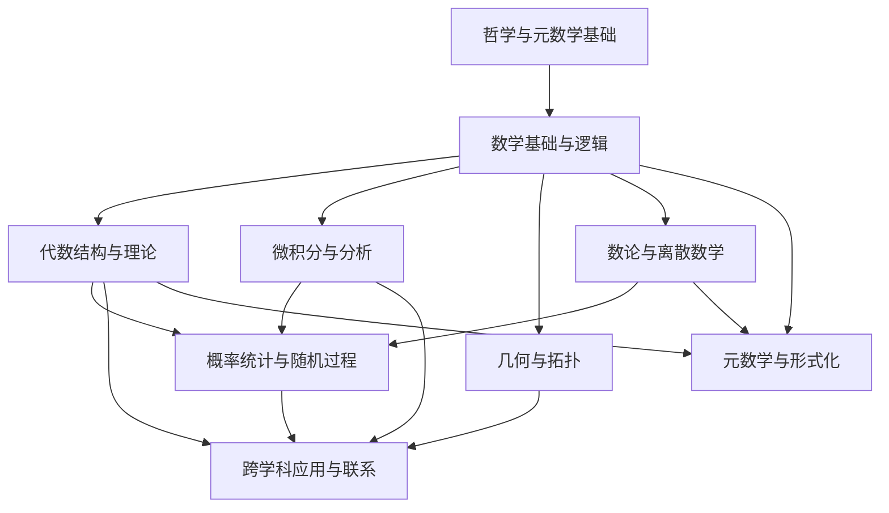

## 2. 核心概念映射

### 2.1 哲学与元数学基础

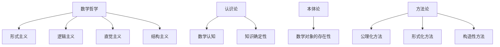

### 2.2 数学基础与逻辑

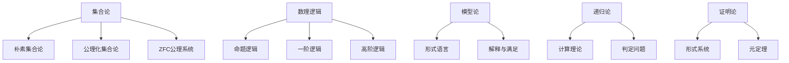

### 2.3 代数结构与理论

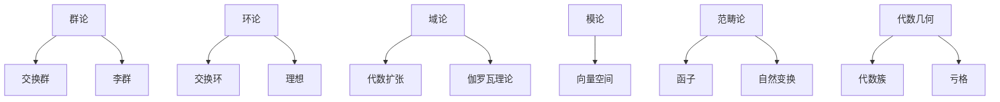

### 2.4 微积分与分析

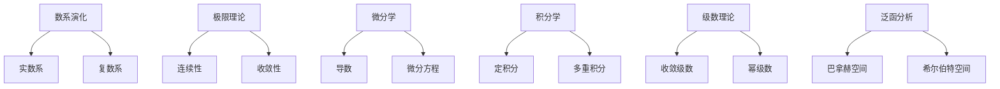

### 2.5 几何与拓扑

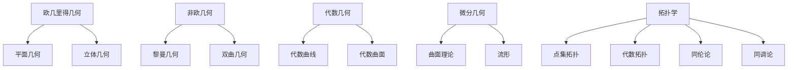

### 2.6 数论与离散数学

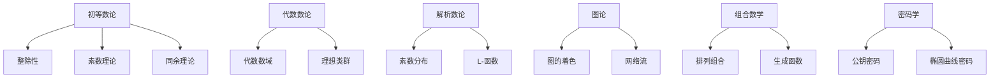

## 3. 跨领域知识关联

### 3.1 代数与几何的关联

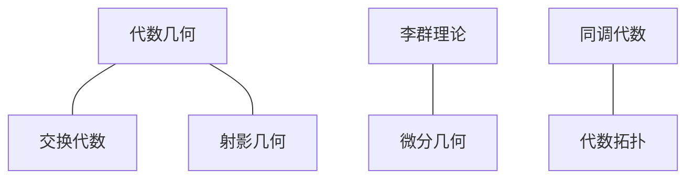

### 3.2 分析与几何的关联

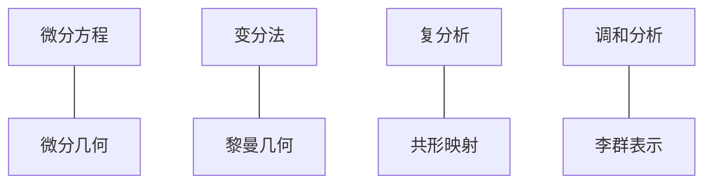

### 3.3 离散与连续的关联

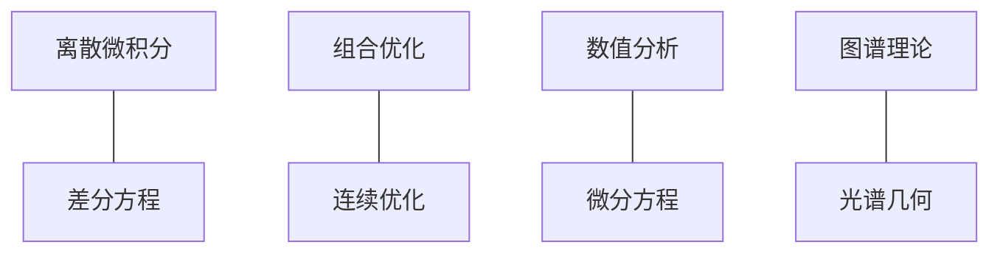

## 4. 跨学科应用映射

### 4.1 数学与物理

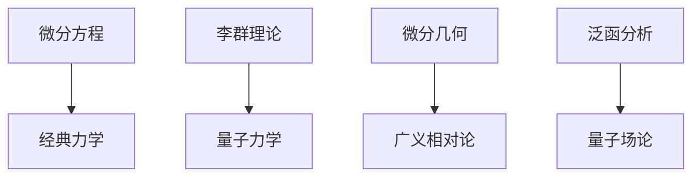

### 4.2 数学与计算机科学

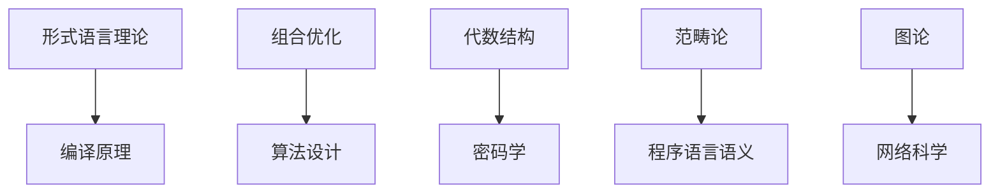

### 4.3 数学与经济学

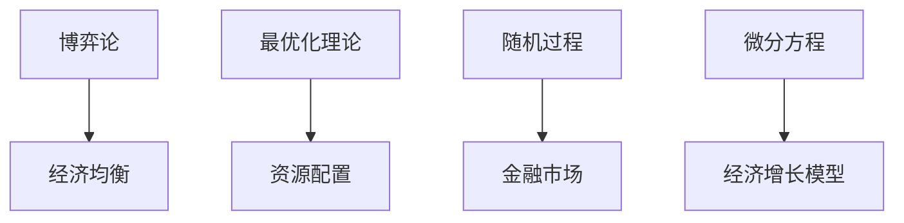

## 5. 形式化与自动化

### 5.1 形式化数学

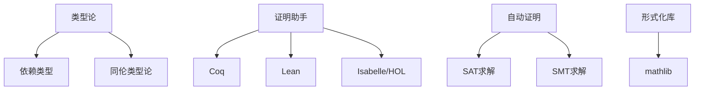

### 5.2 计算数学

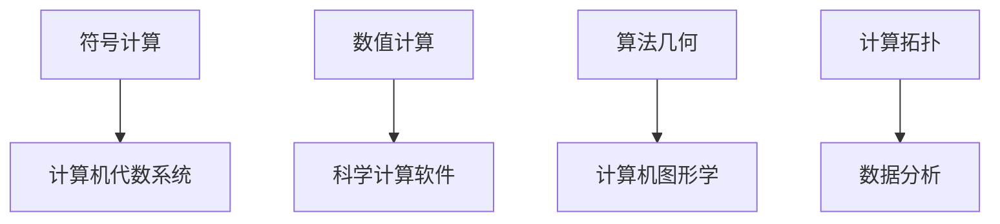

## 6. 知识体系整合视图

以下是数学知识体系的整体关联网络，展示了主要概念之间的相互依赖关系：

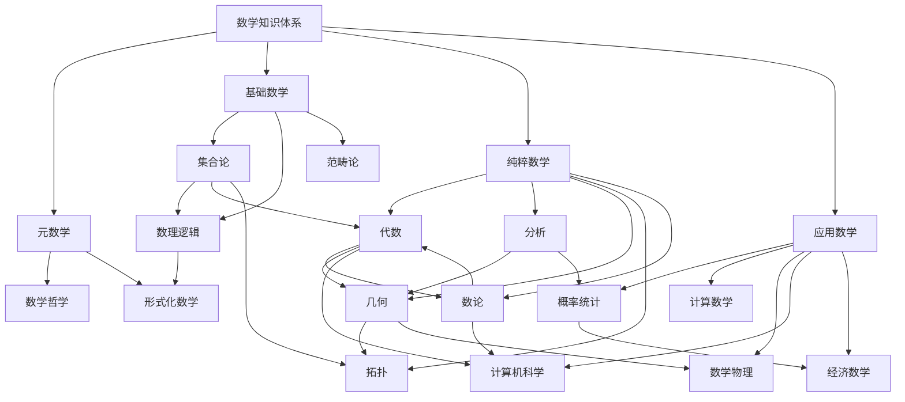

## 7. 知识体系中的深层关联

数学知识体系中存在诸多深层关联，这些关联往往跨越传统分类边界，显示了数学内部的深度统一性：

1. **代数与几何的对偶性**：通过代数几何，方程与几何形状建立了深刻的对应关系
2. **分析与拓扑的互补性**：连续函数的性质与拓扑空间的结构紧密相连
3. **离散与连续的统一**：离散结构在极限下逼近连续结构，建立了两者之间的桥梁
4. **抽象与具体的辩证**：抽象理论指导具体应用，而具体问题又促进抽象理论的发展
5. **逻辑与结构的相互作用**：逻辑规则塑造了数学结构，而数学结构也影响了逻辑的发展

---

**文档创建时间**: 2025-06-22  
**最后更新**: 2025-06-22  
**状态**: 初稿完成
