# 数学知识体系映射

## 本地目录

- [数学知识体系映射](#数学知识体系映射)
  - [本地目录](#本地目录)
  - [1. 映射概述](#1-映射概述)
  - [2. 核心概念映射](#2-核心概念映射)
    - [2.1 数学基础概念](#21-数学基础概念)
    - [2.2 代数结构概念](#22-代数结构概念)
    - [2.3 代数结构概念](#23-代数结构概念)
    - [2.4 分析学概念](#24-分析学概念)
    - [2.5 几何与拓扑概念](#25-几何与拓扑概念)
    - [2.6 概率统计概念](#26-概率统计概念)
    - [2.7 数论与离散数学概念](#27-数论与离散数学概念)
  - [3. 知识结构映射](#3-知识结构映射)
    - [3.1 层次结构映射](#31-层次结构映射)
    - [3.2 关联关系映射](#32-关联关系映射)
    - [3.3 发展脉络映射](#33-发展脉络映射)
  - [4. 应用领域映射](#4-应用领域映射)
    - [4.1 自然科学应用](#41-自然科学应用)
    - [4.2 工程技术应用](#42-工程技术应用)
    - [4.3 社会科学应用](#43-社会科学应用)
  - [5. 认知结构映射](#5-认知结构映射)
    - [5.1 概念形成过程](#51-概念形成过程)
    - [5.2 思维模式映射](#52-思维模式映射)
    - [5.3 学习路径映射](#53-学习路径映射)
  - [6. 本地知识图谱](#6-本地知识图谱)
    - [思脉体系](#思脉体系)
      - [基础数学思脉](#基础数学思脉)
      - [分析学思脉](#分析学思脉)
      - [概率统计思脉](#概率统计思脉)
      - [离散数学思脉](#离散数学思脉)
    - [相关文件](#相关文件)
    - [相关分支](#相关分支)

## 1. 映射概述

数学知识体系是一个高度结构化、相互关联的复杂网络。以下知识映射展示了各数学分支之间的逻辑关系和概念流动。

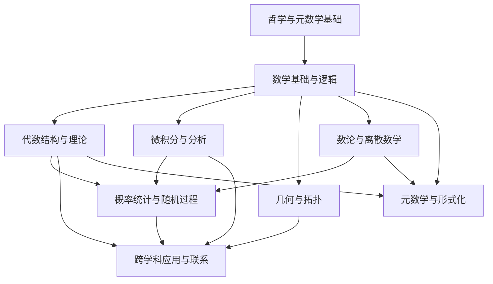

## 2. 核心概念映射

### 2.1 数学基础概念

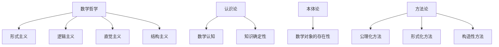

### 2.2 代数结构概念

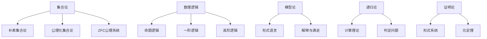

### 2.3 代数结构概念

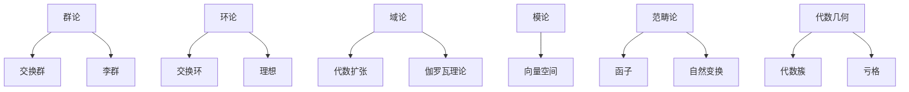

### 2.4 分析学概念

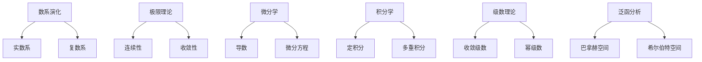

### 2.5 几何与拓扑概念

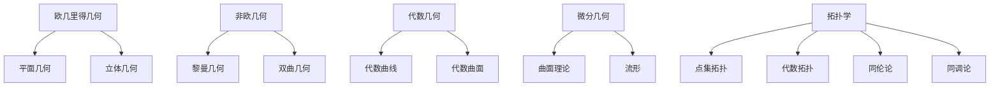

### 2.6 概率统计概念

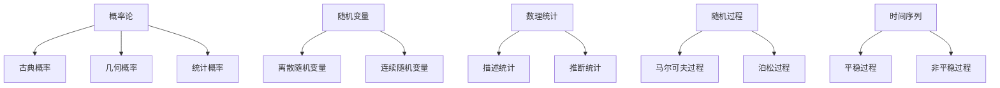

### 2.7 数论与离散数学概念

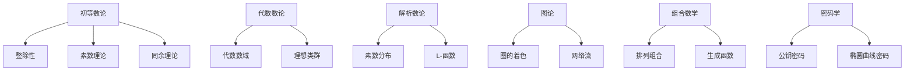

## 3. 知识结构映射

### 3.1 层次结构映射

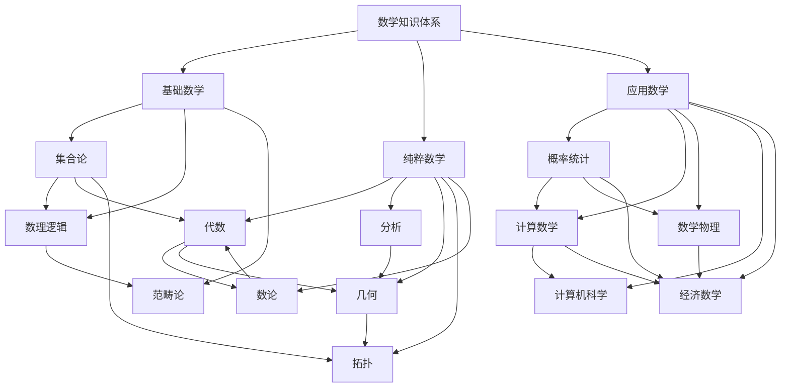

### 3.2 关联关系映射

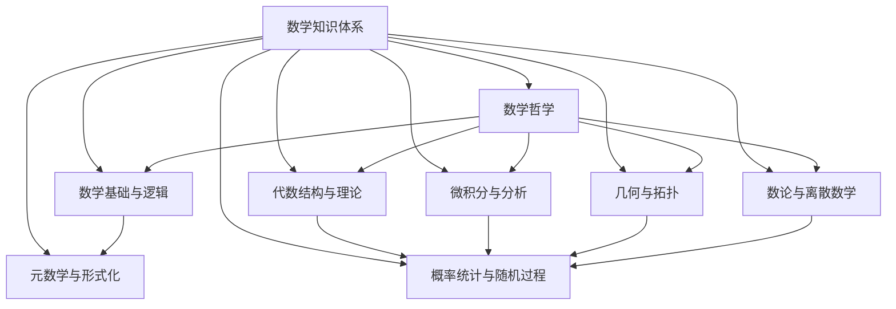

### 3.3 发展脉络映射

## 4. 应用领域映射

### 4.1 自然科学应用

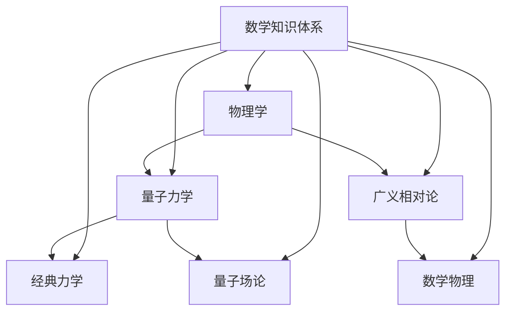

### 4.2 工程技术应用

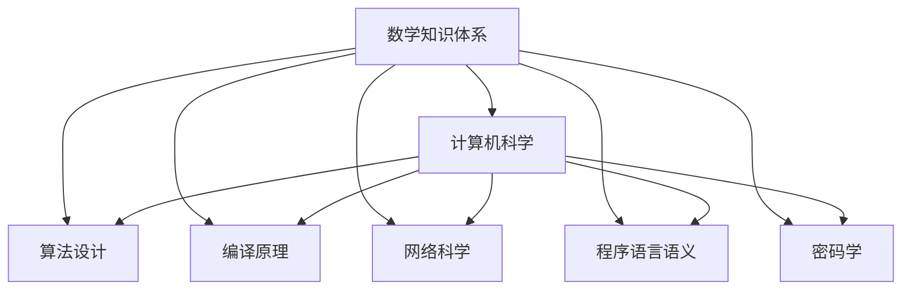

### 4.3 社会科学应用

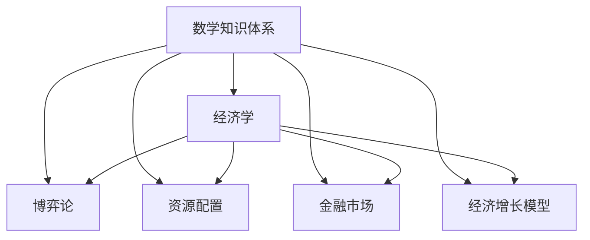

## 5. 认知结构映射

### 5.1 概念形成过程

### 5.2 思维模式映射

### 5.3 学习路径映射

## 6. 本地知识图谱

### 思脉体系

#### 基础数学思脉

- [群论思脉.md](../思脉体系/群论思脉.md) - 从对称性到代数结构
- [环论思脉.md](../思脉体系/环论思脉.md) - 从整数性质到抽象环结构
- [线性代数思脉.md](../思脉体系/线性代数思脉.md) - 从向量空间到线性变换
- [范畴论思脉.md](../思脉体系/范畴论思脉.md) - 从数学对象到抽象范畴

#### 分析学思脉

- [测度论思脉.md](../思脉体系/测度论思脉.md) - 从长度概念到抽象测度
- [泛函分析思脉.md](../思脉体系/泛函分析思脉.md) - 从函数空间到算子理论
- [拓扑学思脉.md](../思脉体系/拓扑学思脉.md) - 从几何直观到抽象拓扑
- [证明论思脉.md](../思脉体系/证明论思脉.md) - 从数学证明到形式化理论
- [模型论视角下的分析基础哲学思脉.md](../思脉体系/模型论视角下的分析基础哲学思脉.md) - 从标准分析到非标准分析

#### 概率统计思脉

- [随机过程思脉.md](../思脉体系/随机过程思脉.md) - 从随机性到动态系统
- [数理统计思脉.md](../思脉体系/数理统计思脉.md) - 从数据到推断

#### 离散数学思脉

- [图论思脉.md](../思脉体系/图论思脉.md) - 从关系结构到网络科学
- [组合数学思脉.md](../思脉体系/组合数学思脉.md) - 从计数到结构

### 相关文件

- [项目规划与路线图](#项目规划与路线图)
- [项目总览](#项目总览)
- [进度跟踪与日志](#进度跟踪与日志)
- [报告与分析](#报告与分析)
- [模板与标准](#模板与标准)
- [知识图谱与映射](#知识图谱与映射)
- [思脉体系总览](../思脉体系/00-思脉体系总览.md)

### 相关分支

- [数学哲学与元数学](#数学哲学与元数学)
- [数学基础与逻辑](#数学基础与逻辑)
- [代数结构与理论](#代数结构与理论)
- [分析学](#分析学)
- [几何学与拓扑学](#几何学与拓扑学)
- [概率论与统计学](#概率论与统计学)
- [数论与离散数学](#数论与离散数学)
- [跨学科应用与联系](#跨学科应用与联系)

---

**文档创建时间**: 2025-06-22  
**最后更新**: 2025-06-22  
**状态**: 初稿完成
