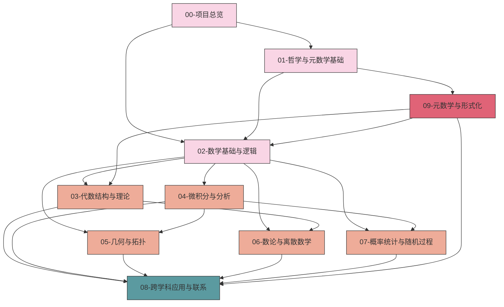

# 数学知识体系重构总览

## 本地目录

- [数学知识体系重构总览](#数学知识体系重构总览)
  - [本地目录](#本地目录)
  - [目录](#目录)
  - [1. 项目背景与目标](#1-项目背景与目标)
    - [1.1 项目背景](#11-项目背景)
    - [1.2 项目目标](#12-项目目标)
    - [1.3 项目意义](#13-项目意义)
  - [2. 重构策略与方法](#2-重构策略与方法)
    - [2.1 重构原则](#21-重构原则)
    - [2.2 重构方法](#22-重构方法)
    - [2.3 重构流程](#23-重构流程)
  - [3. 知识体系结构](#3-知识体系结构)
    - [3.1 总体架构](#31-总体架构)
    - [3.2 分支结构](#32-分支结构)
    - [3.3 关联关系](#33-关联关系)
  - [4. 实施计划](#4-实施计划)
    - [4.1 阶段划分](#41-阶段划分)
    - [4.2 优先级排序](#42-优先级排序)
    - [4.3 资源分配](#43-资源分配)
  - [5. 预期成果](#5-预期成果)
    - [5.1 直接成果](#51-直接成果)
    - [5.2 间接成果](#52-间接成果)
    - [5.3 长期影响](#53-长期影响)
  - [本地知识图谱](#本地知识图谱)
    - [相关文件](#相关文件)
    - [相关分支](#相关分支)

## 目录

1. [项目简介](#1-项目简介)
2. [目标与原则](#2-目标与原则)
3. [整体架构](#3-整体架构)
4. [重构方法论](#4-重构方法论)
5. [进度与规划](#5-进度与规划)
6. [文档标准](#6-文档标准)
7. [参与指南](#7-参与指南)

---

## 1. 项目背景与目标

数学知识体系重构项目旨在对已有数学内容进行系统性整理和重新组织，以建立一个逻辑清晰、结构规范、内容丰富的数学知识体系。本项目聚焦于基础数学和高等数学的核心概念、定理及其关联性，致力于从多维度展现数学知识的内在联系。

### 1.1 项目背景

原始数学内容分散在多个文件和目录中，存在内容重复、结构不一致、组织混乱等问题。这导致了知识的碎片化，难以形成系统性的理解。通过重构，我们将重新梳理和整合这些内容，构建一个层次分明的知识框架。

### 1.2 项目目标

1. **系统化**：构建完整、连贯的数学知识体系
2. **结构化**：建立清晰的层次结构和分类体系
3. **形式化**：提供严格的数学定义和形式化证明
4. **多维表征**：结合直观解释、图形展示、代码实现等多种表达方式
5. **关联性**：揭示数学概念之间的内在联系和依赖关系

### 1.3 项目意义

重构数学知识体系的意义在于：

1. **知识整合**：将分散的知识点整合成系统性的知识体系，便于理解和应用。
2. **知识深化**：通过重构，可以深入理解数学概念之间的联系和应用。
3. **知识创新**：重构过程中可能会发现新的数学概念和应用场景。

## 2. 重构策略与方法

### 2.1 重构原则

1. **内容一致性**：确保概念定义、记号使用和术语表达的一致性
2. **逻辑严谨性**：保持数学推理和证明的严格性和完整性
3. **可访问性**：以渐进方式呈现知识，从基本概念到高级主题
4. **多视角整合**：结合数学哲学、认知科学、形式化和应用视角
5. **模块化组织**：通过模块化设计实现内容的灵活组合和复用

### 2.2 重构方法

1. **内容提取与分类**：分析原始文档，识别核心概念、定理和方法
2. **知识表征方法**：每个数学概念应通过以下方式表征：
   - **形式定义**：严格的数学定义，使用标准符号和术语
   - **直观解释**：提供直观理解和几何解释
   - **例证**：展示典型例子和反例
   - **性质与定理**：列出相关性质和定理
   - **证明**：提供关键定理的详细证明
   - **应用**：说明概念的应用场景和方法
   - **代码实现**：使用Rust/Haskell/Lean表达算法和证明
   - **历史背景**：简述概念的历史发展
3. **关联构建策略**：知识关联通过以下方式构建：
   - **概念网络**：构建概念间的依赖和关联网络
   - **交叉引用**：在文档间建立链接和引用
   - **层级索引**：创建多层次的概念索引
   - **知识图谱**：可视化展示知识结构和关系

### 2.3 重构流程

1. **内容提取**：从原始文档中提取数学概念和定理
2. **知识表征**：为每个概念创建详细的表征
3. **关联构建**：建立概念间的依赖关系和关联网络
4. **知识整合**：将提取的知识点整合成系统性的知识体系

## 3. 知识体系结构

### 3.1 总体架构

数学知识体系的顶层目录结构如下：

```text
Math/Refactor/
├── 00-项目总览/                    # 项目管理、进度跟踪、知识图谱
├── 01-哲学与元数学基础/            # 数学哲学、元数学、认识论
├── 02-数学基础与逻辑/              # 集合论、数理逻辑、证明论
├── 03-代数结构与理论/              # 群论、环论、域论、范畴论
├── 04-微积分与分析/                # 实分析、复分析、泛函分析
├── 05-几何与拓扑/                  # 欧几里得几何、微分几何、拓扑学
├── 06-数论与离散数学/              # 初等数论、代数数论、组合学、图论
├── 07-概率统计与随机过程/          # 概率论、统计推断、随机过程
├── 08-跨学科应用与联系/            # 数学物理、计算数学、金融数学
└── 09-元数学与形式化/              # 形式化数学、证明辅助系统
```

### 3.2 分支结构

以下图谱展示了各模块之间的关系和知识流动：



### 3.3 关联关系

数学知识体系按照以下层次组织：

1. **元理论层**：数学哲学、元数学、形式系统
2. **基础层**：集合论、逻辑、数理基础
3. **结构层**：代数结构、分析框架、几何系统
4. **应用层**：各领域应用和交叉学科联系

## 4. 实施计划

### 4.1 阶段划分

1. **顶层目录结构**：完成顶层目录结构规范化
2. **核心内容迁移**：完成核心内容迁移
3. **知识关联建立**：建立完整知识关联
4. **形式化证明和代码实现**：完成形式化证明和代码实现
5. **最终优化和完善**：最终优化和完善知识体系

### 4.2 优先级排序

1. 完成00-项目总览目录的文件整合
2. 规范化01-哲学与元数学基础和03-代数结构与理论目录结构
3. 填充02-数学基础与逻辑的核心内容
4. 构建初步的知识图谱和关联系统

### 4.3 资源分配

1. **人力**：项目团队成员
2. **时间**：2025年7月1日至2025年11月15日
3. **工具**：Rust/Haskell/Lean编程语言，Markdown文档编辑器

## 5. 预期成果

### 5.1 直接成果

1. 完成数学知识体系重构项目
2. 创建完整的数学知识体系文档
3. 建立数学知识体系的关联系统

### 5.2 间接成果

1. 提高数学知识的系统性和连贯性
2. 加深对数学概念之间关系的理解
3. 为后续数学研究和应用打下坚实基础

### 5.3 长期影响

1. 数学知识体系的长期稳定性和可用性
2. 数学知识体系的持续更新和完善
3. 数学知识体系在教育和研究中的广泛应用

## 本地知识图谱

### 相关文件

- **项目规划与路线图**：描述项目的目标、范围和时间线
- **项目总览**：提供项目概览和主要内容
- **进度跟踪与日志**：记录项目进度和关键事件
- **报告与分析**：提供项目进展和结果的分析报告
- **模板与标准**：定义项目文档的结构和格式
- **知识图谱与映射**：展示知识体系和概念间的关联

### 相关分支

- **数学哲学与元数学**：研究数学哲学和元数学的基本概念和理论
- **数学基础与逻辑**：研究数学基础和逻辑的基本概念和理论
- **代数结构与理论**：研究代数结构和理论的基本概念和理论
- **分析学**：研究分析学的基本概念和理论
- **几何学与拓扑学**：研究几何学和拓扑学的基本概念和理论
- **概率论与统计学**：研究概率论和统计学的基本概念和理论
- **数论与离散数学**：研究数论和离散数学的基本概念和理论
- **跨学科应用与联系**：研究数学在其他学科中的应用和联系

---

**创建日期**: 2025-07-01  
**最后更新**: 2025-07-01  
**主要负责人**: AI助手  
**相关文件**: [01-知识图谱分析.md](./01-知识图谱分析.md), [02-进度跟踪.md](./02-进度跟踪.md), [00-持续上下文跟踪.md](./00-持续上下文跟踪.md)
