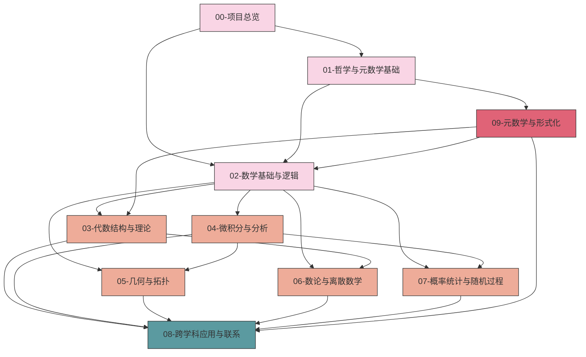

# 数学知识体系重构总览

## 本地目录

- [数学知识体系重构总览](#数学知识体系重构总览)
  - [本地目录](#本地目录)
  - [目录](#目录)
  - [1. 项目简介](#1-项目简介)
    - [1.1 项目背景](#11-项目背景)
    - [1.2 重构范围](#12-重构范围)
  - [2. 目标与原则](#2-目标与原则)
    - [2.1 核心目标](#21-核心目标)
    - [2.2 指导原则](#22-指导原则)
  - [3. 整体架构](#3-整体架构)
    - [3.1 顶层目录结构](#31-顶层目录结构)
    - [3.2 模块关系图谱](#32-模块关系图谱)
    - [3.3 知识层次结构](#33-知识层次结构)
  - [4. 重构方法论](#4-重构方法论)
    - [4.1 内容提取与分类](#41-内容提取与分类)
    - [4.2 知识表征方法](#42-知识表征方法)
    - [4.3 关联构建策略](#43-关联构建策略)
  - [5. 进度与规划](#5-进度与规划)
    - [5.1 当前进度](#51-当前进度)
    - [5.2 里程碑规划](#52-里程碑规划)
    - [5.3 优先任务](#53-优先任务)
  - [6. 文档标准](#6-文档标准)
    - [6.1 文件命名规范](#61-文件命名规范)
    - [6.2 文档结构标准](#62-文档结构标准)
  - [7. 参与指南](#7-参与指南)
  - [本地知识图谱](#本地知识图谱)
    - [相关文件](#相关文件)
      - [项目规划与路线图](#项目规划与路线图)
      - [项目总览](#项目总览)
      - [进度跟踪与日志](#进度跟踪与日志)
      - [报告与分析](#报告与分析)
      - [模板与标准](#模板与标准)
      - [知识图谱与映射](#知识图谱与映射)
    - [相关分支](#相关分支)
      - [数学哲学与元数学](#数学哲学与元数学)
      - [数学基础与逻辑](#数学基础与逻辑)
      - [代数结构与理论](#代数结构与理论)
      - [分析学](#分析学)
      - [几何学与拓扑学](#几何学与拓扑学)
      - [概率论与统计学](#概率论与统计学)
      - [数论与离散数学](#数论与离散数学)
      - [跨学科应用与联系](#跨学科应用与联系)

## 目录

1. [项目简介](#1-项目简介)
2. [目标与原则](#2-目标与原则)
3. [整体架构](#3-整体架构)
4. [重构方法论](#4-重构方法论)
5. [进度与规划](#5-进度与规划)
6. [文档标准](#6-文档标准)
7. [参与指南](#7-参与指南)

---

## 1. 项目简介

数学知识体系重构项目旨在对已有数学内容进行系统性整理和重新组织，以建立一个逻辑清晰、结构规范、内容丰富的数学知识体系。本项目聚焦于基础数学和高等数学的核心概念、定理及其关联性，致力于从多维度展现数学知识的内在联系。

### 1.1 项目背景

原始数学内容分散在多个文件和目录中，存在内容重复、结构不一致、组织混乱等问题。这导致了知识的碎片化，难以形成系统性的理解。通过重构，我们将重新梳理和整合这些内容，构建一个层次分明的知识框架。

### 1.2 重构范围

本项目重构范围包括`/Math/Matter`目录下的所有数学内容，涵盖数学哲学、数学基础、代数、分析、几何、离散数学、概率统计等主题。

## 2. 目标与原则

### 2.1 核心目标

1. **系统化**：构建完整、连贯的数学知识体系
2. **结构化**：建立清晰的层次结构和分类体系
3. **形式化**：提供严格的数学定义和形式化证明
4. **多维表征**：结合直观解释、图形展示、代码实现等多种表达方式
5. **关联性**：揭示数学概念之间的内在联系和依赖关系

### 2.2 指导原则

1. **内容一致性**：确保概念定义、记号使用和术语表达的一致性
2. **逻辑严谨性**：保持数学推理和证明的严格性和完整性
3. **可访问性**：以渐进方式呈现知识，从基本概念到高级主题
4. **多视角整合**：结合数学哲学、认知科学、形式化和应用视角
5. **模块化组织**：通过模块化设计实现内容的灵活组合和复用

## 3. 整体架构

### 3.1 顶层目录结构

数学知识体系的顶层目录结构如下：

```text
Math/Refactor/
├── 00-项目总览/                    # 项目管理、进度跟踪、知识图谱
├── 01-哲学与元数学基础/            # 数学哲学、元数学、认识论
├── 02-数学基础与逻辑/              # 集合论、数理逻辑、证明论
├── 03-代数结构与理论/              # 群论、环论、域论、范畴论
├── 04-微积分与分析/                # 实分析、复分析、泛函分析
├── 05-几何与拓扑/                  # 欧几里得几何、微分几何、拓扑学
├── 06-数论与离散数学/              # 初等数论、代数数论、组合学、图论
├── 07-概率统计与随机过程/          # 概率论、统计推断、随机过程
├── 08-跨学科应用与联系/            # 数学物理、计算数学、金融数学
└── 09-元数学与形式化/              # 形式化数学、证明辅助系统
```

### 3.2 模块关系图谱

以下图谱展示了各模块之间的关系和知识流动：



### 3.3 知识层次结构

数学知识体系按照以下层次组织：

1. **元理论层**：数学哲学、元数学、形式系统
2. **基础层**：集合论、逻辑、数理基础
3. **结构层**：代数结构、分析框架、几何系统
4. **应用层**：各领域应用和交叉学科联系

## 4. 重构方法论

### 4.1 内容提取与分类

1. **内容分析**：分析原始文档，识别核心概念、定理和方法
2. **主题分类**：将内容按主题和领域分类
3. **结构梳理**：识别概念间的依赖关系和逻辑链接
4. **冗余整合**：合并重复内容，保留最清晰、最完整的表述

### 4.2 知识表征方法

每个数学概念应通过以下方式表征：

1. **形式定义**：严格的数学定义，使用标准符号和术语
2. **直观解释**：提供直观理解和几何解释
3. **例证**：展示典型例子和反例
4. **性质与定理**：列出相关性质和定理
5. **证明**：提供关键定理的详细证明
6. **应用**：说明概念的应用场景和方法
7. **代码实现**：使用Rust/Haskell/Lean表达算法和证明
8. **历史背景**：简述概念的历史发展

### 4.3 关联构建策略

知识关联通过以下方式构建：

1. **概念网络**：构建概念间的依赖和关联网络
2. **交叉引用**：在文档间建立链接和引用
3. **层级索引**：创建多层次的概念索引
4. **知识图谱**：可视化展示知识结构和关系

## 5. 进度与规划

### 5.1 当前进度

截至2025-07-01：

- **整体完成度**：约36%
- **已完成**：顶层目录结构、项目总览文档、部分数学基础内容
- **进行中**：数学基础与逻辑内容迁移、哲学与元数学基础结构规范化

详细进度请参阅[02-进度跟踪.md](./02-进度跟踪.md)。

### 5.2 里程碑规划

| 阶段 | 目标 | 预计完成时间 |
|-----|-----|------------|
| 第1阶段 | 完成目录结构规范化 | 2025-07-15 |
| 第2阶段 | 完成核心内容迁移 | 2025-08-15 |
| 第3阶段 | 建立完整知识关联 | 2025-09-15 |
| 第4阶段 | 形式化证明和代码实现 | 2025-10-15 |
| 第5阶段 | 最终优化和完善 | 2025-11-15 |

### 5.3 优先任务

1. 完成00-项目总览目录的文件整合
2. 规范化01-哲学与元数学基础和03-代数结构与理论目录结构
3. 填充02-数学基础与逻辑的核心内容
4. 构建初步的知识图谱和关联系统

详细任务清单请参阅[03-待办任务清单.md](./03-待办任务清单.md)。

## 6. 文档标准

### 6.1 文件命名规范

- **目录命名**：`XX-主题名称/`（XX为两位数序号）
- **文件命名**：`XX-具体内容.md`（XX为两位数序号）
- **总览文件**：各目录下使用`00-主题总览.md`

### 6.2 文档结构标准

所有文档应遵循标准模板，包括：

- 清晰的标题和目录
- 结构化的章节安排
- 统一的元数据（创建日期、更新日期等）
- 一致的符号和术语使用

详细的文档模板请参阅[04-标准文档模板.md](./04-标准文档模板.md)。

### 6.3 交叉引用规范

- 使用相对路径引用其他文档：`[集合论](../../02-数学基础与逻辑/01-集合论/00-集合论总览.md)`
- 引用当前文档的特定部分：`[定义](#1-定义)`
- 引用定理或公式：`[定理1.2](#定理-12-xxxx)`

## 7. 参与指南

### 7.1 参与方式

可以通过以下方式参与项目：

1. **内容贡献**：完善特定主题或概念的内容
2. **结构优化**：改进目录结构和文档组织
3. **质量审核**：检查数学内容的准确性和一致性
4. **知识关联**：帮助建立概念间的联系和引用

### 7.2 工作流程

1. **查看任务**：参考[03-待办任务清单.md](./03-待办任务清单.md)获取待办任务
2. **选择任务**：选择适合的任务或主题
3. **开发内容**：按照标准模板创建或修改内容
4. **提交贡献**：提交更改并更新进度信息
5. **审核更新**：定期审核和优化已完成的内容

### 7.3 质量标准

所有贡献应遵循以下质量标准：

1. **数学严谨性**：内容在数学上准确无误
2. **结构一致性**：遵循项目的结构和格式规范
3. **内容完整性**：覆盖主题的必要方面
4. **表达清晰性**：解释清晰、语言精确
5. **关联丰富性**：提供与其他概念的有效链接

---

**创建日期**: 2025-07-01  
**最后更新**: 2025-07-01  
**主要负责人**: AI助手  
**相关文件**: [01-知识图谱分析.md](./01-知识图谱分析.md), [02-进度跟踪.md](./02-进度跟踪.md), [00-持续上下文跟踪.md](./00-持续上下文跟踪.md)
