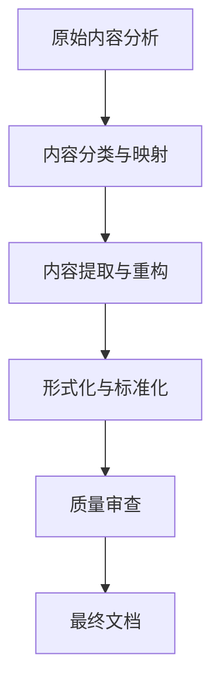

# 数学知识体系：内容映射与重构指南

## 1. 原始内容分析

### 1.1 主要文件分析

| 文件名 | 大小 | 行数 | 主要内容 | 重构目标目录 |
|--------|------|------|----------|--------------|
| 数学核心概念分析.md | 87KB | 888 | 形式化、推理与元结构 | 01-哲学与元数学基础, 09-元数学与形式化 |
| 数学逻辑.md | 239KB | 2410 | 数理逻辑基础、计算理论、AI应用 | 02-数学基础与逻辑 |
| 数学概念联系.md | 324KB | 3003 | 概念关联性分析 | 08-跨学科应用与联系 |
| 数学概念分析和综合.md | 292KB | 2409 | 概念分析与综合 | 分散到各个主题目录 |
| 数学概念分析.md | 157KB | 1295 | 概念分析 | 分散到各个主题目录 |
| 数学分支与联系.md | 120KB | 978 | 数学分支关联 | 08-跨学科应用与联系 |

### 1.2 主要目录分析

#### 1.2.1 Algebra/

**主题**: 代数结构、范畴论视角、认知结构、软件编程映射
**重构目标**: 03-代数结构与理论

| 文件名 | 大小 | 行数 | 主要内容 | 重构目标文件 |
|--------|------|------|----------|--------------|
| 从范畴论视角重审代数学.md | 87KB | 1644 | 范畴论视角下的代数 | 03-代数结构与理论/06-范畴论基础.md |
| 代数.md | 28KB | 629 | 代数基础 | 03-代数结构与理论/00-代数结构与理论总览.md |
| 抽象代数、认知结构与软件编程：映射、模型与元理论的批判性分析01.md | 264KB | 1893 | 代数与软件编程 | 03-代数结构与理论/代数与软件编程的关联.md |
| 人脑认知、抽象代数与软件编程的关联性探索01.md | 106KB | 669 | 认知与代数 | 03-代数结构与理论/代数认知结构.md |
| 从范畴论视角重审代数认知与形式系统.md | 100KB | 738 | 范畴论与认知 | 03-代数结构与理论/06-范畴论基础.md |
| view_抽象代数.md | 126KB | 1374 | 抽象代数视图 | 03-代数结构与理论/05-抽象代数理论.md |

#### 1.2.2 Calculus/

**主题**: 微积分、非标准分析、数系演化、微积分合法性
**重构目标**: 04-微积分与分析

| 文件名 | 大小 | 行数 | 主要内容 | 重构目标文件 |
|--------|------|------|----------|--------------|
| 非标准微积分的批判性分析：基础、优势与挑战.md | 33KB | 707 | 非标准分析 | 04-微积分与分析/07-非标准分析.md |
| 数系演化的多维批判性分析：从自然数到高维代数结构.md | 82KB | 2106 | 数系演化 | 04-微积分与分析/01-数系演化理论.md |
| 极限与连续性理论.md | 多个文件 | - | 极限与连续性 | 04-微积分与分析/02-极限与连续性理论.md |
| 微积分的合法性：多维度论证与批判性分析.md | 92KB | 2958 | 微积分哲学 | 04-微积分与分析/00-微积分与分析总览.md |

#### 1.2.3 Geometry/

**主题**: 几何学、空间结构
**重构目标**: 05-几何与拓扑

| 文件名 | 大小 | 行数 | 主要内容 | 重构目标文件 |
|--------|------|------|----------|--------------|
| view_几何01.md - view_几何15.md | 多个文件 | - | 几何视角 | 05-几何与拓扑/ 下的多个文件 |

#### 1.2.4 MetaMath/

**主题**: 元数学、形式化、证明理论
**重构目标**: 01-哲学与元数学基础, 09-元数学与形式化

| 子目录 | 主要内容 | 重构目标目录 |
|--------|----------|--------------|
| Set/ | 集合论 | 02-数学基础与逻辑/01-集合论/ |
| Logic/ | 逻辑 | 02-数学基础与逻辑/02-数理逻辑/ |
| Proof/ | 证明理论 | 02-数学基础与逻辑/05-证明论基础.md |
| Model/ | 模型论 | 02-数学基础与逻辑/03-模型论基础.md |
| Category/ | 范畴论 | 03-代数结构与理论/06-范畴论基础.md |
| HoTT/ | 同伦类型论 | 09-元数学与形式化/04-同伦类型论.md |
| Computability/ | 可计算性 | 02-数学基础与逻辑/04-递归论基础.md |

#### 1.2.5 批判性分析/

**主题**: 哲学批判、思想框架
**重构目标**: 所有目录的"哲学思考与批判分析"部分

| 文件名 | 大小 | 行数 | 主要内容 | 重构目标 |
|--------|------|------|----------|----------|
| 具体文档批判性分析.md | 19KB | 675 | 文档批判 | 分散到各个主题文档 |
| 综合评价报告.md | 19KB | 654 | 综合评价 | 00-项目总览/知识体系评价.md |
| 重构建议与改进方案.md | 19KB | 803 | 重构建议 | 00-项目总览/重构建议.md |
| 理念驱动数学思考框架批判性分析.md | 10KB | 344 | 思想框架 | 01-哲学与元数学基础/ |

## 2. 内容重构策略

### 2.1 内容提取原则

1. **核心概念优先**: 优先提取核心数学概念和定义
2. **形式化表达**: 使用标准数学符号和LaTeX公式
3. **哲学深度保留**: 保留批判性思考和哲学分析
4. **去重合并**: 合并重复内容，保留最完整版本
5. **结构化组织**: 按照标准目录结构组织内容

### 2.2 内容转换流程

### 2.3 特定主题处理策略

#### 2.3.1 数学哲学内容

- 提取哲学思考
- 整合到各主题的"哲学思考与批判分析"部分
- 深度内容放入01-哲学与元数学基础/

#### 2.3.2 形式化内容

- 提取形式化定义和证明
- 转换为标准LaTeX格式
- 添加Rust和Haskell实现

#### 2.3.3 应用内容

- 提取现代应用案例
- 整合到各主题的"现代应用与发展"部分
- 跨学科应用放入08-跨学科应用与联系/

## 3. 内容映射详细计划

### 3.1 01-哲学与元数学基础

从以下文件提取内容:

- 数学核心概念分析.md (元结构部分)
- 理念驱动数学思考框架批判性分析.md
- MetaMath/ 相关文件

### 3.2 02-数学基础与逻辑

从以下文件提取内容:

- 数学逻辑.md
- MetaMath/Set/
- MetaMath/Logic/
- MetaMath/Proof/
- MetaMath/Model/
- MetaMath/Computability/

### 3.3 03-代数结构与理论

从以下文件提取内容:

- Algebra/ 目录下所有文件
- MetaMath/Category/

### 3.4 04-微积分与分析

从以下文件提取内容:

- Calculus/ 目录下所有文件
- 数学概念分析.md (相关部分)

### 3.5 05-几何与拓扑

从以下文件提取内容:

- Geometry/ 目录下所有文件
- 数学概念分析.md (相关部分)

### 3.6 06-数论与离散数学

从以下文件提取内容:

- 数学概念分析.md (相关部分)
- 数学概念分析和综合.md (相关部分)

### 3.7 07-概率统计与随机过程

从以下文件提取内容:

- MetaMath/Probability/
- 数学概念分析.md (相关部分)

### 3.8 08-跨学科应用与联系

从以下文件提取内容:

- 数学概念联系.md
- 数学分支与联系.md
- 数学概念分析和综合.md (相关部分)

### 3.9 09-元数学与形式化

从以下文件提取内容:

- 数学核心概念分析.md (形式化部分)
- MetaMath/HoTT/

## 4. 实施计划

### 4.1 第一阶段：内容分析与映射

- [x] 分析原始文件内容
- [x] 创建内容映射表
- [x] 确定重构策略

### 4.2 第二阶段：内容提取与重构

- [ ] 01-哲学与元数学基础 (已完成)
- [ ] 03-代数结构与理论 (已完成)
- [ ] 04-微积分与分析 (已完成)
- [ ] 05-几何与拓扑 (已完成)
- [ ] 06-数论与离散数学 (进行中)
- [ ] 02-数学基础与逻辑 (待开始)
- [ ] 07-概率统计与随机过程 (待开始)
- [ ] 08-跨学科应用与联系 (待开始)
- [ ] 09-元数学与形式化 (待开始)

### 4.3 第三阶段：质量审查与完善

- [ ] 内容完整性检查
- [ ] 形式化表达检查
- [ ] 交叉引用检查
- [ ] 哲学深度检查

---

**最后更新**: 2025年6月20日
**状态**: 内容映射文档
