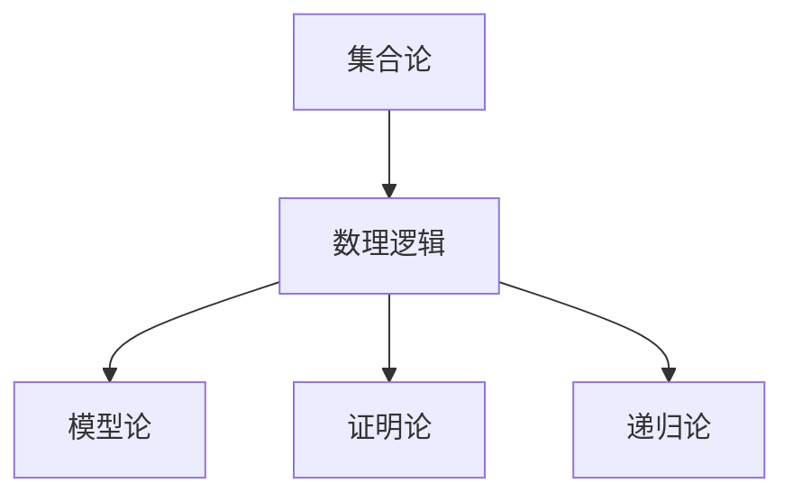

# 标准文档模板

## 本地目录

- [标准文档模板](#标准文档模板)
  - [本地目录](#本地目录)
  - [1. 模板概述](#1-模板概述)
    - [1.1 模板目的](#11-模板目的)
    - [1.2 适用范围](#12-适用范围)
    - [1.3 使用说明](#13-使用说明)
  - [2. 文档结构](#2-文档结构)
    - [2.1 标题结构](#21-标题结构)
    - [2.2 内容组织](#22-内容组织)
    - [2.3 格式规范](#23-格式规范)
  - [3. 模板示例](#3-模板示例)
    - [3.1 总览文档模板](#31-总览文档模板)
    - [3.2 专题文档模板](#32-专题文档模板)
    - [3.3 报告文档模板](#33-报告文档模板)
  - [本地知识图谱](#本地知识图谱)
    - [相关文件](#相关文件)
      - [项目规划与路线图](#项目规划与路线图)
      - [项目总览](#项目总览)
      - [进度跟踪与日志](#进度跟踪与日志)
      - [报告与分析](#报告与分析)
      - [模板与标准](#模板与标准)
      - [知识图谱与映射](#知识图谱与映射)
    - [相关分支](#相关分支)
      - [数学哲学与元数学](#数学哲学与元数学)
      - [数学基础与逻辑](#数学基础与逻辑)
      - [代数结构与理论](#代数结构与理论)
      - [分析学](#分析学)
      - [几何学与拓扑学](#几何学与拓扑学)
      - [概率论与统计学](#概率论与统计学)
      - [数论与离散数学](#数论与离散数学)
      - [跨学科应用与联系](#跨学科应用与联系)

## 1. 模板概述

## 1. 文档类型与模板

### 1.1 总览文档模板

```markdown
# [主题名称]总览

## 目录

1. [简介](#1-简介)
2. [历史脉络](#2-历史脉络)
3. [核心概念](#3-核心概念)
4. [主要分支](#4-主要分支)
5. [理论发展](#5-理论发展)
6. [学科关联](#6-学科关联)
7. [应用领域](#7-应用领域)
8. [参考资料](#8-参考资料)

---

## 1. 简介

[简要介绍该主题的基本定义、研究对象和重要性]

## 2. 历史脉络

[描述该领域的历史发展、重要里程碑和关键人物]

## 3. 核心概念

[列出并简要解释该领域的核心概念、基本原理和关键定义]

## 4. 主要分支

[介绍该领域的主要分支或子领域，以及它们之间的关系]

## 5. 理论发展

[概述该领域的理论框架发展脉络、主要定理和突破]

## 6. 学科关联

[探讨该主题与其他数学分支以及其他学科的联系]

## 7. 应用领域

[描述该主题在实际中的应用场景和重要性]

## 8. 参考资料

[列出相关的参考书目、论文或其他资源]

```

### 1.2 概念文档模板

```markdown
# [概念名称]

## 目录

1. [定义](#1-定义)
2. [直观解释](#2-直观解释)
3. [形式表述](#3-形式表述)
4. [性质与定理](#4-性质与定理)
5. [相关概念](#5-相关概念)
6. [应用示例](#6-应用示例)
7. [历史注记](#7-历史注记)
8. [形式化实现](#8-形式化实现)
9. [参考资料](#9-参考资料)

---

## 1. 定义

[给出概念的精确数学定义]

## 2. 直观解释

[提供概念的直观理解、几何解释或类比说明]

## 3. 形式表述

[使用数学符号和形式语言给出严格表述]

## 4. 性质与定理

[列出与该概念相关的重要性质和定理]

### 4.1 性质一

[性质描述及证明]

### 4.2 定理一

[定理描述]

**证明**：
[给出详细的证明过程]

## 5. 相关概念

[介绍与该概念密切相关的其他概念，以及它们之间的关系]

## 6. 应用示例

[提供该概念的应用实例，包括数学内部和实际应用]

## 7. 历史注记

[概念的历史发展、命名由来或相关轶事]

## 8. 形式化实现

[使用Lean、Coq、Rust或Haskell等提供形式化实现]

```rust
// Rust代码实现（如适用）
```

```lean
-- Lean形式化证明（如适用）
```

## 9. 参考资料

[相关参考文献]

```text

### 1.3 证明文档模板

```markdown
# [定理名称]证明

## 目录

1. [定理陈述](#1-定理陈述)
2. [预备知识](#2-预备知识)
3. [证明概要](#3-证明概要)
4. [详细证明](#4-详细证明)
5. [证明分析](#5-证明分析)
6. [推论与应用](#6-推论与应用)
7. [形式化验证](#7-形式化验证)
8. [历史注记](#8-历史注记)
9. [参考资料](#9-参考资料)

---

## 1. 定理陈述

[给出定理的精确数学表述]

## 2. 预备知识

[列出理解证明所需的预备知识、引理和概念]

## 3. 证明概要

[提供证明的整体思路和关键步骤]

## 4. 详细证明

[给出定理的详细证明过程，包括所有的推导步骤]

## 5. 证明分析

[分析证明方法、技巧及其独特之处]

## 6. 推论与应用

[介绍该定理的重要推论及应用场景]

## 7. 形式化验证

[使用证明助手（如Lean）提供形式化证明]

```lean
-- Lean形式化证明
```

## 8. 历史注记

[证明的历史背景、发现过程或相关轶事]

## 9. 参考资料1

[相关参考文献]

```text

## 2. 内容规范

### 2.1 数学符号与公式

- 使用LaTeX格式的数学公式：$f(x) = \sum_{i=0}^{n} a_i x^i$
- 行内公式使用单美元符号：$a^2 + b^2 = c^2$
- 独立公式使用双美元符号：

$$
\int_a^b f(x) \, dx = F(b) - F(a)
$$

### 2.2 交叉引用规范

- 引用其他文档：[集合论基础](../../02-数学基础与逻辑/01-集合论/01-朴素集合论.md)
- 引用同一文档内的部分：[定义](#1-定义)
- 引用定理、公理等：[欧几里得公理](../05-几何与拓扑/01-欧几里得几何基础.md#欧几里得公理)

### 2.3 代码示例规范

- 首选使用Rust或Haskell表达算法和数据结构
- 首选使用Lean表达形式化证明
- 代码应添加注释，解释关键步骤

```rust
// Rust示例
fn factorial(n: u64) -> u64 {
    // 计算阶乘: n!
    match n {
        0 => 1,                    // 基本情况: 0! = 1
        _ => n * factorial(n - 1)  // 递归情况: n! = n * (n-1)!
    }
}
```

```lean
-- Lean示例
def factorial : ℕ → ℕ
| 0     := 1                   -- 基本情况: 0! = 1
| (n+1) := (n+1) * factorial n -- 递归情况: (n+1)! = (n+1) * n!

-- 定理: n! > 0
theorem factorial_pos : ∀ n : ℕ, factorial n > 0 :=
begin
  intro n,
  induction n with n ih,
  { -- 基本情况: 0! = 1 > 0
    simp [factorial], -- 简化为 1 > 0
    exact nat.one_pos, -- 使用标准库中 1 > 0 的证明
  },
  { -- 归纳步骤: 假设 n! > 0，证明 (n+1)! > 0
    simp [factorial], -- 简化为 (n+1) * factorial n > 0
    exact nat.mul_pos (nat.succ_pos n) ih, -- 使用正数乘积的性质
  }
end
```

### 2.4 图表规范

使用Mermaid图表创建可视化内容:



## 3. 文档结构规范

### 3.1 文件命名规范

- 使用序号前缀确保排序：`01-主题名称.md`
- 总览文档使用`00-主题总览.md`
- 避免特殊字符（除连字符和下划线外）

### 3.2 目录结构规范

```text
XX-主题名称/
├── 00-主题总览.md
├── 01-子主题A.md
├── 02-子主题B.md
└── 子目录/
    ├── 01-细分主题A.md
    └── 02-细分主题B.md
```

### 3.3 元数据规范

每个文档末尾应包含以下元数据：

```text
---

**创建日期**: YYYY-MM-DD  
**最后更新**: YYYY-MM-DD  
**贡献者**: [贡献者名单]  
**相关主题**: [相关主题列表]
```

## 4. 多维表征规范

### 4.1 表征类型

每个重要概念应尽可能从多个维度进行表征：

1. **形式化表征**：严格的数学定义和符号表示
2. **直观表征**：图形、比喻或直观解释
3. **计算表征**：算法实现或计算示例
4. **关联表征**：与其他概念的联系和区别
5. **应用表征**：实际应用场景和例子

### 4.2 表征示例

**连续函数概念的多维表征**：

- **形式化表征**：$\forall \varepsilon > 0, \exists \delta > 0, \forall x \in D, |x-x_0| < \delta \Rightarrow |f(x) - f(x_0)| < \varepsilon$
- **直观表征**：图形展示函数的连续性质，无"跳跃"或"断裂"
- **计算表征**：通过Rust函数展示如何验证特定函数在给定点的连续性
- **关联表征**：与极限、微分、一致连续性等概念的关系
- **应用表征**：物理系统中的连续变化，信号处理中的连续信号

---

**更新日期**: 2025-07-01  
**状态**: 正式发布
