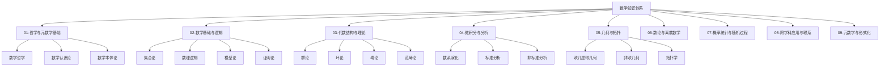
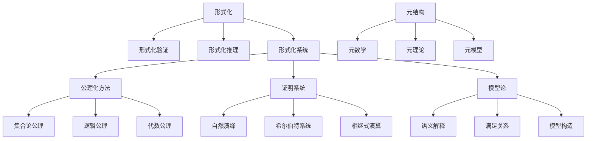
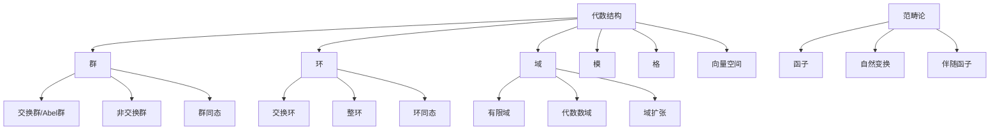
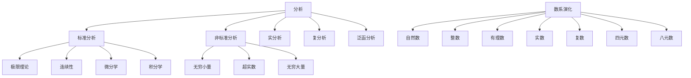

# 01-知识图谱与重构路线

## 1. 知识体系整体结构

## 2. 主题关联矩阵

| 主题 | 哲学基础 | 数学基础 | 代数结构 | 微积分 | 几何拓扑 | 数论离散 | 概率统计 | 跨学科 | 元数学 |
| ---- | ---- | ---- | ---- | ---- | ---- | ---- | ---- | ---- | ---- |
| 哲学基础 | ■ | ■ | ■ | ■ | ■ | ■ | ■ | ■ | ■ |
| 数学基础 | ■ | ■ | ■ | ■ | ■ | ■ | ■ | ■ | ■ |
| 代数结构 | ■ | ■ | ■ | ■ | ■ | ■ | □ | ■ | ■ |
| 微积分 | ■ | ■ | ■ | ■ | ■ | ■ | ■ | ■ | □ |
| 几何拓扑 | ■ | ■ | ■ | ■ | ■ | □ | □ | ■ | □ |
| 数论离散 | ■ | ■ | ■ | ■ | □ | ■ | ■ | ■ | ■ |
| 概率统计 | ■ | ■ | □ | ■ | □ | ■ | ■ | ■ | □ |
| 跨学科 | ■ | ■ | ■ | ■ | ■ | ■ | ■ | ■ | ■ |
| 元数学 | ■ | ■ | ■ | □ | □ | ■ | □ | ■ | ■ |

■ 强关联  □ 弱关联

## 3. 核心概念图谱

### 3.1 形式化与元结构

### 3.2 代数结构层次

### 3.3 分析与微积分

## 4. 重构路线图

### 4.1 第一阶段：基础结构建立

1. **目录结构规范化**
   - 创建标准化的目录结构
   - 建立文件命名规范
   - 设计文档模板

2. **核心概念梳理**
   - 形式化与元结构
   - 数学基础与逻辑
   - 代数结构基础

3. **知识图谱构建**
   - 概念关联网络
   - 主题依赖关系
   - 跨学科联系

### 4.2 第二阶段：内容深度重构

1. **代数结构与理论**
   - 群论、环论、域论基础
   - 范畴论视角的代数学
   - 代数认知结构

2. **微积分与分析**
   - 数系演化理论
   - 标准与非标准分析
   - 微积分哲学基础

3. **几何与拓扑**
   - 欧几里得几何
   - 非欧几何
   - 拓扑学基础

### 4.3 第三阶段：形式化与应用

1. **形式化证明系统**
   - Lean证明助手应用
   - 形式化数学基础
   - 证明自动化

2. **跨学科应用**
   - 数学物理
   - 计算数学
   - 人工智能基础

3. **知识整合**
   - 内部链接系统
   - 概念索引
   - 学习路径图

## 5. 内容重构优先级

### 5.1 高优先级内容

1. **数学基础与逻辑**
   - 集合论基础
   - 数理逻辑基础
   - 证明论基础

2. **代数结构与理论**
   - 群论基础
   - 环论基础
   - 范畴论基础

3. **微积分与分析**
   - 数系演化理论
   - 非标准分析
   - 微积分哲学基础

### 5.2 中优先级内容

1. **几何与拓扑**
   - 欧几里得几何
   - 非欧几何
   - 拓扑学基础

2. **数论与离散数学**
   - 初等数论
   - 代数数论
   - 组合数学

### 5.3 低优先级内容

1. **概率统计与随机过程**
   - 概率论基础
   - 统计学基础
   - 随机过程

2. **跨学科应用与联系**
   - 数学物理
   - 计算数学
   - 金融数学

## 6. 文件组织规范

### 6.1 文件命名规范

- 使用数字前缀表示顺序（如：01-、02-、03-）
- 使用中文描述性名称
- 避免特殊字符
- 示例：`01-群论基础.md`、`02-环论基础.md`

### 6.2 目录结构规范

- 每个主题目录包含一个总览文件（如：`00-代数结构与理论总览.md`）
- 子主题使用子目录组织（如：`01-集合论/`、`02-数理逻辑/`）
- 相关文件放在同一目录下

### 6.3 内容格式规范

- 使用标准Markdown格式
- 数学公式使用LaTeX语法
- 图表使用Mermaid语法
- 代码示例使用Rust或Haskell
- 形式化证明使用Lean

---

**创建日期**: 2024-06-24
**最后更新**: 2024-06-24
**文档版本**: 1.0
