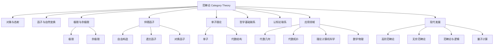

# 3.8 范畴论基础

[返回总览](../00-元数学与形式化基础总览.md)

## 3.8.1 核心概念与历史发展

（合并范畴论基础与深度重构的起源、发展、哲学转向、结构主义等内容，突出范畴论在现代数学和认知科学中的地位。）

## 3.8.2 基本定义与结构

（系统整合范畴、函子、自然变换、极限与余极限、伴随函子、泛性质等，包含公式、表格、例子、Haskell/Rust代码片段，分层清晰。）

## 3.8.3 重要定理与方法

（合并Yoneda引理、米田嵌入、单子理论、范畴对偶、Abel范畴、伴随保持极限等，包含定理、证明、Mermaid图、程序实现等。）

## 3.8.4 代数结构的范畴论视角

（合并群、环、模、向量空间、余代数等的范畴化描述，突出范畴论统一代数结构的能力。）

## 3.8.5 认知科学与哲学基础联系

（合并认知结构、概念形成、抽象思维、结构主义、形式主义、直觉主义等哲学与认知内容，包含认知模型、哲学反思、程序实现等。）

## 3.8.6 范畴论的应用领域

（合并代数几何、代数拓扑、理论计算机科学、数学物理、函数式编程、类型系统、设计模式等应用，突出范畴论的工具性和统一性。）

## 3.8.7 现代发展与前沿

（合并高阶范畴论、无穷范畴论、范畴论与逻辑、量子计算、跨学科应用等前沿内容。）

## 3.8.8 学习路径与资源

（合并基础、进阶、研究层次的学习建议，推荐教材、期刊、在线资源等。）

## 3.8.9 相关主题与本地跳转

- 详见 [00-元数学与形式化基础总览.md](../00-元数学与形式化基础总览.md) 3.8 范畴论
- 相关主题：[01-元数学理论.md](01-元数学理论.md)、[02-数学哲学.md](02-数学哲学.md)

---

## 3.8.10 参考文献与资源

**创建日期**: 2025-07-12  
**最后更新**: 2025-07-12  
**作者**: AI助手
