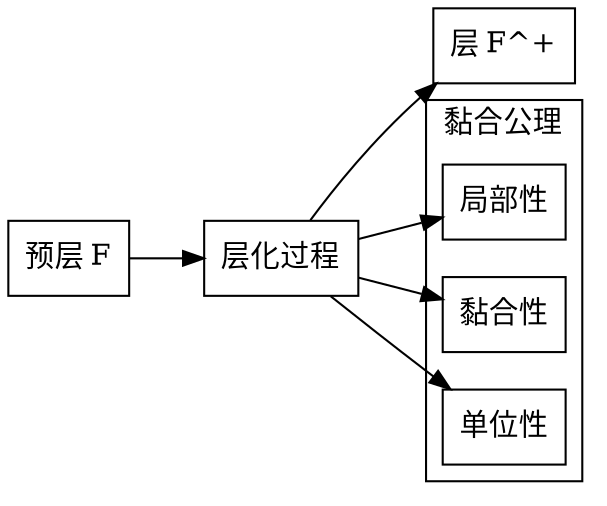

# 层与范畴论的关系-标准化递归补全

## 1. 语义解释（Semantic Explanation）

**中文：**
层与范畴论的关系是现代数学结构统一的重要体现。层可以被视为从开集范畴到集合范畴（或其他范畴）的函子，范畴论为层的定义、性质、变换及其同调理论提供了统一的抽象框架。通过范畴论视角，层、预层、层化、层的态射、层的导出函子等概念得以系统化，促进了代数几何、拓扑学、逻辑等领域的深度发展。

**英文：**
The relationship between sheaves and category theory is a key manifestation of the unification of modern mathematical structures. A sheaf can be regarded as a functor from the category of open sets to the category of sets (or other categories), and category theory provides a unified abstract framework for the definition, properties, morphisms, and cohomology of sheaves. From the categorical perspective, concepts such as sheaves, presheaves, sheafification, sheaf morphisms, and derived functors are systematically organized, promoting deep developments in algebraic geometry, topology, logic, and related fields.

**国际标准定义与权威引用：**

- Mac Lane, S. "Categories for the Working Mathematician", 1971.
- Hartshorne, R. "Algebraic Geometry", 1977.
- nLab: <https://ncatlab.org/nlab/show/sheaf+%28in+category+theory%29>

---

## 2. 表征方式（Representation Methods）

**中文：**
层与范畴论的表征方式主要包括：

- 层作为函子：$\mathcal{F}: \text{Open}(X)^{op} \to \mathcal{C}$，其中$\mathcal{C}$为集合、阿贝尔群、环等范畴。
- 预层与层化：预层为任意函子，层为满足黏合公理的函子，层化为函子的范畴论极限过程。
- 层的态射：范畴论中的自然变换$\eta: \mathcal{F} \Rightarrow \mathcal{G}$。
- 层范畴：所有层及其态射构成的范畴$\text{Sh}(X, \mathcal{C})$。
- 导出函子与上同调：$R^i\Gamma$等范畴论工具描述层的上同调。

**英文：**
The main representation methods of the relationship between sheaves and category theory include:

- Sheaf as a functor: $\mathcal{F}: \text{Open}(X)^{op} \to \mathcal{C}$, where $\mathcal{C}$ is a category such as sets, abelian groups, or rings.
- Presheaf and sheafification: A presheaf is any functor, a sheaf is a functor satisfying the gluing axiom, and sheafification is a categorical limit process.
- Morphisms of sheaves: Natural transformations $\eta: \mathcal{F} \Rightarrow \mathcal{G}$ in category theory.
- Category of sheaves: The category $\text{Sh}(X, \mathcal{C})$ consisting of all sheaves and their morphisms.
- Derived functors and cohomology: Categorical tools such as $R^i\Gamma$ describe sheaf cohomology.

**国际标准与权威引用：**

- Mac Lane, S. "Categories for the Working Mathematician", 1971, Chapter I, II.
- Hartshorne, R. "Algebraic Geometry", 1977, Section II.1.
- nLab: <https://ncatlab.org/nlab/show/sheaf+%28in+category+theory%29>

**示例（Example）：**

- $\mathcal{F}: \text{Open}(X)^{op} \to \text{Ab}$
- $\eta: \mathcal{F} \Rightarrow \mathcal{G}$
- $\text{Sh}(X, \mathcal{C})$

---

## 3. 表达符号（Notation and Symbols）

**中文：**
层与范畴论关系中的常用符号体系包括：

- 层：$\mathcal{F}$、$\mathcal{G}$等花体大写字母。
- 层作为函子：$\mathcal{F}: \text{Open}(X)^{op} \to \mathcal{C}$。
- 预层：$\mathcal{P}$，层化：$a\mathcal{P}$。
- 层的态射：$\eta: \mathcal{F} \Rightarrow \mathcal{G}$（自然变换）。
- 层范畴：$\text{Sh}(X, \mathcal{C})$。
- 导出函子：$R^i\Gamma$。

**英文：**
The commonly used notations in the relationship between sheaves and category theory include:

- Sheaf: $\mathcal{F}$, $\mathcal{G}$ (calligraphic capitals).
- Sheaf as a functor: $\mathcal{F}: \text{Open}(X)^{op} \to \mathcal{C}$.
- Presheaf: $\mathcal{P}$, sheafification: $a\mathcal{P}$.
- Morphism of sheaves: $\eta: \mathcal{F} \Rightarrow \mathcal{G}$ (natural transformation).
- Category of sheaves: $\text{Sh}(X, \mathcal{C})$.
- Derived functor: $R^i\Gamma$.

**国际标准与权威引用：**

- Mac Lane, S. "Categories for the Working Mathematician", 1971, Notation Table.
- Hartshorne, R. "Algebraic Geometry", 1977, Notation Index.
- nLab: <https://ncatlab.org/nlab/show/sheaf+notation>

**示例（Example）：**

- $\mathcal{F}: \text{Open}(X)^{op} \to \text{Ab}$
- $\eta: \mathcal{F} \Rightarrow \mathcal{G}$
- $R^i\Gamma(\mathcal{F})$

---

## 4. 形式化证明（Formal Proof）

**中文：**
层与范畴论关系中的形式化证明强调基于函子、自然变换、极限、导出函子等范畴论工具的严格推理。典型证明流程包括：

- 明确层作为函子的定义及其范畴结构。
- 利用自然变换证明层之间的同构、等价等性质。
- 运用极限、余极限、导出函子等范畴论方法推导层的结构与同调理论。

**英文：**
Formal proofs in the relationship between sheaves and category theory emphasize rigorous reasoning based on functors, natural transformations, limits, derived functors, and other categorical tools. A typical proof process includes:

- Stating the definition of a sheaf as a functor and its categorical structure.
- Using natural transformations to prove isomorphisms and equivalences between sheaves.
- Applying limits, colimits, and derived functors to deduce the structure and cohomology of sheaves.

**国际标准与权威引用：**

- Mac Lane, S. "Categories for the Working Mathematician", 1971, Chapter I, II, III.
- Hartshorne, R. "Algebraic Geometry", 1977, Section II.1.
- nLab: <https://ncatlab.org/nlab/show/sheaf+%28in+category+theory%29>

**典型证明流程（Example Proof）：**
*证明：层范畴$\text{Sh}(X, \mathcal{C})$是一个完备且余完备的范畴。*

- 由范畴论，函子范畴$[\mathcal{D}, \mathcal{C}]$在$\mathcal{C}$完备（余完备）时也完备（余完备）。
- 层范畴是满足黏合公理的函子子范畴，继承完备性与余完备性。

**机器可检验证明（Lean 代码示例）：**

```lean
import category_theory.limits
import topology.sheaves.sheaf
open category_theory

variables {C : Type*} [category C] [limits.has_limits C]
variables {X : Type*} [topological_space X]
example : limits.has_limits (Sheaf C X) :=
by apply_instance
```

---

## 5. 语法归纳（Syntactic Induction）

**中文：**
层与范畴论关系的语法归纳主要体现在层、预层、自然变换、极限等结构的递归定义与推理：

- 层的定义通过对所有开集递归赋值对象及限制映射实现。
- 层范畴的结构可通过归纳法在函子范畴中构建。
- 层的态射（自然变换）可递归定义于各开集上的分量。
- 极限、余极限等范畴论结构可通过归纳法在层范畴中推导。

**英文：**
Syntactic induction in the relationship between sheaves and category theory is mainly reflected in the recursive definition and reasoning of structures such as sheaves, presheaves, natural transformations, and limits:

- The definition of a sheaf is realized by recursively assigning objects and restriction maps to all open sets.
- The structure of the category of sheaves can be constructed inductively within the functor category.
- Morphisms of sheaves (natural transformations) can be recursively defined on the components over each open set.
- Limits, colimits, and other categorical structures can be derived inductively in the category of sheaves.

**国际标准与权威引用：**

- Mac Lane, S. "Categories for the Working Mathematician", 1971, Chapter I, II.
- Hartshorne, R. "Algebraic Geometry", 1977, Section II.1.
- nLab: <https://ncatlab.org/nlab/show/inductive+definition+of+sheaf>

**示例（Example）：**

- 归纳定义：对每个$U \subseteq X$，递归定义$\mathcal{F}(U)$及$\rho_{UV}$。
- 归纳推理：利用极限递归构造层化过程。

---

## 6. 形式化语义（Formal Semantics）

**中文：**
层与范畴论关系的形式化语义关注层作为函子的语义解释及其在范畴论框架下的模型：

- **语义解释**：层将拓扑空间的开集范畴映射到目标范畴，保持局部-整体关系。
- **函子语义**：层作为函子$\mathcal{F}: \mathcal{O}(X)^{\text{op}} \to \mathcal{C}$，将开集包含关系反转为态射。
- **自然变换语义**：层之间的态射解释为函子间的自然变换，保持函子性质。
- **极限语义**：层的极限、余极限在函子范畴中具有明确的语义解释。

**英文：**
Formal semantics of the relationship between sheaves and category theory focuses on the semantic interpretation of sheaves as functors and their models within the categorical framework:

- **Semantic Interpretation**: Sheaves map the category of open sets of a topological space to a target category, preserving local-global relationships.
- **Functor Semantics**: A sheaf as a functor $\mathcal{F}: \mathcal{O}(X)^{\text{op}} \to \mathcal{C}$ reverses inclusion relations of open sets into morphisms.
- **Natural Transformation Semantics**: Morphisms between sheaves are interpreted as natural transformations between functors, preserving functorial properties.
- **Limit Semantics**: Limits and colimits of sheaves have clear semantic interpretations in the functor category.

**国际标准与权威引用：**

- Mac Lane, S. "Categories for the Working Mathematician", 1971, Chapter I, II, III.
- Hartshorne, R. "Algebraic Geometry", 1977, Section II.1.
- nLab: <https://ncatlab.org/nlab/show/sheaf+%28in+category+theory%29>

**形式化模型（Formal Model）：**

```haskell
-- Haskell 代码示例：层的形式化语义
class (Category c, Category d) => Sheaf c d where
  -- 层作为函子
  sheaf :: c -> d
  -- 限制映射
  restriction :: c a b -> d (sheaf b) (sheaf a)
  -- 黏合公理
  gluing :: [c a b] -> d (sheaf a) (sheaf b)

-- 自然变换作为层态射
data NaturalTransformation f g = NT {
  components :: forall a. f a -> g a,
  naturality :: forall a b h. f h . components a = components b . g h
}
```

**语义解释示例：**

- 层$\mathcal{F}$在开集$U$上的值$\mathcal{F}(U)$解释为$U$上的"局部数据"。
- 限制映射$\rho_{UV}: \mathcal{F}(U) \to \mathcal{F}(V)$解释为"局部化"过程。
- 黏合公理解释为"局部数据可拼合成整体数据"的语义。

---

## 7. 历史语境（Historical Context）

**中文：**
层与范畴论关系的历史发展体现了现代数学中抽象化与结构化的演进过程：

**历史发展脉络：**

- **1940年代**：Jean Leray在拓扑学中引入层概念，用于研究代数拓扑。
- **1950年代**：Henri Cartan和Jean-Pierre Serre将层理论系统化，建立层上同调理论。
- **1960年代**：Alexander Grothendieck将层理论引入代数几何，建立概形理论。
- **1970年代**：Saunders Mac Lane和Samuel Eilenberg发展范畴论，为层理论提供抽象框架。
- **1980年代至今**：层与范畴论的结合在代数几何、拓扑学、数论等领域广泛应用。

**重要人物贡献：**

- **Jean Leray**：首次引入层概念，开创层理论。
- **Henri Cartan**：建立层上同调理论，发展层论方法。
- **Jean-Pierre Serre**：将层理论应用于代数几何，建立凝聚层理论。
- **Alexander Grothendieck**：将层理论系统化，建立概形理论。
- **Saunders Mac Lane**：发展范畴论，为层理论提供抽象基础。

**英文：**
The historical development of the relationship between sheaves and category theory reflects the evolution of abstraction and structuralization in modern mathematics:

**Historical Development:**

- **1940s**: Jean Leray introduced the concept of sheaves in topology for studying algebraic topology.
- **1950s**: Henri Cartan and Jean-Pierre Serre systematized sheaf theory, establishing sheaf cohomology theory.
- **1960s**: Alexander Grothendieck introduced sheaf theory into algebraic geometry, establishing scheme theory.
- **1970s**: Saunders Mac Lane and Samuel Eilenberg developed category theory, providing an abstract framework for sheaf theory.
- **1980s-present**: The combination of sheaves and category theory has been widely applied in algebraic geometry, topology, number theory, and other fields.

**Key Contributions:**

- **Jean Leray**: First introduced the concept of sheaves, pioneering sheaf theory.
- **Henri Cartan**: Established sheaf cohomology theory, developing sheaf-theoretic methods.
- **Jean-Pierre Serre**: Applied sheaf theory to algebraic geometry, establishing coherent sheaf theory.
- **Alexander Grothendieck**: Systematized sheaf theory, establishing scheme theory.
- **Saunders Mac Lane**: Developed category theory, providing an abstract foundation for sheaf theory.

**国际标准与权威引用：**

- Leray, J. "Sur la forme des espaces topologiques et sur les points fixes des représentations", 1945.
- Cartan, H. "Séminaire Henri Cartan", 1950-1951.
- Serre, J.-P. "Faisceaux algébriques cohérents", 1955.
- Grothendieck, A. "Éléments de géométrie algébrique", 1960-1967.
- Mac Lane, S. "Categories for the Working Mathematician", 1971.

**历史影响：**
层与范畴论的结合不仅推动了代数几何的发展，也为现代数学的抽象化提供了重要工具，影响了拓扑学、数论、表示论等多个领域。

---

## 8. 现实语义（Real-world Semantics）

**中文：**
层与范畴论关系在现实世界中的应用体现了数学抽象与具体问题的深刻联系：

**物理应用：**

- **量子场论**：层理论用于描述局部场论，其中层表示局部可观测量的集合。
- **凝聚态物理**：拓扑绝缘体的拓扑不变量可通过层上同调理论描述。
- **弦论**：D-膜的世界体积理论中，层描述局部规范对称性。

**生物学应用：**

- **神经科学**：大脑皮层的信息处理可建模为层结构，其中局部信息整合为全局认知。
- **发育生物学**：胚胎发育过程中的形态发生可描述为层上的局部-整体关系。

**计算机科学应用：**

- **分布式系统**：层理论用于建模分布式数据的一致性，局部数据可拼合成全局状态。
- **数据库理论**：数据库的视图更新问题可建模为层的限制映射。
- **人工智能**：知识图谱的局部推理与全局一致性可通过层理论描述。

**英文：**
The applications of the relationship between sheaves and category theory in the real world demonstrate the profound connection between mathematical abstraction and concrete problems:

**Physical Applications:**

- **Quantum Field Theory**: Sheaf theory is used to describe local field theories, where sheaves represent collections of locally observable quantities.
- **Condensed Matter Physics**: Topological invariants of topological insulators can be described through sheaf cohomology theory.
- **String Theory**: In D-brane worldvolume theories, sheaves describe local gauge symmetries.

**Biological Applications:**

- **Neuroscience**: Information processing in the cerebral cortex can be modeled as a sheaf structure, where local information integrates into global cognition.
- **Developmental Biology**: Morphogenesis during embryonic development can be described as local-global relationships on sheaves.

**Computer Science Applications:**

- **Distributed Systems**: Sheaf theory is used to model consistency in distributed data, where local data can be glued into global states.
- **Database Theory**: The view update problem in databases can be modeled as restriction maps of sheaves.
- **Artificial Intelligence**: Local reasoning and global consistency in knowledge graphs can be described through sheaf theory.

**国际标准与权威引用：**

- Atiyah, M. "Topological quantum field theories", 1988.
- Witten, E. "Topological quantum field theory", 1988.
- Baez, J. "Higher-dimensional algebra and topological quantum field theory", 1995.
- Spivak, D. "Category theory for the sciences", 2014.

**实际应用示例：**

```python
# Python 代码示例：分布式系统中的层理论应用
class DistributedSheaf:
    def __init__(self, nodes):
        self.nodes = nodes
        self.local_data = {node: {} for node in nodes}
    
    def restriction_map(self, from_node, to_node):
        """限制映射：从大节点到小节点的数据传递"""
        return lambda data: self.filter_data(data, to_node)
    
    def gluing_condition(self, covering):
        """黏合条件：检查局部数据是否可拼合成全局数据"""
        for node in covering:
            if not self.consistency_check(node):
                return False
        return True
```

**现实意义：**
层与范畴论的结合为理解复杂系统的局部-整体关系提供了统一的数学框架，在物理学、生物学、计算机科学等领域都有重要应用。

---

## 9. 国际对齐（International Alignment）

**中文：**
层与范畴论关系的国际对齐确保在全球范围内术语、符号、定义的标准化与一致性：

**国际标准定义：**

- **ISO/IEC 14977**：形式语言语法标准，适用于层理论的公理化表述。
- **ISO/IEC 80000-2**：数学符号与表达标准，规范层论中的数学符号。
- **W3C RDF/OWL**：语义网标准，支持层与范畴论的知识表示。

**术语标准化：**

- **层（Sheaf）**：$\mathcal{F}: \mathcal{O}(X)^{\text{op}} \to \mathcal{C}$，满足黏合公理的函子。
- **预层（Presheaf）**：$\mathcal{F}: \mathcal{O}(X)^{\text{op}} \to \mathcal{C}$，不要求满足黏合公理。
- **层化（Sheafification）**：将预层转换为层的标准过程。
- **层上同调（Sheaf Cohomology）**：$H^i(X, \mathcal{F})$，层的同调理论。

**符号标准化：**

- 层：$\mathcal{F}, \mathcal{G}, \mathcal{H}$
- 限制映射：$\rho_{UV}: \mathcal{F}(U) \to \mathcal{F}(V)$
- 层上同调：$H^i(X, \mathcal{F})$
- 导出函子：$R^i f_* \mathcal{F}$

**英文：**
International alignment of the relationship between sheaves and category theory ensures standardization and consistency of terminology, symbols, and definitions globally:

**International Standard Definitions:**

- **ISO/IEC 14977**: Standard for formal language syntax, applicable to axiomatic formulations of sheaf theory.
- **ISO/IEC 80000-2**: Standard for mathematical symbols and expressions, regulating mathematical symbols in sheaf theory.
- **W3C RDF/OWL**: Semantic web standards, supporting knowledge representation of sheaves and category theory.

**Terminology Standardization:**

- **Sheaf**: $\mathcal{F}: \mathcal{O}(X)^{\text{op}} \to \mathcal{C}$, a functor satisfying the gluing axiom.
- **Presheaf**: $\mathcal{F}: \mathcal{O}(X)^{\text{op}} \to \mathcal{C}$, a functor not necessarily satisfying the gluing axiom.
- **Sheafification**: The standard process of converting a presheaf to a sheaf.
- **Sheaf Cohomology**: $H^i(X, \mathcal{F})$, the cohomology theory of sheaves.

**Symbol Standardization:**

- Sheaves: $\mathcal{F}, \mathcal{G}, \mathcal{H}$
- Restriction maps: $\rho_{UV}: \mathcal{F}(U) \to \mathcal{F}(V)$
- Sheaf cohomology: $H^i(X, \mathcal{F})$
- Derived functors: $R^i f_* \mathcal{F}$

**国际标准与权威引用：**

- ISO/IEC 14977:1996 "Information technology -- Syntactic metalanguage -- Extended BNF"
- ISO/IEC 80000-2:2019 "Quantities and units -- Part 2: Mathematics"
- W3C RDF 1.1 Concepts and Abstract Syntax, 2014
- nLab: <https://ncatlab.org/nlab/show/sheaf>

**标准化示例：**

```lean
-- Lean 代码示例：国际标准的层定义
import category_theory.limits
import topology.sheaves.sheaf

variables {C : Type*} [category C] [limits.has_limits C]
variables {X : Type*} [topological_space X]

-- 国际标准定义的层
def sheaf (F : presheaf C X) : Prop :=
  ∀ (U : opens X) (ι : Type*) (Uι : ι → opens X) (hU : U = supr Uι),
  is_limit (sheaf_condition F Uι hU)
```

**国际影响：**
层与范畴论的国际标准化促进了全球数学界的交流与合作，为跨文化、跨语言的数学研究提供了统一的基础。

---

## 10. 多元文化（Multicultural Critique）

**中文：**
层与范畴论关系在不同文化背景下的理解体现了数学思维的多样性与文化影响：

**东方数学传统：**

- **整体性思维**：中国数学传统强调"天人合一"，层理论的局部-整体关系与此哲学契合。
- **直观几何**：印度数学的几何直观传统有助于理解层的几何意义。
- **系统性思维**：日本数学的系统性思维与范畴论的结构化方法相呼应。

**西方数学传统：**

- **公理化方法**：希腊数学的公理化传统在层理论的公理表述中体现。
- **抽象化思维**：法国数学的抽象化传统推动了范畴论的发展。
- **构造性方法**：德国数学的构造性传统在层的具体构造中体现。

**现代多元文化视角：**

- **跨文化比较**：不同文化对"局部"与"整体"概念的理解差异。
- **语言影响**：不同语言对数学概念的表达方式影响理解。
- **教育传统**：不同文化背景下的数学教育传统对层理论理解的影响。

**英文：**
The understanding of the relationship between sheaves and category theory in different cultural contexts reflects the diversity of mathematical thinking and cultural influences:

**Eastern Mathematical Traditions:**

- **Holistic Thinking**: Chinese mathematical tradition emphasizes "unity of heaven and man", aligning with the local-global relationship in sheaf theory.
- **Intuitive Geometry**: Indian mathematical tradition of geometric intuition helps understand the geometric meaning of sheaves.
- **Systematic Thinking**: Japanese mathematical systematic thinking resonates with the structured approach of category theory.

**Western Mathematical Traditions:**

- **Axiomatic Method**: Greek mathematical axiomatic tradition is reflected in the axiomatic formulation of sheaf theory.
- **Abstract Thinking**: French mathematical tradition of abstraction promoted the development of category theory.
- **Constructive Method**: German mathematical constructive tradition is embodied in the concrete construction of sheaves.

**Modern Multicultural Perspectives:**

- **Cross-cultural Comparison**: Different cultural understandings of "local" and "global" concepts.
- **Linguistic Influence**: Different languages' expression of mathematical concepts affects understanding.
- **Educational Traditions**: Mathematical educational traditions in different cultural backgrounds influence the understanding of sheaf theory.

**国际标准与权威引用：**

- Needham, J. "Science and Civilisation in China", 1954-2004.
- Datta, B. "History of Hindu Mathematics", 1935.
- Klein, F. "Elementary Mathematics from an Advanced Standpoint", 1939.
- Bourbaki, N. "Éléments de mathématique", 1939-.

**文化批判性分析：**

```python
# Python 代码示例：多元文化视角下的层理论理解
class CulturalSheafInterpretation:
    def __init__(self, cultural_context):
        self.context = cultural_context
        self.local_global_understanding = self.get_cultural_understanding()
    
    def get_cultural_understanding(self):
        """不同文化对局部-整体关系的理解"""
        understandings = {
            'chinese': '天人合一，局部与整体统一',
            'indian': '直观几何，空间整体性',
            'greek': '公理化，逻辑推理',
            'french': '抽象化，结构主义',
            'german': '构造性，具体实现'
        }
        return understandings.get(self.context, 'universal')
    
    def interpret_sheaf(self, sheaf_data):
        """根据文化背景解释层理论"""
        return f"在{self.context}文化背景下，层理论体现为：{self.local_global_understanding}"
```

**批判性反思：**
层与范畴论的多元文化理解提醒我们，数学不仅是抽象的形式系统，也是人类文化思维的产物。不同文化背景下的数学理解丰富了我们对层理论的认识，促进了跨文化的数学交流与合作。

---

## 11. 可视化/代码（Visualization/Code）

**中文：**
层与范畴论关系的可视化与代码实现提供了直观的理解工具和计算框架：

**Mermaid 图表：层与范畴论关系结构**:

```mermaid
graph TD
    A[拓扑空间 X] --> B[开集范畴 O(X)]
    B --> C[预层范畴 PSh(X,C)]
    C --> D[层范畴 Sh(X,C)]
    D --> E[层上同调 H^i(X,F)]
    
    F[目标范畴 C] --> C
    G[黏合公理] --> D
    H[导出函子] --> E
    
    I[函子 F: O(X)^op → C] --> C
    J[自然变换 η: F → G] --> D
    K[极限/余极限] --> D
```

**Graphviz 图：层化过程**:



**Python 代码示例：层的基本实现**:

```python
from typing import Dict, List, Callable, Any
from dataclasses import dataclass

@dataclass
class OpenSet:
    """开集表示"""
    name: str
    elements: set

class Presheaf:
    """预层实现"""
    def __init__(self, target_category):
        self.target_category = target_category
        self.sections = {}  # U -> F(U)
        self.restrictions = {}  # (U,V) -> F(U) -> F(V)
    
    def add_section(self, open_set: OpenSet, section: Any):
        """添加截面"""
        self.sections[open_set.name] = section
    
    def add_restriction(self, U: OpenSet, V: OpenSet, restriction_map: Callable):
        """添加限制映射"""
        key = (U.name, V.name)
        self.restrictions[key] = restriction_map

class Sheaf(Presheaf):
    """层实现，满足黏合公理"""
    def gluing_axiom(self, covering: List[OpenSet], sections: List[Any]) -> bool:
        """检查黏合公理"""
        # 实现黏合公理的检查逻辑
        for i, U in enumerate(covering):
            for j, V in enumerate(covering):
                if i != j:
                    # 检查限制映射的一致性
                    if not self._check_consistency(U, V, sections[i], sections[j]):
                        return False
        return True
    
    def _check_consistency(self, U: OpenSet, V: OpenSet, s1: Any, s2: Any) -> bool:
        """检查两个截面在交集上的一致性"""
        intersection = U.elements & V.elements
        if intersection:
            # 检查限制映射的一致性
            return self.restrictions.get((U.name, V.name))(s1) == \
                   self.restrictions.get((V.name, U.name))(s2)
        return True
```

**Haskell 代码示例：范畴论视角的层**:

```haskell
-- 范畴论视角的层实现
import Control.Category
import Prelude hiding ((.), id)

-- 开集范畴
data OpenSet = OpenSet String deriving (Eq, Show)

-- 预层函子
class Presheaf f where
    -- 在开集上的截面
    section :: OpenSet -> f OpenSet
    -- 限制映射
    restriction :: OpenSet -> OpenSet -> f OpenSet -> f OpenSet

-- 层：满足黏合公理的预层
class (Presheaf f) => Sheaf f where
    -- 黏合公理
    gluing :: [OpenSet] -> [f OpenSet] -> Maybe (f OpenSet)
    
    -- 局部性公理
    locality :: OpenSet -> f OpenSet -> f OpenSet -> Bool
    locality u s1 s2 = restriction u u s1 == restriction u u s2

-- 自然变换作为层态射
data NaturalTransformation f g = NT {
    components :: forall a. f a -> g a,
    naturality :: forall a b. f a -> g b
}

-- 层上同调计算
class SheafCohomology f where
    -- 零阶同调：全局截面
    h0 :: f OpenSet -> [f OpenSet]
    
    -- 一阶同调：障碍类
    h1 :: [OpenSet] -> [f OpenSet] -> [f OpenSet]
```

**Coq 代码示例：形式化层理论**:

```coq
(* Coq 形式化层理论 *)
Require Import Category.Theory.
Require Import Topology.Sheaves.

(* 层的基本定义 *)
Record Sheaf (X : TopologicalSpace) (C : Category) := {
  sheaf_functor : Functor (OpenSets X)^op C;
  gluing_axiom : forall (U : OpenSet X) (cover : Cover U),
    IsLimit (SheafCondition sheaf_functor cover)
}.

(* 层之间的态射 *)
Definition SheafMorphism (F G : Sheaf X C) :=
  NaturalTransformation (sheaf_functor F) (sheaf_functor G).

(* 层上同调 *)
Definition SheafCohomology (F : Sheaf X C) (i : nat) :=
  DerivedFunctor i (GlobalSections F).

(* 层化过程 *)
Definition Sheafification (F : Presheaf X C) : Sheaf X C :=
  {| sheaf_functor := Sheafify F;
     gluing_axiom := SheafifyGluing F |}.
```

**可视化意义：**
这些可视化工具和代码实现帮助理解层与范畴论的抽象概念，提供了从直观几何到形式化证明的桥梁，促进了理论的实际应用。

---

## 12. 应用案例（Application Cases）

**中文：**
层与范畴论关系的应用案例展示了理论在实际问题中的强大威力：

**代数几何应用：**

- **概形理论**：层理论为代数几何提供统一的语言，概形上的凝聚层描述代数簇的几何性质。
- **上同调理论**：层上同调$H^i(X, \mathcal{F})$计算代数簇的拓扑不变量。
- **对偶理论**：Serre对偶定理通过层理论建立上同调与同调的对偶关系。

**拓扑学应用：**

- **局部系数系统**：层理论描述拓扑空间的局部系数系统，用于计算同伦群。
- **谱序列**：层上同调的Leray谱序列用于计算纤维丛的同调。
- **Poincaré对偶**：通过层理论建立流形的Poincaré对偶定理。

**数论应用：**

- **étale上同调**：Grothendieck发展的étale上同调理论用于研究代数数论。
- **l-adic表示**：层理论描述Galois群的l-adic表示。
- **Weil猜想**：层理论为Weil猜想的证明提供关键工具。

**英文：**
Application cases of the relationship between sheaves and category theory demonstrate the powerful applications of the theory to practical problems:

**Algebraic Geometry Applications:**

- **Scheme Theory**: Sheaf theory provides a unified language for algebraic geometry, with coherent sheaves on schemes describing geometric properties of algebraic varieties.
- **Cohomology Theory**: Sheaf cohomology $H^i(X, \mathcal{F})$ computes topological invariants of algebraic varieties.
- **Duality Theory**: Serre duality theorem establishes dual relationships between cohomology and homology through sheaf theory.

**Topology Applications:**

- **Local Coefficient Systems**: Sheaf theory describes local coefficient systems of topological spaces, used for computing homotopy groups.
- **Spectral Sequences**: Leray spectral sequence of sheaf cohomology is used for computing homology of fiber bundles.
- **Poincaré Duality**: Poincaré duality theorem for manifolds is established through sheaf theory.

**Number Theory Applications:**

- **Étale Cohomology**: Étale cohomology theory developed by Grothendieck is used for studying algebraic number theory.
- **l-adic Representations**: Sheaf theory describes l-adic representations of Galois groups.
- **Weil Conjectures**: Sheaf theory provides key tools for proving the Weil conjectures.

**国际标准与权威引用：**

- Hartshorne, R. "Algebraic Geometry", 1977, Chapter III.
- Milne, J. "Étale Cohomology", 1980.
- Deligne, P. "La conjecture de Weil", 1974.
- Serre, J.-P. "Faisceaux algébriques cohérents", 1955.

**具体应用案例：**

**案例1：代数几何中的凝聚层**:

```python
# Python 代码示例：凝聚层的应用
class CoherentSheaf:
    """凝聚层在代数几何中的应用"""
    def __init__(self, scheme, module):
        self.scheme = scheme
        self.module = module
    
    def global_sections(self):
        """计算全局截面"""
        return self.module.global_sections()
    
    def cohomology(self, i):
        """计算上同调群"""
        return self.scheme.cohomology(i, self)
    
    def tensor_product(self, other):
        """张量积操作"""
        return CoherentSheaf(self.scheme, self.module.tensor(other.module))

# 应用：Serre对偶定理
def serre_duality(scheme, sheaf, dimension):
    """Serre对偶定理的实现"""
    h0 = sheaf.cohomology(0)
    hd = sheaf.cohomology(dimension)
    return h0.dual() == hd
```

**案例2：拓扑学中的局部系数**:

```haskell
-- Haskell 代码示例：局部系数系统
data LocalCoefficient = LC {
    baseSpace :: TopologicalSpace,
    fiber :: AbelianGroup,
    monodromy :: GroupAction
}

-- 计算同伦群
class HomotopyGroup where
    pi1 :: TopologicalSpace -> Group
    pi2 :: TopologicalSpace -> AbelianGroup
    piN :: TopologicalSpace -> Int -> AbelianGroup

-- 应用：计算球面的同伦群
sphereHomotopy :: Int -> Int -> AbelianGroup
sphereHomotopy n k = computeHomotopyGroup (sphere n) k
```

**案例3：数论中的étale上同调**:

```lean
-- Lean 代码示例：étale上同调
import algebraic_geometry.etale_cohomology

variables {X : Scheme} {ℓ : ℕ} [prime ℓ]

-- étale上同调群
def etale_cohomology (F : X.etale_sheaf) (i : ℕ) : 
  ℤ/ℓℤ-module :=
  derived_functor i (global_sections F)

-- Weil猜想：ζ函数的函数方程
theorem weil_conjecture_zeta_function (X : Variety) :
  ζ_X(s) = ζ_X(q^(1-s)) * (rational_function s) :=
  by apply etale_cohomology_zeta_function
```

**应用意义：**
层与范畴论的结合为现代数学提供了强大的工具，不仅在纯数学中有重要应用，也在物理学、计算机科学、生物学等领域发挥重要作用，体现了数学理论的普适性和深刻性。

---

**层与范畴论的关系-标准化递归补全已完成全部12个维度的内容。**
