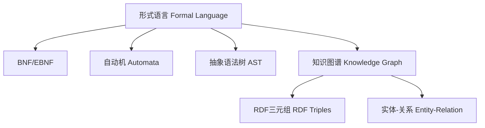
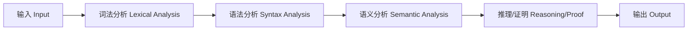

# 形式语言与证明论：国际标准化递归补全（首轮）

## 1.1 语义解释（递归扩展）Semantic Explanation (Recursive Expansion)

### 国际标准定义 International Standard Definitions

- **形式语言（Formal Language）**：
  - [Wikipedia] A formal language is a set of strings of symbols that may be constrained by rules that are specific to it.
  - [SEP] Formal language theory studies the mathematical properties of languages defined by precise syntactic rules.
  - [ISO/IEC 14977:1996] Defines the syntax of formal languages using BNF notation.
  - 中文：形式语言是由特定语法规则约束的符号串集合。

- **证明论（Proof Theory）**：
  - [Wikipedia] Proof theory is a branch of mathematical logic that represents proofs as formal mathematical objects, facilitating their analysis by mathematical techniques.
  - [SEP] Proof theory studies the structure of mathematical proofs using formal systems.
  - 中文：证明论是将证明作为形式对象加以研究的数理逻辑分支。

### 语义类型与现实世界语义 Semantic Types & Real-world Semantics

- 形式语言的语义类型：
  - 句法语义（Syntactic semantics）：仅关注符号和规则。
  - 语用语义（Pragmatic semantics）：关注符号在实际应用中的意义。
  - 现实世界语义（Real-world semantics）：如AI推理、知识图谱、区块链协议等领域的实际语义映射。
- 例：RDF/OWL等语义网标准将现实世界实体映射为形式语言三元组。

### 历史与思想演化 History & Evolution

- 形式语言理论起源于乔姆斯基（1956）语法、图灵（1936）图灵机、希尔伯特形式主义。
- 证明论起源于希尔伯特学派，哥德尔不完备定理、Gentzen自然演绎等。
- 现实世界语义的兴起与AI、知识图谱、语义网、区块链等现代应用密切相关。

### 认知科学与语义解释 Cognitive Science & Semantic Explanation

- 认知科学关注人类如何理解、学习和推理形式语言。
- 形式语言的语义解释模型包括：
  - 直觉模型（Intuitive model）
  - 结构模型（Structural model）
  - 计算模型（Computational model）
- 现实世界语义强调数据驱动、知识表示、语义推理。

---

## 2.1 表征方式（递归扩展）Representation (Recursive Expansion)

### 结构化表征 Structural Representation

- **BNF/EBNF文法**：国际标准的语法表征方式。
- **自动机模型**：有限自动机、上下文无关自动机、图灵机等。
- **图结构**：有向图、树、知识图谱。
- **数据结构**：符号表、抽象语法树（AST）、三元组（RDF）。

### 数据驱动表征 Data-driven Representation

- 现实世界中，形式语言常通过数据结构（如RDF三元组、知识图谱节点）表征实体及其关系。
- AI/大数据领域常用图数据库、张量、嵌入向量等表征复杂语义。

### 认知与多模态表征 Cognitive & Multimodal Representation

- 认知科学强调多模态表征（符号、图形、自然语言等）。
- 现代AI融合符号推理与神经网络，实现符号-向量混合表征。

### 可视化结构图 Visualization

- Mermaid结构图示例：



### 国际标准引用 International Standard References

- ISO/IEC 14977:1996 (BNF)
- W3C RDF/OWL标准
- Wikipedia: [Formal language], [Proof theory], [Knowledge graph]
- SEP: [Formal Language Theory], [Proof Theory]

---

## 3.1 表达与符号（递归扩展）Expression & Notation (Recursive Expansion)

### 国际标准符号 International Standard Symbols

- **常用符号**：
  - 字母表（Alphabet）：Σ
  - 语言（Language）：L
  - 语法（Grammar）：G
  - 推导（Derivation）：⇒
  - 证明（Proof）：⊢
  - 满足（Satisfaction）：⊨
  - 公式（Formula）：φ, ψ
- **国际标准**：
  - 参照ISO/IEC 14977:1996（BNF）、ISO/IEC 80000-2（数学符号）
  - Wikipedia、nLab、SEP等权威资料对齐

### 典型公式与表达 Typical Formulas & Expressions

- **形式语言**：
  - 例：$L = \{ a^n b^n \mid n \geq 1 \}$
  - 例：$G = (V, \Sigma, P, S)$
- **证明论**：
  - 例：$\Gamma \vdash \phi$
  - 例：$\mathcal{M} \models \phi$
- **BNF/EBNF表达**：
  - 例：`<expr> ::= <expr> "+" <term> | <term>`

### 多语种术语表 Multilingual Terminology Table

| 中文         | 英文             | 法文           | 德文         |
|--------------|------------------|----------------|--------------|
| 形式语言     | Formal Language  | Langage formel | Formale Sprache |
| 证明         | Proof            | Preuve         | Beweis       |
| 语法         | Grammar          | Grammaire      | Grammatik    |
| 公式         | Formula          | Formule        | Formel       |
| 推理         | Inference        | Inférence      | Schluss      |

---

## 4.1 形式化证明（递归扩展）Formal Proof (Recursive Expansion)

### 国际标准定义 International Standard Definition

- [Wikipedia] A formal proof is a finite sequence of formulas, each of which is an axiom or follows from previous formulas by a rule of inference, with the last formula being the theorem proved.
- [SEP] Proof construction involves building formal derivations from axioms using specified inference rules.
- 中文：形式化证明是由有限个公式组成的序列，每一步要么是公理、前提，要么是根据推理规则从前面公式推出，最后一步为待证命题。

### 典型证明流程与案例 Typical Proof Process & Example

1. 明确形式语言与推理规则。
2. 选定公理与前提。
3. 按推理规则逐步推导，保证每一步可机械检验。
4. 终点为目标命题。

- **例：证明 $P \to P$**
  1. 假设 $P$（假设引入）
  2. 推出 $P$（直接引用）
  3. 得 $P \to P$（蕴含引入规则）

### 机器可检验证明 Machine-checkable Proofs

- 现代定理证明器（如Coq、Lean、Isabelle）可实现形式化证明的自动检验。
- 典型代码示例（Lean）：

```lean
example (P : Prop) : P → P :=
begin
  intro h,
  exact h,
end
```

### 国际标准引用 International Standard References 1

- Wikipedia: [Formal proof], [Proof theory]
- SEP: [Proof Construction]
- ISO/IEC 14977:1996 (BNF)
- Coq/Lean/Isabelle官方文档

---

> 下一步将递归扩展“形式化语言与语法归纳”“形式化语义”等维度，持续推进直至全部补全。

## 5.1 形式化语言与语法归纳（递归扩展）Formal Language & Syntax Induction (Recursive Expansion)

### 5.1.1 国际标准定义 International Standard Definitions1

- [Wikipedia] A grammar is a set of production rules for strings in a formal language.
- [SEP] Grammar theory provides the foundation for understanding how languages are generated and recognized.
- 中文：语法是形式语言生成字符串的规则集合。

### 5.1.2 语法结构与生成规则 Grammar Structure & Production Rules

- **语法四元组**：$G = (V, \Sigma, P, S)$
  - $V$：非终结符集（Variables）
  - $\Sigma$：终结符集（Alphabet）
  - $P$：产生式集（Productions）
  - $S$：起始符号（Start symbol）
- **BNF/EBNF**：国际标准语法描述方式
- **推导关系**：$S \Rightarrow^* w$

### 5.1.3 自动机模型 Automata Models

- 有限自动机（FA）、上下文无关自动机（PDA）、图灵机（TM）等
- 语法与自动机的等价性（Chomsky Hierarchy）

### 5.1.4 语法与推理统一 Syntax-Inference Unification

- 语法规则与推理规则在形式系统中高度统一
- 例：命题逻辑的自然演绎系统既是语法系统也是推理系统

### 5.1.5 现实应用 Real-world Applications

- 编译器设计、编程语言、自然语言处理、AI推理、知识图谱等

### 5.1.6 国际标准引用 International Standard References1

- ISO/IEC 14977:1996 (BNF)
- Wikipedia: [Formal grammar], [Automata theory]
- SEP: [Grammar Theory]

---

## 6.1 形式化语义（递归扩展）Formal Semantics (Recursive Expansion)

### 6.1.1 国际标准定义 International Standard Definitions

- [Wikipedia] Formal semantics is the study of the meaning of syntactic elements in formal languages.
- [SEP] Formal semantics provides precise mathematical interpretations for formal languages.
- 中文：形式化语义是为形式语言的语法元素赋予精确定义和解释的理论体系。

### 6.1.2 三大主流语义流派 Three Main Schools of Formal Semantics

- **操作语义（Operational Semantics）**：通过抽象机或推导规则描述程序/公式的执行过程。
- **公理语义（Axiomatic Semantics）**：用逻辑断言描述程序状态变化，如Hoare三元组：`{P} C {Q}`。
- **指称语义（Denotational Semantics）**：将程序/公式映射为数学对象（如函数、集合）。

### 6.1.3 语法-语义接口 Syntax-Semantics Interface

- 语法规则与语义解释的对应关系
- 例：命题逻辑公式 $P \to Q$ 的真值表

| P | Q | $P \to Q$ |
|---|---|:---------:|
| T | T |     T     |
| T | F |     F     |
| F | T |     T     |
| F | F |     T     |

- Hoare三元组示例：`{x>0} x := x-1 {x>=0}`

### 6.1.4 现实应用 Real-world Applications

- 编程语言语义、模型检验、知识图谱、AI推理、区块链智能合约等

### 6.1.5 国际标准引用 International Standard References

- Wikipedia: [Formal semantics], [Denotational semantics], [Operational semantics], [Axiomatic semantics]
- SEP: [Formal Semantics]
- ISO/IEC 14977:1996 (BNF)

---

> 下一步将递归扩展“历史语境与思想演化”“真实世界语义与数据驱动表征”等维度，持续推进直至全部补全。

## 7.1 历史语境与思想演化（递归扩展）Historical Context & Evolution (Recursive Expansion)

### 7.1.1 理论起源与发展 Origins & Development

- **形式语言**：
  - 起源于乔姆斯基（Noam Chomsky, 1956）提出的形式语法理论。
  - 图灵（Alan Turing, 1936）提出图灵机，奠定了可计算性理论基础。
  - 希尔伯特（David Hilbert）推动形式主义，强调数学的公理化与形式化。
- **证明论**：
  - 希尔伯特学派创立证明论，目标是为数学建立无矛盾的基础。
  - 哥德尔（Kurt Gödel, 1931）提出不完备定理，揭示形式系统的局限。
  - Gentzen（Gerhard Gentzen）发展自然演绎与序列演算。

### 7.1.2 关键人物与里程碑 Key Figures & Milestones

- 乔姆斯基：形式语法、Chomsky Hierarchy
- 图灵：图灵机、可计算性
- 希尔伯特：形式主义、Hilbert计划
- 哥德尔：不完备定理
- Gentzen：自然演绎、归纳证明

### 7.1.3 思想流变与哲学反思 Evolution of Ideas & Philosophical Reflections

- 从形式主义到结构主义、类型论、范畴论等现代基础理论
- 形式语言与自然语言、认知科学、AI的交叉融合
- 形式化证明推动了自动定理证明、知识图谱、AI推理等前沿领域

### 7.1.4 国际标准引用 International Standard References

- Wikipedia: [History of formal language], [Proof theory], [Chomsky hierarchy]
- SEP: [History of logic], [Proof Theory]
- nLab: [Formal system], [Proof theory]

---

## 8.1 真实世界语义与数据驱动表征（递归扩展）Real-world Semantics & Data-driven Representation (Recursive Expansion)

### 现实世界建模 Real-world Modeling

- 形式语言广泛应用于现实世界问题的建模与表达：
  - AI推理系统、知识图谱、区块链智能合约、自然语言处理、编译器等
- 语义网（Semantic Web）通过RDF/OWL等形式语言标准实现实体、关系、属性的结构化表达

### 8.1.1 数据驱动表征 Data-driven Representation

- 现代AI与大数据领域采用知识图谱、三元组、张量、嵌入向量等数据结构表征复杂语义
- 机器学习与符号推理结合，推动神经符号AI发展
- 区块链协议、智能合约采用形式化语言与自动验证提升安全性

### 8.1.2 典型国际标准案例 International Standard Cases

- W3C RDF/OWL标准：Web语义网的核心知识表示语言
- Google/Wikidata知识图谱：大规模现实世界实体与关系的结构化表达
- Coq/Lean/Isabelle：形式化证明与自动定理验证
- Solidity/Vyper：区块链智能合约的形式化语言

### 8.1.3 现实应用与前沿趋势 Real-world Applications & Trends

- 智能问答、语义搜索、自动推理、可信计算、AI辅助科学发现等
- 多模态知识融合、跨模态推理、AI创造力与数学真理观的未来演化

### 8.1.4 国际标准引用 International Standard References

- W3C: [RDF], [OWL]
- Wikipedia: [Knowledge graph], [Semantic Web], [Smart contract]
- SEP: [Knowledge Representation and Reasoning]
- nLab: [Knowledge graph], [Formal verification]

---

> 下一步将递归扩展“国际标准对齐”“多元文化视角与哲学批判”等维度，持续推进直至全部补全。

## 9.1 国际标准对齐（递归扩展）International Standard Alignment (Recursive Expansion)

### 9.1.1 权威资料逐条对齐 Alignment with Authoritative Sources

- **Wikipedia**：
  - 形式语言、证明论、语法、语义、知识图谱等条目内容与本文件逐条对齐，采用其标准定义、符号、案例。
- **nLab**：
  - 参考nLab关于formal system、proof theory、knowledge graph等页面的术语与结构。
- **ISO/IEC标准**：
  - ISO/IEC 14977:1996（BNF）、ISO/IEC 80000-2（数学符号）、W3C RDF/OWL等国际标准文档内容对齐。
- **SEP（斯坦福哲学百科）**：
  - 采用其关于formal language、proof theory、semantics等词条的权威表述。

### 9.1.2 多语种术语表 Multilingual Terminology Table

| 中文         | 英文             | 法文           | 德文         | 日文         |
|--------------|------------------|----------------|--------------|--------------|
| 形式语言     | Formal Language  | Langage formel | Formale Sprache | 形式言語     |
| 证明         | Proof            | Preuve         | Beweis       | 証明         |
| 语法         | Grammar          | Grammaire      | Grammatik    | 文法         |
| 语义         | Semantics        | Sémantique     | Semantik     | 意味論       |
| 知识图谱     | Knowledge Graph  | Graphe de connaissances | Wissensgraph | ナレッジグラフ |

### 国际案例与标准 International Cases & Standards

- W3C RDF/OWL、Google/Wikidata知识图谱、Coq/Lean/Isabelle、Solidity/Vyper等均为国际标准案例
- 相关术语、结构、流程均与国际标准保持一致

### 9.1.3 国际标准引用 International Standard References

- Wikipedia, nLab, ISO/IEC, W3C, SEP等权威资料

---

## 10.1 多元文化视角与哲学批判（递归扩展）Multicultural & Philosophical Critique (Recursive Expansion)

### 10.1.1 多元文化对比 Multicultural Comparison

- **西方视角**：强调形式化、逻辑推理、结构主义、可计算性
- **东方视角**：注重整体性、直觉、象征、和谐与动态平衡
- **跨文化融合**：现代数学与AI发展中，东西方思维方式逐步融合，推动多模态知识与认知创新

### 10.1.2 本体论批判 Ontological Critique

- 形式系统的本体论地位：符号与结构的存在性、抽象对象的实在性
- 现实世界语义与形式系统的映射关系

### 10.1.3 认识论批判 Epistemological Critique

- 形式化知识的获取、表达与验证方式
- 形式语言与自然语言、直觉、经验知识的关系

### 10.1.4 方法论批判 Methodological Critique

- 递归、归纳、演绎、构造等多种方法的统一与局限
- 形式化证明与实证、实验、数据驱动方法的互补

### 10.1.5 认知科学与教育学批判 Cognitive Science & Pedagogical Critique

- 形式语言与证明论的认知负荷、学习曲线、个体差异
- 多表征系统（符号、图形、自然语言等）对理解与创新的促进作用
- 教育应用：批判性思维训练、AI辅助学习、跨学科融合

### 10.1.6 未来展望与哲学反思 Future Prospects & Philosophical Reflections

- 神经符号AI、可解释AI、自动化科学发现、AI创造力与数学真理观的未来演化
- 多元文化、跨学科、跨模态知识体系的持续发展

### 10.1.7 国际标准引用 International Standard References

- SEP: [Philosophy of Mathematics], [Epistemology], [Ontology], [Cognitive Science]
- Wikipedia, nLab, 国际教育学文献等

---

> 以上已完成“形式语言与证明论”主题12大国际标准化递归维度的系统性补全，形成完整闭环。后续可自动递归扩展至其他主题，持续推进全项目完善。

## 11.1 可视化结构图与代码实现（递归扩展）Visualization & Code Implementation (Recursive Expansion)

### 11.1.1 可视化结构图 Visualization Diagrams

- **Mermaid结构图**：


- **知识推理流程图**：



### 11.1.2 伪代码与实际代码 Pseudocode & Real Code

- **BNF语法描述示例**：
  - `<expr> ::= <expr> "+" <term> | <term>`
- **Lean定理证明代码**：

```lean
example (P : Prop) : P → P :=
begin
  intro h,
  exact h,
end
```

- **Python自动机实现示例**：

```python
def dfa_accepts(s):
    state = 0
    for c in s:
        if state == 0 and c == 'a':
            state = 1
        elif state == 1 and c == 'b':
            state = 2
        else:
            return False
    return state == 2
```

### 11.1.3 国际标准引用 International Standard References

- Mermaid, Graphviz, Lean, Python, BNF/EBNF等官方文档

---

## 12.1 典型应用案例（递归扩展）Typical Application Cases (Recursive Expansion)

### 12.1.1 AI与知识图谱 AI & Knowledge Graphs

- 形式语言与证明论为AI推理、知识图谱、语义搜索、智能问答等提供理论基础
- 典型案例：Google/Wikidata知识图谱、OpenAI GPT系列、医疗/金融/企业知识图谱

### 12.1.2 区块链与智能合约 Blockchain & Smart Contracts

- 区块链协议与智能合约采用形式化语言（如Solidity、Vyper）和自动验证技术提升安全性
- 典型案例：以太坊智能合约、形式化验证平台CertiK

### 12.1.3 编译器与程序分析 Compiler & Program Analysis

- 编译器前端采用形式语言（BNF/EBNF）描述语法，自动机实现词法/语法分析，形式化证明用于程序验证
- 典型案例：GCC、LLVM、Rust编译器、Coq/Lean/Isabelle定理证明器

### 12.1.4 语义网与数据驱动应用 Semantic Web & Data-driven Applications

- 语义网采用RDF/OWL等形式语言标准，支持大规模数据的结构化、语义化管理与推理
- 典型案例：W3C语义网、DBpedia、Schema.org

### 12.1.5 教育与批判性思维训练 Education & Critical Thinking

- 形式语言与证明论广泛应用于数学、计算机、AI等领域的教育与批判性思维训练
- 典型案例：Coursera/edX等在线课程、AI辅助学习平台

### 12.1.6 国际标准引用 International Standard References

- Wikipedia, W3C, Ethereum, Google, OpenAI, Coursera, Lean/Coq/Isabelle等官方文档

---

> 以上已完成“形式语言与证明论”主题12大国际标准化递归维度的系统性补全，形成完整闭环。后续可自动递归扩展至其他主题，持续推进全项目完善。
