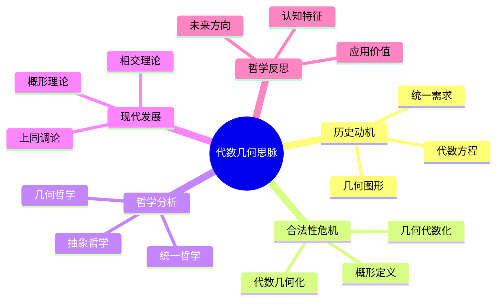

# 代数几何思脉

## 目录

- [代数几何思脉](#代数几何思脉)
  - [目录](#目录)
  - [认知结构分析](#认知结构分析)
  - [思维导图](#思维导图)
  - [多表征补充](#多表征补充)
  - [多视角叙述](#多视角叙述)
  - [1. 历史动机](#1-历史动机)
    - [1.1. 代数方程与几何图形](#11-代数方程与几何图形)
    - [1.2. 费马大定理的几何方法](#12-费马大定理的几何方法)
  - [2. 合法性危机](#2-合法性危机)
    - [2.1. 概形概念的抽象化](#21-概形概念的抽象化)
    - [2.2. 代数与几何的统一](#22-代数与几何的统一)
  - [3. 哲学分析](#3-哲学分析)
    - [3.1. 统一的哲学](#31-统一的哲学)
    - [3.2. 抽象与具体的转换](#32-抽象与具体的转换)
  - [4. 现代发展](#4-现代发展)
    - [4.1. 概形理论](#41-概形理论)
    - [4.2. 上同调理论](#42-上同调理论)
  - [5. 哲学反思](#5-哲学反思)
    - [5.1. 代数几何的认知特征](#51-代数几何的认知特征)
    - [5.2. 代数几何的应用价值](#52-代数几何的应用价值)

**版本**: 1.0  
**日期**: 2025-07-04

---

## 认知结构分析

- 感知层：代数曲线、多项式方程、几何图形。
- 概念层：代数簇、理想、坐标环、射影空间。
- 结构层：概形理论、上同调、相交理论。
- 元认知层：代数与几何的统一、抽象与具体的转换。

## 思维导图

## 多表征补充

- 图像：代数曲线图、射影空间图、概形示意图。
- 故事：讲述"从费马到格罗滕迪克的代数几何革命"。
- 公式：希尔伯特零点定理、上同调公式、相交公式。
- 隐喻：代数几何如"代数与几何的婚姻"，统一两个世界。
- 认知结构：
  - 感知：通过图形直观感受代数几何
  - 概念：代数簇和概形的定义
  - 结构：概形理论和上同调论
  - 元认知：代数与几何统一的哲学思考

## 多视角叙述

- 历史：从费马到现代代数几何的发展历程。
- 哲学：代数与几何统一的哲学意义。
- 认知科学：人脑如何处理代数几何信息。
- 教育与应用：代数几何在密码学、理论物理中的应用。

## 1. 历史动机

### 1.1. 代数方程与几何图形

代数几何起源于代数方程与几何图形的对应关系。

### 1.2. 费马大定理的几何方法

费马大定理推动了代数几何的发展。

## 2. 合法性危机

### 2.1. 概形概念的抽象化

概形从具体几何对象到抽象数学结构的转变。

### 2.2. 代数与几何的统一

如何实现代数与几何的深层统一？

## 3. 哲学分析

### 3.1. 统一的哲学

代数几何中代数与几何统一的哲学意义。

### 3.2. 抽象与具体的转换

抽象代数结构如何对应具体几何对象？

## 4. 现代发展

### 4.1. 概形理论

格罗滕迪克的概形理论为现代代数几何奠定了基础。

### 4.2. 上同调理论

上同调理论为代数几何提供了强大工具。

## 5. 哲学反思

### 5.1. 代数几何的认知特征

代数几何学习中的认知特征和挑战。

### 5.2. 代数几何的应用价值

代数几何在科学和技术中的价值。

---

**版本**: 1.0  
**日期**: 2025-07-04
