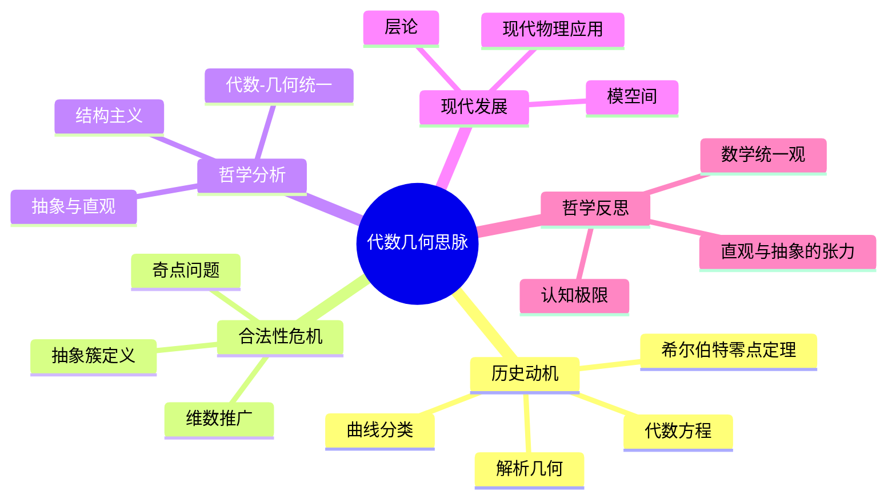

# 代数几何思脉深化：从代数方程到现代几何理论

## 目录

- [代数几何思脉深化：从代数方程到现代几何理论](#代数几何思脉深化从代数方程到现代几何理论)
  - [目录](#目录)
  - [认知结构分析](#认知结构分析)
  - [思维导图](#思维导图)
  - [多表征补充](#多表征补充)
  - [多视角叙述](#多视角叙述)
  - [1. 历史动机：代数与几何的统一](#1-历史动机代数与几何的统一)
    - [1.1. 笛卡尔的坐标几何](#11-笛卡尔的坐标几何)
      - [1.1.1. 笛卡尔的几何思想](#111-笛卡尔的几何思想)
      - [1.1.2. 解析几何的哲学基础](#112-解析几何的哲学基础)
    - [1.2. 牛顿的代数几何方法](#12-牛顿的代数几何方法)
      - [1.2.1. 牛顿的几何贡献](#121-牛顿的几何贡献)
      - [1.2.2. 牛顿的几何直觉](#122-牛顿的几何直觉)
    - [1.3. 黎曼的代数几何思想](#13-黎曼的代数几何思想)
      - [1.3.1. 黎曼曲面的概念](#131-黎曼曲面的概念)
      - [1.3.2. 黎曼的几何哲学](#132-黎曼的几何哲学)
  - [2. 合法性危机：几何基础的代数化](#2-合法性危机几何基础的代数化)
    - [2.1. 几何直觉的代数化](#21-几何直觉的代数化)
      - [2.1.1. 直觉与形式的冲突](#211-直觉与形式的冲突)
      - [2.1.2. 抽象化的哲学挑战](#212-抽象化的哲学挑战)
    - [2.2. 代数方法的几何化](#22-代数方法的几何化)
      - [2.2.1. 代数与几何的融合](#221-代数与几何的融合)
      - [2.2.2. 抽象代数几何](#222-抽象代数几何)
    - [2.3. 抽象代数几何的哲学挑战](#23-抽象代数几何的哲学挑战)
      - [2.3.1. 抽象程度的哲学问题](#231-抽象程度的哲学问题)
      - [2.3.2. 几何直觉的现代意义](#232-几何直觉的现代意义)
  - [3. 哲学分析：代数几何的多重维度](#3-哲学分析代数几何的多重维度)
    - [3.1. 本体论维度：代数几何对象的本质](#31-本体论维度代数几何对象的本质)
      - [3.1.1. 柏拉图主义观点](#311-柏拉图主义观点)
      - [3.1.2. 构造主义观点](#312-构造主义观点)
    - [3.2. 认识论维度：代数几何知识的性质](#32-认识论维度代数几何知识的性质)
      - [3.2.1. 先验知识论](#321-先验知识论)
      - [3.2.2. 经验主义观点](#322-经验主义观点)
    - [3.3. 方法论维度：代数几何研究的方法](#33-方法论维度代数几何研究的方法)
      - [3.3.1. 代数方法](#331-代数方法)
      - [3.3.2. 几何方法](#332-几何方法)
  - [4. 现代发展：从古典到现代](#4-现代发展从古典到现代)
    - [4.1. 现代代数几何的理论发展](#41-现代代数几何的理论发展)
      - [4.1.1. 概形理论](#411-概形理论)
      - [4.1.2. 上同调理论](#412-上同调理论)
    - [4.2. 概形理论的革命](#42-概形理论的革命)
      - [4.2.1. 概形的概念](#421-概形的概念)
      - [4.2.2. 概形的应用](#422-概形的应用)
    - [4.3. 代数几何的应用扩展](#43-代数几何的应用扩展)
      - [4.3.1. 数论应用](#431-数论应用)
      - [4.3.2. 数学物理应用](#432-数学物理应用)
  - [5. 哲学反思：代数几何的深层意义](#5-哲学反思代数几何的深层意义)
    - [5.1. 代数几何与数学统一](#51-代数几何与数学统一)
      - [5.1.1. 数学统一性](#511-数学统一性)
      - [5.1.2. 跨领域联系](#512-跨领域联系)
    - [5.2. 代数几何与人类认知](#52-代数几何与人类认知)
      - [5.2.1. 几何直觉](#521-几何直觉)
      - [5.2.2. 代数思维](#522-代数思维)
    - [5.3. 代数几何的文化价值](#53-代数几何的文化价值)
      - [5.3.1. 美学价值](#531-美学价值)
      - [5.3.2. 教育价值](#532-教育价值)

## 认知结构分析

- 感知层：平面曲线、交点、图像化方程。
- 概念层：代数方程、零点、奇点、维数。
- 结构层：簇、层、同调、模空间。
- 元认知层：代数与几何的统一、抽象结构的认知挑战。

## 思维导图

## 多表征补充

- 图像：代数曲线、曲面的可视化。
- 故事：笛卡尔"解析几何"、希尔伯特"零点定理"。
- 公式：代数曲线方程、模空间定义。
- 隐喻：代数几何如"方程的画布"，每个方程都画出一幅几何图。
- 认知结构：
  - 感知：画图、观察交点
  - 概念：方程与几何对象
  - 结构：簇、模空间
  - 元认知：代数与几何的统一

## 多视角叙述

- 历史：解析几何到现代代数几何的发展。
- 哲学：代数与几何的统一与张力。
- 认知科学：抽象结构与直观图像的认知转换。
- 教育与应用：代数几何在物理、信息等领域的应用，多表征教学建议。

**版本**: 1.0  
**日期**: 2025-07-04

---

## 1. 历史动机：代数与几何的统一

### 1.1. 笛卡尔的坐标几何

#### 1.1.1. 笛卡尔的几何思想

**历史背景**：

- **时间**：17世纪
- **背景**：科学革命，数学方法革新
- **社会环境**：文艺复兴，理性主义兴起

**笛卡尔的原话**：
> "几何学应该用代数方法来处理，代数应该用几何方法来解释。"
> —— 笛卡尔，《几何学》(1637)

**革命性贡献**：

- **坐标系统**：几何点的代数坐标表示
- **代数方程**：几何曲线的代数方程
- **统一方法**：代数与几何的统一方法

**哲学意义**：

- **方法统一**：代数与几何方法的统一
- **抽象化**：几何问题的代数化处理
- **工具性**：代数作为几何研究的工具

#### 1.1.2. 解析几何的哲学基础

**理论基础**：

- **坐标化**：几何空间的坐标化
- **代数化**：几何问题的代数化
- **分析化**：几何问题的分析化

**哲学意义**：

- **空间概念**：空间概念的数学化
- **几何直觉**：几何直觉的代数化
- **数学统一**：数学方法的统一性

### 1.2. 牛顿的代数几何方法

#### 1.2.1. 牛顿的几何贡献

**历史背景**：

- **时间**：17世纪后半叶
- **背景**：微积分发展，科学革命
- **社会环境**：英国科学革命，经验主义

**牛顿的贡献**：

- **曲线分类**：代数曲线的系统分类
- **切线方法**：代数曲线的切线方法
- **曲率计算**：代数曲线的曲率计算

**哲学意义**：

- **分类方法**：几何对象的分类方法
- **计算方法**：几何量的计算方法
- **应用价值**：几何理论的应用价值

#### 1.2.2. 牛顿的几何直觉

**直觉特征**：

- **运动几何**：几何与运动的结合
- **流数方法**：几何的流数方法
- **物理几何**：几何的物理应用

**哲学意义**：

- **物理几何**：几何与物理的联系
- **运动直觉**：运动在几何中的作用
- **应用导向**：几何的应用导向

### 1.3. 黎曼的代数几何思想

#### 1.3.1. 黎曼曲面的概念

**历史背景**：

- **时间**：19世纪中叶
- **背景**：复分析发展，抽象几何兴起
- **社会环境**：德国统一，科学理论化

**黎曼的贡献**：

- **黎曼曲面**：复函数的几何表示
- **代数函数**：代数函数的几何理论
- **拓扑方法**：几何的拓扑方法

**哲学意义**：

- **抽象化**：几何概念的抽象化
- **复几何**：复数在几何中的作用
- **拓扑联系**：几何与拓扑的联系

#### 1.3.2. 黎曼的几何哲学

**哲学思想**：

- **空间概念**：抽象空间的概念
- **几何直觉**：几何直觉的抽象化
- **数学统一**：数学理论的统一性

**对代数几何的影响**：

- **抽象方法**：代数几何的抽象方法
- **统一理论**：几何理论的统一性
- **现代发展**：代数几何的现代发展

## 2. 合法性危机：几何基础的代数化

### 2.1. 几何直觉的代数化

#### 2.1.1. 直觉与形式的冲突

**历史背景**：

- **时间**：19-20世纪
- **背景**：抽象数学发展，形式化方法
- **社会环境**：现代数学发展，逻辑主义

**冲突本质**：

- **几何直觉**：传统的几何直觉方法
- **代数形式**：现代的代数形式方法
- **认知方式**：不同的数学认知方式

**哲学问题**：

- **直觉价值**：几何直觉在数学中的价值
- **形式化程度**：数学形式化的程度
- **认知平衡**：直觉与形式的平衡

#### 2.1.2. 抽象化的哲学挑战

**抽象化过程**：

- **具体到抽象**：从具体几何到抽象几何
- **直观到形式**：从直观几何到形式几何
- **特殊到一般**：从特殊几何到一般几何

**哲学挑战**：

- **认知边界**：人类认知的边界
- **抽象程度**：数学抽象的程度
- **实用性**：抽象理论的实用性

### 2.2. 代数方法的几何化

#### 2.2.1. 代数与几何的融合

**融合过程**：

- **代数几何化**：代数方法的几何化
- **几何代数化**：几何方法的代数化
- **方法统一**：代数与几何方法的统一

**哲学意义**：

- **方法融合**：不同数学方法的融合
- **理论统一**：数学理论的统一性
- **认知整合**：数学认知的整合

#### 2.2.2. 抽象代数几何

**抽象特征**：

- **概形理论**：概形的抽象理论
- **上同调理论**：上同调的抽象理论
- **范畴方法**：代数几何的范畴方法

**哲学意义**：

- **抽象化**：几何概念的抽象化
- **统一性**：几何理论的统一性
- **现代性**：几何理论的现代性

### 2.3. 抽象代数几何的哲学挑战

#### 2.3.1. 抽象程度的哲学问题

**抽象层次**：

- **具体几何**：具体的几何对象
- **抽象几何**：抽象的几何概念
- **形式几何**：形式的几何理论

**哲学问题**：

- **抽象边界**：数学抽象的边界
- **认知能力**：人类认知的能力
- **实用价值**：抽象理论的实用价值

#### 2.3.2. 几何直觉的现代意义

**直觉作用**：

- **发现工具**：直觉在数学发现中的作用
- **理解工具**：直觉在数学理解中的作用
- **创造工具**：直觉在数学创造中的作用

**现代意义**：

- **认知价值**：几何直觉的认知价值
- **教育价值**：几何直觉的教育价值
- **文化价值**：几何直觉的文化价值

## 3. 哲学分析：代数几何的多重维度

### 3.1. 本体论维度：代数几何对象的本质

#### 3.1.1. 柏拉图主义观点

**核心主张**：

- **几何实在性**：代数几何对象是客观存在的
- **完美性**：代数几何对象具有完美性质
- **永恒性**：代数几何真理是永恒不变的

**对代数几何的意义**：

- **几何真理**：代数几何真理的客观性
- **几何美**：代数几何的审美价值
- **几何发现**：代数几何是发现而非发明

#### 3.1.2. 构造主义观点

**核心主张**：

- **几何构造性**：代数几何对象通过构造产生
- **心智依赖性**：代数几何依赖于人类心智
- **历史性**：代数几何具有历史发展性

**对代数几何的意义**：

- **构造方法**：代数几何的构造性方法
- **直觉基础**：代数几何的直觉基础
- **发展性**：代数几何的发展性

### 3.2. 认识论维度：代数几何知识的性质

#### 3.2.1. 先验知识论

**康德的观点**：

- **空间直觉**：空间是纯直觉形式
- **几何先验性**：几何知识具有先验性
- **综合判断**：几何是先验综合判断

**对代数几何的意义**：

- **直觉基础**：代数几何的直觉基础
- **先验结构**：代数几何的先验结构
- **必然性**：代数几何真理的必然性

#### 3.2.2. 经验主义观点

**密尔的主张**：

- **经验基础**：几何知识基于经验
- **归纳方法**：几何使用归纳方法
- **可修正性**：几何知识是可修正的

**对代数几何的意义**：

- **经验验证**：代数几何的经验验证
- **应用价值**：代数几何的应用价值
- **发展性**：代数几何知识的发展性

### 3.3. 方法论维度：代数几何研究的方法

#### 3.3.1. 代数方法

**方法特征**：

- **代数工具**：使用代数工具研究几何
- **方程方法**：通过方程研究几何对象
- **代数结构**：研究几何的代数结构

**在代数几何中的应用**：

- **多项式环**：几何对象的代数表示
- **理想理论**：几何对象的理想理论
- **代数簇**：代数簇的代数性质

#### 3.3.2. 几何方法

**方法特征**：

- **几何直觉**：使用几何直觉研究代数
- **几何结构**：研究代数的几何结构
- **几何性质**：研究代数的几何性质

**在代数几何中的应用**：

- **几何空间**：代数对象的几何表示
- **几何变换**：代数对象的几何变换
- **几何不变量**：代数对象的几何不变量

## 4. 现代发展：从古典到现代

### 4.1. 现代代数几何的理论发展

#### 4.1.1. 概形理论

**历史背景**：

- **时间**：20世纪中叶
- **背景**：抽象代数发展，范畴论兴起
- **社会环境**：现代数学发展，跨学科融合

**格罗滕迪克的贡献**：

- **概形概念**：概形的抽象概念
- **上同调理论**：概形的上同调理论
- **范畴方法**：代数几何的范畴方法

**哲学意义**：

- **抽象化**：几何概念的抽象化
- **统一性**：几何理论的统一性
- **现代性**：几何理论的现代性

#### 4.1.2. 上同调理论

**理论框架**：

- **层上同调**：层的上同调理论
- **étale上同调**：étale上同调理论
- **晶体上同调**：晶体上同调理论

**哲学意义**：

- **代数拓扑**：代数与拓扑的结合
- **同调方法**：同调方法在几何中的应用
- **抽象工具**：抽象工具在几何中的作用

### 4.2. 概形理论的革命

#### 4.2.1. 概形的概念

**概念特征**：

- **局部环化空间**：概形的局部环化空间结构
- **仿射概形**：仿射概形的基本概念
- **概形态射**：概形之间的态射

**哲学意义**：

- **抽象化**：几何概念的抽象化
- **统一性**：几何理论的统一性
- **现代性**：几何理论的现代性

#### 4.2.2. 概形的应用

**应用领域**：

- **数论**：概形在数论中的应用
- **代数几何**：概形在代数几何中的应用
- **数学物理**：概形在数学物理中的应用

**哲学意义**：

- **跨领域应用**：概形的跨领域应用
- **理论统一**：概形的理论统一性
- **实用价值**：概形的实用价值

### 4.3. 代数几何的应用扩展

#### 4.3.1. 数论应用

**应用领域**：

- **算术几何**：代数几何在算术中的应用
- **椭圆曲线**：椭圆曲线的代数几何
- **模形式**：模形式的代数几何

**哲学意义**：

- **数论几何**：数论与几何的结合
- **算术方法**：算术的几何方法
- **统一理论**：数论与几何的统一理论

#### 4.3.2. 数学物理应用

**应用领域**：

- **镜像对称**：镜像对称的代数几何
- **规范理论**：规范理论的代数几何
- **弦理论**：弦理论的代数几何

**哲学意义**：

- **物理几何**：物理与几何的结合
- **数学物理**：数学与物理的深层联系
- **统一理论**：物理理论的几何统一

## 5. 哲学反思：代数几何的深层意义

### 5.1. 代数几何与数学统一

#### 5.1.1. 数学统一性

**统一特征**：

- **代数几何**：代数与几何的统一
- **数论几何**：数论与几何的统一
- **拓扑几何**：拓扑与几何的统一

**统一意义**：

- **理论统一**：数学理论的统一性
- **方法统一**：数学方法的统一性
- **思想统一**：数学思想的统一性

#### 5.1.2. 跨领域联系

**联系网络**：

- **代数联系**：代数几何与代数的联系
- **几何联系**：代数几何与几何的联系
- **分析联系**：代数几何与分析的联系

**联系意义**：

- **方法融合**：不同数学方法的融合
- **理论整合**：不同数学理论的整合
- **认知统一**：数学认知的统一

### 5.2. 代数几何与人类认知

#### 5.2.1. 几何直觉

**认知特征**：

- **空间直觉**：人类的空间直觉能力
- **几何想象**：几何对象的想象能力
- **几何推理**：几何问题的推理能力

**认知意义**：

- **认知能力**：几何对人类认知能力的体现
- **认知发展**：几何对人类认知发展的贡献
- **认知边界**：几何对人类认知边界的探索

#### 5.2.2. 代数思维

**思维特征**：

- **抽象思维**：代数的抽象思维特征
- **符号思维**：代数的符号思维特征
- **结构思维**：代数的结构思维特征

**思维意义**：

- **思维训练**：代数对思维的训练作用
- **创造力培养**：代数对创造力的培养
- **文化传承**：代数对文化的传承作用

### 5.3. 代数几何的文化价值

#### 5.3.1. 美学价值

**美学特征**：

- **简洁美**：代数几何问题的简洁性
- **对称美**：代数几何结构的对称性
- **和谐美**：代数几何关系的和谐性

**美学意义**：

- **数学美**：代数几何体现的数学美
- **艺术价值**：代数几何的艺术价值
- **文化价值**：代数几何的文化价值

#### 5.3.2. 教育价值

**教育意义**：

- **思维训练**：代数几何对逻辑思维的训练
- **创造力培养**：代数几何对创造力的培养
- **文化传承**：代数几何对数学文化的传承

**教育应用**：

- **数学教育**：代数几何在数学教育中的作用
- **思维教育**：代数几何在思维教育中的作用
- **文化教育**：代数几何在文化教育中的作用

---

**总结**：代数几何思脉展现了从古典代数几何到现代几何理论的完整发展脉络，体现了代数几何在数学统一、人类认知和文化价值方面的重要地位。代数几何不仅连接了代数与几何两个重要数学分支，也为理解数学的统一性和人类认知的复杂性提供了重要的哲学视角。
