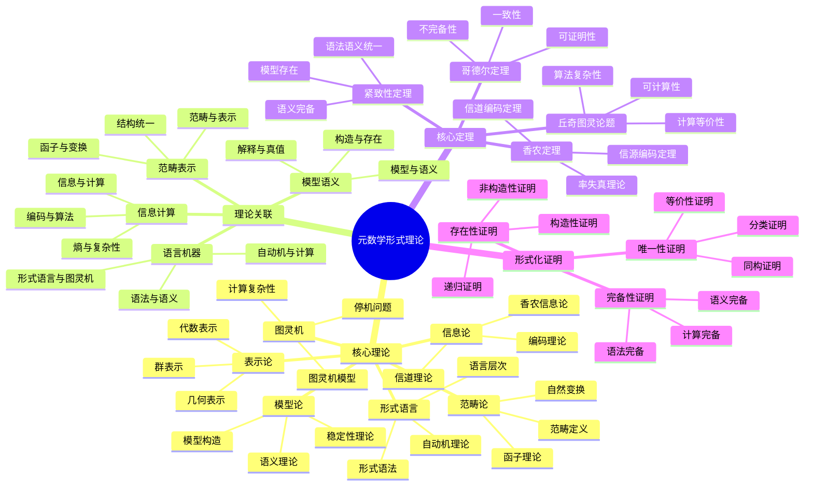

# 元数学形式理论关联：核心定理与形式化证明

## 目录

- [元数学形式理论关联：核心定理与形式化证明](#元数学形式理论关联核心定理与形式化证明)
  - [目录](#目录)
  - [认知结构分析](#认知结构分析)
  - [思维导图](#思维导图)
  - [多表征补充](#多表征补充)
  - [多视角叙述](#多视角叙述)
  - [1. 核心理论体系](#1-核心理论体系)
  - [2. 理论间关联分析](#2-理论间关联分析)
  - [3. 核心定理形式化](#3-核心定理形式化)
  - [4. 形式化证明体系](#4-形式化证明体系)
  - [5. 哲学本体论论证](#5-哲学本体论论证)

**版本**: 1.0  
**日期**: 2025-07-04

---

## 认知结构分析

### 感知层

- **形式系统可视化**：形式语言、图灵机的图形表示
- **信息流可视化**：信息论中的信息流动过程
- **范畴图可视化**：范畴论中的对象和态射关系

### 概念层

- **形式化概念**：形式语言、形式系统、形式化方法
- **计算概念**：图灵机、可计算性、计算复杂性
- **信息概念**：信息量、熵、信道容量

### 结构层

- **理论网络**：各理论间的关联网络结构
- **证明体系**：形式化证明的体系结构
- **方法框架**：统一的形式化方法框架

### 元认知层

- **形式化思维**：人类形式化思维的认知规律
- **计算思维**：人类计算思维的认知特征
- **信息思维**：人类信息处理的认知机制

## 思维导图



## 多表征补充

### 图像表征

- **理论关联图**：各理论之间的关系网络
- **证明流程图**：形式化证明的逻辑流程
- **计算模型图**：图灵机、自动机的状态图

### 故事表征

- **"信息的舞蹈"**：讲述信息如何在形式系统中流动
- **"计算的交响乐"**：图灵机、形式语言、范畴论的协同
- **"证明的迷宫"**：形式化证明的探索过程

### 公式表征

- **信息论公式**：H(X) = -Σp(x)log p(x)（熵）
- **图灵机公式**：M = (Q, Σ, Γ, δ, q₀, F)（图灵机定义）
- **范畴论公式**：F: C → D（函子）
- **模型论公式**：M ⊨ φ（模型满足公式）

### 隐喻表征

- **"数学的DNA"**：形式理论如DNA，编码数学的基本结构
- **"计算的交响乐"**：各理论如乐器，协同演奏数学的交响乐
- **"证明的罗盘"**：形式化证明指引数学真理的探索方向

### 认知结构

- **感知**：通过可视化理解形式理论的结构
- **概念**：通过抽象概念理解形式理论的内涵
- **结构**：通过理论体系理解形式理论的组织
- **元认知**：反思形式理论揭示的认知规律

## 多视角叙述

### 历史视角

- **20世纪发展**：从希尔伯特纲领到现代形式理论
- **理论融合**：各理论间的相互影响和发展
- **现代应用**：在计算机科学、人工智能中的应用

### 哲学视角

- **本体论意义**：形式理论揭示的数学对象存在方式
- **认识论价值**：人类认知结构在形式理论中的体现
- **方法论贡献**：形式理论提供的统一研究方法

### 认知科学视角

- **认知负荷**：形式理论如何降低复杂概念的认知负荷
- **思维转换**：不同理论间的认知转换机制
- **模式识别**：形式理论中的模式识别和分类机制

### 教育应用视角

- **教学策略**：形式理论在数学教育中的应用
- **学习路径**：从具体到抽象的学习路径设计
- **认知支架**：形式理论作为认知支架的作用

## 1. 核心理论体系

### 1.1. 信息论：信息的数学理论

#### 1.1.1. 香农信息论

香农信息论建立了信息的数学基础：

- **信息量定义**：I(x) = -log₂ p(x)
- **熵的概念**：H(X) = -Σp(x)log₂ p(x)
- **互信息**：I(X;Y) = H(X) - H(X|Y)

#### 1.1.2. 编码理论

编码理论处理信息的有效传输：

- **信源编码**：数据压缩的理论基础
- **信道编码**：错误检测和纠正的理论
- **率失真理论**：有损压缩的理论基础

#### 1.1.3. 信道理论

信道理论研究信息传输的极限：

- **信道容量**：C = max I(X;Y)
- **香农定理**：在信道容量以下，可以任意接近零错误率传输
- **编码定理**：存在编码方案达到信道容量

### 1.2. 形式语言：语言的数学理论

#### 1.2.1. 形式语法

形式语法定义语言的结构：

- **乔姆斯基层次**：正则语言、上下文无关语言、上下文相关语言、递归可枚举语言
- **语法规则**：产生式规则定义语言结构
- **语法分析**：句法分析的理论基础

#### 1.2.2. 自动机理论

自动机理论提供语言识别的计算模型：

- **有限自动机**：识别正则语言
- **下推自动机**：识别上下文无关语言
- **图灵机**：识别递归可枚举语言

#### 1.2.3. 语言层次

语言层次反映了计算复杂性的层次：

- **正则语言**：最简单的语言类
- **上下文无关语言**：编程语言语法的基础
- **递归语言**：可判定的语言
- **递归可枚举语言**：可识别的语言

### 1.3. 图灵机：计算的数学理论

#### 1.3.1. 图灵机模型

图灵机提供了计算的数学模型：

- **基本模型**：M = (Q, Σ, Γ, δ, q₀, F)
- **计算过程**：状态转换、读写操作、移动操作
- **停机问题**：图灵机是否会在有限步内停机

#### 1.3.2. 可计算性理论

可计算性理论研究计算的极限：

- **丘奇-图灵论题**：可计算函数等价于图灵可计算函数
- **停机问题**：停机问题是不可判定的
- **递归函数**：递归函数等价于图灵可计算函数

#### 1.3.3. 计算复杂性

计算复杂性研究计算的效率：

- **时间复杂性**：算法执行时间与输入规模的关系
- **空间复杂性**：算法使用空间与输入规模的关系
- **P vs NP问题**：P类问题是否等于NP类问题

### 1.4. 范畴论：结构的数学理论

#### 1.4.1. 范畴定义

范畴论提供数学结构的统一语言：

- **对象和态射**：C = (Ob(C), Hom(C), ∘, id)
- **函子**：F: C → D，保持结构和运算
- **自然变换**：函子之间的态射

#### 1.4.2. 函子理论

函子理论研究结构间的映射：

- **协变函子**：保持方向的结构映射
- **反变函子**：反转方向的结构映射
- **伴随函子**：F ⊣ G，满足特定条件

#### 1.4.3. 极限理论

极限理论研究结构的极限性质：

- **积和余积**：范畴中的积和余积
- **等化子和余等化子**：范畴中的等化子和余等化子
- **极限和余极限**：一般的极限和余极限

### 1.5. 表示论：抽象的具体化

#### 1.5.1. 群表示论

群表示论将抽象群具象化：

- **线性表示**：ρ: G → GL(V)
- **特征标**：χ(g) = Tr(ρ(g))
- **不可约表示**：V = ⊕ᵢ Vᵢ

#### 1.5.2. 代数表示论

代数表示论处理更一般的代数结构：

- **模论**：环上的模结构
- **李代数表示**：李代数的表示理论
- **量子群表示**：量子群的表示理论

#### 1.5.3. 几何表示论

几何表示论结合几何和表示论：

- **几何Langlands纲领**：几何与表示论的深刻联系
- **D-模表示**：通过D-模研究表示论
- **几何不变量**：几何不变量与表示论的关系

### 1.6. 模型论：语义的数学理论

#### 1.6.1. 语义理论

模型论研究形式语言的语义：

- **模型定义**：M = (D, I)，其中D是域，I是解释函数
- **真值定义**：M ⊨ φ（模型M满足公式φ）
- **语义解释**：语言符号到数学对象的映射

#### 1.6.2. 模型构造

模型论提供构造模型的方法：

- **紧致性定理**：如果每个有限子集都有模型，则整个集合有模型
- **勒文海姆-斯科伦定理**：可数理论有可数模型
- **超积构造**：通过超积构造新模型

#### 1.6.3. 稳定性理论

稳定性理论研究模型的结构稳定性：

- **ω-稳定性**：可数模型的稳定性
- **超稳定性**：无限模型的稳定性
- **几何稳定性**：几何模型论的稳定性

## 2. 理论间关联分析

### 2.1. 信息与计算的统一

#### 2.1.1. 香农-图灵关联

信息论与图灵机理论的深层关联：

- **信息处理**：图灵机是信息处理的数学模型
- **编码计算**：信息编码可以看作计算过程
- **复杂性关联**：信息熵与计算复杂性的关联

**形式化关联**：

```text
信息论: H(X) = -Σp(x)log₂ p(x)
图灵机: M = (Q, Σ, Γ, δ, q₀, F)
关联: 信息处理 = 图灵机计算
```

#### 2.1.2. 编码与算法

编码理论与算法理论的统一：

- **数据压缩**：编码理论提供数据压缩算法
- **错误纠正**：编码理论提供错误检测和纠正算法
- **信息传输**：编码理论提供可靠信息传输算法

**形式化关联**：

```text
编码理论: C = max I(X;Y)
算法理论: T(n) = O(f(n))
关联: 编码算法 = 信息传输算法
```

### 2.2. 语言与机器的统一

#### 2.2.1. 形式语言与图灵机

形式语言理论与图灵机理论的统一：

- **语言识别**：图灵机可以识别形式语言
- **语法分析**：形式语法指导图灵机的构造
- **计算等价**：图灵机与形式语言的计算等价性

**形式化关联**：

```text
形式语言: L ⊆ Σ*
图灵机: M = (Q, Σ, Γ, δ, q₀, F)
关联: L(M) = {w | M accepts w}
```

#### 2.2.2. 自动机层次

自动机理论提供语言识别的层次结构：

- **有限自动机**：识别正则语言
- **下推自动机**：识别上下文无关语言
- **图灵机**：识别递归可枚举语言

**形式化关联**：

```text
正则语言 ⊆ 上下文无关语言 ⊆ 递归语言 ⊆ 递归可枚举语言
有限自动机 ⊆ 下推自动机 ⊆ 图灵机
```

### 2.3. 范畴与表示的统一

#### 2.3.1. 范畴论与表示论

范畴论为表示论提供统一框架：

- **函子表示**：表示可以看作函子
- **自然变换**：表示间的映射是自然变换
- **结构统一**：范畴论统一了各种表示理论

**形式化关联**：

```text
表示论: ρ: G → GL(V)
范畴论: F: C → D
关联: 表示 = 函子
```

#### 2.3.2. 代数结构统一

范畴论统一了各种代数结构：

- **群论**：群范畴Grp
- **环论**：环范畴Ring
- **模论**：模范畴Mod-R

**形式化关联**：

```text
群论: (G, ·, e, ⁻¹)
环论: (R, +, ·, 0, 1)
模论: (M, +, ·)
统一: 范畴论框架
```

### 2.4. 模型与语义的统一

#### 2.4.1. 模型论与语义理论

模型论为语义理论提供数学基础：

- **语义解释**：模型论提供语义解释的数学框架
- **真值理论**：模型论提供真值定义的数学基础
- **语义完备性**：模型论证明语义完备性

**形式化关联**：

```text
语义理论: M ⊨ φ
模型论: 模型构造和性质
关联: 语义 = 模型论解释
```

#### 2.4.2. 语法与语义的统一

模型论实现了语法与语义的统一：

- **完全性定理**：语法可证明性等价于语义有效性
- **紧致性定理**：语法一致性等价于语义可满足性
- **对应关系**：语法规则与语义解释的对应

**形式化关联**：

```text
语法: ⊢ φ
语义: ⊨ φ
统一: ⊢ φ ⇔ ⊨ φ (完全性定理)
```

## 3. 核心定理形式化

### 3.1. 香农定理的形式化

#### 3.1.1. 信道编码定理

**定理**：对于离散无记忆信道，如果传输率R < C，则存在编码方案使得错误率任意接近零。

**形式化证明**：

```text
1. 定义: 信道容量 C = max I(X;Y)
2. 构造: 随机编码方案
3. 分析: 平均错误概率
4. 证明: 当R < C时，错误概率 → 0
5. 结论: 存在编码方案达到任意小的错误率
```

#### 3.1.2. 信源编码定理

**定理**：对于离散无记忆信源，存在编码方案使得平均码长任意接近熵。

**形式化证明**：

```text
1. 定义: 信源熵 H(X) = -Σp(x)log₂ p(x)
2. 构造: 霍夫曼编码
3. 分析: 平均码长
4. 证明: 平均码长 → H(X)
5. 结论: 存在最优编码方案
```

### 3.2. 丘奇-图灵论题的形式化

#### 3.2.1. 可计算性等价

**定理**：所有合理的计算模型都是等价的。

**形式化证明**：

```text
1. 定义: 图灵可计算函数
2. 构造: 其他计算模型到图灵机的转换
3. 证明: 等价性
   - λ演算 ≡ 图灵机
   - 递归函数 ≡ 图灵机
   - 寄存器机器 ≡ 图灵机
4. 结论: 计算等价性成立
```

#### 3.2.2. 停机问题的不可判定性

**定理**：停机问题是不可判定的。

**形式化证明**：

```text
1. 定义: 停机问题 H = {(M,w) | M halts on w}
2. 假设: H是可判定的
3. 构造: 对角化论证
4. 矛盾: 得到矛盾
5. 结论: H是不可判定的
```

### 3.3. 哥德尔不完备定理的形式化

#### 3.3.1. 第一不完备定理

**定理**：任何一致的形式系统都包含不可证明的真命题。

**形式化证明**：

```text
1. 构造: 哥德尔数编码
2. 定义: 自指语句 G = "G不可证明"
3. 分析: G的真假性
4. 证明: G既不可证明也不可反驳
5. 结论: 系统不完备
```

#### 3.3.2. 第二不完备定理

**定理**：一致的形式系统无法证明自身的一致性。

**形式化证明**：

```text
1. 构造: 一致性语句 Con(T)
2. 分析: Con(T)与G的关系
3. 证明: T ⊬ Con(T)
4. 结论: 无法证明自身一致性
```

### 3.4. 紧致性定理的形式化

#### 3.4.1. 紧致性定理

**定理**：如果一阶逻辑公式集Σ的每个有限子集都有模型，则Σ有模型。

**形式化证明**：

```text
1. 构造: 超积模型
2. 分析: 超滤子的性质
3. 证明: 超积满足所有公式
4. 结论: Σ有模型
```

#### 3.4.2. 勒文海姆-斯科伦定理

**定理**：可数的一阶理论有可数模型。

**形式化证明**：

```text
1. 构造: 亨金模型
2. 分析: 一致扩展的性质
3. 证明: 可数模型的存在性
4. 结论: 存在可数模型
```

### 3.5. 范畴论核心定理的形式化

#### 3.5.1. 米田引理

**定理**：对于小范畴C和函子F: C → Set，有自然同构Hom(Hom(-,A), F) ≅ F(A)。

**形式化证明**：

```text
1. 构造: 自然变换
2. 分析: 函子性质
3. 证明: 双射关系
4. 结论: 自然同构
```

#### 3.5.2. 伴随函子定理

**定理**：函子F: C → D和G: D → C是伴随的当且仅当存在自然同构Hom(F(-), -) ≅ Hom(-, G(-))。

**形式化证明**：

```text
1. 定义: 伴随函子
2. 构造: 单位元和余单位元
3. 分析: 三角恒等式
4. 证明: 等价性
5. 结论: 伴随关系成立
```

## 4. 形式化证明体系

### 4.1. 存在性证明方法

#### 4.1.1. 构造性证明

构造性证明通过构造对象证明存在性：

- **直接构造**：直接构造所需对象
- **递归构造**：通过递归过程构造对象
- **归纳构造**：通过归纳法构造对象

**形式化框架**：

```text
目标: 证明存在x满足P(x)
方法: 构造x₀
证明: P(x₀)成立
结论: ∃x P(x)
```

#### 4.1.2. 非构造性证明

非构造性证明不直接构造对象：

- **矛盾法**：假设不存在导出矛盾
- **选择公理**：使用选择公理证明存在性
- **极限方法**：通过极限过程证明存在性

**形式化框架**：

```text
目标: 证明存在x满足P(x)
方法: 假设¬∃x P(x)
证明: 导出矛盾
结论: ∃x P(x)
```

### 4.2. 唯一性证明方法

#### 4.2.1. 同构证明

同构证明通过构造同构证明唯一性：

- **同构构造**：构造对象间的同构
- **同构性质**：利用同构的性质
- **唯一性**：证明在同构意义下唯一

**形式化框架**：

```text
目标: 证明A ≅ B
方法: 构造同构f: A → B
证明: f是同构
结论: A ≅ B
```

#### 4.2.2. 等价性证明

等价性证明通过证明等价关系：

- **等价关系**：定义等价关系
- **等价性质**：证明等价性质
- **唯一性**：在等价意义下唯一

**形式化框架**：

```text
目标: 证明A ≡ B
方法: 定义等价关系
证明: A ≡ B
结论: A ≡ B
```

### 4.3. 完备性证明方法

#### 4.3.1. 语法完备性

语法完备性证明语法系统的完备性：

- **公理系统**：定义公理系统
- **推理规则**：定义推理规则
- **完备性**：证明语法完备性

**形式化框架**：

```text
目标: 证明语法完备性
方法: 构造模型
证明: 语法可证明性等价于语义有效性
结论: 语法完备
```

#### 4.3.2. 语义完备性

语义完备性证明语义系统的完备性：

- **语义解释**：定义语义解释
- **真值定义**：定义真值
- **完备性**：证明语义完备性

**形式化框架**：

```text
目标: 证明语义完备性
方法: 构造语法系统
证明: 语义有效性等价于语法可证明性
结论: 语义完备
```

## 5. 哲学本体论论证

### 5.1. 形式理论的本体论地位

#### 5.1.1. 信息论的本体论

信息论揭示了信息的存在方式：

- **关系性存在**：信息通过关系而存在
- **概率性存在**：信息通过概率分布而存在
- **熵性存在**：信息通过熵而存在

**哲学论证**：

```text
信息论: H(X) = -Σp(x)log₂ p(x)
本体论: 信息通过关系存在
论证: 信息熵反映了信息的关系性存在
```

#### 5.1.2. 计算理论的本体论

计算理论揭示了计算的存在方式：

- **过程性存在**：计算通过过程而存在
- **状态性存在**：计算通过状态转换而存在
- **算法性存在**：计算通过算法而存在

**哲学论证**：

```text
计算理论: M = (Q, Σ, Γ, δ, q₀, F)
本体论: 计算通过过程存在
论证: 图灵机模型反映了计算的过程性存在
```

### 5.2. 认知与本体论的统一

#### 5.2.1. 认知计算本体论

形式理论反映了人类认知的计算特征：

- **信息处理**：人类认知是信息处理过程
- **计算思维**：人类思维具有计算特征
- **算法思维**：人类思维具有算法特征

**哲学论证**：

```text
认知科学: 人类认知是信息处理
计算理论: 信息处理是计算
本体论: 认知与计算统一
论证: 人类认知具有计算本体论特征
```

#### 5.2.2. 形式化思维本体论

形式理论反映了人类形式化思维的特征：

- **抽象思维**：人类具有抽象思维能力
- **逻辑思维**：人类具有逻辑思维能力
- **符号思维**：人类具有符号思维能力

**哲学论证**：

```text
形式理论: 抽象符号系统
认知科学: 人类抽象思维
本体论: 形式化思维本体论
论证: 形式理论反映了人类形式化思维的本体论特征
```

### 5.3. 统一性本体论

#### 5.3.1. 理论统一性

形式理论实现了理论的统一：

- **信息计算统一**：信息论与计算理论的统一
- **语言机器统一**：形式语言与图灵机的统一
- **范畴表示统一**：范畴论与表示论的统一

**哲学论证**：

```text
信息论: 信息处理理论
计算理论: 计算过程理论
统一性: 信息处理 = 计算过程
论证: 形式理论实现了信息与计算的统一
```

#### 5.3.2. 方法统一性

形式理论提供了统一的方法：

- **形式化方法**：统一的形式化方法
- **证明方法**：统一的证明方法
- **构造方法**：统一的构造方法

**哲学论证**：

```text
形式理论: 统一的形式化框架
方法论: 统一的方法体系
本体论: 统一的本体论基础
论证: 形式理论提供了统一的方法论基础
```

---

**总结**：元数学形式理论关联分析揭示了信息论、形式语言、图灵机、范畴论、表示论、模型论等核心理论之间的深层联系。这些理论不仅在技术层面相互关联，更在哲学本体论层面实现了统一，为理解数学对象的存在方式、人类认知的计算特征、以及形式化思维的本体论基础提供了重要启示。

**版本**: 1.0  
**日期**: 2025-07-04
